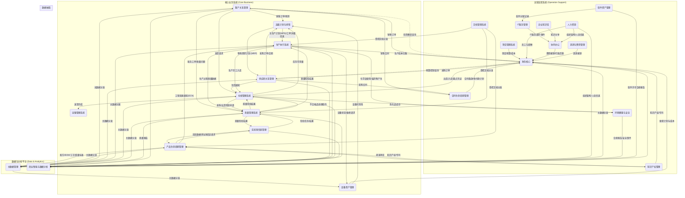

# 企业数字化蓝图 - 最终版 V1.0

**文档编号**：BP-ARCH-001  
**版本**：v1.0  
**创建日期**：2026年1月5日  
**更新日期**：2026年1月5日  
**文档状态**：已发布

---

## 📋 实施说明

**本蓝图定位**：本文档描绘的是企业信息化的**最终目标架构**（3-5年愿景），包含25个专业系统的完整规划。

**当前执行策略**：采用**超精益方案**（详见 [分阶段选型策略](01_关键决策与选型/分阶段选型策略-超精益方案.md)）

- **第一年（2026）**：**宜搭平台 + 招商银行薪福通**，投资仅**8万**
  - 供应链（CRM、采购、库存、应收应付）全部用宜搭搭建
  - 财务核算使用现有招商银行薪福通
  - MES/LIMS暂缓（车间设备未到位、实验室可用宜搭过渡）
  
- **第二年（2027）**：根据业务发展，选择性升级2-3个专业系统（预算80万）
  - 优先考虑：MES（如车间设备到位）、LIMS（如需仪器集成）
  
- **第三年及以后（2028+）**：逐步向本蓝图的目标架构演进
  - 当年营收>3000万或需要多公司独立核算时，升级为金蝶ERP
  - 其他系统根据业务触发条件，逐步从宜搭升级为专业系统

**投资对比**：

- 传统方案（一步到位）：第一年290万，三年640万
- 超精益方案（本策略）：第一年8万，三年238万
- **节省投资402万（63%），第一年现金流优势282万**

---

## 1. 愿景与目标

本文档旨在从企业级的顶层视角，描绘公司核心业务信息系统的构成、它们之间的相互关系以及关键的数据流。其目标是打破系统孤岛，确保数据在不同业务域之间能够健康、有序地流转，为构建一个协同、高效、数据驱动的“企业数字孪生”提供架构指引。

## 2. 核心设计原则 (集团化管控)

基于集团“A公司（研发）与B公司（生产）业务独立，但职能部门共享”的特定治理模式，我们确立了“联邦制”为IT建设的最高指导原则。详见 [[../30_技术架构域/ADR/ADR-006_集团化IT管控模型|ADR-006: 集团化IT管控模型]]。

本蓝图中的系统，根据其业务属性，分为“集团通用系统”和“公司专用系统”两类。

### 2.1. 集团通用系统 (Group-Shared Systems)

- **定义:** 承载集团层面统一业务、数据或服务的系统。所有公司**必须**使用同一套系统实例。
- **范围:** MDM, FIN, HR, SRM, CRM, PLM, APS, BI 等。
- **原则:** **统一平台，差异化配置。** 在统一的系统上，通过权限和规则引擎，实现对不同公司业务差异的适配。

### 2.2. 公司专用系统 (Company-Specific Systems)

- **定义:** 紧密贴合特定公司核心运营，且业务模式差异巨大的系统。允许各公司拥有**独立的系统实例**。
- **范围:** MES, WMS, LIMS, QMS 等直接与研发和生产现场紧密集成的系统。
- **原则:** **最佳组合，数据集成。** 各公司可以选择最适合自己的专用系统，但必须通过标准接口，与集团通用的MDM、FIN等系统进行数据集成。

### 2.3. 集团化管控的核心技术原则

- **原则一: 统一主数据，预留扩展**
  - **要求:** 核心主数据（物料、客户、供应商）在集团层面统一创建和编码。所有主数据模型必须包含`所属公司`字段，为未来的数据按法人主体切割预留技术可行性。
- **原则二: 独立法人核算**
  - **要求:** FIN系统必须按多账套搭建。所有价值流业务必须能清晰识别法人主体，并生成正确的公司间或公司内凭证。
- **原则三: 统一平台，分权运营**
  - **要求:** 系统的权限模型必须支持“公司”维度的数据行级别隔离。
- **原则四: 流程模板化，差异配置**
  - **要求:** 通用系统的审批流、业务流引擎，必须支持根据单据的`所属公司`字段，调用不同的规则和路径。

---

## 3. 核心系统架构图



## 3. 核心系统职责定义

- **MDM (主数据管理):** **单一事实来源**。负责企业最核心、最需要共享的数据（如物料、客户、供应商、BOM、工艺路线、质量标准）的创建、清洗、分发和治理。
- **PLM (产品生命周期管理):** **工程与配方数据的源头**。负责从产品概念、研发、设计到工艺的整个过程管理。在化工行业，其核心是**配方管理**（处理百分比、浓度、活性成分等）和实验数据管理，是BOM和工艺路线的创建和变更的源头系统，并将最终版本发布至MDM。
- **LIMS (实验室信息管理系统):** **研发与质量的“执行层”**。负责管理研发实验（样品、试剂、设备）和质量检验（QC）的全过程。与分析仪器集成，自动采集检验数据，并生成检验报告(COA)。与PLM和QMS紧密集成。
- **APS (高级计划与排程):** **企业运营的“大脑”**。综合销售预测、客户订单、物料库存、供应交期、设备产能等多重约束，通过算法生成最优的主生产计划(MPS)和物料需求计划(MRP)。
- **CRM (客户关系管理):** 负责客户全生命周期管理。不仅包含从市场、线索到销售订单的**L2C (Lead to Cash)**前端流程，也应包含**售后服务管理**（客服工单的接收、分配、处理和关闭），是提升客户满意度和忠诚度的核心平台。
- **SRM (供应商关系管理):** 负责从供应商寻源、采购需求、采购订单到收货的**P2P (Procure to Pay)**全流程管理。
- **MES (生产执行系统):** **车间运作的“心脏”**。负责接收APS下达的生产计划，并调度车间人、机、料、法、环，执行从投料到完工入库的**P2I (Production to Inventory)**全流程。
- **WMS (仓储管理系统):** 负责所有物料的精细化**库内物流管理**，包括入库、出库、盘点、移位等，确保账实相符。
- **TMS (运输管理系统):** 负责管理产品**从仓库到客户端**的运输过程，包括路线规划、承运商管理、在途跟踪和运费结算。
- **QMS (质量管理系统):** **企业质量的“裁判所”**。集中管理质量标准、检验流程、审计和不合格品处理。它定义“应该怎么检”，而具体的检验任务执行和数据采集由LIMS完成。
- **EHS (环境、健康与安全):** **企业的“生命线”**。负责管理危险化学品(MSDS)、安全操作规程(SOP)、风险识别、事故上报、环保监测等所有EHS事务，确保企业合规、可持续运营。
- **EAM (设备资产管理):** 负责生产设备和关键资产的台账、预防性维护、维修和保养管理，保障生产的顺利进行。
- **DMS (文档管理系统):** **企业“法”的源头**。负责对所有受控文档（如SOP、技术图纸、质量标准、管理制度）进行严格的版本控制、权限管理、评审发布和分发，确保所有岗位使用的都是最新、最准确的有效版本。
- **CLM (合同生命周期管理):** 负责所有类型合同（销售、采购、技术等）的起草、评审、签署、归档、执行跟踪和到期提醒的全生命周期管理。
- **ITSM (IT服务管理):** 负责管理企业内部所有的IT服务请求、事件处理、问题管理、变更管理和IT资产配置管理(CMDB)。
- **SAM (软件资产管理):** 负责管理企业所有软件的许可证（License）采购、分配、回收和合规性审计，确保免受法律风险，并优化软件支出。
- **IPM (知识产权管理):** 负责管理公司的专利、商标、著作权等无形资产的申请、维护、组合管理和价值评估。
- **FIN (财务核心系统):** 作为企业的**价值核心**。负责总账、应收、应付、成本、固定资产等所有价值流的核算与管理。是所有业务的最终价值沉淀池。
- **HR (人力资源系统):** 作为企业的**人才核心**。负责组织架构、员工主数据、薪酬福利、**绩效管理**和**培训管理**（员工技能矩阵、培训计划与记录、上岗资质认证）等人力资源核心流程。
- **OA (协同办公):** 负责企业内部的审批流、公文、通知以及非结构化的协同工作。同时，可作为**行政后勤管理**应用的承载平台（如图书借阅、车辆申请、工服管理等）。
- **WIKI (企业知识库):** 提供一个开放、便利的平台，用于企业内部非结构化知识、经验、FAQ的创建、分享和搜索，促进知识的沉淀与复用。
- **TNE (差旅与费用管理):** 负责从出差申请、行程预订到费用报销的**T2E (Travel to Expense)**全流程管理，确保差旅合规与高效报销。
- **BI (商业智能):** 从各大业务系统抽取数据，进行清洗、建模和分析，为管理决策提供数据洞察。

---

## 4. 系统集成原则与标准 (System Integration Principles and Standards)

### 4.1. 集成架构理念

企业数字化的成功，不在于拥有多少先进的单点系统，而在于这些系统能否有机协同，形成一个"数据流动、业务贯通"的数字化生态。本章定义企业级系统集成的核心原则和技术标准。

### 4.2. 核心集成原则

#### 原则1: 主数据统一分发，业务数据点对点

- **主数据 (Master Data):** 由MDM系统统一管理和分发至所有下游系统。采用"订阅-发布"模式，MDM主动推送主数据变更。
- **业务数据 (Transactional Data):** 各业务系统之间直接交互。例如：CRM直接向WMS发起发货请求，SRM直接向WMS发送到货通知。
- **理由:** 主数据变更频率低但影响面广，需要集中管控；业务数据变更频繁且具有强时效性，点对点集成效率更高。

#### 原则2: 优先异步集成，关键场景同步

- **异步集成 (Asynchronous):** 适用于对实时性要求不高的场景（如主数据分发、报表数据抽取、批量订单导入）。通过消息队列实现，解耦系统间依赖，提升系统可用性。
- **同步集成 (Synchronous):** 仅用于必须立即获取结果的场景（如：CRM下单时实时查询库存可用量、SRM采购时实时校验供应商信用额度）。
- **理由:** 异步集成降低系统耦合度，提升整体可靠性；同步集成保证关键业务的实时性和一致性。

#### 原则3: API优先，ETL补充

- **API集成:** 作为首选集成方式，适用于实时或近实时的数据交互场景。所有系统必须提供标准化的RESTful API或事件驱动接口。
- **ETL批量集成:** 仅用于历史数据迁移、大批量数据同步（如每日库存快照）和BI数据仓库建设。
- **理由:** API集成支持实时业务，ETL适合离线分析。

#### 原则4: 单向依赖，避免循环调用

- **上游系统:** 提供数据的系统（如MDM、PLM）。
- **下游系统:** 消费数据的系统（如MES、WMS）。
- **规则:** 数据流向应单向清晰。下游系统不得反向修改上游系统的数据。如需变更，必须通过上游系统的标准业务流程提交变更请求。
- **禁止模式:** A调用B，B再调用A，形成循环依赖。

#### 原则5: 幂等性与可重试

- **幂等性:** 所有API接口必须设计为幂等（同一请求多次调用，结果一致）。使用业务单据号作为幂等键。
- **可重试:** 在网络故障或超时场景下，系统应支持自动重试机制，并记录重试日志。
- **理由:** 分布式系统中网络不可靠，幂等性和重试机制是保证数据一致性的基础。

### 4.3. API设计标准

#### 4.3.1. RESTful API规范

- **基础URL结构:** `https://{domain}/api/{version}/{resource}`
  - 示例: `https://mdm.company.com/api/v1/materials/M0001`
- **HTTP方法语义:**
  - `GET`: 查询资源
  - `POST`: 创建资源
  - `PUT`: 全量更新资源
  - `PATCH`: 部分更新资源
  - `DELETE`: 删除（逻辑删除）资源
- **状态码标准:**
  - `200 OK`: 请求成功
  - `201 Created`: 资源创建成功
  - `400 Bad Request`: 请求参数错误
  - `401 Unauthorized`: 未授权
  - `404 Not Found`: 资源不存在
  - `500 Internal Server Error`: 服务器内部错误

#### 4.3.2. 请求与响应格式

**请求头标准:**

```http
Content-Type: application/json
Authorization: Bearer {access_token}
X-Request-ID: {uuid}  # 用于请求追踪
X-Company-ID: {company_code}  # 集团化场景下的公司代码
```

**响应体标准 (统一封装格式):**

```json
{
  "success": true,
  "code": "200",
  "message": "操作成功",
  "data": {
    "material_id": "M0001",
    "material_name": "聚氨酯A-36"
  },
  "timestamp": "2026-01-04T10:30:00Z",
  "request_id": "550e8400-e29b-41d4-a716-446655440000"
}
```

**错误响应示例:**

```json
{
  "success": false,
  "code": "MATERIAL_NOT_FOUND",
  "message": "物料编码不存在",
  "errors": [
    {
      "field": "material_id",
      "message": "物料M0001在系统中未找到"
    }
  ],
  "timestamp": "2026-01-04T10:30:00Z",
  "request_id": "550e8400-e29b-41d4-a716-446655440000"
}
```

### 4.4. 事件驱动架构 (Event-Driven Architecture)

#### 4.4.1. 适用场景

事件驱动架构适用于以下场景：

- **主数据变更通知:** MDM中的物料、客户、供应商变更后，通知所有下游系统。
- **业务状态变更:** 订单状态变更、生产工单完工、质检结果确认等。
- **异步解耦:** 一个业务操作触发多个下游系统的后续处理（如：员工离职触发HR、OA、ITSM、SAM的联动）。

#### 4.4.2. 事件消息标准

**事件主题命名:** `{domain}.{entity}.{action}`

- 示例: `mdm.material.created`, `mes.workorder.completed`, `qms.inspection.approved`

**事件消息格式 (CloudEvents标准):**

```json
{
  "specversion": "1.0",
  "type": "mdm.material.updated",
  "source": "mdm.company.com",
  "id": "550e8400-e29b-41d4-a716-446655440000",
  "time": "2026-01-04T10:30:00Z",
  "datacontenttype": "application/json",
  "data": {
    "material_id": "M0001",
    "change_type": "attribute_update",
    "changed_fields": ["unit_of_measure", "safety_stock"],
    "old_values": {"unit_of_measure": "kg", "safety_stock": 100},
    "new_values": {"unit_of_measure": "L", "safety_stock": 150}
  }
}
```

### 4.5. 主数据分发策略

#### 4.5.1. 分发模式

- **全量初始化:** 新系统上线时，从MDM一次性同步所有有效的主数据。
- **增量推送:** MDM中的主数据发生变更（新增、修改、状态变更）时，实时推送变更消息至消息队列，下游系统订阅并消费。
- **定期对账:** 每周执行一次主数据一致性对账，识别并修复数据差异。

#### 4.5.2. 分发范围控制

- **按公司隔离:** 下游系统仅接收与其`Company_ID`匹配的主数据。
- **按状态过滤:** 仅分发状态为"已发布"的主数据，草稿和已废弃的主数据不分发。
- **按系统需求:** 不同系统按需订阅所需的主数据类型。例如：WMS订阅物料主数据，CRM订阅客户主数据。

### 4.6. 数据一致性保障

#### 4.6.1. 最终一致性原则

在分布式系统中，我们采用"**最终一致性 (Eventual Consistency)**"而非"强一致性"：

- **含义:** 主数据在MDM中变更后，可能存在数秒到数分钟的延迟，才会在所有下游系统生效。
- **应对策略:**
  - 在业务流程设计时，容忍短时间的数据不一致。
  - 关键业务校验（如：订单创建时校验物料是否有效），调用MDM的同步查询API获取最新状态。

#### 4.6.2. 分布式事务处理

对于跨系统的业务事务（如：销售订单创建 → 库存扣减 → 财务记账），采用"**Saga模式**"：

- **正向流程:** 各系统依次执行本地事务，并发布事件通知下游系统。
- **补偿流程:** 如某环节失败，触发补偿事务（如取消订单、回退库存）。
- **实施要求:** 所有业务系统必须提供业务单据的"取消"或"冲销"接口。

### 4.7. 集成监控与异常处理

#### 4.7.1. 集成监控指标

- **接口可用性:** 目标 ≥ 99.9%
- **接口响应时间:**
  - 查询类API: P95 < 500ms
  - 事务类API: P95 < 2s
- **消息队列积压:** 任何队列积压超过1000条消息时告警
- **数据一致性:** 每日对账差异率 < 0.1%

#### 4.7.2. 异常处理机制

- **重试策略:** 网络超时或5xx错误，自动重试最多3次，采用指数退避策略（1s, 2s, 4s）。
- **死信队列:** 重试失败的消息进入死信队列，人工介入处理。
- **告警通知:** 集成失败超过阈值时，自动发送邮件/短信告警给系统负责人。
- **降级策略:** 关键依赖系统不可用时，启用本地缓存或降级逻辑，保证核心业务不中断。

### 4.8. 集成安全要求

- **身份认证:** 所有API调用必须通过OAuth 2.0或JWT令牌认证。
- **权限控制:** API接口须实现基于角色的访问控制（RBAC），确保调用方只能访问其被授权的资源。
- **数据加密:**
  - 传输加密: 所有API调用必须使用HTTPS (TLS 1.2+)。
  - 敏感字段加密: 身份证号、银行账户等敏感信息在传输和存储时加密。
- **审计日志:** 所有API调用必须记录审计日志（调用方、时间、操作、结果），保留至少1年。

### 4.9. 集成技术栈建议

- **API网关:** Kong / Azure API Management（统一认证、限流、日志）
- **消息队列:** RabbitMQ / Kafka（事件驱动架构的基础设施）
- **ETL工具:** Talend / Azure Data Factory（批量数据同步）
- **API文档:** Swagger/OpenAPI 3.0（自动生成API文档）
- **监控工具:** Prometheus + Grafana / Azure Application Insights

---

## 5. 下一步行动计划

1. **评审并确认**此顶层系统架构图。
2. 选择一个核心业务域（如我们已部分完成的P2P，或全新的L2C），**绘制详细的跨系统流程图和数据流图**。
3. **定义**每个核心业务域的关键数据对象和交互接口。

---

## 6. 实施路线图 (Implementation Roadmap)

根据“基础先行、价值驱动”的原则，建议将企业数字化蓝图的实施分为以下四个主要阶段：

### 阶段一: 奠定基石 (Phase 1: Foundation)

- **目标:** 统一企业核心“语言”，打通人、财、物三大基础数据流。
- **核心系统:**
  - **1. MDM (主数据管理):** **最高优先级**。作为所有系统的“翻译官”，必须第一个建立，至少要完成物料、供应商、客户三大核心主数据的治理。
  - **2. FIN (财务核心):** 建立全集团统一的财务核算体系，是所有价值流的最终沉淀池。
  - **3. HR (人力资源):** 建立统一的组织架构和员工主数据，是所有流程审批和权限的基础。
  - **4. OA (协同办公):** 作为流程审批和企业门户的统一入口，可以先实现基础的流程引擎功能。

### 阶段二: 打通供需 (Phase 2: Supply & Demand)

- **目标:** 实现核心的“买”和“卖”业务流程线上化，打通供应链与客户链。
- **核心系统:**
  - **1. SRM (供应商关系管理):** 固化采购流程 (S2P)，管理供应商，控制采购成本。
  - **2. CRM (客户关系管理):** 固化销售流程 (L2C)，管理客户，提升销售效率。
  - **3. WMS (仓储管理系统):** 对接SRM和CRM，实现采购入库和销售出库的精细化管理。

### 阶段三: 深化研产 (Phase 3: R&D and Production)

- **目标:** 将数字化能力从供需两端，向企业内部的研发和生产核心延伸。
- **核心系统:**
  - **1. PLM (产品生命周期管理):** 管理产品研发过程 (I2M)，成为BOM和工艺的源头。
  - **2. MES (生产执行系统):** 实现车间生产过程的透明化管理 (P2I)。
  - **3. QMS (质量管理系统):** 建立全面的质量检验和追溯体系。
  - **4. LIMS (实验室信息管理系统):** 配合PLM和QMS，实现研发和质检的自动化。

### 阶段四: 全面优化 (Phase 4: Optimization)

- **目标:** 在核心流程打通的基础上，通过更专业的系统进行优化和扩展。
- **核心系统:**
  - **APS (先进规划与排程):** 在ERP, MES, SRM数据基础上，进行智能的生产计划排程。
  - **TMS (运输管理系统):** 优化销售订单的物流配送。
  - **EAM (设备资产管理):** 落地TPM思想，进行设备预防性维护。
  - **BI (商业智能):** 全面集成各系统数据，提供全局的数据洞察和决策支持。
  - **其他支撑系统:** 如CLM, ITSM, DMS等，根据业务发展的具体需求，逐步引入。
