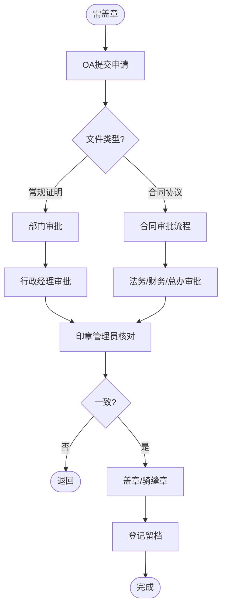

# BIZ-FLOW-A01: 印章与证照管理流程

**文档编号**：BIZ-FLOW-A01  
**版本**：v1.0  
**创建日期**：2026年1月5日  
**更新日期**：2026年1月5日  
**文档状态**：已发布  
**业务域**：行政管理域  
**优先级**：🔴 P0（极高风险）

---

## 一、流程概述

### 1.1 基本信息

- **流程名称**：印章与证照管理流程（Seal & License Management Process）
- **流程编号**：BIZ-FLOW-A01
- **起点**：用印/借证申请
- **终点**：归还/归档
- **业务目标**：
  - 规范公司印章（公章、合同章、法人章）的使用，防范法律风险
  - 确保公司证照（营业执照、资质证书）的安全与有效性
  - 杜绝违规用印、私盖公章行为

### 1.2 适用范围

- **适用公司**：全集团
- **管理对象**：
  - **实体印章**：公章、合同专用章、财务专用章、法人人名章、发票专用章。
  - **电子印章**：OA系统中的电子签章。
  - **证照原件**：营业执照（正副本）、开户许可证、高企证书、专利证书等。

### 1.3 流程类型

- **流程性质**：风险控制流程
- **流程频率**：高频
- **流程复杂度**：中（审批链条严格）

---

## 二、角色与职责（RACI矩阵）

| 流程阶段 | 申请人 | 部门负责人 | 印章管理员 | 法务部 | 总经理 |
|---------|-------|-----------|-----------|-------|-------|
| 用印申请 | R | A | C | C (合同类) | A (特殊类) |
| 审批审核 | I | R | C | R | A |
| 盖章执行 | I | - | R | - | - |
| 外带申请 | R | R | I | I | A |
| 证照年检 | - | - | R | - | I |

**注释**：

- R (Responsible)：负责执行
- A (Accountable)：最终批准
- C (Consulted)：需要咨询
- I (Informed)：需要知会

---

## 三、流程阶段设计

### 阶段1：印章使用管理

#### 步骤1.1 用印申请

**触发条件**：合同签署、证明开具、申报材料。

**执行角色**：申请人

**执行步骤**：

1. 在OA系统发起【用印申请流程】。
2. 上传需盖章的文件附件（定稿版）。
3. 填写关键信息：
   - 文件名称、份数。
   - 用印类型（公章/合同章/法人章）。
   - 用途说明。
   - 关联流程（如：关联已审批的合同流程BIZ-FLOW-C01）。

#### 步骤1.2 审批

**执行角色**：各级审批人

**审批权限**：

- **常规行政类**（证明、通知）：部门负责人 -> 行政经理。
- **合同协议类**：部门负责人 -> 法务 -> 财务 -> 总经理（视金额）。
- **法人章**：必须经总经理/董事长亲自批准。

#### 步骤1.3 盖章与登记

**执行角色**：印章管理员（行政部/财务部）

**执行步骤**：

1. **核对**：核对纸质文件与OA审批附件是否一致（防止“阴阳合同”）。
2. **盖章**：
   - 确保印章清晰。
   - 涉及多页文件，必须加盖**骑缝章**。
3. **登记**：在《印章使用登记簿》上记录（或系统自动生成日志）。
4. **留档**：重要文件需留存一份复印件或扫描件归档。

---

### 阶段2：印章外带管理

#### 步骤2.1 外带申请

**场景**：需在工商局、银行、法院现场盖章。

**原则**：原则上印章不离司，确需外带必须由专人（印章管理员）随行。

**执行步骤**：

1. 填写【印章外带申请单】，注明外带时间、地点、事由。
2. **总经理审批**（一票否决）。
3. **双人同行**：申请人 + 印章管理员共同前往。

---

### 阶段3：证照管理

#### 步骤3.1 证照借用

**执行步骤**：

1. 填写【证照借用申请单】。
2. 优先提供**扫描件**或**复印件**（加盖“仅供XX用途”水印）。
3. 确需原件（如招投标现场），需缴纳押金或专人随行，限期归还。

#### 步骤3.2 年检与更新

**执行角色**：证照管理员

**执行步骤**：

1. 建立《证照台账》，设置到期提醒。
2. 定期办理工商年报、资质复审。
3. 证照变更（如法人变更、地址变更）需同步更新所有相关证书。

---

## 四、流程图

### 4.1 用印流程

---

## 五、关键控制点

### 5.1 控制点清单

| 控制点 | 风险描述 | 控制措施 | 责任人 |
|-------|---------|---------|--------|
| **阴阳合同** | 审批的是A版，盖章时偷换成B版 | 印章管理员必须逐页核对，或使用“契约锁”等电子签章系统 | 印章管理员 |
| **空白纸盖章** | 在空白纸上盖章，后期随意打印内容 | **严禁**在空白纸上盖章，违者开除并追究法律责任 | 全员 |
| **私盖公章** | 管理员私自给熟人盖章 | 印章必须锁入保险柜，实行“人印分离”，监控覆盖盖章区域 | 行政总监 |
| **证照丢失** | 原件借出后遗失 | 尽量使用复印件，原件外带必须专人看管 | 证照管理员 |

---

## 六、附录

### 6.1 相关表单

| 表单名称 | 编号 | 用途 |
|---------|------|------|
| 用印申请单 | FRM-ADM-001 | 盖章审批 |
| 印章外带申请单 | FRM-ADM-002 | 外带审批 |
| 证照借用登记表 | FRM-ADM-003 | 借还记录 |

---

**最后更新**：2026年1月5日
