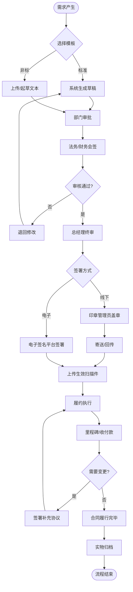

# BIZ-FLOW-C01: 合同全生命周期管理

**文档编号**：BIZ-FLOW-C01  
**版本**：v1.0  
**创建日期**：2026年1月5日  
**更新日期**：2026年1月5日  
**文档状态**：已发布  
**业务域**：企业支持域  
**优先级**：🟠 P1（高）

---

## 一、流程概述

### 1.1 基本信息

- **流程名称**：合同全生命周期管理（Contract Lifecycle Management - CLM）
- **流程编号**：BIZ-FLOW-C01
- **起点**：合同起草/申请
- **终点**：合同归档与结案
- **业务目标**：
  - 规范合同管理流程，防范法律风险和商业风险
  - 提高合同审批和签署效率，缩短业务周期
  - 确保合同履行的透明度和可追踪性
  - 实现合同数据的集中管理和分析

### 1.2 适用范围

- **适用公司**：全集团
- **适用部门**：所有业务部门（销售、采购、人事、行政、研发等）、法务部、财务部、总经办
- **合同类型**：
  - 销售合同
  - 采购合同
  - 保密协议 (NDA)
  - 劳动合同
  - 租赁合同
  - 技术合作协议

### 1.3 流程类型

- **流程性质**：风险管控流程
- **流程频率**：高频
- **流程复杂度**：中（涉及多部门审批和法律条款审核）

---

## 二、角色与职责（RACI矩阵）

| 流程阶段 | 经办人(申请人) | 部门负责人 | 法务专员 | 财务经理 | 总经理/授权代表 | 印章管理员 | 档案管理员 |
|---------|--------------|-----------|---------|---------|---------------|-----------|-----------|
| 合同起草 | R | I | C | - | - | - | - |
| 合同评审 | R | A | R (法律) | R (财税) | I | - | - |
| 合同签署 | R | - | - | - | A | R | - |
| 合同履行 | R | A | I | C | - | - | - |
| 变更/解除 | R | A | R | R | A | - | - |
| 归档结案 | R | - | - | - | - | - | R, A |

**注释**：

- R (Responsible)：负责执行
- A (Accountable)：最终批准
- C (Consulted)：需要咨询
- I (Informed)：需要知会

---

## 三、流程阶段设计

### 阶段1：合同准备与起草 (Drafting)

#### 步骤1.1 模板选择

**触发条件**：业务需求产生（如确定采购意向、达成销售意向）

**执行角色**：经办人

**执行步骤**：

1. 登录合同管理系统（或OA）。
2. 选择标准合同模板（由法务部预先批准）。
   - 优先使用公司标准模板。
   - 如对方强势要求使用其模板，需选择"非标合同"流程。
3. 填写合同关键信息（相对方、金额、标的、期限）。

#### 步骤1.2 合同起草

**执行角色**：经办人

**执行步骤**：

1. **标准合同**：系统自动生成合同文本，仅允许修改非固定条款（如价格、数量）。
2. **非标合同**：上传对方提供的合同草稿，或自行起草文本。
3. 上传相关附件（如营业执照、报价单、技术协议）。
4. 提交审批申请。

---

### 阶段2：合同评审与审批 (Review & Approval)

#### 步骤2.1 部门内部审批

**执行角色**：部门负责人

**审核内容**：

- 业务合理性：是否符合预算？是否符合公司策略？
- 价格合理性：毛利是否达标？

#### 步骤2.2 专业部门会签

**执行角色**：法务专员、财务经理

**审核内容**：

- **法务审核**：
  - 主体资格：对方是否合法存续？
  - 法律条款：违约责任、争议解决、知识产权归属是否合规？
  - 风险防范：是否存在重大法律陷阱？
- **财务审核**：
  - 付款/收款条款：账期是否合理？
  - 税务条款：税率是否正确？发票类型是否明确？
  - 银行账户：信息是否准确？

**决策点**：

- **通过**：进入下一环节。
- **退回修改**：经办人根据意见修改后重新提交。
- **拒绝**：终止流程。

#### 步骤2.3 终审

**执行角色**：总经理或授权代表

**审核内容**：

- 综合评估风险与收益。
- 批准签署。

---

### 阶段3：合同签署 (Signing)

#### 步骤3.1 内部用印

**执行角色**：印章管理员

**执行步骤**：

1. 收到审批通过的通知。
2. 核对打印出的纸质合同与系统审批版本是否一致（通过水印或校验码）。
3. **盖章**：
   - 加盖公章或合同专用章。
   - 加盖骑缝章。
4. 登记用印记录（用印时间、份数、经办人）。

#### 步骤3.2 电子签署（可选）

**执行角色**：经办人、授权代表

**执行步骤**：

1. 发起电子签约流程。
2. 己方授权代表进行实名认证并签署。
3. 系统自动发送给对方签署链接。
4. 对方签署完成后，系统自动生成已签署的PDF文件（含数字证书）。

#### 步骤3.3 外部签署与回传

**执行角色**：经办人

**执行步骤**：

1. 将己方盖章的合同寄送给对方（或对方先盖章）。
2. 跟踪对方盖章进度。
3. 收到对方寄回的合同后，检查对方印章是否清晰、完整。
4. 扫描双方盖章的合同，上传至系统作为"生效版本"。

---

### 阶段4：合同履行 (Execution)

#### 步骤4.1 履约计划

**执行角色**：经办人

**执行步骤**：

1. 在系统中设定关键里程碑：
   - 交货日期
   - 验收日期
   - 付款/收款节点
   - 合同到期日
2. 系统设置自动提醒（提前7天/30天）。

#### 步骤4.2 履约执行

**执行角色**：业务部门、财务部

**执行步骤**：

1. **收付款**：财务部依据合同条款和发票进行收付款（参见BIZ-FLOW-S01/P01）。
2. **交付/验收**：业务部门按合同要求交付产品或服务，并签署验收单。
3. **进度更新**：经办人定期在系统中更新履约进度。

---

### 阶段5：变更与解除 (Change & Termination)

#### 步骤5.1 合同变更

**触发条件**：业务范围调整、价格变动、期限延长

**执行角色**：经办人

**执行步骤**：

1. 起草【补充协议】。
2. 引用原合同编号。
3. 明确变更内容（"原条款...变更为..."）。
4. 走审批和签署流程（同阶段2、3）。

#### 步骤5.2 合同解除

**触发条件**：提前终止合作、违约解除

**执行角色**：经办人、法务

**执行步骤**：

1. 发送【解除合同通知函】（需法务审核）。
2. 确认双方债权债务清理情况。
3. 签署【解除协议】。

---

### 阶段6：归档与统计 (Archiving)

#### 步骤6.1 实物归档

**执行角色**：经办人、档案管理员

**执行步骤**：

1. 经办人整理合同原件及相关附件。
2. 移交档案室。
3. 档案管理员核对无误后，入库存档。
4. 建立档案索引，便于借阅查找。

#### 步骤6.2 统计分析

**执行角色**：法务部、总经办

**分析维度**：

- 合同数量与金额（按部门、按类型）。
- 审批时效（平均审批时间）。
- 履约异常率（逾期付款、违约纠纷）。
- 标准模板使用率。

---

## 四、流程图

### 4.1 合同全生命周期流程

---

## 五、关键控制点

### 5.1 控制点清单

| 控制点 | 风险描述 | 控制措施 | 责任人 |
|-------|---------|---------|--------|
| **模板使用** | 擅自修改标准条款 | 锁定标准模板文档保护，修改需开权限 | 法务专员 |
| **相对方资质** | 签约主体不存在或无履约能力 | 强制要求上传营业执照，查询征信 | 经办人 |
| **印章管理** | 偷盖、乱盖、人情章 | 建立用印登记台账，必须见审批单方可盖章 | 印章管理员 |
| **阴阳合同** | 审批版本与盖章版本不一致 | 骑缝章，核对水印/校验码，归档复核 | 印章管理员 |
| **原件归档** | 原件丢失，诉讼举证困难 | 定期盘点档案，离职必须交接合同 | 档案管理员 |

---

## 六、异常处理

### 6.1 常见异常场景

#### 场景1：紧急合同需先盖章后补流程

**触发**：业务紧急，老板口头同意，流程来不及走完。

**处理流程**：

1. 经办人填写【紧急用印申请单】，由总经理签字（或邮件/微信确认）。
2. 印章管理员先行盖章，并留存复印件。
3. 经办人必须在3个工作日内补齐系统审批流程。
4. 如逾期未补，印章管理员通报批评，并追究责任。

#### 场景2：合同原件丢失

**触发**：快递丢失或保管不善。

**处理流程**：

1. 立即联系对方，请求提供对方持有的原件复印件，并加盖"与原件一致"章。
2. 或者与对方重新签署一份合同，注明"补签，原合同作废"。
3. 内部提交【事故说明书】，进行检讨。

---

## 七、绩效指标（KPI）

| 指标名称 | 定义 | 计算公式 | 目标值 |
|---------|------|---------|--------|
| **合同审批周期** | 从提交到终审通过的时间 | 平均审批天数 | ≤3天 |
| **合同归档率** | 已生效合同是否及时归档 | 已归档数 / 已生效数 × 100% | 100% |
| **标准模板使用率** | 规范化程度 | 标准合同数 / 总合同数 × 100% | ≥80% |
| **合同纠纷率** | 发生法律诉讼的比例 | 纠纷合同数 / 总合同数 | ≤0.1% |

---

## 八、与其他流程的接口

### 8.1 上游流程

| 上游流程 | 接口点 | 输入数据 |
|---------|--------|---------|
| **采购订单到付款** (BIZ-FLOW-P01) | 采购合同 | 供应商信息、价格、物料 |
| **销售订单到收款** (BIZ-FLOW-S01) | 销售合同 | 客户信息、报价单 |
| **供应商评估流程** (BIZ-FLOW-P02) | 准入 | 合格供应商资质 |

### 8.2 下游流程

| 下游流程 | 接口点 | 输出数据 |
|---------|--------|---------|
| **月度财务关账** (BIZ-FLOW-F01) | 预提/待摊 | 合同金额、期限 |
| **文档管理流程** (BIZ-FLOW-C02) | 归档 | 合同档案 |

---

## 九、流程优化建议

### 9.1 短期优化

1. **印章外带管控**：原则上印章不外带。确需外带的，必须双人同行（经办人+印章管理员），或使用智能印章筒（远程授权解锁）。
2. **水印防伪**：系统生成的审批通过文本自动添加"已审批"水印和唯一校验码。

### 9.2 中期优化

1. **电子签约普及**：大力推广电子签约，减少纸质流转和快递成本，提高效率。
2. **OCR比对**：引入OCR技术，自动比对对方寄回的合同与系统审批版本，识别被篡改的条款。

### 9.3 长期优化

1. **智能审阅**：利用NLP技术，辅助法务进行合同初审，自动识别高风险条款（如无限责任、不合理违约金）。
2. **合同大数据**：分析历史合同数据，优化定价策略和条款设计。

---

## 十、附录

### 10.1 相关表单

| 表单名称 | 编号 | 用途 |
|---------|------|------|
| 合同审批单 | FRM-CLM-001 | 合同审核 |
| 用印申请单 | FRM-CLM-002 | 盖章申请 |
| 合同变更申请单 | FRM-CLM-003 | 补充协议 |
| 合同解除审批单 | FRM-CLM-004 | 终止合作 |
| 借阅申请单 | FRM-CLM-005 | 档案借阅 |

### 10.2 术语表

| 术语 | 全称 | 解释 |
|-----|------|------|
| CLM | Contract Lifecycle Management | 合同全生命周期管理 |
| NDA | Non-Disclosure Agreement | 保密协议 |
| OCR | Optical Character Recognition | 光学字符识别 |
| NLP | Natural Language Processing | 自然语言处理 |

### 10.3 参考文档

- 中华人民共和国民法典（合同编）
- 公司印章管理制度
- 公司合同管理办法

---

**文档版本历史**：

| 版本 | 日期 | 修改人 | 修改内容 |
|-----|------|--------|---------|
| v1.0 | 2026-01-05 | 系统 | 初始版本，定义合同全生命周期管理 |

---

**审批记录**：

| 角色 | 姓名 | 审批意见 | 日期 |
|-----|------|---------|------|
| 流程Owner | 待定 | 待审批 | - |
| 法务总监 | 待定 | 待审批 | - |
| 财务总监 | 待定 | 待审批 | - |
| 总经理 | 待定 | 待审批 | - |

---

**最后更新**：2026年1月5日
