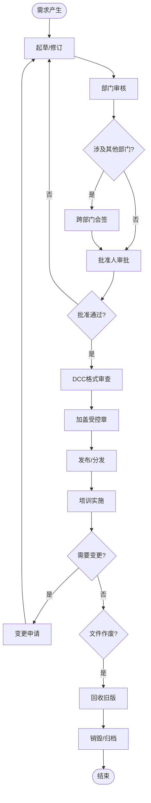

# BIZ-FLOW-C02: 文档管理流程

**文档编号**：BIZ-FLOW-C02  
**版本**：v1.0  
**创建日期**：2026年1月5日  
**更新日期**：2026年1月5日  
**文档状态**：已发布  
**业务域**：综合管理域  
**优先级**：🟡 P2（中）

---

## 一、流程概述

### 1.1 基本信息

- **流程名称**：文档管理流程（Document Control Process）
- **流程编号**：BIZ-FLOW-C02
- **起点**：文档编制需求提出
- **终点**：文档归档、作废或销毁
- **业务目标**：
  - 确保企业文档的规范性、准确性和有效性
  - 保护企业知识产权和商业机密
  - 满足ISO 9001等质量管理体系对文件控制的要求
  - 促进知识共享与传承

### 1.2 适用范围

- **适用公司**：全集团
- **适用对象**：
  - **管理性文档**：制度、流程、规范、手册
  - **技术性文档**：图纸、配方、工艺卡、规格书
  - **记录性文档**：表单、报告、会议纪要
- **不适用**：临时性通知、个人笔记

### 1.3 流程类型

- **流程性质**：基础支持流程
- **流程频率**：中
- **流程复杂度**：中（涉及版本控制和权限管理）

---

## 二、角色与职责（RACI矩阵）

| 流程阶段 | 文档编制人 | 部门经理 | 关联部门 | 文控专员(DCC) | 批准人 |
|---------|-----------|---------|---------|--------------|-------|
| 编制/修订 | R | A | C | C (格式) | - |
| 审核 | I | R | C | - | - |
| 批准 | - | - | - | - | A |
| 发布/分发 | - | - | I | R | - |
| 培训/实施 | R | A | I | - | - |
| 归档/作废 | - | - | - | R | - |

**注释**：

- R (Responsible)：负责执行
- A (Accountable)：最终批准
- C (Consulted)：需要咨询
- I (Informed)：需要知会
- **批准人**：通常为部门总监、副总或总经理（视文档等级而定）

---

## 三、流程阶段设计

### 阶段1：编制与修订 (Drafting & Revision)

#### 步骤1.1 需求提出

**执行角色**：文档编制人

**触发条件**：

- 新业务开展。
- 现有流程优化。
- 外部法规变更。
- 定期评审发现不适用。

#### 步骤1.2 文档起草

**执行角色**：文档编制人

**执行步骤**：

1. 申请文档编号（向DCC申请）。
2. 使用标准模板（如：制度模板、流程图模板）。
3. 编写内容，确保逻辑清晰、文字准确。
4. 设定密级（公开、内部、秘密、机密）。

---

### 阶段2：评审与批准 (Review & Approval)

#### 步骤2.1 部门内部审核

**执行角色**：部门经理

**审核内容**：

- 内容是否符合业务实际？
- 职责划分是否清晰？

#### 步骤2.2 跨部门会签（如涉及）

**执行角色**：关联部门经理

**执行步骤**：

1. 涉及上下游接口的文档，需相关部门会签。
2. 提出修改意见，编制人修订。

#### 步骤2.3 正式批准

**执行角色**：批准人（如总经理/管理者代表）

**执行步骤**：

1. 审核文档的合规性和战略一致性。
2. 签字批准（电子签或手签）。

---

### 阶段3：发布与分发 (Release & Distribution)

#### 步骤3.1 格式审查与受控

**执行角色**：文控专员 (DCC)

**执行步骤**：

1. 检查格式、编号、版本号（如 v1.0）。
2. 检查审批手续是否完备。
3. 加盖“受控文件”章（电子章）。
4. 录入【文件总清单】。

#### 步骤3.2 分发与通知

**执行角色**：文控专员 (DCC)

**执行步骤**：

1. **电子分发**：上传至PLM/OA/知识库，设置查阅权限。
2. **纸质分发**：打印受控副本，分发给生产线/实验室，做好【文件分发记录】。
3. 发送全员通知（邮件/公告）。

---

### 阶段4：培训与实施 (Training & Implementation)

#### 步骤4.1 组织培训

**执行角色**：文档编制人 / 部门经理

**执行步骤**：

1. 确定培训对象。
2. 开展培训（会议、在线学习）。
3. 考核（如需要），保留【培训签到表】。

#### 步骤4.2 正式生效

**执行角色**：全员

**执行步骤**：

1. 按照新文档执行业务。
2. 废除旧习惯。

---

### 阶段5：变更与作废 (Change & Obsolescence)

#### 步骤5.1 变更申请

**执行角色**：申请人

**执行步骤**：

1. 填写【文件更改申请单】。
2. 说明变更原因和内容（Before/After对比）。
3. 走审批流程（同阶段2）。

#### 步骤5.2 版本升级

**执行角色**：文控专员 (DCC)

**执行步骤**：

1. 版本号升级（v1.0 -> v1.1 或 v2.0）。
2. 重新发布新版本。

#### 步骤5.3 旧版回收与作废

**执行角色**：文控专员 (DCC)

**执行步骤**：

1. 回收旧版纸质文件，销毁或加盖“作废”章保留一份作为档案。
2. 系统中将旧版本标记为“已失效/历史版本”。
3. 防止现场误用旧文件。

---

## 四、流程图

### 4.1 文档全生命周期管理

---

## 五、关键控制点

### 5.1 控制点清单

| 控制点 | 风险描述 | 控制措施 | 责任人 |
|-------|---------|---------|--------|
| **版本控制** | 现场使用旧版本导致质量事故 | 严格执行旧版回收，定期现场稽查 | DCC |
| **审批权限** | 未经批准发布文件 | 系统强制审批流，无批准无法发布 | 批准人 |
| **密级管理** | 核心机密外泄 | 严格设定系统权限，限制下载/打印，加水印 | IT/DCC |
| **外来文件** | 客户标准/国标未及时更新 | 建立外来文件清单，定期查新 | 质量部 |
| **记录保存** | 关键记录丢失 | 定期备份，防火防水防虫 | 档案管理员 |

---

## 六、异常处理

### 6.1 常见异常场景

#### 场景1：紧急变更

**触发**：生产现场发现工艺严重错误，需立即停止。

**处理流程**：

1. 填写【临时更改通知单】(TCN)。
2. 授权人（如总工）现场签字生效。
3. 有效期通常不超过24小时或一批次。
4. 随后补办正式文件更改流程。

#### 场景2：文件丢失

**触发**：受控纸质文件丢失。

**处理流程**：

1. 责任人提交书面说明。
2. 部门经理签字确认。
3. 向DCC申请补发，新文件编号不变，注明“补发”。

---

## 七、绩效指标（KPI）

| 指标名称 | 定义 | 计算公式 | 目标值 |
|---------|------|---------|--------|
| **文件发放及时率** | 批准后到发放的时间 | 24小时内发放数 / 总数 | 100% |
| **旧版文件回收率** | 变更后旧版回收比例 | 回收数 / 发放数 | 100% |
| **文件差错率** | 格式、编号等错误 | 错误文件数 / 总文件数 | ≤ 1% |

---

## 八、与其他流程的接口

### 8.1 上游流程

| 上游流程 | 接口点 | 输入数据 |
|---------|--------|---------|
| **工艺改进** (BIZ-FLOW-M03) | 工艺变更 | 新的工艺文件/SOP |
| **研发立项** (BIZ-FLOW-R01) | 研发输出 | 图纸、规格书 |

### 8.2 下游流程

| 下游流程 | 接口点 | 输出数据 |
|---------|--------|---------|
| **所有业务流程** | 规范指导 | 标准作业程序 (SOP) |
| **员工培训** | 教材 | 岗位操作手册 |

---

## 九、流程优化建议

### 9.1 短期优化

1. **模板标准化**：统一全公司的Word/PPT/Excel模板，提升专业形象。
2. **电子签名**：全面推广电子签名，减少纸质流转，提高审批速度。

### 9.2 中期优化

1. **知识图谱**：建立文档之间的关联关系（如：制度->流程->表单），方便检索。
2. **移动端查阅**：开发企业微信/钉钉应用，支持一线员工手机扫码查看SOP。

### 9.3 长期优化

1. **结构化文档**：从“文档管理”转向“内容管理”，实现文档内容的碎片化重组和复用（如DITA标准）。

---

## 十、附录

### 10.1 相关表单

| 表单名称 | 编号 | 用途 |
|---------|------|------|
| 文件更改申请单 | FRM-DCC-001 | 变更申请 |
| 文件发放/回收记录表 | FRM-DCC-002 | 记录流向 |
| 文件销毁申请单 | FRM-DCC-003 | 销毁记录 |
| 外来文件清单 | FRM-DCC-004 | 外部标准管理 |

### 10.2 术语表

| 术语 | 全称 | 解释 |
|-----|------|------|
| DCC | Document Control Center | 文控中心 |
| SOP | Standard Operating Procedure | 标准作业程序 |
| PLM | Product Lifecycle Management | 产品生命周期管理系统（常用于图纸管理） |

### 10.3 参考文档

- ISO 9001:2015 质量管理体系要求 (7.5 成文信息)
- 档案法

---

**文档版本历史**：

| 版本 | 日期 | 修改人 | 修改内容 |
|-----|------|--------|---------|
| v1.0 | 2026-01-05 | 系统 | 初始版本，定义文档管理流程 |

---

**审批记录**：

| 角色 | 姓名 | 审批意见 | 日期 |
|-----|------|---------|------|
| 流程Owner | 待定 | 待审批 | - |
| 管理者代表 | 待定 | 待审批 | - |
| 总经理 | 待定 | 待审批 | - |

---

**最后更新**：2026年1月5日
