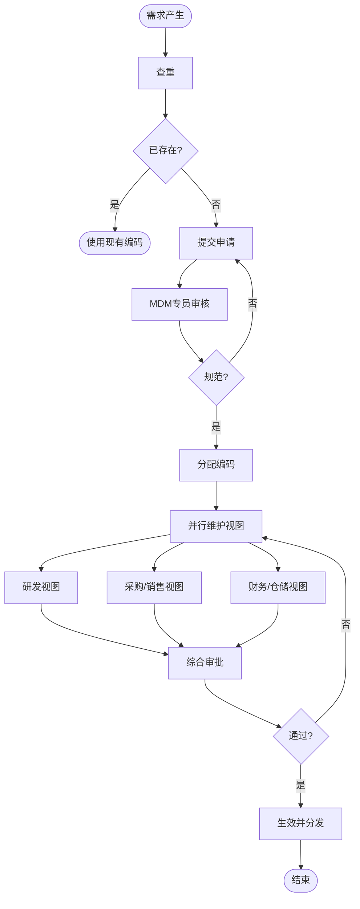

# BIZ-FLOW-C03: 主数据管理流程

**文档编号**：BIZ-FLOW-C03  
**版本**：v1.0  
**创建日期**：2026年1月5日  
**更新日期**：2026年1月5日  
**文档状态**：已发布  
**业务域**：综合管理域  
**优先级**：🔴 P0（极高）

---

## 一、流程概述

### 1.1 基本信息

- **流程名称**：主数据管理流程（Master Data Management Process）
- **流程编号**：BIZ-FLOW-C03
- **起点**：数据新增/变更申请
- **终点**：数据生效并分发
- **业务目标**：
  - 确保全集团数据的一致性、准确性和完整性
  - 消除“信息孤岛”，实现跨系统数据共享
  - 规范数据标准，提升报表分析质量
  - 避免因数据错误导致的业务停滞（如发错货、买错料）

### 1.2 适用范围

- **适用公司**：全集团
- **核心主数据**：
  - **物料主数据 (Material Master)**：编码、名称、规格、属性。
  - **物料清单 (BOM)**：父子项关系、用量、损耗率。
  - **客商档案 (BP)**：客户、供应商的基本信息、银行账户。
  - **财务主数据**：会计科目、成本中心、利润中心。

### 1.3 流程类型

- **流程性质**：基础支撑流程
- **流程频率**：中频（日常申请）
- **流程复杂度**：中高（涉及多部门协同维护）

---

## 二、角色与职责（RACI矩阵）

| 流程阶段 | 申请人 | 数据专员(MDM) | 研发/技术 | 财务 | 采购/销售 | 流程Owner |
|---------|-------|--------------|----------|------|----------|----------|
| 数据申请 | R | C | - | - | - | - |
| 查重与校验 | I | R | - | - | - | - |
| 视图维护 | I | C | R (技术视图) | R (财务视图) | R (业务视图) | - |
| 审批 | I | I | - | - | - | A |
| 启用/分发 | - | R | - | - | - | - |
| 清洗/停用 | I | R | C | C | C | A |

**注释**：

- R (Responsible)：负责执行
- A (Accountable)：最终批准
- C (Consulted)：需要咨询
- I (Informed)：需要知会
- **数据专员**：通常归属于IT部或运营部，负责数据标准的把控。

---

## 三、流程阶段设计

### 阶段1：物料主数据管理 (Material Master)

#### 步骤1.1 新增申请

**触发条件**：新产品研发、新材料引入。

**执行角色**：申请人（研发/采购）

**执行步骤**：

1. 在MDM系统中查询是否已存在类似物料（防止重码）。
2. 填写【物料编码申请单】：
   - 必填项：物料名称、规格型号、基本单位、物料大类。
   - 附件：规格书或图纸。

#### 步骤1.2 编码分配与基本视图维护

**执行角色**：数据专员

**执行步骤**：

1. 审核申请信息的规范性（如：名称中不能含特殊字符）。
2. 按《物料编码规则》分配唯一编码（如：10.01.0001）。
3. 维护基本视图（Basic View）。

#### 步骤1.3 扩展视图维护

**执行角色**：各职能部门

**执行步骤**：

1. **研发**：维护技术参数、图号。
2. **采购**：维护采购组、采购提前期、最小订货量。
3. **销售**：维护销售组织、税率、发货工厂。
4. **财务**：维护评估类（决定会计科目）、价格控制方式（标准价/移动平均价）。
5. **仓储**：维护仓库号、货位、重量、体积。

#### 步骤1.4 审批与生效

**执行角色**：流程Owner

**执行步骤**：

1. 确认所有视图维护完整。
2. 批准生效。
3. 系统自动同步至ERP/PLM/WMS等下游系统。

---

### 阶段2：BOM管理 (Bill of Materials)

#### 步骤2.1 BOM建立

**触发条件**：新产品设计定型。

**执行角色**：研发工程师

**执行步骤**：

1. 创建父项物料。
2. 添加子项物料（组件）。
3. 设定用量（Quantity）和基础数量（Base Quantity）。
4. 设定损耗率（Scrap Rate）。

#### 步骤2.2 BOM审核

**执行角色**：研发经理、生产经理、财务经理

**审核重点**：

- **技术**：结构是否正确？
- **生产**：工艺路线是否匹配？
- **成本**：成本卷算是否合理？

#### 步骤2.3 BOM生效

**执行角色**：数据专员

**执行步骤**：

1. 设定BOM状态为“活动”。
2. 设定生效日期（Valid From）。

---

### 阶段3：客商档案管理 (Customer/Vendor)

#### 步骤3.1 准入申请

**触发条件**：新客户开发、新供应商引入。

**执行角色**：销售员/采购员

**执行步骤**：

1. 收集证照（营业执照、开户许可证）。
2. 填写【客商主数据申请单】。
3. 录入：名称、税号、地址、联系人、银行账户。

#### 步骤3.2 资质审核

**执行角色**：财务、法务

**执行步骤**：

1. **财务**：核对银行账户信息、税号真实性。
2. **法务**：核对工商信息、信用风险（天眼查/企查查）。

#### 步骤3.3 创建与扩充

**执行角色**：数据专员

**执行步骤**：

1. 分配客商编码。
2. 扩充公司代码视图（统驭科目、付款条件）。
3. 扩充采购/销售组织视图（币种、贸易条款）。

---

## 四、流程图

### 4.1 物料主数据创建流程

---

## 五、关键控制点

### 5.1 控制点清单

| 控制点 | 风险描述 | 控制措施 | 责任人 |
|-------|---------|---------|--------|
| **一物多码** | 同一物料有多个编码，导致库存积压 | 强制查重，严格执行编码规则（名称+规格唯一性） | 数据专员 |
| **多物一码** | 不同物料共用编码，导致发错货 | 关键属性（如电压、颜色）必须区分编码 | 研发工程师 |
| **财务属性错误** | 评估类错误导致成本核算错误 | 财务视图必须由财务人员专人维护 | 财务经理 |
| **客商信息造假** | 虚假供应商骗取货款 | 必须上传营业执照原件扫描件，财务复核银行信息 | 财务/风控 |

---

## 六、异常处理

### 6.1 常见异常场景

#### 场景1：紧急编码申请

**触发**：生产急需领料，但物料编码未审批完成。

**处理流程**：

1. 申请人联系数据专员走“绿色通道”。
2. 先维护基本视图和财务视图，确保能下单、能入库。
3. 后续在24小时内补齐其他视图信息。

#### 场景2：BOM错误导致生产领料错误

**触发**：生产发现BOM中某组件规格不对。

**处理流程**：

1. 立即暂停生产。
2. 发起【工程变更通知】(ECN)。
3. 修正BOM。
4. 重新打印领料单，退回错误物料，补领正确物料。

---

## 七、绩效指标（KPI）

| 指标名称 | 定义 | 计算公式 | 目标值 |
|---------|------|---------|--------|
| **数据申请及时率** | 申请到生效的时间 | 24小时内完成数 / 总申请数 | ≥ 95% |
| **数据准确率** | 抽查发现错误的比例 | 1 - (错误记录数 / 抽查总数) | ≥ 99% |
| **一物多码率** | 重复编码占比 | 重复编码组数 / 总物料数 | 0% |

---

## 八、与其他流程的接口

### 8.1 上游流程

| 上游流程 | 接口点 | 输入数据 |
|---------|--------|---------|
| **研发立项** (BIZ-FLOW-R01) | 新产品 | 物料参数、BOM结构 |
| **供应商评估** (BIZ-FLOW-P02) | 新供应商 | 供应商资质信息 |

### 8.2 下游流程

| 下游流程 | 接口点 | 输出数据 |
|---------|--------|---------|
| **所有业务流程** | 基础数据 | 物料编码、客商编码、BOM |

---

## 九、流程优化建议

### 9.1 短期优化

1. **编码规则固化**：制定详细的《物料分类与编码手册》，杜绝“随意起名”。
2. **模板化申请**：在OA中设计标准化的申请表单，必填项设为红星，减少沟通成本。

### 9.2 中期优化

1. **MDM系统**：引入主数据管理平台，实现数据的清洗、治理和分发。
2. **数据清洗**：对历史遗留的脏数据（重复、残缺、废弃）进行一次性大清洗。

### 9.3 长期优化

1. **数据质量防火墙**：利用AI技术，在录入时自动识别疑似重复数据或不规范描述。

---

## 十、附录

### 10.1 相关表单

| 表单名称 | 编号 | 用途 |
|---------|------|------|
| 物料编码申请单 | FRM-MDM-001 | 物料新增 |
| BOM变更申请单 | FRM-MDM-002 | BOM修改 |
| 客商主数据申请单 | FRM-MDM-003 | 往来单位新增 |
| 账户信息变更函 | FRM-MDM-004 | 银行账户变更 |

### 10.2 术语表

| 术语 | 全称 | 解释 |
|-----|------|------|
| MDM | Master Data Management | 主数据管理 |
| BOM | Bill of Materials | 物料清单 |
| UOM | Unit of Measure | 计量单位 |
| SKU | Stock Keeping Unit | 库存量单位 |

### 10.3 参考文档

- 物料编码管理规范
- 财务会计科目表
- 供应商管理制度

---

**文档版本历史**：

| 版本 | 日期 | 修改人 | 修改内容 |
|-----|------|--------|---------|
| v1.0 | 2026-01-05 | 系统 | 初始版本，定义主数据管理流程 |

---

**审批记录**：

| 角色 | 姓名 | 审批意见 | 日期 |
|-----|------|---------|------|
| 流程Owner | 待定 | 待审批 | - |
| IT总监 | 待定 | 待审批 | - |
| 财务总监 | 待定 | 待审批 | - |

---

**最后更新**：2026年1月5日
