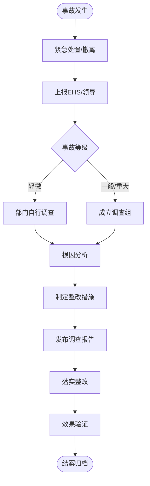

# BIZ-FLOW-E01: 安全与环境管理流程

**文档编号**：BIZ-FLOW-E01  
**版本**：v1.0  
**创建日期**：2026年1月5日  
**更新日期**：2026年1月5日  
**文档状态**：已发布  
**业务域**：综合管理域  
**优先级**：🔴 P0（极高）

---

## 一、流程概述

### 1.1 基本信息

- **流程名称**：安全与环境管理流程（EHS Management Process）
- **流程编号**：BIZ-FLOW-E01
- **起点**：风险识别 / 事故发生
- **终点**：隐患消除 / 事故结案
- **业务目标**：
  - 零事故、零伤害、零污染
  - 符合国家安全生产法和环保法规要求
  - 保障员工职业健康
  - 维护企业社会责任形象

### 1.2 适用范围

- **适用公司**：全集团（重点是B公司工厂和A公司实验室）
- **核心模块**：
  - **危废管理**：废液、废渣的收集与处置。
  - **事故管理**：工伤、火灾、泄漏事故的上报与调查。
  - **隐患排查**：日常巡检与整改。
  - **职业健康**：体检、PPE管理。

### 1.3 流程类型

- **流程性质**：合规与风险控制流程
- **流程频率**：日常（巡检）、突发（事故）
- **流程复杂度**：中高（涉及法规多，责任重）

---

## 二、角色与职责（RACI矩阵）

| 流程阶段 | 员工 | 部门负责人 | EHS专员 | EHS经理 | 总经理 |
|---------|-----|-----------|--------|--------|-------|
| 隐患上报 | R | R | I | - | - |
| 隐患整改 | R | A | C (指导) | I | - |
| 危废收集 | R | A | R (转运) | - | - |
| 事故上报 | R | R | R | A | I |
| 事故调查 | I | C | R | A | A (重大) |
| 应急演练 | R | R | R (组织) | A | - |

**注释**：

- R (Responsible)：负责执行
- A (Accountable)：最终批准
- C (Consulted)：需要咨询
- I (Informed)：需要知会

---

## 三、流程阶段设计

### 阶段1：危险废物管理 (Hazardous Waste)

#### 步骤1.1 分类与收集

**执行角色**：产废部门（实验室/车间）

**执行步骤**：

1. 按照《危废分类名录》进行分类（如：有机废液、酸性废液、废活性炭）。
2. 倒入专用收集桶，粘贴【危险废物标签】（注明成分、危害性、产生日期）。
3. 做好台账记录。

#### 步骤1.2 内部转运与暂存

**执行角色**：EHS专员

**执行步骤**：

1. 定期将各点位的危废转运至【危废暂存间】。
2. 称重、登记入库。
3. 检查暂存间状态（防渗漏、防雨、双人双锁）。

#### 步骤1.3 委外处置

**执行角色**：EHS经理

**执行步骤**：

1. 联系有资质的第三方处置单位。
2. 签订处置合同。
3. 在环保局系统申报转移联单（五联单）。
4. 车辆装运，确认联单闭环。

---

### 阶段2：事故管理 (Incident Management)

#### 步骤2.1 事故上报

**触发条件**：发生人员受伤、火灾、泄漏等。

**执行角色**：现场目击者

**执行步骤**：

1. **立即**：按响警报，撤离人员，切断电源（如安全）。
2. **15分钟内**：口头汇报给部门主管和EHS。
3. **24小时内**：提交书面【事故初始报告】。

#### 步骤2.2 应急处置

**执行角色**：应急小组

**执行步骤**：

1. 启动应急预案（如：化学品泄漏应急预案）。
2. 抢救伤员。
3. 控制事态（如：围堵泄漏物）。

#### 步骤2.3 调查与分析

**执行角色**：事故调查组（EHS牵头）

**执行步骤**：

1. 保护现场，收集证据（监控、照片）。
2. 访谈当事人。
3. 根因分析（5Why分析法）：
   - 直接原因：人的不安全行为、物的不安全状态。
   - 根本原因：管理缺陷、培训不足。

#### 步骤2.4 结案与整改

**执行角色**：EHS经理

**执行步骤**：

1. 发布【事故调查报告】。
2. 落实整改措施（CAPA）。
3. 全员通报教育（举一反三）。

---

### 阶段3：隐患排查与治理 (Hazard Identification)

#### 步骤3.1 日常巡检

**执行角色**：EHS专员、部门安全员

**执行步骤**：

1. 每日/每周按检查表巡视。
2. 重点检查：消防设施、电气线路、危化品存储、PPE佩戴。

#### 步骤3.2 隐患整改

**执行角色**：责任部门

**执行步骤**：

1. 收到【隐患整改通知单】。
2. 立即整改（如：清理堵塞的通道）。
3. 无法立即整改的，制定计划并采取临时防范措施。
4. EHS复查验收。

---

## 四、流程图

### 4.1 事故处理流程

---

## 五、关键控制点

### 5.1 控制点清单

| 控制点 | 风险描述 | 控制措施 | 责任人 |
|-------|---------|---------|--------|
| **危废联单** | 非法倾倒导致刑责 | 必须严格执行五联单制度，核实处置方资质 | EHS经理 |
| **特种作业** | 动火/登高引发火灾或坠落 | 严格执行作业票审批制度，现场设监护人 | 部门主管 |
| **化学品混存** | 禁忌物混存引发爆炸 | 严格按MSDS要求分类存储，设置防爆柜 | 仓管员 |
| **事故瞒报** | 错失最佳救援时机，责任升级 | 建立“无责上报”机制，严惩瞒报行为 | 总经理 |

---

## 六、异常处理

### 6.1 常见异常场景

#### 场景1：环保突击检查

**触发**：环保局执法人员到厂。

**处理流程**：

1. 立即通知EHS经理和总经理。
2. 陪同检查，如实回答问题，提供台账。
3. 对指出的问题照单全收，立即整改。
4. 严禁阻挠执法。

#### 场景2：化学品泄漏

**触发**：实验室浓硫酸打翻。

**处理流程**：

1. 疏散无关人员。
2. 穿戴全套防护服（防酸碱）。
3. 使用泄漏应急包（吸附棉、中和剂）处理。
4. 收集废弃物作为危废处理。

---

## 七、绩效指标（KPI）

| 指标名称 | 定义 | 计算公式 | 目标值 |
|---------|------|---------|--------|
| **百万工时伤害率 (LTIFR)** | 安全绩效核心指标 | (损失工时工伤数 / 总工时) * 100万 | 0 |
| **隐患整改率** | 执行力指标 | 已整改数 / 发现总数 | 100% |
| **三级教育覆盖率** | 培训合规性 | 已培训人数 / 新入职人数 | 100% |

---

## 八、与其他流程的接口

### 8.1 上游流程

| 上游流程 | 接口点 | 输入数据 |
|---------|--------|---------|
| **采购订单到付款** (BIZ-FLOW-P01) | 化学品采购 | MSDS（化学品安全技术说明书） |
| **工艺改进** (BIZ-FLOW-M03) | 变更评审 | 安全风险评估 |

### 8.2 下游流程

| 下游流程 | 接口点 | 输出数据 |
|---------|--------|---------|
| **人力资源** (BIZ-FLOW-H01) | 工伤申报 | 事故报告 |
| **设备维护** (BIZ-FLOW-M04) | 隐患治理 | 维修需求 |

---

## 九、流程优化建议

### 9.1 短期优化

1. **安全地图**：绘制全厂安全风险地图，标示出红/橙/黄/蓝四色风险区域。
2. **随手拍**：鼓励员工用手机拍摄身边的隐患，上传到微信群，查实奖励红包。

### 9.2 中期优化

1. **EHS信息化**：建立EHS管理系统，实现隐患排查、作业票审批的移动化。
2. **行为安全观察 (BBS)**：从“管物”转向“管人”，纠正员工的不安全习惯。

### 9.3 长期优化

1. **本质安全**：通过工艺革新（如用无毒原料替代有毒原料），从源头消除风险。

---

## 十、附录

### 10.1 相关表单

| 表单名称 | 编号 | 用途 |
|---------|------|------|
| 隐患整改通知单 | FRM-EHS-001 | 隐患治理 |
| 事故调查报告 | FRM-EHS-002 | 事故分析 |
| 动火作业许可证 | FRM-EHS-003 | 特种作业 |
| 危废转移联单 | FRM-EHS-004 | 环保合规 |

### 10.2 术语表

| 术语 | 全称 | 解释 |
|-----|------|------|
| EHS | Environment, Health and Safety | 环境、健康与安全 |
| MSDS | Material Safety Data Sheet | 化学品安全技术说明书 |
| PPE | Personal Protective Equipment | 个人防护用品 |
| 5Why | - | 5个为什么（根因分析法） |

### 10.3 参考文档

- 安全生产法
- 固体废物污染环境防治法
- 职业病防治法

---

**文档版本历史**：

| 版本 | 日期 | 修改人 | 修改内容 |
|-----|------|--------|---------|
| v1.0 | 2026-01-05 | 系统 | 初始版本，定义EHS管理流程 |

---

**审批记录**：

| 角色 | 姓名 | 审批意见 | 日期 |
|-----|------|---------|------|
| 流程Owner | 待定 | 待审批 | - |
| 生产总监 | 待定 | 待审批 | - |
| 总经理 | 待定 | 待审批 | - |

---

**最后更新**：2026年1月5日
