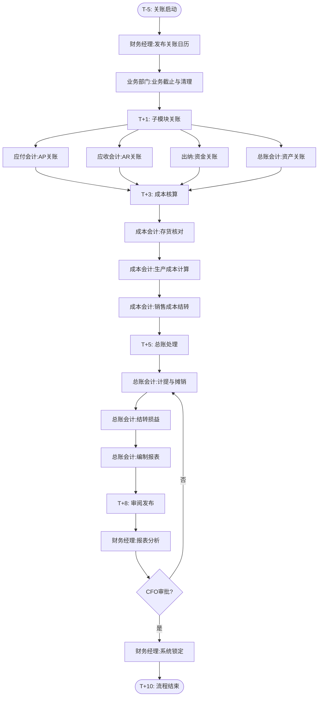

# BIZ-FLOW-F01: 月度财务关账流程

**文档编号**：BIZ-FLOW-F01  
**版本**：v1.0  
**创建日期**：2026年1月5日  
**更新日期**：2026年1月5日  
**文档状态**：已发布  
**业务域**：财务域  
**优先级**：🔴 P0（极高）

---

## 一、流程概述

### 1.1 基本信息

- **流程名称**：月度财务关账流程（Month-End Closing Process）
- **流程编号**：BIZ-FLOW-F01
- **起点**：关账通知发布（通常为每月25日）
- **终点**：财务报表发布（通常为次月10日）
- **业务目标**：
  - 确保财务数据的准确性、完整性和及时性
  - 准确核算当期成本和利润
  - 满足内部管理和外部合规要求
  - 锁定当期账务，防止数据篡改

### 1.2 适用范围

- **适用公司**：全集团（A公司、B公司及合并报表）
- **适用部门**：财务部、各业务部门（销售、采购、生产、仓储、人事）
- **涉及模块**：总账(GL)、应收(AR)、应付(AP)、固定资产(FA)、存货(INV)、成本(CO)

### 1.3 流程类型

- **流程性质**：周期性核心管控流程
- **流程频率**：每月一次
- **流程复杂度**：极高（涉及全公司所有业务数据的汇总与核对）

---

## 二、角色与职责（RACI矩阵）

| 流程阶段 | 总账会计 | 成本会计 | 应收/应付会计 | 出纳 | 财务经理 | 财务总监(CFO) | 业务部门负责人 |
|---------|---------|---------|--------------|------|---------|--------------|--------------|
| 关账计划 | R | C | C | C | A | I | I |
| 业务截止 | I | I | I | I | I | I | R, A |
| 往来核对 | I | I | R | I | C | - | C |
| 资金核对 | I | - | - | R | C | - | - |
| 存货/成本核算 | I | R | - | - | A | I | C |
| 计提与摊销 | R | C | - | - | A | - | - |
| 报表编制 | R | C | C | C | A | C | - |
| 报表审阅 | I | I | I | I | R | A | - |
| 关账锁定 | R | - | - | - | A | I | - |

**注释**：

- R (Responsible)：负责执行
- A (Accountable)：最终批准
- C (Consulted)：需要咨询
- I (Informed)：需要知会

---

## 三、流程阶段设计

### 阶段1：关账准备（T-5至T-1日）

**时间基准**：T日为当月最后一天

#### 步骤1.1 发布关账日历

**执行角色**：财务经理

**执行步骤**：

1. 制定下月关账计划，明确各节点截止时间：
   - 采购发票录入截止时间
   - 销售发货截止时间
   - 费用报销截止时间
   - 生产工单关闭截止时间
2. 通过邮件/OA通知全公司各部门。

**输出**：

- 月度关账日历

#### 步骤1.2 业务数据清理

**执行角色**：业务部门负责人

**执行步骤**：

1. **销售部**：确认所有已发货订单是否已开票（或确认收入）。
2. **采购部**：确认所有已到货采购单是否已收到发票并录入系统。
3. **仓储部**：完成所有出入库单据的系统录入，确保账实相符。
4. **生产部**：关闭已完工的生产工单，统计在制品（WIP）。
5. **行政/人事**：提交当月考勤、社保、公积金数据。

**关键控制**：

- 确保没有"体外循环"的单据。
- 确保所有接口数据（如CRM到ERP）已同步成功。

---

### 阶段2：子模块关账（T+1至T+3日）

**时间基准**：T日为当月最后一天

#### 步骤2.1 应付(AP)关账

**执行角色**：应付会计

**执行步骤**：

1. **发票校验**：审核所有待入账的采购发票。
2. **三单匹配**：核对采购订单、入库单、发票是否一致。
3. **暂估入账**：对已到货但未收到发票的业务，进行暂估入账（GR/IR）。
4. **供应商对账**：与主要供应商核对余额。
5. **关闭AP期间**：停止录入当期采购发票。

**输出**：

- 采购暂估表
- 供应商余额调节表

#### 步骤2.2 应收(AR)关账

**执行角色**：应收会计

**执行步骤**：

1. **收入确认**：根据发货单/验收单确认当期收入。
2. **开票复核**：核对金税系统开票数据与财务系统收入数据。
3. **回款核销**：将银行收款与销售发票进行核销。
4. **坏账计提**：根据账龄分析法计提坏账准备。
5. **客户对账**：与主要客户核对余额。
6. **关闭AR期间**：停止录入当期销售发票。

**输出**：

- 应收账龄分析表
- 收入明细表

#### 步骤2.3 资金(Cash)关账

**执行角色**：出纳

**执行步骤**：

1. **银行对账**：下载银行对账单，与日记账核对。
2. **编制调节表**：编制【银行存款余额调节表】，处理未达账项。
3. **现金盘点**：盘点库存现金，确保账实相符。
4. **资金报表**：出具资金日报/月报。

**输出**：

- 银行存款余额调节表
- 现金盘点表

#### 步骤2.4 固定资产(FA)关账

**执行角色**：总账会计

**执行步骤**：

1. **资产变动**：处理当月新增、报废、调拨的固定资产。
2. **折旧计提**：运行系统折旧程序，生成折旧凭证。
3. **分摊**：将折旧费用分摊至各成本中心（制造费用、管理费用等）。
4. **关闭FA期间**。

**输出**：

- 固定资产折旧表
- 资产变动清单

---

### 阶段3：成本与存货核算（T+3至T+5日）

#### 步骤3.1 存货核对

**执行角色**：成本会计、仓管员

**执行步骤**：

1. **数量核对**：财务账面库存 vs 仓库实物盘点（抽盘或全盘）。
2. **收发存平衡**：期初 + 入库 - 出库 = 期末。
3. **异常处理**：处理盘盈盘亏，经审批后调整账务。

#### 步骤3.2 生产成本核算

**执行角色**：成本会计

**执行步骤**：

1. **数据归集**：
   - 直接材料：从领料单汇总。
   - 直接人工：从工资表和工时记录汇总。
   - 制造费用：从折旧、水电、辅料等科目汇总。
2. **费用分配**：
   - 将制造费用按工时/机时分配到各工单。
3. **成本计算**：
   - 计算完工产品成本。
   - 计算在制品（WIP）成本。
4. **差异分析**：
   - 标准成本 vs 实际成本（如有）。
   - 分析材料价差、量差。
5. **结转成本**：
   - 借：库存商品
   - 贷：生产成本

#### 步骤3.3 销售成本结转

**执行角色**：成本会计

**执行步骤**：

1. 根据当月销售出库记录。
2. 结转主营业务成本：
   - 借：主营业务成本
   - 贷：库存商品

**输出**：

- 产品成本计算单
- 存货收发存报表
- 销售毛利分析表

---

### 阶段4：总账关账与报表（T+5至T+8日）

#### 步骤4.1 薪酬与费用计提

**执行角色**：总账会计

**执行步骤**：

1. **薪酬计提**：根据人事提供的工资表，计提工资、社保、公积金、个税。
2. **待摊费用**：摊销房租、保险费等。
3. **预提费用**：计提水电费、利息、审计费等已发生但未付款的费用。
4. **税金计提**：计算增值税、附加税、印花税、所得税。

#### 步骤4.2 往来重分类与调汇

**执行角色**：总账会计

**执行步骤**：

1. **往来重分类**：
   - 应收账款贷方余额 → 预收账款
   - 应付账款借方余额 → 预付账款
2. **期末调汇**：
   - 对外币账户（银行、应收、应付）按月末汇率调整汇兑损益。

#### 步骤4.3 损益结转

**执行角色**：总账会计

**执行步骤**：

1. 检查所有损益类科目余额。
2. 运行【结转损益】程序，将损益科目余额转入"本年利润"。
3. 确认损益科目余额为零。

#### 步骤4.4 报表编制

**执行角色**：总账会计

**执行步骤**：

1. **试算平衡**：检查借贷是否平衡。
2. **编制单体报表**：
   - 资产负债表
   - 利润表
   - 现金流量表
3. **编制合并报表**（如有）：
   - 抵销内部交易（A公司卖给B公司）。
   - 抵销内部往来。
   - 抵销内部投资。

**输出**：

- 财务报表（单体+合并）
- 科目余额表

---

### 阶段5：审阅与发布（T+8至T+10日）

#### 步骤5.1 财务分析与审阅

**执行角色**：财务经理、CFO

**执行步骤**：

1. **异常波动分析**：对比本月与上月、本月与预算、本月与去年同期。
2. **关键指标检查**：毛利率、费用率、存货周转率、应收周转率。
3. **询问与解释**：针对异常数据询问相关会计，获取合理解释。

#### 步骤5.2 关账锁定

**执行角色**：财务经理

**执行步骤**：

1. 确认报表无误。
2. 在系统中执行【期间锁定】操作，禁止任何新增凭证。
3. 开启下一个会计期间。

#### 步骤5.3 报表发布

**执行角色**：CFO

**执行步骤**：

1. 签字批准财务报表。
2. 发送给管理层（CEO、董事会）。
3. 发送给外部机构（银行、税务、审计，如需要）。

---

## 四、流程图

### 4.1 关账主流程图

---

## 五、关键控制点

### 5.1 控制点清单

| 控制点 | 风险描述 | 控制措施 | 责任人 |
|-------|---------|---------|--------|
| **截止性测试** | 跨期确认收入/费用 | 严格检查最后几笔和最初几笔业务的日期 | 财务经理 |
| **银行余额调节** | 资金被挪用或记录错误 | 每月必须编制调节表，且由非出纳人员复核 | 财务经理 |
| **存货账实相符** | 资产流失或成本虚增 | 定期盘点，差异必须查明原因并审批 | 成本会计 |
| **暂估入账** | 负债低估 | 检查未开票入库明细，确保暂估完整 | 应付会计 |
| **内部交易抵销** | 合并报表虚增收入/资产 | 建立内部交易核对机制，确保双方入账一致 | 总账会计 |
| **权限控制** | 关账后修改数据 | 系统锁定期间，只有CFO授权才能反结账 | 系统管理员 |

---

## 六、异常处理

### 6.1 常见异常场景

#### 场景1：关账后发现重大遗漏

**触发**：报表已出，发现有一笔大额收入未确认。

**处理流程**：

1. **评估影响**：计算对利润、税金的影响金额。
2. **决策**：
   - **重大影响**：申请【反结账】，重新录入，重新生成报表（需CFO批准）。
   - **轻微影响**：记录在下个月，作为会计差错更正。
3. **记录**：填写【关账后调整申请单】。

#### 场景2：存货盘点差异巨大

**触发**：账面100万，实物只有80万。

**处理流程**：

1. **复盘**：立即组织二次盘点，确认数据。
2. **调查**：检查出入库记录，查找漏单、错单。
3. **处理**：
   - 属于管理不善：追究责任人，按规定赔偿。
   - 属于正常损耗：按审批权限核销。
   - 暂时无法查明：先挂账处理（待处理财产损溢），不影响关账，但需在报表附注披露。

#### 场景3：内部往来对不平

**触发**：A公司应收B公司100万，B公司应付A公司90万。

**处理流程**：

1. **导出明细**：双方导出往来明细账。
2. **逐笔勾对**：找出差异项（通常是单据在途、入账时间差）。
3. **编制调节表**：编制【内部往来调节表】，解释差异原因。
4. **合并抵销**：在合并报表层面，按调节后的金额进行抵销。

---

## 七、绩效指标（KPI）

| 指标名称 | 定义 | 计算公式 | 目标值 |
|---------|------|---------|--------|
| **关账及时率** | 是否按计划时间完成关账 | 按时完成次数 / 总次数 × 100% | 100% |
| **报表准确率** | 报表发布后无重大调整 | 无调整月份 / 总月份 × 100% | 100% |
| **暂估偏差率** | 暂估金额与实际发票金额差异 | |暂估-实际| / 实际 × 100% | ≤1% |
| **银行对账及时率** | 每月5日前完成对账 | 按时完成次数 / 总次数 × 100% | 100% |
| **内部往来差异率** | 内部往来未达账项占比 | 差异金额 / 交易总额 × 100% | ≤0.5% |

---

## 八、与其他流程的接口

### 8.1 上游流程

| 上游流程 | 接口点 | 输入数据 |
|---------|--------|---------|
| **销售订单到收款** (BIZ-FLOW-S01) | 收入确认、收款 | 发票、收款单 |
| **采购订单到付款** (BIZ-FLOW-P01) | 成本确认、付款 | 发票、付款单、入库单 |
| **生产计划到交付** (BIZ-FLOW-M01) | 生产成本 | 领料单、工时记录、完工入库单 |
| **费用报销流程** (BIZ-FLOW-F02) | 费用确认 | 报销单 |

### 8.2 下游流程

| 下游流程 | 接口点 | 输出数据 |
|---------|--------|---------|
| **预算管理** | 实际执行数据 | 实际收入、成本、费用 |
| **税务申报** | 计税依据 | 增值税、所得税数据 |
| **审计流程** | 审计底稿 | 财务报表、凭证、账簿 |

---

## 九、流程优化建议

### 9.1 短期优化

1. **关账检查清单（Checklist）**：制定详细的关账检查清单，每完成一项打勾，防止遗漏。
2. **自动计提**：在系统中设置自动计提模板（折旧、摊销），减少手工凭证。
3. **每日清账**：要求出纳和往来会计每日/每周清账，不要堆积到月底。

### 9.2 中期优化

1. **业财一体化**：打通业务系统与财务系统接口，实现凭证自动生成率达到90%以上。
2. **RPA应用**：使用RPA机器人自动下载银行对账单、自动进行三单匹配、自动生成报表。
3. **快速关账（Fast Close）**：优化流程，将关账时间从T+10缩短到T+5。

### 9.3 长期优化

1. **实时会计**：从"月底关账"向"实时关账"转变，随时可出具概算报表。
2. **智能财务分析**：利用BI工具，自动生成财务分析报告，提供经营洞察。
3. **财务共享中心**：建立FSSC，集中处理全集团的核算业务，提高效率和标准化。

---

## 十、附录

### 10.1 相关表单

| 表单名称 | 编号 | 用途 |
|---------|------|------|
| 银行存款余额调节表 | FRM-FIN-001 | 资金核对 |
| 现金盘点表 | FRM-FIN-002 | 现金核对 |
| 存货盘点表 | FRM-FIN-003 | 存货核对 |
| 关账检查清单 | FRM-FIN-004 | 关账进度控制 |
| 关账后调整申请单 | FRM-FIN-005 | 异常调整 |
| 内部往来调节表 | FRM-FIN-006 | 内部对账 |

### 10.2 术语表

| 术语 | 全称 | 解释 |
|-----|------|------|
| GL | General Ledger | 总账 |
| AP | Accounts Payable | 应付账款 |
| AR | Accounts Receivable | 应收账款 |
| FA | Fixed Assets | 固定资产 |
| WIP | Work In Process | 在制品 |
| GR/IR | Goods Receipt / Invoice Receipt | 收货/收票清算科目（暂估） |
| COA | Chart of Accounts | 会计科目表 |
| TB | Trial Balance | 试算平衡表 |

### 10.3 参考文档

- 企业会计准则
- 公司财务管理制度
- 成本核算规范

---

**文档版本历史**：

| 版本 | 日期 | 修改人 | 修改内容 |
|-----|------|--------|---------|
| v1.0 | 2026-01-05 | 系统 | 初始版本，定义月度关账标准流程 |

---

**审批记录**：

| 角色 | 姓名 | 审批意见 | 日期 |
|-----|------|---------|------|
| 流程Owner | 待定 | 待审批 | - |
| 财务经理 | 待定 | 待审批 | - |
| CFO | 待定 | 待审批 | - |

---

**最后更新**：2026年1月5日
