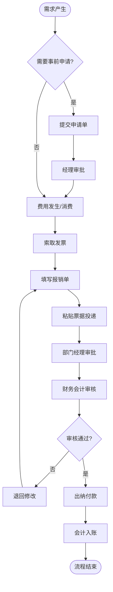

# BIZ-FLOW-F02: 费用报销流程

**文档编号**：BIZ-FLOW-F02  
**版本**：v1.0  
**创建日期**：2026年1月5日  
**更新日期**：2026年1月5日  
**文档状态**：已发布  
**业务域**：财务域  
**优先级**：🟡 P2（中）

---

## 一、流程概述

### 1.1 基本信息

- **流程名称**：费用报销流程（Expense Reimbursement Process）
- **流程编号**：BIZ-FLOW-F02
- **起点**：费用发生前申请 / 费用发生后报销
- **终点**：款项支付到个人账户
- **业务目标**：
  - 规范员工因公支出的行为，确保费用真实、合理、合规
  - 控制企业运营成本，防止预算超支
  - 提高报销效率，缩短员工垫资时间
  - 满足税务合规要求（发票管理）

### 1.2 适用范围

- **适用公司**：全集团
- **适用人员**：全体员工
- **费用类型**：
  - 差旅费（交通、住宿、补贴）
  - 业务招待费（餐饮、礼品）
  - 办公费（文具、快递、通讯）
  - 车辆使用费（油费、过路费、维修）
  - 团建费、培训费等

### 1.3 流程类型

- **流程性质**：日常支持流程
- **流程频率**：极高（每日发生）
- **流程复杂度**：低（标准化程度高）

---

## 二、角色与职责（RACI矩阵）

| 流程阶段 | 申请人 | 部门经理 | 财务会计 | 出纳 | 财务经理 | 总经理 |
|---------|-------|---------|---------|------|---------|-------|
| 事前申请 | R | A | - | - | - | A (超标) |
| 费用发生 | R | - | - | - | - | - |
| 报销填报 | R | - | - | - | - | - |
| 部门审批 | I | A | - | - | - | - |
| 财务审核 | I | - | R | - | A (大额) | - |
| 付款执行 | I | - | - | R | - | - |
| 账务处理 | - | - | R | - | - | - |

**注释**：

- R (Responsible)：负责执行
- A (Accountable)：最终批准
- C (Consulted)：需要咨询
- I (Informed)：需要知会

---

## 三、流程阶段设计

### 阶段1：事前申请 (Pre-approval)

**适用场景**：差旅、业务招待、大额采购

#### 步骤1.1 提交申请

**执行角色**：申请人

**执行步骤**：

1. 登录报销系统（或OA）。
2. 填写【出差申请单】或【费用申请单】。
3. 内容包括：
   - 事由（如：拜访客户、参加展会）。
   - 时间、地点。
   - 预计金额。
   - 陪同人员。

#### 步骤1.2 审批与预算控制

**执行角色**：部门经理

**执行步骤**：

1. 审核业务必要性。
2. 系统自动检查部门预算余额：
   - 预算充足：允许提交。
   - 预算不足：系统预警，需追加预算或调整计划。
3. 批准申请。

---

### 阶段2：费用发生与票据收集 (Expense & Invoice)

#### 步骤2.1 消费与支付

**执行角色**：申请人

**执行步骤**：

1. 按公司标准进行消费（如：酒店不超过500元/晚）。
2. 优先使用公司对公账户支付（如机票统一订购）。
3. 个人垫付时，保留支付凭证。

#### 步骤2.2 发票索取

**执行角色**：申请人

**执行步骤**：

1. 索取合规发票（增值税专用发票或普通发票）。
2. 抬头必须为公司全称，税号准确。
3. **电子发票**：保存PDF或OFD文件。
4. **纸质发票**：妥善保管，保持票面整洁。

---

### 阶段3：报销填报 (Reimbursement Application)

#### 步骤3.1 填写报销单

**执行角色**：申请人

**执行步骤**：

1. 关联事前申请单（如有）。
2. 填写费用明细：
   - 科目（差旅费-住宿、业务招待费-餐饮）。
   - 金额、日期。
   - 费用说明。
3. 上传发票影像：
   - 系统自动识别发票信息（OCR）。
   - 系统自动查重（防止重复报销）。

#### 步骤3.2 实物投递

**执行角色**：申请人

**执行步骤**：

1. 打印报销单（或使用系统生成的二维码）。
2. 将纸质发票粘贴在报销单背面（鱼鳞贴法，不遮挡关键信息）。
3. 投递至财务部报销投递箱。

---

### 阶段4：审批与审核 (Approval & Audit)

#### 步骤4.1 部门审批

**执行角色**：部门经理

**审核内容**：

- 事项是否真实发生？
- 金额是否合理？
- 是否符合部门预算？

#### 步骤4.2 财务审核

**执行角色**：财务会计

**审核内容**：

- **合规性**：是否符合《差旅费管理制度》标准？（如：是否超标？）
- **票据合规**：发票真伪、抬头税号、印章是否齐全。
- **完整性**：附件是否齐全（如：招待费需附人员名单，会议费需附签到表）。
- **关联性**：费用是否与事前申请一致。

**决策点**：

- **通过**：进入付款环节。
- **退回**：退回给申请人补充材料或修改金额。
- **拒绝**：虚假报销，通报批评。

---

### 阶段5：付款与入账 (Payment & Accounting)

#### 步骤5.1 支付

**执行角色**：出纳

**执行步骤**：

1. 生成【付款申请单】（批量）。
2. 通过网银批量转账至员工工资卡。
3. 系统自动发送付款通知给员工。
4. 支付频率：通常每周1-2次（如周二、周四）。

#### 步骤5.2 账务处理

**执行角色**：财务会计

**执行步骤**：

1. 系统自动生成会计凭证：
   - 借：管理费用/销售费用 - 差旅费
   - 贷：银行存款
2. 抵扣进项税（如适用）：
   - 借：应交税费 - 应交增值税（进项税额）

---

## 四、流程图

### 4.1 费用报销全流程

---

## 五、关键控制点

### 5.1 控制点清单

| 控制点 | 风险描述 | 控制措施 | 责任人 |
|-------|---------|---------|--------|
| **预算控制** | 费用超支 | 系统强制校验预算，无预算不可提交 | 部门经理 |
| **发票查重** | 重复报销（电子发票多打） | 系统建立发票台账，重复发票号自动拦截 | 财务会计 |
| **标准控制** | 住宿/交通超标 | 系统内置标准，超标部分需特批或自理 | 财务会计 |
| **真实性** | 虚构业务套取资金 | 抽查大额费用，核对行程单、参会证明 | 财务经理 |
| **替票报销** | 用无关发票抵充 | 严禁替票，发现违规严肃处理 | 财务会计 |

---

## 六、异常处理

### 6.1 常见异常场景

#### 场景1：发票丢失

**触发**：员工不慎丢失纸质发票。

**处理流程**：

1. 向开票方申请复印存根联，并加盖发票专用章。
2. 员工填写【发票遗失说明】，承诺未重复报销。
3. 部门经理、财务经理审批。
4. 仅作为原始凭证入账，通常不可抵扣进项税。

#### 场景2：费用超标

**触发**：因旺季或紧急情况，酒店价格超过标准。

**处理流程**：

1. 员工在报销单中注明超标原因。
2. 提交【超标特批申请】。
3. 需高一级领导（如总监/副总）批准。
4. 批准后财务予以全额报销，否则只报销标准内金额。

---

## 七、绩效指标（KPI）

| 指标名称 | 定义 | 计算公式 | 目标值 |
|---------|------|---------|--------|
| **报销周期** | 从投递到收款的时间 | 平均天数 | ≤5个工作日 |
| **报销退单率** | 因填写错误被退回的比例 | 退单数 / 总单数 | ≤5% |
| **费用预算执行率** | 实际费用与预算的偏差 | |实际-预算| / 预算 | ≤10% |
| **人均差旅费** | 成本控制指标 | 总差旅费 / 出差人次 | 符合基准 |

---

## 八、与其他流程的接口

### 8.1 上游流程

| 上游流程 | 接口点 | 输入数据 |
|---------|--------|---------|
| **合同全生命周期** (BIZ-FLOW-C01) | 预付款 | 合同信息 |
| **供应商评估** (BIZ-FLOW-P02) | 差旅 | 供应商考察行程 |

### 8.2 下游流程

| 下游流程 | 接口点 | 输出数据 |
|---------|--------|---------|
| **月度财务关账** (BIZ-FLOW-F01) | 费用入账 | 费用凭证 |
| **预算管理** | 预算扣减 | 实际发生额 |

---

## 九、流程优化建议

### 9.1 短期优化

1. **报销指南**：制作简明的"报销贴票指南"和"常见问题FAQ"，张贴在财务室门口。
2. **固定投递日**：设立每周固定的报销单投递截止时间，集中处理，提高效率。

### 9.2 中期优化

1. **商旅平台集成**：接入携程/滴滴企业版，公司统一月结，员工无需垫资、无需贴票。
2. **智能稽核**：引入AI稽核系统，自动识别发票违规点（如连号发票、节假日消费）。

### 9.3 长期优化

1. **全面无纸化**：推行电子会计档案，取消纸质报销单和纸质发票归档，全流程数字化。

---

## 十、附录

### 10.1 相关表单

| 表单名称 | 编号 | 用途 |
|---------|------|------|
| 费用报销单 | FRM-EXP-001 | 通用报销 |
| 差旅报销单 | FRM-EXP-002 | 差旅专用 |
| 出差申请单 | FRM-EXP-003 | 事前申请 |
| 借款单 | FRM-EXP-004 | 备用金借支 |

### 10.2 术语表

| 术语 | 全称 | 解释 |
|-----|------|------|
| OCR | Optical Character Recognition | 光学字符识别（自动识票） |
| VAT | Value Added Tax | 增值税 |
| T&E | Travel and Entertainment | 差旅与招待费 |

### 10.3 参考文档

- 差旅费管理制度
- 业务招待费管理办法
- 财务报销手册

---

**文档版本历史**：

| 版本 | 日期 | 修改人 | 修改内容 |
|-----|------|--------|---------|
| v1.0 | 2026-01-05 | 系统 | 初始版本，定义费用报销流程 |

---

**审批记录**：

| 角色 | 姓名 | 审批意见 | 日期 |
|-----|------|---------|------|
| 流程Owner | 待定 | 待审批 | - |
| 财务经理 | 待定 | 待审批 | - |
| 总经理 | 待定 | 待审批 | - |

---

**最后更新**：2026年1月5日
