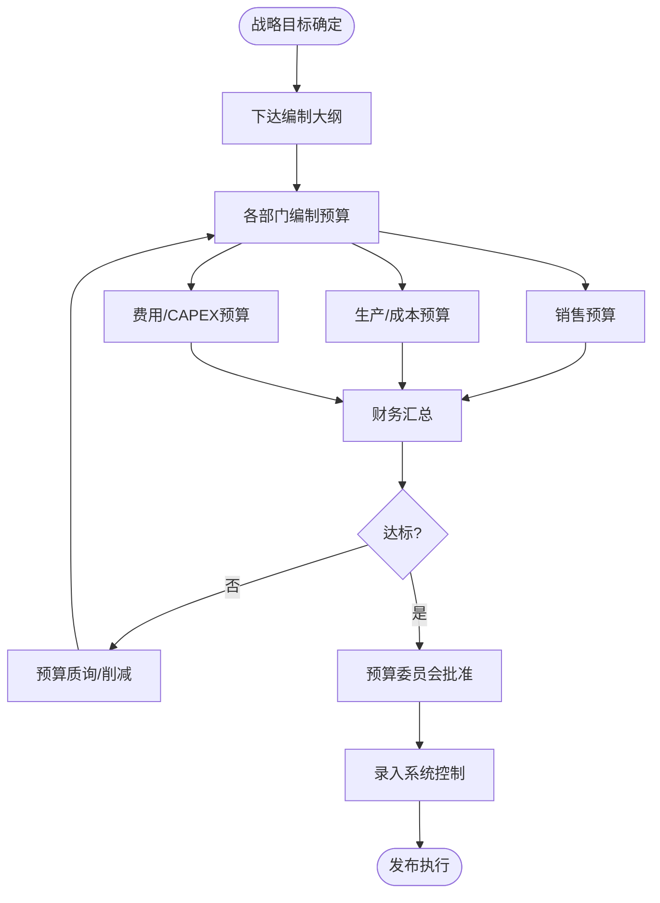

# BIZ-FLOW-F03: 预算管理流程

**文档编号**：BIZ-FLOW-F03  
**版本**：v1.0  
**创建日期**：2026年1月5日  
**更新日期**：2026年1月5日  
**文档状态**：已发布  
**业务域**：财务域  
**优先级**：🟡 P1（高）

---

## 一、流程概述

### 1.1 基本信息

- **流程名称**：预算管理流程（Budget Management Process）
- **流程编号**：BIZ-FLOW-F03
- **起点**：年度战略目标发布
- **终点**：预算执行分析与考核
- **业务目标**：
  - 将公司战略转化为可执行的财务目标
  - 合理配置资源，确保重点项目资金需求
  - 监控经营过程，及时预警偏差
  - 作为绩效考核的依据

### 1.2 适用范围

- **适用公司**：全集团
- **预算类型**：
  - **经营预算**：销售、生产、采购、费用预算。
  - **资本预算 (CAPEX)**：固定资产购置、工程项目预算。
  - **资金预算**：现金流预算。

### 1.3 流程类型

- **流程性质**：管理控制流程
- **流程频率**：年度（编制）、月度（监控）、季度（调整）
- **流程复杂度**：高（全员参与，多轮博弈）

---

## 二、角色与职责（RACI矩阵）

| 流程阶段 | 部门负责人 | 财务预算岗 | 财务总监 | 预算委员会 | 总经理 |
|---------|-----------|-----------|---------|-----------|-------|
| 目标下达 | I | C | R | A | A |
| 预算编制 | R | C (指导) | I | - | - |
| 预算汇总 | I | R | I | - | - |
| 预算质询 | R (答辩) | C | R | A | A |
| 预算批准 | I | I | I | R | A |
| 执行控制 | R | R (监控) | A | - | - |
| 预算调整 | R (申请) | R (审核) | A | A (重大) | A |

**注释**：

- R (Responsible)：负责执行
- A (Accountable)：最终批准
- C (Consulted)：需要咨询
- I (Informed)：需要知会
- **预算委员会**：通常由高管团队组成，负责最终决策。

---

## 三、流程阶段设计

### 阶段1：年度预算编制 (Annual Budgeting)

#### 步骤1.1 目标下达（T-3月）

**执行角色**：总经理、财务总监

**执行步骤**：

1. 确定下一年度公司战略目标（如：销售额增长20%，净利率10%）。
2. 发布【年度预算编制大纲】，明确假设前提（汇率、通胀率、人工成本涨幅）。
3. 下达各部门初版指标。

#### 步骤1.2 部门编制（T-2月）

**执行角色**：各部门负责人

**执行步骤**：

1. **销售部**：按客户/产品预测销量和价格 -> 销售收入预算。
2. **生产部**：根据销售计划计算产量 -> 直接材料、人工、制造费用预算。
3. **采购部**：预测原材料价格走势 -> 采购成本预算。
4. **各职能部门**：编制管理费用预算（差旅、办公、招聘等）。
5. **项目组**：编制资本支出预算（设备、装修）。

#### 步骤1.3 汇总与质询（T-1月）

**执行角色**：财务预算岗、预算委员会

**执行步骤**：

1. 财务汇总所有预算，生成预计利润表、资产负债表、现金流量表。
2. **差异分析**：对比汇总结果与战略目标（通常会有差距）。
3. **预算质询会**：
   - 部门负责人答辩。
   - 委员会挑战预算合理性（“为什么费用涨了20%但产出没变？”）。
   - 削减不合理开支。

#### 步骤1.4 批准与发布（T月）

**执行角色**：预算委员会

**执行步骤**：

1. 签署【年度预算责任书】。
2. 将批准的预算数据录入ERP/费控系统，作为下一年度的控制红线。

---

### 阶段2：预算执行与控制 (Execution & Control)

#### 步骤2.1 事中控制

**执行角色**：系统/财务预算岗

**执行步骤**：

1. **刚性控制**：无预算不可报销/采购（如：招待费、差旅费）。
2. **柔性控制**：超预算需特批（如：生产急需的辅料）。
3. **系统拦截**：在提交PR（采购申请）或报销单时，系统自动检查预算余额。
   - 余额不足 -> 弹窗警告或禁止提交。

#### 步骤2.2 月度分析

**执行角色**：财务预算岗

**执行步骤**：

1. 每月结账后，出具【预算执行分析报告】。
2. 对比：实际 vs 预算 vs 去年同期。
3. 重点分析：
   - 收入未达标原因？
   - 费用超支原因？
4. 召开经营分析会，跟踪整改措施。

---

### 阶段3：预算调整 (Budget Adjustment)

#### 步骤3.1 调整申请

**触发条件**：

- 外部环境剧变（如原材料暴涨、政策变化）。
- 公司战略调整（如新增业务线）。
- 内部组织架构调整。

**执行角色**：部门负责人

**执行步骤**：

1. 填写【预算调整申请单】。
2. 说明调整原因、金额及对全年目标的影响。
3. **原则**：预算调整不应作为掩盖管理不善的手段。

#### 步骤3.2 审批与更新

**执行角色**：财务总监、预算委员会

**执行步骤**：

1. 审核调整的必要性。
2. 批准后，在系统中更新预算额度。
3. 调整后的预算作为新的考核基准。

---

## 四、流程图

### 4.1 年度预算编制流程

---

## 五、关键控制点

### 5.1 控制点清单

| 控制点 | 风险描述 | 控制措施 | 责任人 |
|-------|---------|---------|--------|
| **预算松弛** | 部门故意报高预算（留余地） | 建立对标机制（历史数据、行业数据），严格质询 | 财务总监 |
| **期末突击花钱** | 担心明年预算被砍，年底乱花钱 | 严控年底非必要支出，考核关注投入产出比 | 总经理 |
| **预算外支出** | 绕过预算控制 | 所有支出必须关联预算科目，无预算需走特批流程 | 财务经理 |
| **收入高估** | 为通过审批盲目乐观预测收入 | 收入预算与销售提成方案挂钩 | 销售总监 |

---

## 六、异常处理

### 6.1 常见异常场景

#### 场景1：项目紧急启动无预算

**触发**：年中突然决定参加一个重要展会，年初未规划。

**处理流程**：

1. 申请【预算外立项】。
2. 说明ROI（投资回报率）。
3. 需总经理/董事长批准。
4. 批准后追加单项预算。

#### 场景2：费用科目挪用

**触发**：差旅费不够了，想用办公费报销。

**处理流程**：

1. 原则上禁止跨大类挪用（如：不能用研发费用补销售费用）。
2. 同一大类内（如：管理费用-办公费转管理费用-差旅费）需申请【预算调剂】。
3. 财务经理批准后在系统内划转额度。

---

## 七、绩效指标（KPI）

| 指标名称 | 定义 | 计算公式 | 目标值 |
|---------|------|---------|--------|
| **预算准确率** | 实际与预算的偏差 | 1 - |(实际-预算)/预算| | ≥ 90% |
| **费用率** | 费用占收入的比重 | 费用总额 / 销售收入 | ≤ 目标值 |
| **预算编制及时率** | 按时完成编制 | 按时完成部门数 / 总部门数 | 100% |

---

## 八、与其他流程的接口

### 8.1 上游流程

| 上游流程 | 接口点 | 输入数据 |
|---------|--------|---------|
| **销售订单到收款** (BIZ-FLOW-S01) | 销售预测 | 收入预算基础 |
| **生产计划到交付** (BIZ-FLOW-M01) | 产能规划 | 成本预算基础 |
| **研发立项** (BIZ-FLOW-R01) | 研发计划 | 研发费用预算 |

### 8.2 下游流程

| 下游流程 | 接口点 | 输出数据 |
|---------|--------|---------|
| **采购订单到付款** (BIZ-FLOW-P01) | 采购控制 | 采购预算限额 |
| **费用报销** (BIZ-FLOW-F02) | 报销控制 | 部门费用余额 |
| **月度财务关账** (BIZ-FLOW-F01) | 差异分析 | 实际发生数 |

---

## 九、流程优化建议

### 9.1 短期优化

1. **模板标准化**：设计统一的Excel预算模板，内置公式和逻辑校验，减少计算错误。
2. **滚动预测**：每季度末对下季度进行滚动预测（Rolling Forecast），弥补年度预算的滞后性。

### 9.2 中期优化

1. **费控系统**：实施专业的费控系统（如每刻、汇联易），实现“申请即冻结，报销即扣减”的实时控制。
2. **零基预算**：每隔3年推行一次零基预算（Zero-Based Budgeting），打破“基数+增长”的惯性，重新审视所有支出的必要性。

### 9.3 长期优化

1. **全面预算管理系统 (EPM)**：引入Hyperion/BPC等系统，实现预算编制、合并、分析的一体化和自动化。

---

## 十、附录

### 10.1 相关表单

| 表单名称 | 编号 | 用途 |
|---------|------|------|
| 年度预算编制模板 | FRM-BUD-001 | 编制工具 |
| 预算调整申请单 | FRM-BUD-002 | 变更申请 |
| 预算外支出申请单 | FRM-BUD-003 | 特批申请 |

### 10.2 术语表

| 术语 | 全称 | 解释 |
|-----|------|------|
| CAPEX | Capital Expenditure | 资本性支出（长期资产） |
| OPEX | Operating Expense | 运营支出（日常费用） |
| Rolling Forecast | - | 滚动预测 |

### 10.3 参考文档

- 全面预算管理制度
- 费用报销标准
- 授权核决权限表 (DOA)

---

**文档版本历史**：

| 版本 | 日期 | 修改人 | 修改内容 |
|-----|------|--------|---------|
| v1.0 | 2026-01-05 | 系统 | 初始版本，定义预算管理流程 |

---

**审批记录**：

| 角色 | 姓名 | 审批意见 | 日期 |
|-----|------|---------|------|
| 流程Owner | 待定 | 待审批 | - |
| 财务总监 | 待定 | 待审批 | - |
| 总经理 | 待定 | 待审批 | - |

---

**最后更新**：2026年1月5日
