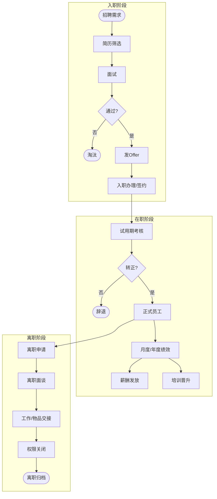

# BIZ-FLOW-H01: 人力资源流程

**文档编号**：BIZ-FLOW-H01  
**版本**：v1.0  
**创建日期**：2026年1月5日  
**更新日期**：2026年1月5日  
**文档状态**：已发布  
**业务域**：人力资源域  
**优先级**：🟢 P2（中）

---

## 一、流程概述

### 1.1 基本信息

- **流程名称**：人力资源流程（Human Resources Process）
- **流程编号**：BIZ-FLOW-H01
- **起点**：用人需求提出
- **终点**：员工离职归档
- **业务目标**：
  - 确保人才供应满足业务发展需求
  - 提升员工能力与绩效
  - 保障薪酬发放准确及时
  - 规避用工法律风险

### 1.2 适用范围

- **适用公司**：全集团
- **适用对象**：全体正式员工、实习生、劳务派遣人员。

### 1.3 流程类型

- **流程性质**：管理支持流程
- **流程频率**：日常/月度
- **流程复杂度**：中（涉及法律法规较多）

---

## 二、角色与职责（RACI矩阵）

| 流程阶段 | 用人部门 | HR招聘专员 | HR薪酬绩效 | HRBP | 总经理 |
|---------|---------|-----------|-----------|------|-------|
| 招聘需求 | R | C | - | I | A |
| 面试选拔 | R | R | - | I | A (关键岗) |
| 入职培训 | I | R | - | R | - |
| 绩效考核 | R | - | R | C | A |
| 薪酬发放 | - | - | R | - | A |
| 离职办理 | R | I | I | R | A |

**注释**：
- R (Responsible)：负责执行
- A (Accountable)：最终批准
- C (Consulted)：需要咨询
- I (Informed)：需要知会

---

## 三、流程阶段设计

### 阶段1：招聘与入职 (Recruitment & Onboarding)

#### 步骤1.1 需求与发布

**执行角色**：用人部门、HR招聘专员

**执行步骤**：
1. **需求提出**：用人部门填写【招聘需求申请表】，明确岗位职责（JD）和任职资格。
2. **审批**：部门负责人 -> HRBP -> 总经理审批（是否在编制内）。
3. **发布**：HR在招聘渠道（猎聘、智联、官网）发布职位。

#### 步骤1.2 面试与录用

**执行角色**：HR招聘专员、用人部门

**执行步骤**：
1. **简历筛选**：HR初筛 -> 用人部门复筛。
2. **面试**：
   - 初试：HR（考察基本素质、价值观）。
   - 复试：用人部门（考察专业能力）。
   - 终试：总经理（关键岗位）。
3. **背景调查**：针对敏感岗位进行背调。
4. **Offer发放**：确定薪资，发送录用通知书。

#### 步骤1.3 入职办理

**执行角色**：HRBP

**执行步骤**：
1. 收集入职材料（身份证、学历证、离职证明）。
2. 签订劳动合同、保密协议。
3. 开通账号（邮箱、OA、ERP权限）。
4. **入职培训**：企业文化、规章制度、安全教育（三级安全教育）。

---

### 阶段2：培养与发展 (Development)

#### 步骤2.1 试用期管理

**执行角色**：用人部门主管

**执行步骤**：
1. 设定试用期目标。
2. 指定导师（Mentor）。
3. **转正考核**：试用期满前一周进行答辩/评估。
   - 通过：正式转正。
   - 不通过：延长试用期或辞退。

#### 步骤2.2 培训管理

**执行角色**：HR培训专员

**执行步骤**：
1. 年度培训计划制定。
2. 实施培训（内部讲师/外部机构）。
3. 培训效果评估（反应层、学习层、行为层、结果层）。

---

### 阶段3：绩效与薪酬 (Performance & Compensation)

#### 步骤3.1 绩效考核

**执行角色**：用人部门、HR薪酬绩效

**执行步骤**：
1. **目标设定**：年初/月初设定KPI/OKR。
2. **绩效辅导**：过程中进行反馈和指导。
3. **绩效评分**：自评 -> 主管评分 -> 强制分布（如271原则）。
4. **结果应用**：关联奖金、晋升、调薪。

#### 步骤3.2 薪酬核算与发放

**执行角色**：HR薪酬绩效、财务部

**执行步骤**：
1. **考勤统计**：汇总出勤、请假、加班数据。
2. **算薪**：基本工资 + 绩效奖金 + 补贴 - 社保公积金 - 个税。
3. **审核**：HR总监审核 -> 财务复核 -> 总经理批准。
4. **发放**：银行代发。

---

### 阶段4：离职管理 (Offboarding)

#### 步骤4.1 离职申请

**执行角色**：员工、用人部门

**执行步骤**：
1. 员工提交书面辞职信（提前30天）。
2. **离职面谈**：HRBP进行面谈，了解真实离职原因，挽留核心人才。

#### 步骤4.2 交接与结算

**执行角色**：员工、各部门

**执行步骤**：
1. **工作交接**：填写【工作交接单】，确保文档、代码、客户资料移交。
2. **物品归还**：电脑、门禁卡、工服等。
3. **权限关闭**：IT部门关闭所有系统账号。
4. **薪资结算**：结清最后工资和未休年假。
5. **离职证明**：开具离职证明。

---

## 四、流程图

### 4.1 员工全生命周期流程

---

## 五、关键控制点

### 5.1 控制点清单

| 控制点 | 风险描述 | 控制措施 | 责任人 |
|-------|---------|---------|--------|
| **编制控制** | 超编招聘，增加人力成本 | 招聘前必须核对HC（Headcount），超编需特批 | HR总监 |
| **用工风险** | 未签合同导致双倍工资赔偿 | 入职当天必须签订劳动合同 | HRBP |
| **试用期辞退** | 举证不足导致非法解除 | 试用期目标必须量化签字，不胜任证据要确凿 | 用人部门主管 |
| **薪酬保密** | 薪酬泄露导致内部不公 | 薪酬单加密，严禁员工互打听，系统权限隔离 | HR薪酬经理 |
| **离职交接** | 关键资料/代码流失 | 交接单必须逐项确认，IT确认权限关闭后方可放行 | 部门负责人 |

---

## 六、异常处理

### 6.1 常见异常场景

#### 场景1：急招

**触发**：核心岗位突然离职，业务停摆。

**处理流程**：
1. 启动“紧急招聘通道”。
2. 启用猎头服务（需增加预算审批）。
3. 简化面试流程（如一天内完成所有轮次）。

#### 场景2：工伤事故

**触发**：员工在工作期间受伤。

**处理流程**：
1. 立即送医。
2. 24小时内向社保局申报工伤。
3. 收集医疗单据进行报销。
4. 配合EHS部门进行事故调查（见BIZ-FLOW-E01）。

---

## 七、绩效指标（KPI）

| 指标名称 | 定义 | 计算公式 | 目标值 |
|---------|------|---------|--------|
| **招聘达成率** | 招聘效率 | 实际到岗人数 / 计划招聘人数 | ≥ 90% |
| **试用期通过率** | 招聘质量 | 转正人数 / 入职人数 | ≥ 85% |
| **核心人才流失率** | 留存能力 | 核心离职人数 / 核心总人数 | ≤ 5% |
| **培训覆盖率** | 员工发展 | 参训人数 / 总人数 | 100% |

---

## 八、与其他流程的接口

### 8.1 上游流程

| 上游流程 | 接口点 | 输入数据 |
|---------|--------|---------|
| **年度预算** (BIZ-FLOW-F03) | 人力预算 | 年度HC计划、薪酬包 |
| **各业务流程** | 绩效数据 | 销售业绩、生产产量等 |

### 8.2 下游流程

| 下游流程 | 接口点 | 输出数据 |
|---------|--------|---------|
| **财务付款** (BIZ-FLOW-F02) | 工资发放 | 工资表 |
| **IT服务** | 账号管理 | 入职/离职通知 |

---

## 九、流程优化建议

### 9.1 短期优化

1. **电子签**：劳动合同、保密协议采用电子签名，提高效率，便于归档。
2. **在线学习**：搭建内部Wiki或网课平台，新员工自助完成入职培训。

### 9.2 中期优化

1. **E-HR系统**：引入专业HR软件，实现考勤、薪酬、绩效的自动化计算。
2. **人才盘点**：每年进行一次人才盘点，建立继任者计划（Succession Plan）。

### 9.3 长期优化

1. **HRSSC**：建立HR共享服务中心，集中处理事务性工作（社保、证明、考勤）。

---

## 十、附录

### 10.1 相关表单

| 表单名称 | 编号 | 用途 |
|---------|------|------|
| 招聘需求申请表 | FRM-HR-001 | 编制控制 |
| 面试评价表 | FRM-HR-002 | 选拔记录 |
| 员工入职登记表 | FRM-HR-003 | 信息采集 |
| 离职交接单 | FRM-HR-004 | 风险控制 |

### 10.2 术语表

| 术语 | 全称 | 解释 |
|-----|------|------|
| JD | Job Description | 岗位描述 |
| HC | Headcount | 人员编制 |
| KPI | Key Performance Indicator | 关键绩效指标 |
| OKR | Objectives and Key Results | 目标与关键结果 |

### 10.3 参考文档

- 员工手册
- 薪酬管理制度
- 绩效考核管理办法

---

**文档版本历史**：

| 版本 | 日期 | 修改人 | 修改内容 |
|-----|------|--------|---------|
| v1.0 | 2026-01-05 | 系统 | 初始版本，定义HR全流程 |

---

**审批记录**：

| 角色 | 姓名 | 审批意见 | 日期 |
|-----|------|---------|------|
| 流程Owner | 待定 | 待审批 | - |
| 人力总监 | 待定 | 待审批 | - |
| 总经理 | 待定 | 待审批 | - |

---

**最后更新**：2026年1月5日