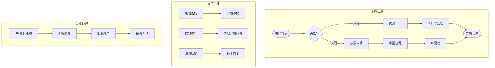

# BIZ-FLOW-I01: IT服务与安全管理流程

**文档编号**：BIZ-FLOW-I01  
**版本**：v1.0  
**创建日期**：2026年1月5日  
**更新日期**：2026年1月5日  
**文档状态**：已发布  
**业务域**：信息技术域  
**优先级**：🔴 P1（高）

---

## 一、流程概述

### 1.1 基本信息

- **流程名称**：IT服务与安全管理流程（IT Service & Security Management Process）
- **流程编号**：BIZ-FLOW-I01
- **起点**：IT服务请求 / 安全事件触发
- **终点**：服务交付 / 隐患消除
- **业务目标**：
  - 确保企业信息系统（ERP、OA、MES等）稳定运行
  - 保障数据安全，防止核心机密泄露
  - 规范IT资产与权限管理
  - 提升IT服务响应效率

### 1.2 适用范围

- **适用公司**：全集团
- **适用场景**：
  - **ITSM（IT服务管理）**：硬件故障、软件安装、网络报修、账号开通。
  - **信息安全**：数据备份、防病毒、权限审计、外设管理。
  - **变更管理**：系统升级、补丁更新、新功能上线。

### 1.3 流程类型

- **流程性质**：核心支持流程
- **流程频率**：高频（日常）
- **流程复杂度**：中高（涉及技术专业性与全员合规）

---

## 二、角色与职责（RACI矩阵）

| 流程阶段 | 申请人 | 部门负责人 | IT运维工程师 | IT经理 | 信息安全专员 | 总经理 |
|---------|-------|-----------|-------------|-------|-------------|-------|
| 服务请求 | R | I | R | I | - | - |
| 权限申请 | R | A | I | R | C | - |
| 故障处理 | I | - | R | A (重大) | - | - |
| 系统变更 | - | C | R | R | A | I |
| 安全审计 | - | I | C | C | R | A |

**注释**：

- R (Responsible)：负责执行
- A (Accountable)：最终批准
- C (Consulted)：需要咨询
- I (Informed)：需要知会

---

## 三、流程阶段设计

### 阶段1：IT服务请求 (Service Request)

#### 步骤1.1 故障报修与支持

**触发条件**：电脑蓝屏、网络中断、打印机故障、软件报错。

**执行角色**：员工、IT运维

**执行步骤**：

1. **提交工单**：员工通过OA/钉钉提交【IT服务申请单】，描述故障现象。
2. **接单响应**：IT运维收到通知，初步判断优先级（P0-P3）。
3. **处理解决**：
   - 远程协助（TeamViewer/AnyDesk）。
   - 现场处理。
   - 硬件送修（如需更换配件，走采购流程）。
4. **验证关闭**：员工确认故障恢复，评价服务质量。

#### 步骤1.2 账号与权限管理

**触发条件**：入职、转岗、离职、新增业务权限。

**执行角色**：HR、部门负责人、IT运维

**执行步骤**：

1. **IT资产发放（配电脑）**：
   - **配置标准**：
     - **通用办公**：标准笔记本（i5/16G）。
     - **研发/设计**：高性能工作站（i7/32G/独立显卡）或 Mac Pro。
   - **软件预装**：
     - **通用**：OS、Office、杀毒软件、DLP。
     - **研发**：IDE (VS Code, IDEA), CAD, Git, 访问研发内网权限。
   - 让员工签署【IT资产领用单】。
2. **入职开通**：依据HR入职通知，开通域账号、邮箱、OA账号。
3. **权限变更**：
   - 员工填写【权限变更申请表】，注明申请理由（如：申请访问ERP财务模块）。
   - 部门负责人审批 -> 数据Owner审批（如财务总监） -> IT执行。
4. **离职注销与回收**：
   - 依据HR离职通知，**立即**冻结/删除账号。
   - **回收电脑**：检查硬件是否完好，格式化硬盘（数据归档后）。

---

### 阶段2：信息安全管理 (InfoSec)

#### 步骤2.1 数据安全与备份

**执行角色**：IT运维、信息安全专员

**执行步骤**：

1. **定期备份**：
   - 核心数据库（ERP/MES）：每日增量备份，每周全量备份。
   - 关键文档服务器：实时同步 + 异地灾备。
2. **防泄密控制 (DLP)**：
   - 禁用USB存储设备（特殊需求需审批）。
   - 部署加密软件，核心文档外发需解密审批。
   - 邮件监控与审计。

#### 步骤2.2 安全巡检与审计

**执行角色**：信息安全专员

**执行步骤**：

1. **漏洞扫描**：每月对服务器、防火墙进行漏洞扫描。
2. **补丁更新**：测试后统一下发操作系统补丁。
3. **权限审计**：每季度导出系统权限列表，发给各部门负责人核对“僵尸账号”或“权限过大”情况。

---

### 阶段3：系统变更管理 (Change Management)

#### 步骤3.1 变更申请与测试

**触发条件**：ERP流程调整、服务器配置修改。

**执行角色**：业务部门、IT经理

**执行步骤**：

1. **变更申请**：填写【系统变更申请单】，评估影响范围。
2. **方案设计**：IT制定回滚方案（Rollback Plan）。
3. **测试环境验证**：在UAT环境进行测试，业务部门签字确认。

#### 步骤3.2 上线与发布

**执行角色**：IT运维

**执行步骤**：

1. **停机公告**：提前通知全员停机维护时间。
2. **执行变更**：在非工作时间（如周五晚）执行。
3. **验证与监控**：上线后密切监控系统日志，确保无异常。

---

## 四、流程图

### 4.1 IT服务与安全流程

---

## 五、关键控制点

### 5.1 控制点清单

| 控制点 | 风险描述 | 控制措施 | 责任人 |
|-------|---------|---------|--------|
| **特权账号** | 管理员账号滥用导致数据篡改 | 实行“双人双岗”或堡垒机审计，严禁共用Admin账号 | IT经理 |
| **离职未关停** | 离职员工继续访问公司系统窃取资料 | 建立HR与IT的联动机制，离职当天必须强制下线 | HR & IT |
| **数据丢失** | 勒索病毒或硬盘损坏 | 严格执行“3-2-1”备份策略，定期进行恢复演练 | IT运维 |
| **变更失败** | 系统升级导致业务瘫痪 | 必须有回滚方案，必须在测试环境验证通过 | IT经理 |

---

## 六、绩效指标（KPI）

| 指标名称 | 定义 | 目标值 |
|---------|------|--------|
| **SLA达成率** | 规定时间内解决故障的比例 | ≥ 95% |
| **核心系统可用性** | ERP/MES等系统正常运行时间 | ≥ 99.9% |
| **数据备份成功率** | 备份任务成功的比例 | 100% |
| **重大安全事故数** | 数据泄露、病毒爆发次数 | 0 |

---

## 七、附录

### 7.1 相关表单

| 表单名称 | 编号 | 用途 |
|---------|------|------|
| IT服务申请单 | FRM-IT-001 | 故障/需求 |
| 权限变更申请表 | FRM-IT-002 | 账号权限 |
| 系统变更申请单 | FRM-IT-003 | 变更控制 |
| IT资产领用单 | FRM-IT-004 | 电脑/外设领用 |

### 7.2 术语表

| 术语 | 全称 | 解释 |
|-----|------|------|
| SLA | Service Level Agreement | 服务级别协议 |
| UAT | User Acceptance Testing | 用户验收测试 |
| DLP | Data Loss Prevention | 数据防泄露 |

---

**最后更新**：2026年1月5日
