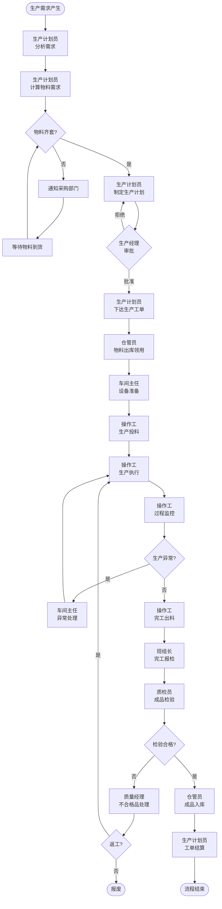

# BIZ-FLOW-M01: 生产计划到交付

**文档编号**：BIZ-FLOW-M01  
**版本**：v1.0  
**创建日期**：2026年1月5日  
**更新日期**：2026年1月5日  
**文档状态**：已发布  
**业务域**：生产域  
**优先级**：🔴 P0（极高）

---

## 一、流程概述

### 1.1 基本信息

- **流程名称**：生产计划到交付（Plan to Produce - P2P）
- **流程编号**：BIZ-FLOW-M01
- **起点**：生产需求确认
- **终点**：成品入库，可供销售/发货
- **业务目标**：
  - 按需生产，满足销售订单和库存需求
  - 提高生产效率，缩短生产周期
  - 确保产品质量，合格率达标
  - 优化资源利用，降低生产成本

### 1.2 适用范围

- **适用公司**：B公司（生产型企业）
- **适用部门**：生产计划部、车间、仓储部、质检部、设备部
- **适用场景**：
  - 按单生产（MTO - Make to Order）：销售订单驱动
  - 备货生产（MTS - Make to Stock）：库存预测驱动
  - 补货生产：库存低于安全库存时补充

### 1.3 流程类型

- **流程性质**：端到端核心业务流程
- **流程频率**：高频（每日多次）
- **流程复杂度**：高（涉及5个部门协同，需精细管理）

---

## 二、角色与职责（RACI矩阵）

| 流程阶段 | 生产计划员 | 生产经理 | 车间主任 | 操作工 | 仓管员 | 质检员 | 质量经理 | 设备工程师 |
|---------|-----------|---------|---------|--------|--------|--------|---------|-----------|
| 需求分析 | R, A | I | - | - | C | - | - | - |
| 生产计划制定 | R | A | C | - | C | - | - | - |
| 生产计划审批 | R | A | I | - | - | - | - | - |
| 工单下达 | R, A | I | I | - | - | - | - | - |
| 物料准备 | I | - | I | - | R, A | - | - | - |
| 设备检查 | I | - | R | - | - | - | - | R, A |
| 生产执行 | I | - | R | R, A | - | - | - | - |
| 过程监控 | I | I | R, A | R | - | C | - | - |
| 完工报检 | I | - | R | - | - | I | - | - |
| 成品检验 | I | - | I | - | - | R, A | A* | - |
| 成品入库 | I | - | I | - | R, A | I | - | - |
| 工单结算 | R, A | I | - | - | - | - | - | - |

**注释**：

- R (Responsible)：负责执行
- A (Accountable)：最终批准
- C (Consulted)：需要咨询
- I (Informed)：需要知会
- A*：严重不合格时质量经理审批

---

## 三、流程阶段设计

### 阶段1：生产计划管理

#### 步骤1.1 生产需求分析

**触发方式**：

**方式A：销售订单驱动（按单生产）**

- **触发**：销售部门下达销售订单（参见BIZ-FLOW-S01）
- **检查**：当前库存是否能满足订单
- **判断**：
  - 库存充足 → 直接发货，无需生产
  - 库存不足 → 产生生产需求

**方式B：库存预测驱动（备货生产）**

- **触发**：畅销产品库存低于安全库存
- **计算**：根据历史销售数据预测未来需求
- **判断**：需要补充多少库存

**方式C：手工计划**

- **触发**：生产经理根据市场预判，主动安排生产

**执行角色**：生产计划员

**输入**：

- 销售订单（含产品、数量、交货期）
- 当前库存数据
- 在途生产工单（已下但未完成）
- 设备可用性
- 物料库存

**执行步骤**：

1. 收集生产需求来源
2. 汇总需求：
   - 需要生产的产品清单
   - 各产品需求数量
   - 要求完工日期
3. 核查现有资源：
   - **库存检查**：成品库存、半成品库存
   - **在途工单**：已下达但未完成的工单
   - **设备能力**：设备可用时间、产能
   - **人员排班**：车间人员配置
4. 计算净需求：

   ```
   净生产需求 = 总需求 - 现有库存 - 在途工单
   ```

**输出**：

- 生产需求清单（产品、数量、优先级、要求完工日期）

---

#### 步骤1.2 物料需求计算（MRP）

**触发条件**：

- 生产需求清单确定

**执行角色**：生产计划员

**输入**：

- 生产需求清单
- 产品BOM（物料清单）
- 原材料库存

**执行步骤**：

1. 根据BOM展开，计算物料需求：

   ```
   物料需求 = Σ(产品需求数量 × BOM用量)
   ```

   **示例**：
   - 产品A需要生产100kg
   - BOM: 原料X 0.5kg/kg，原料Y 0.3kg/kg，包材Z 1个/kg
   - 物料需求：
     - 原料X: 100 × 0.5 = 50kg
     - 原料Y: 100 × 0.3 = 30kg
     - 包材Z: 100 × 1 = 100个

2. 检查物料库存：
   - 当前库存量
   - 安全库存
   - 在途采购订单

3. 计算物料缺口：

   ```
   缺料数量 = 物料需求 - 当前库存 - 在途采购
   ```

4. 生成【缺料清单】

**输出**：

- 物料需求清单
- 缺料清单（需要采购）

**决策点**：

- 物料是否齐套？
  - 是 → 可以安排生产
  - 否 → 通知采购部门紧急采购（参见BIZ-FLOW-P01），等待物料到齐

---

#### 步骤1.3 生产计划制定

**触发条件**：

- 生产需求确定
- 物料齐套（或确认物料到货时间）

**执行角色**：生产计划员

**输入**：

- 生产需求清单
- 设备产能数据
- 人员排班
- 物料齐套情况

**执行步骤**：

**（1）生产排程**

1. 确定生产周期（每个产品的生产时间）
2. 考虑优先级：
   - 紧急订单（客户指定交货期）
   - 常规订单
   - 备货生产
3. 考虑约束条件：
   - **设备约束**：某些产品需要特定设备
   - **人员约束**：特殊工艺需要持证上岗
   - **换型时间**：不同产品切换需要清洗设备
4. 制定生产计划：

| 计划日期 | 产品 | 计划产量 | 使用设备 | 负责班组 | 预计开工 | 预计完工 |
|---------|------|---------|---------|---------|---------|---------|
| 1月6日 | 产品A | 100kg | 反应釜1# | 甲班 | 08:00 | 16:00 |
| 1月6日 | 产品B | 50kg | 反应釜2# | 乙班 | 08:00 | 14:00 |
| 1月7日 | 产品C | 200kg | 反应釜1# | 甲班 | 08:00 | 18:00 |

**（2）产能平衡**

- 避免设备过载（产能利用率<90%为宜）
- 避免某些设备空闲，某些设备排队
- 平衡各班组工作量

**（3）协调确认**

- 与车间主任沟通，确认可行性
- 与仓储部门确认物料准备时间
- 与质检部门确认检验资源

**输出**：

- 周生产计划 / 月生产计划（汇总表）
- 每日生产计划（详细计划）

---

#### 步骤1.4 生产计划审批

**触发条件**：

- 生产计划制定完成

**执行角色**：生产经理

**输入**：

- 生产计划
- 资源配置情况

**审批内容**：

1. 计划合理性：
   - 产能是否匹配
   - 交货期是否满足
2. 优先级是否正确
3. 资源配置是否到位

**审批规则**：

- 常规生产计划：生产经理审批
- 涉及加班、外包：总经理审批

**输出**：

- 审批通过的生产计划

**决策点**：

- 生产计划是否批准？
  - 批准 → 下达生产工单
  - 拒绝 → 调整计划重新提交

---

### 阶段2：生产准备

#### 步骤2.1 生产工单下达

**触发条件**：

- 生产计划审批通过

**执行角色**：生产计划员

**输入**：

- 生产计划

**执行步骤**：

1. 创建【生产工单】（Manufacturing Order - MO）
2. 分配唯一编号（MO-YYYYMMDD-XXX）
3. 填写工单详细信息：

   **基本信息**：
   - 产品编码、名称、规格
   - 计划生产数量
   - 计划开工日期、计划完工日期
   - 优先级（紧急/正常）

   **生产信息**：
   - 工艺路线（从技术文档获取）
   - 使用设备
   - 负责车间/班组

   **物料信息**：
   - BOM物料清单（原料、辅料、包材）
   - 各物料用量

   **质量信息**：
   - 质量标准
   - 检验要求

4. 工单状态：**已下达**
5. 通知相关人员：
   - 车间主任（生产通知）
   - 仓管员（备料通知）
   - 质检员（检验准备）

**输出**：

- 生产工单（打印件 + 电子版）
- 工单看板（车间显示屏）

---

#### 步骤2.2 物料领用准备

**触发条件**：

- 生产工单下达

**执行角色**：车间班组长、仓管员

**输入**：

- 生产工单（含BOM）

**执行步骤**：

**（1）车间班组长动作**：

1. 查看生产工单
2. 核对物料清单
3. 提前1-2小时提交【领料申请】

**（2）仓管员动作**：

1. 接收领料申请
2. 核对工单编号
3. 检查物料库存：
   - 数量是否充足
   - 物料是否合格（已检验）
   - 批次是否满足先进先出（FIFO）
4. 拣料准备：
   - 按BOM清单拣货
   - 核对物料编码、规格
   - 称重/点数
5. 生成【领料单】，编号（ML-YYYYMMDD-XXX）
6. 物料出库：
   - 扣减库存可用量
   - 记录批次号（用于追溯）
7. 将物料送至车间（或车间人员自提）

**输出**：

- 领料单
- 出库的物料（交付车间）

**异常处理**：

- 如物料不足，立即通知生产计划员
- 生产计划员协调：
  - 调整生产计划
  - 紧急采购
  - 寻找替代物料

---

#### 步骤2.3 设备与工具准备

**触发条件**：

- 生产工单下达

**执行角色**：车间主任、设备工程师

**输入**：

- 生产工单（指定设备）
- 设备维护记录

**执行步骤**：

**（1）设备状态检查**

1. 确认设备当前状态：
   - 是否在使用中
   - 是否在维护中
   - 是否待清洗
2. 如设备被占用，协调调度

**（2）设备清洗与切换**

- 如果上一批次生产不同产品，需要清洗设备
- 清洗流程：
  1. 拆卸可拆部件
  2. 用清洗剂清洗
  3. 用纯水冲洗
  4. 干燥
  5. 清洁验证（取样检测残留）
- 清洗时间：通常1-4小时

**（3）设备运行检查**

- 开机试运行
- 检查关键参数（温度、压力、转速）
- 确认仪表正常

**（4）工具与模具准备**

- 准备生产所需工具（搅拌器、量具等）
- 安装模具（如需要）

**输出**：

- 设备就绪确认
- 清洁验证合格报告（如需要）

**决策点**：

- 设备是否就绪？
  - 是 → 可以开始生产
  - 否 → 设备维修或调整生产计划

---

### 阶段3：生产执行

#### 步骤3.1 生产前准备会

**触发条件**：

- 物料、设备均已准备就绪
- 即将开始生产

**执行角色**：车间主任、班组长、操作工

**执行步骤**：

1. 召集本班次操作工。
2. 进行生产前要素确认（4M1E检查）：
   - **人 (Man)**：人员是否到岗？资质是否符合？PPE是否佩戴？
   - **机 (Machine)**：设备是否清洁？运行状态是否正常？
   - **料 (Material)**：物料是否齐备？批次是否正确？
   - **法 (Method)**：工艺文件（SOP/批记录）是否为最新版？
   - **环 (Environment)**：车间温湿度、压差是否达标？
3. 宣读生产工单：
   - 产品名称、数量
   - 工艺要求
   - 质量标准
   - 安全注意事项
4. 分工明确：
   - 主操：负责投料、控制
   - 副操：辅助、记录
   - 质检：过程监控

**输出**：

- 生产前准备确认表

---

#### 步骤3.2 生产投料

**触发条件**：

- 准备会完成，开始生产

**执行角色**：操作工（主操）

**输入**：

- 生产工单
- 工艺规程
- 领用的物料

**执行步骤**：

1. **再次核对物料**：
   - 物料名称、编码
   - 批次号
   - 有效期（如有）
2. **称量投料**：
   - 按工艺规程要求的配比称量
   - 使用校准合格的天平
   - 记录实际投料量（可能与理论值有偏差）
3. **记录投料信息**：
   - 在【生产记录表】中记录：
     - 物料名称、批次号
     - 投料时间
     - 投料量
     - 操作人员
4. **启动生产**：
   - 按工艺规程启动设备
   - 设定工艺参数（温度、转速、压力等）

**输出**：

- 生产记录表（投料记录）

**关键控制**：

- 投料必须双人复核（主操+副操）
- 避免投错物料（可能导致质量事故）

---

#### 步骤3.3 生产过程控制

**触发条件**：

- 生产开始

**执行角色**：操作工、车间主任

**输入**：

- 工艺规程
- 工艺参数要求

**执行步骤**：

**（1）工艺参数监控**

- 实时监控关键参数：
  - **温度**：反应温度、冷却温度
  - **压力**：反应压力、真空度
  - **时间**：反应时间、搅拌时间
  - **转速**：搅拌转速
  - **pH值**：溶液酸碱度
- 每小时记录一次参数（或按工艺要求）
- 参数偏离时及时调整

**（2）现场观察**

- 观察反应现象：
  - 颜色变化
  - 是否产生气泡、沉淀
  - 温度变化趋势
- 与工艺规程描述对比，判断正常与否

**（3）中间取样（如需要）**

- 在关键节点取样
- 送质检部门快速检测
- 根据检测结果决定：
  - 继续反应
  - 调整工艺
  - 终止生产

**（4）异常处理**

- 如发生异常（设备故障、参数失控），立即：
  1. 停止生产
  2. 报告车间主任
  3. 记录异常情况
  4. 等待处理指令

**输出**：

- 生产记录表（工艺参数记录）
- 中间检测报告（如有）

---

#### 步骤3.4 生产报工

**触发条件**：

- 生产过程中或生产完成后

**执行角色**：操作工

**输入**：

- 生产工单

**执行步骤**：

1. 记录生产进度：
   - 工单编号
   - 完成数量（阶段性或最终）
   - 报工时间
   - 操作人员
   - 使用设备
2. 更新工单状态：
   - 生产中
   - 部分完工
   - 全部完工
3. 记录工时：
   - 开始时间
   - 结束时间
   - 实际工时

**输出**：

- 报工记录
- 更新的工单状态

**用途**：

- 跟踪生产进度
- 计算生产效率
- 核算人工成本

---

#### 步骤3.5 完工与出料

**触发条件**：

- 生产完成，产品合格

**执行角色**：操作工

**输入**：

- 生产记录表

**执行步骤**：

1. **出料**：
   - 将产品从设备中转移出来
   - 放置在干净的容器中
2. **称重**：
   - 称量实际产量
   - 记录在生产记录表
3. **计算收率**：

   ```
   收率 = (实际产量 / 理论产量) × 100%
   ```

   - 理论产量根据投料量和BOM计算
   - 收率通常应达到≥95%
4. **产品标识**：
   - 贴标签，注明：
     - 产品名称、规格
     - 批次号（生成规则：日期+工单号后4位）
     - 生产日期
     - 数量
     - 操作人员
5. **设备清理**：
   - 清理设备残留
   - 准备下次生产
6. **提交检验申请**：
   - 通知质检部门进行成品检验

**输出**：

- 待检验产品（已标识）
- 完整的生产记录表

---

### 阶段4：质量检验与入库

#### 步骤4.1 完工报检

**触发条件**：

- 生产完工，产品出料

**执行角色**：车间班组长

**输入**：

- 生产工单
- 生产记录表

**执行步骤**：

1. 整理生产记录：
   - 核对记录完整性
   - 签字确认
2. 创建【完工报检单】
3. 填写报检信息：
   - 产品名称、规格
   - 批次号
   - 生产数量
   - 生产日期
   - 存放位置
4. 提交质检部门

**输出**：

- 完工报检单

---

#### 步骤4.2 成品检验

**触发条件**：

- 接到完工报检

**执行角色**：质检员

**输入**：

- 完工报检单
- 质量标准
- 生产记录表

**执行步骤**：

**（1）文件审查**

- 检查生产记录是否完整：
  - 投料记录是否齐全
  - 工艺参数是否在范围内
  - 是否有异常记录
- 如生产记录不符，可能直接判不合格

**（2）成品检验**

1. 创建【成品检验单】，编号（FQC-YYYYMMDD-XXX）
2. 抽样（按AQL标准或公司规定）：
   - 批量<50kg：抽样5-10kg检测
   - 批量≥50kg：抽样5%，至少10kg
3. 执行检验项目：

   **外观检查**：
   - 颜色、光泽
   - 有无杂质、沉淀
   - 包装是否完好

   **规格检测**：
   - 含量/纯度（化学分析）
   - 粘度、密度等物理性质
   - pH值

   **性能测试**：
   - 按产品质量标准执行
   - 使用校准合格的仪器

4. 记录检测数据
5. 判定结果

**判定规则**：

| 检验结果 | 判定 | 后续动作 |
|---------|------|---------|
| 所有指标合格 | 合格 | 允许入库，贴合格标签 |
| 轻微不合格（偏差<5%） | 让步接收 | 需质量经理批准，降级或折价 |
| 严重不合格（关键指标超标） | 不合格 | 返工或报废 |

**输出**：

- 成品检验报告
- 合格证（贴在产品上）

**决策点**：

- 检验是否合格？
  - 合格 → 允许入库
  - 不合格 → 进入不合格品处理流程（参见BIZ-FLOW-M02）

---

#### 步骤4.3 成品入库

**触发条件**：

- 成品检验合格

**执行角色**：仓管员

**输入**：

- 检验合格的产品
- 成品检验报告

**执行步骤**：

1. 核对产品信息：
   - 产品名称、批次号
   - 数量
   - 检验报告
2. 创建【成品入库单】，编号（FIN-YYYYMMDD-XXX）
3. 关联生产工单
4. 记录入库信息：
   - 产品编码、名称、规格
   - 批次号
   - 入库数量
   - 生产日期
   - 有效期（如有）
   - 存放库位
5. 更新库存：
   - 增加成品库存可用量
   - 更新库存台账
6. 产品上架：
   - 按批次存放
   - 先进先出（FIFO）原则
   - 标识清晰

**输出**：

- 成品入库单
- 更新的成品库存

**自动触发**：

- 更新生产工单状态为"已完成"
- 如关联销售订单，通知销售部门可以发货

---

### 阶段5：生产结算与分析

#### 步骤5.1 工单结算

**触发条件**：

- 成品入库完成

**执行角色**：生产计划员

**输入**：

- 生产工单
- 生产记录表
- 领料单
- 成品入库单

**执行步骤**：

**（1）数量核算**

- 计划生产数量 vs 实际完成数量
- 完成率 = 实际 / 计划 × 100%

**（2）物料消耗核算**

- 理论物料用量（根据BOM）
- 实际领用量
- 材料利用率 = 理论 / 实际 × 100%

**（3）工时核算**

- 计划工时 vs 实际工时
- 工时效率 = 计划 / 实际 × 100%

**（4）成本核算**

- 直接材料成本 = Σ(物料单价 × 用量)
- 直接人工成本 = 工时 × 工资率
- 制造费用分摊（按工时或机时）
- 单位成本 = 总成本 / 产量

**（5）关闭工单**

- 更新工单状态为"已结算"
- 归档生产记录

**输出**：

- 工单结算报告
- 生产成本数据（导出给财务部门）

---

#### 步骤5.2 生产数据分析

**触发条件**：

- 定期（每周/每月）

**执行角色**：生产经理、生产计划员

**分析内容**：

**（1）生产效率分析**

- 设备利用率 = 实际运行时间 / 可用时间
- 产能达成率 = 实际产量 / 计划产量
- 换型时间占比

**（2）质量分析**

- 一次合格率 = 一次检验合格批次 / 总批次
- 返工率
- 报废率

**（3）成本分析**

- 单位成本趋势
- 材料利用率趋势
- 能耗分析

**（4）异常分析**

- 统计生产异常（设备故障、缺料、质量问题）
- 识别高频异常
- 制定改进措施

**输出**：

- 生产分析报告（周报/月报）
- 改进建议

---

## 四、流程图

### 4.1 主流程图（泳道图）



---

## 五、关键控制点

### 5.1 控制点清单

| 控制点 | 控制目标 | 控制措施 | 责任人 | 检查频率 |
|-------|---------|---------|--------|---------|
| **物料齐套** | 避免停工待料 | 生产前检查物料库存 | 生产计划员 | 每个工单 |
| **投料复核** | 防止投错物料 | 双人复核（主操+副操） | 操作工 | 每次投料 |
| **工艺参数** | 确保产品质量 | 实时监控，偏离时调整 | 操作工 | 每小时记录 |
| **成品检验** | 确保出厂质量 | 100%批次检验 | 质检员 | 每批产品 |
| **批次追溯** | 质量可追溯 | 记录完整批次信息 | 操作工+质检员 | 每批产品 |
| **设备维护** | 确保设备正常 | 定期保养，运行前检查 | 设备工程师 | 按计划 |
| **安全操作** | 防止安全事故 | 穿戴PPE，遵守SOP | 车间主任 | 每班检查 |

### 5.2 风险与应对

| 风险 | 影响 | 概率 | 应对措施 |
|-----|------|------|---------|
| 设备故障 | 生产停工、延期交货 | 中 | 预防性维护、备用设备、快速响应 |
| 物料短缺 | 无法按时生产 | 中 | 安全库存、多源供应、紧急采购 |
| 产品质量不合格 | 返工、报废、客诉 | 中 | 严格工艺控制、过程检验、持续改进 |
| 人员操作失误 | 质量事故、安全事故 | 低 | 培训上岗、SOP张贴、双人复核 |
| 能源供应中断 | 生产中断 | 低 | 备用发电机、与供电局协调 |

---

## 六、异常处理

### 6.1 常见异常场景

#### 场景1：生产中发现物料不足

**触发**：生产过程中发现物料数量不够

**原因分析**：

- 库存数据不准确
- 领料时短缺未发现
- 物料损耗超过预期

**处理流程**：

1. 操作工立即停止生产
2. 报告车间主任
3. 车间主任联系仓储部门：
   - 检查是否有其他批次
   - 紧急调配
4. 如仍不足，联系生产计划员：
   - 通知采购部门紧急采购
   - 调整生产计划，先生产其他产品
5. 记录异常情况，分析原因

---

#### 场景2：生产过程中设备故障

**触发**：设备突然停机或参数异常

**处理流程**：

1. **立即响应**（5分钟内）：
   - 操作工按下紧急停止按钮
   - 确保人员安全
   - 报告车间主任
2. **故障诊断**（15分钟内）：
   - 车间主任初步诊断
   - 如无法解决，呼叫设备工程师
3. **维修决策**（30分钟内）：
   - 小故障（<1小时修复）→ 现场维修
   - 大故障（>1小时修复）→ 调整生产计划，使用备用设备
4. **维修执行**：
   - 设备工程师维修
   - 维修完成后试运行
5. **恢复生产**：
   - 确认设备正常
   - 继续生产
6. **记录归档**：
   - 填写设备故障报告
   - 分析故障原因
   - 制定预防措施

**升级机制**：

- 如故障影响重大（无法按时交货）→ 通知生产经理→ 总经理
- 考虑外包加工或采购成品

---

#### 场景3：成品检验不合格

**触发**：质检员判定成品不合格

**处理流程**：

1. **隔离**：
   - 不合格品立即隔离
   - 贴"不合格"标签
   - 单独存放
2. **通知相关人员**：
   - 车间主任
   - 生产经理
   - 质量经理
3. **原因分析**（参见BIZ-FLOW-M02）：
   - 成立调查小组（车间+质检+技术）
   - 分析不合格原因：
     - 原料问题
     - 工艺参数偏离
     - 操作失误
     - 设备问题
4. **处理决策**：

   **方案A：返工**
   - 如可以通过再加工合格
   - 制定返工方案
   - 返工后重新检验

   **方案B：降级使用**
   - 轻微不合格，可降级销售
   - 质量经理审批
   - 调整标签和价格

   **方案C：报废**
   - 无法返工，且不能降级
   - 质量经理审批
   - 按报废流程处理
5. **纠正措施**：
   - 针对根本原因，制定改进措施
   - 更新工艺文件（如需要）
   - 培训相关人员
6. **记录归档**：
   - 不合格品处理记录
   - 纠正措施跟踪

---

### 6.2 异常升级机制

```
一级响应（车间主任处理）
   ↓ 无法解决或超时1小时
二级响应（生产经理介入）
   ↓ 无法解决或影响交货
三级响应（总经理介入）
   ↓ 重大质量/安全事故
四级响应（成立专项小组、外部支援）
```

---

## 七、绩效指标（KPI）

### 7.1 生产效率指标

| 指标名称 | 定义 | 计算公式 | 目标值 | 数据来源 |
|---------|------|---------|--------|---------|
| **生产计划完成率** | 按计划完成的工单比例 | 按时完成工单数 ÷ 总工单数 × 100% | ≥95% | 生产工单表 |
| **设备利用率** | 设备实际使用时间占比 | 设备运行时间 ÷ 可用时间 × 100% | ≥85% | 设备运行记录 |
| **生产周期** | 从投料到入库的平均天数 | Σ(完工日期 - 开工日期) ÷ 工单数 | ≤3天 | 生产工单表 |
| **换型时间** | 不同产品切换的时间 | 清洗+调试时间 | ≤2小时 | 生产记录 |

### 7.2 质量指标

| 指标名称 | 定义 | 计算公式 | 目标值 | 数据来源 |
|---------|------|---------|--------|---------|
| **产品一次合格率** | 首次检验合格的批次比例 | 一次合格批次 ÷ 总批次 × 100% | ≥98% | 成品检验表 |
| **返工率** | 需要返工的批次比例 | 返工批次 ÷ 总批次 × 100% | ≤2% | 不合格品记录 |
| **报废率** | 报废产品占比 | 报废数量 ÷ 生产数量 × 100% | ≤0.5% | 不合格品记录 |

### 7.3 成本指标

| 指标名称 | 定义 | 计算公式 | 目标值 | 数据来源 |
|---------|------|---------|--------|---------|
| **材料利用率** | 理论用量与实际用量比 | 理论用量 ÷ 实际用量 × 100% | ≥95% | 工单结算 |
| **单位成本** | 每单位产品的生产成本 | 总成本 ÷ 产量 | 持续下降 | 工单结算 |
| **能耗** | 单位产品能源消耗 | 总能耗 ÷ 产量 | 持续下降 | 能源计量 |

---

## 八、与其他流程的接口

### 8.1 上游流程

| 上游流程 | 接口点 | 输入数据 |
|---------|--------|---------|
| **销售订单流程** (BIZ-FLOW-S01) | 销售订单驱动生产 | 产品、数量、交货期 |
| **采购流程** (BIZ-FLOW-P01) | 物料到货入库 | 原材料、辅料库存 |
| **研发技术转移** (BIZ-FLOW-R01) | 新产品配方和工艺 | BOM、工艺规程、质量标准 |

### 8.2 下游流程

| 下游流程 | 接口点 | 输出数据 |
|---------|--------|---------|
| **质量检验流程** (BIZ-FLOW-M02) | 成品检验 | 完工报检、质量标准 |
| **销售发货流程** (BIZ-FLOW-S01) | 成品入库可发货 | 成品库存、批次号 |
| **月度财务关账** (BIZ-FLOW-F01) | 生产成本核算 | 工单结算数据、成本数据 |

### 8.3 并行流程

| 并行流程 | 协同点 | 数据交换 |
|---------|--------|---------|
| **库存管理流程** | 物料领用和成品入库 | 库存数据、批次号 |
| **设备维护流程** (BIZ-FLOW-M04) | 设备保养和维修 | 设备状态、维护计划 |
| **工艺改进流程** (BIZ-FLOW-M03) | 工艺优化 | 生产数据、质量数据 |

---

## 九、流程优化建议

### 9.1 短期优化（1-3个月）

1. **减少换型时间**
   - 优化清洗流程
   - 准备快速切换工具
   - 目标：换型时间从2小时缩短到1小时

2. **加强过程监控**
   - 在关键工序增加中间检测
   - 及早发现偏差，避免批量不合格
   - 目标：一次合格率从95%提升到98%

3. **优化生产排程**
   - 减少同类产品切换频次
   - 批量生产相似产品
   - 目标：提高设备利用率5%

### 9.2 中期优化（3-6个月）

1. **生产过程数字化**
   - 电子化生产记录（替代纸质）
   - 实时采集工艺参数（温度、压力等）
   - 目标：提高数据准确性，减少人工填写

2. **精益生产（Lean）**
   - 识别并消除浪费（等待、搬运、库存）
   - 实施5S管理（整理、整顿、清扫、清洁、素养）
   - 目标：生产周期缩短20%

3. **员工技能提升**
   - 多能工培训（一人多岗）
   - 提高换岗灵活性
   - 目标：人员利用率提升

### 9.3 长期优化（6-12个月）

1. **智能排程系统**
   - 基于AI算法自动生成最优排程
   - 考虑多重约束（设备、人员、物料）
   - 目标：计划效率提升30%

2. **预测性维护**
   - 基于设备运行数据预测故障
   - 提前安排维护，避免突发停机
   - 目标：设备故障率降低50%

3. **工艺参数优化**
   - 基于历史数据分析最优工艺参数
   - 持续优化，提高收率和质量
   - 目标：材料利用率提升至97%

---

## 十、附录

### 10.1 相关表单清单

| 表单名称 | 表单编号 | 使用场景 |
|---------|---------|---------|
| 生产工单 | FRM-M01-001 | 下达生产任务 |
| 领料单 | FRM-M01-002 | 物料领用 |
| 生产记录表 | FRM-M01-003 | 记录生产过程 |
| 报工单 | FRM-M01-004 | 报告生产进度 |
| 完工报检单 | FRM-M01-005 | 申请成品检验 |
| 成品检验单 | FRM-M01-006 | 记录检验结果 |
| 成品入库单 | FRM-M01-007 | 成品入库 |
| 工单结算单 | FRM-M01-008 | 生产成本核算 |
| 生产异常单 | FRM-M01-009 | 记录生产异常 |

### 10.2 术语表

| 术语 | 英文 | 定义 |
|-----|------|------|
| 生产工单 | Manufacturing Order (MO) | 生产任务的正式指令 |
| 物料清单 | Bill of Materials (BOM) | 产品所需原材料清单及用量 |
| 物料需求计划 | Material Requirements Planning (MRP) | 根据生产计划计算物料需求 |
| 按单生产 | Make to Order (MTO) | 根据客户订单安排生产 |
| 备货生产 | Make to Stock (MTS) | 根据库存预测生产 |
| 先进先出 | First In First Out (FIFO) | 先到货的先使用 |
| 收率 | Yield | 实际产量与理论产量的比值 |
| 标准操作规程 | Standard Operating Procedure (SOP) | 标准化的操作步骤文件 |
| 个人防护装备 | Personal Protective Equipment (PPE) | 安全帽、手套、护目镜等 |
| 可接受质量水平 | Acceptable Quality Level (AQL) | 抽样检验标准 |

### 10.3 参考文档

- [业务架构分析](../业务架构分析.md)
- [分阶段选型策略-超精益方案](../../20_应用架构域/20.1_应用架构设计/分阶段选型策略-超精益方案.md)
- BIZ-FLOW-S01: 销售订单到收款（上游流程）
- BIZ-FLOW-P01: 采购订单到付款（上游流程）
- BIZ-FLOW-M02: 质量检验流程（关联流程）
- BIZ-FLOW-R01: 研发立项到技术转移（上游流程）
- BIZ-FLOW-F01: 月度财务关账流程（下游流程）

---

**文档版本历史**：

| 版本 | 日期 | 修改人 | 修改内容 |
|-----|------|--------|---------|
| v1.0 | 2026-01-05 | 系统 | 初始版本，定义完整的生产流程 |

---

**审批记录**：

| 角色 | 姓名 | 审批意见 | 日期 |
|-----|------|---------|------|
| 流程Owner | 待定 | 待审批 | - |
| 生产经理 | 待定 | 待审批 | - |
| 质量经理 | 待定 | 待审批 | - |
| 总经理 | 待定 | 待审批 | - |

---

**最后更新**：2026年1月5日
