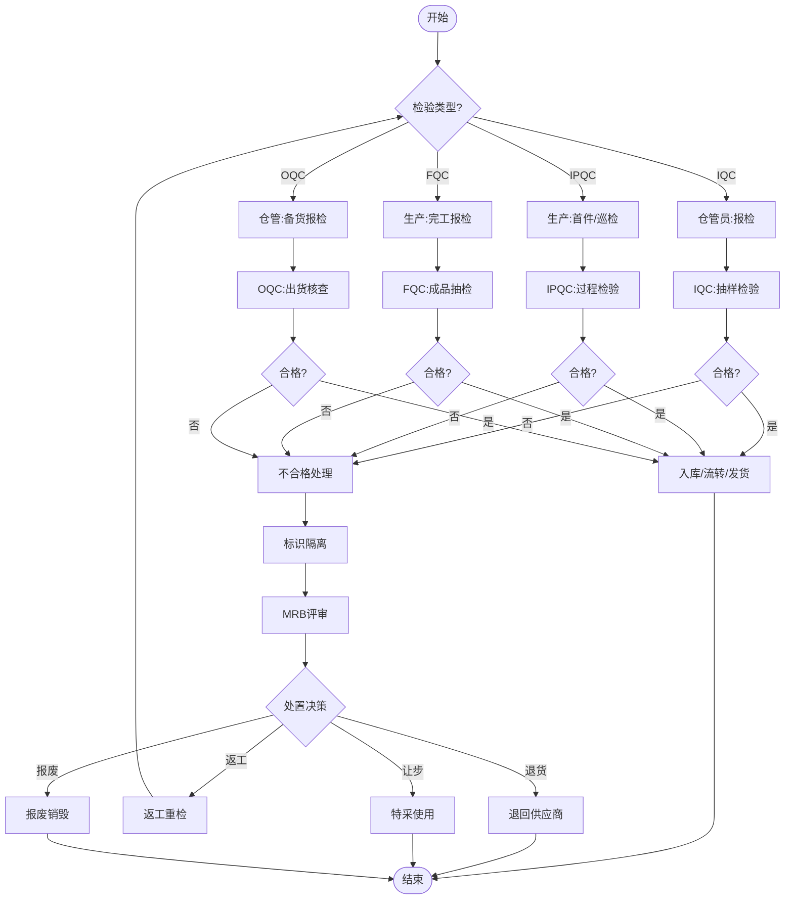

# BIZ-FLOW-M02: 质量检验流程

**文档编号**：BIZ-FLOW-M02  
**版本**：v1.0  
**创建日期**：2026年1月5日  
**更新日期**：2026年1月5日  
**文档状态**：已发布  
**业务域**：质量域  
**优先级**：🔴 P0（极高）

---

## 一、流程概述

### 1.1 基本信息

- **流程名称**：质量检验流程（Quality Control Process）
- **流程编号**：BIZ-FLOW-M02
- **起点**：检验申请（来料/过程/成品/出货）
- **终点**：检验完成并出具报告
- **业务目标**：
  - 确保原材料、半成品、成品符合质量标准
  - 防止不合格品流入下一道工序或客户手中
  - 及时发现质量异常，降低质量成本
  - 满足合规性要求（GMP/ISO等）

### 1.2 适用范围

- **适用公司**：全集团（A公司研发质控、B公司生产质控）
- **适用部门**：质量部（QC/QA）、采购部、生产部、仓储部、销售部
- **涵盖场景**：
  - **IQC (Incoming Quality Control)**：来料检验
  - **IPQC (In-Process Quality Control)**：过程检验
  - **FQC (Final Quality Control)**：成品终检
  - **OQC (Outgoing Quality Control)**：出货检验
  - **退货检验**：客户退回产品检验

### 1.3 流程类型

- **流程性质**：核心控制流程
- **流程频率**：高频（伴随物流和生产流）
- **流程复杂度**：中高（涉及多环节、多标准、多部门）

---

## 二、角色与职责（RACI矩阵）

| 流程阶段   | 质检员(QC) | 质量经理(QA)  | 仓管员      | 生产人员     | 采购员 | 销售员   | 供应商/客户 |
| ---------- | ---------- | ------------- | ----------- | ------------ | ------ | -------- | ----------- |
| 检验申请   | I          | -             | R (IQC/OQC) | R (IPQC/FQC) | -      | R (退货) | -           |
| 抽样       | R, A       | -             | C           | C            | -      | -        | -           |
| 检验执行   | R          | -             | -           | -            | -      | -        | -           |
| 结果判定   | R          | A (争议/让步) | I           | I            | I      | I        | I           |
| 标识与隔离 | R          | -             | C           | C            | -      | -        | -           |
| 不合格处理 | C          | R, A          | I           | I            | I      | I        | C           |
| 报告归档   | R          | I             | -           | -            | -      | -        | -           |

**注释**：

- R (Responsible)：负责执行
- A (Accountable)：最终批准
- C (Consulted)：需要咨询
- I (Informed)：需要知会

---

## 三、流程阶段设计

### 阶段1：来料检验 (IQC)

#### 步骤1.1 报检与核对

**触发条件**：

- 供应商送货到厂
- 仓储部门完成收货清点（参见BIZ-FLOW-P01）

**执行角色**：仓管员

**输入**：

- 送货单
- 采购订单
- 物料实物（待检区）

**执行步骤**：

1. 仓管员核对物料名称、规格、数量、批次号。
2. 确认外包装完好。
3. 将物料放置在【待检区】，挂黄色"待检"标识。
4. 提交【来料报检单】给质量部。

**输出**：

- 来料报检单

---

#### 步骤1.2 抽样与检验

**触发条件**：

- 接到来料报检单

**执行角色**：IQC质检员

**输入**：

- 来料报检单
- 物料规格书/图纸
- 检验标准（SIP）
- AQL抽样标准

**执行步骤**：

1. **资料审查**：
   - 检查供应商提供的COA（出厂检验报告）。
   - 确认是否为合格供应商。
2. **抽样**：
   - 根据AQL标准（如GB/T 2828.1）确定抽样数量。
   - 随机抽取样品。
3. **检验执行**：
   - **外观检查**：包装、标签、外观缺陷。
   - **尺寸/规格**：使用卡尺、千分尺等测量。
   - **理化性能**：送实验室进行化学成分、物理性能测试。
   - **功能测试**：如电子元器件通电测试。
4. **记录数据**：
   - 填写【来料检验记录表】。

**输出**：

- 检验原始记录

---

#### 步骤1.3 结果判定与处置

**触发条件**：

- 检验完成

**执行角色**：IQC质检员

**执行步骤**：

1. 对比检验结果与标准。
2. **判定**：
   - **合格**：所有指标符合要求。
   - **不合格**：存在关键缺陷或主要缺陷超过AQL限值。
3. **标识与处置**：
   - **合格**：
     - 出具【IQC检验报告】（结论：合格）。
     - 在物料外箱贴绿色"合格"标签。
     - 通知仓管员入库（移入合格品区）。
   - **不合格**：
     - 出具【IQC检验报告】（结论：不合格）。
     - 在物料外箱贴红色"不合格"标签。
     - 通知仓管员隔离（移入不合格品区）。
     - 发起【不合格品处理流程】（见阶段5）。

**输出**：

- IQC检验报告
- 物料状态标识（合格/不合格）

---

### 阶段2：过程检验 (IPQC)

#### 步骤2.1 首件检验

**触发条件**：

- 生产线开机/换型/换班/修机后生产的第一件/批产品

**执行角色**：生产操作工、IPQC质检员

**执行步骤**：

1. 操作工自检合格后，通知IPQC。
2. IPQC进行首件检验：
   - 核对工艺参数。
   - 检验产品质量（外观、尺寸、关键性能）。
3. **判定**：
   - **合格**：签署【首件检验确认书】，允许批量生产。
   - **不合格**：通知停机调整，调整后重新首检。

**输出**：

- 首件检验记录

---

#### 步骤2.2 巡回检验

**触发条件**：

- 批量生产过程中

**执行角色**：IPQC质检员

**执行步骤**：

1. 按规定频率（如每2小时一次）到产线巡检。
2. 检查内容：
   - **人**：操作员是否按SOP操作。
   - **机**：设备参数是否在设定范围内。
   - **料**：投料是否正确，物料标识是否清晰。
   - **法**：工艺文件是否现行有效。
   - **环**：温湿度、洁净度是否达标。
   - **测**：产品抽检是否合格。
3. 记录巡检结果。
4. 发现异常立即要求停线整改。

**输出**：

- 巡检记录表

---

### 阶段3：成品检验 (FQC)

#### 步骤3.1 完工报检

**触发条件**：

- 生产批次结束，产品包装完成（参见BIZ-FLOW-M01）

**执行角色**：生产班组长

**执行步骤**：

1. 确认生产记录完整。
2. 将成品放置在【待检区】。
3. 提交【成品报检单】。

---

#### 步骤3.2 成品抽检

**执行角色**：FQC质检员

**执行步骤**：

1. 核对生产记录、批次号、数量。
2. 按成品检验标准（成品SIP）进行抽样。
3. 执行全项检验（外观、尺寸、性能、包装）。
4. 判定结果：
   - **合格**：出具【成品检验报告】（COA），贴合格证，通知入库。
   - **不合格**：贴不合格标签，隔离，发起不合格品处理。

**输出**：

- 成品检验报告 (COA)
- 合格证

---

### 阶段4：出货检验 (OQC)

#### 步骤4.1 出货报检

**触发条件**：

- 销售发货通知单生成
- 仓库备货完成

**执行角色**：仓管员

**执行步骤**：

1. 按发货单备货到【发货区】。
2. 通知OQC进行出货检验。

---

#### 步骤4.2 出货核查

**执行角色**：OQC质检员

**执行步骤**：

1. **核对**：
   - 产品名称、规格、数量是否与发货单一致。
   - 批次号是否正确。
   - 客户有无特殊要求（如特定标签、特定包装）。
2. **外箱检查**：
   - 包装是否破损、脏污。
   - 唛头标识是否正确。
3. **抽检**（必要时）：
   - 开箱抽检产品外观、附件。
4. **判定**：
   - **合格**：在发货单上盖"QA放行章"，允许装车。
   - **不合格**：拦截发货，通知销售和仓库，查找原因。

**输出**：

- 出货检验报告
- 发货放行指令

---

### 阶段5：不合格品处理

#### 步骤5.1 不合格标识与隔离

**触发条件**：

- 任何检验环节判定为"不合格"

**执行角色**：质检员、仓管员

**执行步骤**：

1. 立即粘贴红色"不合格"标签。
2. 将实物移至【不合格品区】（物理隔离）。
3. 冻结系统库存（防止误领用/误发货）。
4. 开具【不合格品处置单】（NCR）。

---

#### 步骤5.2 原因分析与评审

**执行角色**：质量工程师、相关部门（采购/生产/技术）

**执行步骤**：

1. 组织评审会议（MRB - Material Review Board）。
2. 分析不合格原因（采用5M1E分析法）：
   - **人 (Man)**：员工是否培训合格？是否有操作失误？
   - **机 (Machine)**：设备是否故障？参数是否漂移？
   - **料 (Material)**：原材料是否有缺陷？是否用错料？
   - **法 (Method)**：SOP是否正确？工艺标准是否合理？
   - **环 (Environment)**：温湿度、洁净度是否达标？
   - **测 (Measurement)**：检测仪器是否校准？检测方法是否准确？
3. 确定责任部门。

---

#### 步骤5.3 处置决策

**执行角色**：MRB小组（质量经理批准）

**决策选项**：

| 处置方式 | 适用场景 | 后续动作 |
|---------|---------|---------|
| **退货** | 来料严重不合格 | 通知采购退货给供应商 |
| **换货** | 来料不合格但急需 | 通知供应商换货 |
| **返工/返修** | 生产过程/成品轻微缺陷，可修复 | 制定返工方案，返工后重检 |
| **特采/让步接收** | 缺陷不影响功能，且急需 | 需总经理/客户批准，可能降价 |
| **报废** | 无法修复或修复成本过高 | 财务审核后销毁 |
| **挑选** | 批次中混有不合格品 | 全检挑选，合格品入库，不合格品处理 |

**输出**：

- 评审决议
- 处置指令

---

#### 步骤5.4 纠正预防措施 (CAPA)

**触发条件**：

- 重大质量问题
- 重复发生的质量问题

**执行角色**：责任部门、质量部

**执行步骤**：

1. 质量部发出【纠正预防措施要求单】（CAR）。
2. 责任部门调查根本原因（Root Cause Analysis）。
3. 制定纠正措施（短期）和预防措施（长期）。
4. 实施改进。
5. 质量部验证改进效果。
6. 验证有效后关闭CAR。

---

## 四、流程图

### 4.1 综合检验流程图

---

## 五、关键控制点

### 5.1 控制点清单

| 控制点 | 风险描述 | 控制措施 | 责任人 |
|-------|---------|---------|--------|
| **抽样方案** | 样本代表性不足，漏检 | 严格执行GB/T 2828.1标准，随机抽样 | 质检员 |
| **检验标准** | 标准过期或理解错误 | 定期培训，现场放置最新SIP | 质量工程师 |
| **不合格品隔离** | 误用不合格品 | 物理隔离+系统冻结+醒目标识 | 仓管/质检 |
| **特采审批** | 滥用特采导致质量隐患 | 严格审批权限，限制特采比例 | 质量经理 |
| **量具校准** | 测量数据不准 | 定期校准量具，贴校准标签 | 计量员 |
| **首件确认** | 批量性报废 | 必须首件合格后方可量产 | IPQC |

---

## 六、异常处理

### 6.1 常见异常场景

#### 场景1：供应商来料急用但检验未完成

**处理流程**：

1. 生产部门提出【紧急放行申请】。
2. 质量经理评估风险（基于历史质量记录）。
3. 批准后，留样备查，其余物料先投入生产。
4. 标识该批产品，一旦检验不合格，立即追回。
5. 检验完成后补发报告。

#### 场景2：客户投诉质量问题

**处理流程**：

1. 销售部接收客诉，填写【客户投诉处理单】。
2. 质量部登记，成立小组调查。
3. 追溯批次记录（IQC/IPQC/FQC/OQC记录）。
4. 分析留样（如有）。
5. 确认原因，回复客户（8D报告）。
6. 协商赔偿/退换货。
7. 内部整改。

#### 场景3：检验仪器故障

**处理流程**：

1. 立即停止使用该仪器。
2. 追溯最近一次校准后检测的所有产品。
3. 重新评估这些产品的质量风险（必要时重检）。
4. 维修或更换仪器。

---

## 七、绩效指标（KPI）

| 指标名称 | 定义 | 计算公式 | 目标值 |
|---------|------|---------|--------|
| **来料检验合格率** | 供应商供货质量水平 | 合格批次 ÷ 总检验批次 × 100% | ≥95% |
| **IQC及时率** | 检验效率 | 规定时间内完成检验批次 ÷ 总批次 | ≥98% |
| **制程不良率** | 生产过程质量水平 | 不良品数量 ÷ 投入数量 × 100% | ≤2% |
| **成品一次通过率** | 成品质量水平 | 一次检验合格批次 ÷ 总提交批次 | ≥98% |
| **客户投诉率** | 客户满意度 | 投诉次数 ÷ 发货批次 × 100% | ≤0.5% |
| **质量事故数** | 重大质量问题 | 发生重大质量事故的次数 | 0 |
| **检测设备校准率** | 计量管理水平 | 按时校准设备数 ÷ 应校准设备数 | 100% |

---

## 八、与其他流程的接口

### 8.1 上游流程

| 上游流程 | 接口点 | 输入数据 |
|---------|--------|---------|
| **采购订单到付款** (BIZ-FLOW-P01) | 物料到货 | 送货单、采购订单 |
| **生产计划到交付** (BIZ-FLOW-M01) | 生产过程/完工 | 生产工单、生产记录 |
| **研发立项到转移** (BIZ-FLOW-R01) | 新产品导入 | 质量标准、检验方法 |

### 8.2 下游流程

| 下游流程 | 接口点 | 输出数据 |
|---------|--------|---------|
| **采购订单到付款** (BIZ-FLOW-P01) | 入库/退货 | 检验结果（决定付款/扣款） |
| **生产计划到交付** (BIZ-FLOW-M01) | 生产放行 | 首件确认、成品放行 |
| **销售订单到收款** (BIZ-FLOW-S01) | 发货放行 | 出货检验报告 |

---

## 九、流程优化建议

### 9.1 短期优化

1. **检验标准化**：完善所有物料和产品的SIP（检验作业指导书），图文并茂。
2. **目视化管理**：在待检区、合格区、不合格区设置清晰的地标和看板。
3. **样板管理**：建立限度样板（合格/不合格边界样品），统一判定标准。

### 9.2 中期优化

1. **QMS系统应用**：实施质量管理系统，实现检验数据无纸化采集（平板录入）。
2. **SPC应用**：在关键工序引入统计过程控制（SPC），监控CPK值，预防变异。
3. **免检机制**：对长期质量稳定的优秀供应商实施免检或降低抽样频率。

### 9.3 长期优化

1. **自动化检测**：引入机器视觉检测设备，替代人工目检，提高效率和准确性。
2. **供应链质量协同**：与核心供应商系统互联，共享质量数据，前移质量控制点。
3. **质量大数据分析**：利用历史数据预测质量风险，辅助研发设计优化。

---

## 十、附录

### 10.1 相关表单

| 表单名称 | 编号 | 用途 |
|---------|------|------|
| 来料报检单 | FRM-QC-001 | 申请IQC |
| 来料检验报告 | FRM-QC-002 | 记录IQC结果 |
| 首件检验记录 | FRM-QC-003 | 记录首件确认 |
| 巡检记录表 | FRM-QC-004 | 记录IPQC巡检 |
| 成品检验报告 | FRM-QC-005 | 记录FQC结果(COA) |
| 不合格品处置单 | FRM-QC-006 | 记录NCR处理 |
| 纠正预防措施单 | FRM-QC-007 | 记录CAPA |
| 客户投诉处理单 | FRM-QC-008 | 记录客诉处理 |

### 10.2 术语表

| 术语 | 全称 | 解释 |
|-----|------|------|
| IQC | Incoming Quality Control | 来料质量控制 |
| IPQC | In-Process Quality Control | 过程质量控制 |
| FQC | Final Quality Control | 终检质量控制 |
| OQC | Outgoing Quality Control | 出货质量控制 |
| AQL | Acceptable Quality Level | 可接受质量水平（抽样标准） |
| MRB | Material Review Board | 物料审查委员会（处理不合格品） |
| NCR | Non-Conformance Report | 不合格品报告 |
| CAPA | Corrective and Preventive Action | 纠正和预防措施 |
| COA | Certificate of Analysis | 检验分析报告 |
| SIP | Standard Inspection Procedure | 标准检验作业指导书 |

### 10.3 参考文档

- GB/T 2828.1 计数抽样检验程序
- ISO 9001 质量管理体系标准
- 内部质量手册

---

**文档版本历史**：

| 版本 | 日期 | 修改人 | 修改内容 |
|-----|------|--------|---------|
| v1.0 | 2026-01-05 | 系统 | 初始版本，定义全流程质量检验 |

---

**审批记录**：

| 角色 | 姓名 | 审批意见 | 日期 |
|-----|------|---------|------|
| 流程Owner | 待定 | 待审批 | - |
| 质量经理 | 待定 | 待审批 | - |
| 生产经理 | 待定 | 待审批 | - |
| 总经理 | 待定 | 待审批 | - |

---

**最后更新**：2026年1月5日
