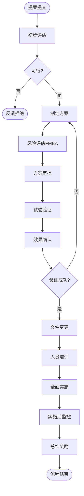

# BIZ-FLOW-M03: 工艺改进流程

**文档编号**：BIZ-FLOW-M03  
**版本**：v1.0  
**创建日期**：2026年1月5日  
**更新日期**：2026年1月5日  
**文档状态**：已发布  
**业务域**：生产域  
**优先级**：🟠 P1（高）

---

## 一、流程概述

### 1.1 基本信息

- **流程名称**：工艺改进流程（Process Improvement Process）
- **流程编号**：BIZ-FLOW-M03
- **起点**：改进提案提交
- **终点**：改进标准化与推广
- **业务目标**：
  - 持续优化生产工艺，提高产品质量（Quality）
  - 降低生产成本（Cost），减少浪费
  - 提高生产效率（Delivery），缩短周期
  - 确保变更过程受控，防止因改进引入新的风险

### 1.2 适用范围

- **适用公司**：B公司（生产基地）
- **适用部门**：生产技术部、生产部、质量部、设备部
- **适用场景**：
  - 工艺参数优化（如温度、压力调整）
  - 原辅料替代
  - 设备改造或工装升级
  - 操作步骤简化

### 1.3 流程类型

- **流程性质**：变更管理流程
- **流程频率**：中频
- **流程复杂度**：中高（涉及验证和变更控制）

---

## 二、角色与职责（RACI矩阵）

| 流程阶段 | 提案人 | 工艺工程师 | 生产经理 | 质量经理 | 财务经理 | 总经理 |
|---------|-------|-----------|---------|---------|---------|-------|
| 提案提交 | R | I | I | - | - | - |
| 初步评估 | I | R | C | C | - | - |
| 详细方案 | - | R | C | C | C | - |
| 方案审批 | I | R | A | A | C | A (重大) |
| 试验验证 | I | R | R | R | - | - |
| 结果确认 | I | R | A | A | - | - |
| 标准化 | - | R | A | I | - | - |

**注释**：

- R (Responsible)：负责执行
- A (Accountable)：最终批准
- C (Consulted)：需要咨询
- I (Informed)：需要知会

---

## 三、流程阶段设计

### 阶段1：提案与评估 (Proposal & Assessment)

#### 步骤1.1 提案收集

**触发条件**：

- 一线员工发现操作不便
- 数据分析发现质量波动
- 财务要求降本
- 客户反馈建议

**执行角色**：提案人（全员）

**执行步骤**：

1. 填写【工艺改进提案单】。
2. 描述现状（问题点）：
   - 建议从人机料法环（4M1E）维度进行分析（如：设备老化、操作繁琐、原料波动等）。
3. 描述建议方案。
4. 预估收益（如：每年节约10万元，或效率提升10%）。

#### 步骤1.2 初步评估

**执行角色**：工艺工程师

**执行步骤**：

1. **技术可行性**：理论上是否成立？现有设备能否支持？
2. **合规性**：是否违反法规或客户协议？
3. **筛选**：
   - 采纳：进入下一环节。
   - 暂缓：条件不成熟，列入储备库。
   - 拒绝：不可行，反馈理由给提案人。

#### 步骤1.3 详细方案与风险评估

**执行角色**：工艺工程师、多部门小组

**执行步骤**：

1. 制定详细改进方案（含试验计划）。
2. **成本效益分析**：计算投入产出比（ROI）。
3. **风险评估**（FMEA）：
   - 识别潜在失效模式（如：改参数可能导致副产物增加）。
   - 制定风险控制措施。

#### 步骤1.4 方案审批

**执行角色**：生产经理、质量经理

**执行步骤**：

1. 评审方案的完整性和风险控制措施。
2. 批准进行试验验证。
3. 如涉及重大变更（如关键工艺参数CPP变更），需报总经理批准。

---

### 阶段2：试验验证 (Validation)

#### 步骤2.1 小试/中试验证（必要时）

**执行角色**：工艺工程师

**执行步骤**：

1. 在实验室或中试车间进行模拟试验。
2. 验证改进方案在小规模下的效果。
3. 确认无负面影响。

#### 步骤2.2 生产线试运行

**执行角色**：工艺工程师、生产班组

**执行步骤**：

1. 下达【试生产工单】。
2. 在正式生产线上，按新工艺生产1-3批。
3. 全程跟踪记录关键参数。
4. 收集试生产产品。

#### 步骤2.3 效果确认

**执行角色**：质量部、工艺工程师

**执行步骤**：

1. **产品检验**：对试生产产品进行全项检验（BIZ-FLOW-M02）。
2. **稳定性考察**：必要时进行加速稳定性测试。
3. **数据对比**：对比改进前后的数据（收率、工时、能耗）。
4. **判定**：
   - 成功：达到预期目标，且无副作用。
   - 失败：未达标或出现新问题，回退到原工艺。

---

### 阶段3：标准化与推广 (Standardization)

#### 步骤3.1 文件变更

**执行角色**：工艺工程师

**执行步骤**：

1. 发起【文件变更申请】（ECR）。
2. 修订相关技术文件：
   - 工艺规程
   - SOP（标准操作规程）
   - BOM（物料清单）
   - FMEA（失效模式分析）
3. 审批发布新版本文件。

#### 步骤3.2 人员培训

**执行角色**：工艺工程师、车间主任

**执行步骤**：

1. 编制培训教材。
2. 对相关操作人员进行新工艺培训。
3. 考核合格后方可上岗操作。

#### 步骤3.3 全面实施

**执行角色**：生产部

**执行步骤**：

1. 设定切换日期（Cut-off Date）。
2. 从切换日起，所有生产按新工艺执行。
3. 废除旧版文件，回收旧版SOP。

---

### 阶段4：效果监控 (Monitoring)

#### 步骤4.1 实施后监控

**执行角色**：工艺工程师、质量部

**执行步骤**：

1. 在实施后的1-3个月内，重点监控该工序。
2. 收集生产数据和质量数据。
3. 确认改进效果的稳定性（是否反弹）。

#### 步骤4.2 总结与奖励

**执行角色**：生产经理、人事部

**执行步骤**：

1. 编制【工艺改进总结报告】。
2. 核算实际收益。
3. 根据公司制度，对提案人和实施团队进行奖励。

---

## 四、流程图

### 4.1 工艺改进闭环流程

---

## 五、关键控制点

### 5.1 控制点清单

| 控制点 | 风险描述 | 控制措施 | 责任人 |
|-------|---------|---------|--------|
| **风险评估** | 改进引入了未知的质量隐患 | 必须进行FMEA分析，识别潜在风险 | 工艺工程师 |
| **试验验证** | 盲目量产导致批量报废 | 必须遵循"小试-中试-试生产"的验证路径 | 生产经理 |
| **文件变更** | 现场使用旧版SOP | 严格执行文件发放与回收制度，现场检查 | 质量QA |
| **客户通知** | 擅自变更违反客户协议 | 识别是否为"通知客户"或"客户批准"的变更 | 质量经理 |

---

## 六、异常处理

### 6.1 常见异常场景

#### 场景1：试生产失败

**触发**：试生产的产品不合格或设备故障。

**处理流程**：

1. 立即停止试生产。
2. 隔离不合格品。
3. 恢复原工艺生产，确保交付不受影响。
4. 分析失败原因，修改方案后重新申请验证。

#### 场景2：实施后发现隐患

**触发**：全面实施一周后，发现某项次要指标下降。

**处理流程**：

1. 启动偏差处理流程。
2. 评估影响程度。
3. 如影响可接受，进行微调；如影响重大，立即回退到旧工艺（启动回退预案）。

---

## 七、绩效指标（KPI）

| 指标名称 | 定义 | 计算公式 | 目标值 |
|---------|------|---------|--------|
| **工艺改进收益** | 通过改进带来的经济效益 | 节约成本 + 增效价值 | ≥50万/年 |
| **改进提案采纳率** | 提案质量 | 采纳数 / 提交总数 | ≥30% |
| **变更成功率** | 实施后未回退的比例 | 成功变更数 / 总变更数 | ≥95% |

---

## 八、与其他流程的接口

### 8.1 上游流程

| 上游流程 | 接口点 | 输入数据 |
|---------|--------|---------|
| **生产计划到交付** (BIZ-FLOW-M01) | 问题反馈 | 生产异常数据 |
| **质量检验流程** (BIZ-FLOW-M02) | 质量数据 | 不合格率分析 |

### 8.2 下游流程

| 下游流程 | 接口点 | 输出数据 |
|---------|--------|---------|
| **生产计划到交付** (BIZ-FLOW-M01) | 新工艺执行 | 新版SOP、BOM |
| **文档管理流程** (BIZ-FLOW-C02) | 文件归档 | 变更记录 |

---

## 九、流程优化建议

### 9.1 短期优化

1. **提案激励**：设立"月度最佳提案奖"，即使未采纳的提案也给予小礼品鼓励，营造全员改善氛围。
2. **快速通道**：对于不涉及产品质量的微小改进（如工具摆放优化），简化审批流程，授权班组长批准。

### 9.2 中期优化

1. **知识库**：建立工艺问题与改进案例库，避免重复研究。
2. **DOE应用**：培训工艺工程师掌握试验设计（DOE）方法，科学地寻找最优参数，而不是试错法。

### 9.3 长期优化

1. **数字孪生仿真**：在虚拟工厂中模拟工艺变更，预测结果，减少实物验证成本。

---

## 十、附录

### 10.1 相关表单

| 表单名称 | 编号 | 用途 |
|---------|------|------|
| 工艺改进提案单 | FRM-IMP-001 | 提交建议 |
| 变更申请单(ECR) | FRM-IMP-002 | 申请变更 |
| 试生产方案 | FRM-IMP-003 | 验证计划 |
| 变更总结报告 | FRM-IMP-004 | 结果确认 |

### 10.2 术语表

| 术语 | 全称 | 解释 |
|-----|------|------|
| ECR | Engineering Change Request | 工程变更申请 |
| ECO | Engineering Change Order | 工程变更指令 |
| FMEA | Failure Mode and Effects Analysis | 失效模式与影响分析 |
| ROI | Return on Investment | 投资回报率 |
| CPP | Critical Process Parameter | 关键工艺参数 |

### 10.3 参考文档

- 变更控制管理制度
- 风险管理规程

---

**文档版本历史**：

| 版本 | 日期 | 修改人 | 修改内容 |
|-----|------|--------|---------|
| v1.0 | 2026-01-05 | 系统 | 初始版本，定义工艺改进流程 |

---

**审批记录**：

| 角色 | 姓名 | 审批意见 | 日期 |
|-----|------|---------|------|
| 流程Owner | 待定 | 待审批 | - |
| 生产经理 | 待定 | 待审批 | - |
| 质量经理 | 待定 | 待审批 | - |

---

**最后更新**：2026年1月5日
