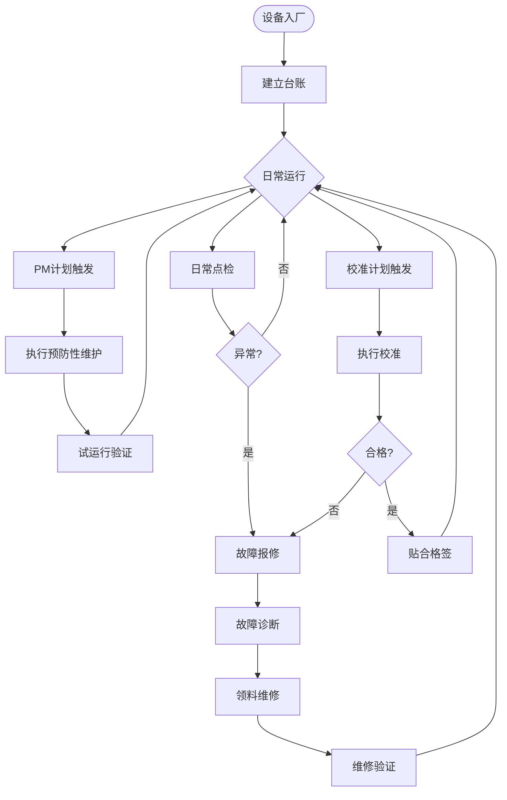

# BIZ-FLOW-M04: 设备全生命周期管理流程

**文档编号**：BIZ-FLOW-M04  
**版本**：v1.1  
**创建日期**：2026年1月5日  
**更新日期**：2026年1月6日  
**文档状态**：已发布  
**业务域**：生产域  
**优先级**：🔴 P0（极高）

---

## 一、流程概述

### 1.1 基本信息

- **流程名称**：设备全生命周期管理流程（Equipment Lifecycle Management Process）
- **流程编号**：BIZ-FLOW-M04
- **起点**：设备到货验收
- **终点**：设备报废处置
- **业务目标**：
  - 覆盖设备从安装、调试、试用到报废的全过程
  - 提高设备综合效率（OEE），减少非计划停机
  - 延长设备使用寿命，保护资产价值
  - 确保设备精度满足工艺和质量要求
  - 消除安全隐患，保障EHS合规

### 1.2 适用范围

- **适用公司**：B公司（生产基地）、A公司（实验室）
- **适用对象**：
  - 生产设备（反应釜、灌装机等）
  - 公用工程设备（空压机、纯水机、HVAC）
  - 实验室仪器（HPLC、GC等）
  - 计量器具（天平、压力表等）

### 1.3 流程类型

- **流程性质**：核心支持流程
- **流程频率**：日常（巡查）、定期（保养/校准）、突发（维修）
- **流程复杂度**：中高（涉及技术专业性强）

---

## 二、角色与职责（RACI矩阵）

| 流程阶段 | 设备使用人 | 设备工程师 | 维修技工 | 计量员 | 生产/实验室经理 | 质量QA |
|---------|-----------|-----------|---------|-------|----------------|-------|
| 验收与试运行| R (试用) | R (主导) | C | - | A | C (验证) |
| 日常巡查 | R | I | - | - | A | I |
| 预防性维护(PM) | C | A | R | - | I | I |
| 故障维修(CM) | R (报修) | A | R | - | I | C (验证) |
| 计量校准 | I | A | - | R | I | C |
| 备件管理 | - | A | R | - | - | - |
| 报废评估 | I | R | C | - | C | A |

**注释**：

- R (Responsible)：负责执行
- A (Accountable)：最终批准
- C (Consulted)：需要咨询
- I (Informed)：需要知会

---

## 三、流程阶段设计

### 阶段1：验收与试运行 (Acceptance & Commissioning)

#### 步骤1.1 安装与调试 (IQ/OQ)

**触发条件**：采购设备到货。

**执行角色**：设备工程师、供应商

**执行步骤**：

1. **安装确认 (IQ)**：检查设备是否按图纸安装，水电汽连接是否正确。
2. **运行确认 (OQ)**：空载运行测试，检查设备功能是否正常，各项参数是否达标。
3. 收集随机资料（说明书、图纸），移交档案室。

#### 步骤1.2 试运行与验收 (PQ)

**执行角色**：设备工程师、生产操作员、QA

**执行步骤**：

1. **性能确认 (PQ)**：带料试运行，验证设备能否稳定生产出合格产品。
2. **试用期**：通常为1-3个月，观察设备稳定性。
3. **合格签字**：三方（生产、技术、采购）签署《设备验收单》。此单据作为财务转固（F04）的依据。

---

### 阶段2：设备台账与资料管理

#### 步骤2.1 建立台账

**执行角色**：设备工程师

**执行步骤**：

1. 设备验收合格后，分配唯一设备编号（EQ-YYYY-XXX）。
2. 建立【设备卡片】，录入信息：
   - 规格型号、序列号、制造商。
   - 购置日期、原值。
   - 存放位置、保管人。
3. 粘贴固定资产标签。

#### 步骤2.2 资料归档

**执行角色**：设备工程师

**执行步骤**：

1. 收集说明书、图纸、软件光盘。
2. 扫描上传至文档管理系统（BIZ-FLOW-C02）。

---

### 阶段3：巡查与点检 (Inspection)

#### 步骤3.1 日常点检

**执行角色**：设备使用人（操作工）

**执行步骤**：

1. **开机前**：检查气压、油位、紧固件。
2. **运行中**：观察异响、异味、振动。
3. 填写《设备日常点检表》。

#### 步骤3.2 专业巡查

**执行角色**：设备工程师

**执行步骤**：

1. 每周/每月对重点设备进行深度巡检。
2. 使用专业工具（测振仪、热成像）检测隐患。

---

### 阶段4：预防性维护 (PM - Preventive Maintenance)

#### 步骤4.1 制定PM计划

**执行角色**：设备工程师

**执行步骤**：

1. 依据厂家说明书和历史经验，制定【年度维护计划】。
2. 定义保养级别：
   - **一级保养**：月度，清洁、紧固、润滑（操作工/技工）。
   - **二级保养**：季度/年度，拆机检查、更换易损件（技工/厂家）。
3. 审批计划。

#### 步骤4.2 执行维护

**执行角色**：维修技工

**执行步骤**：

1. 系统自动生成【维护工单】。
2. 领取备件（润滑油、密封圈等）。
3. 停机执行保养作业。
4. 填写【设备维护记录】。
5. 贴上“维护完成”标签，注明下次维护日期。

---

### 阶段5：故障维修 (CM - Corrective Maintenance)

#### 步骤5.1 故障报修

**触发条件**：设备突发故障或点检异常。

**执行角色**：设备使用人（操作工）

**执行步骤**：

1. 立即停机，挂“故障待修”牌。
2. 系统提交【维修申请单】，描述故障现象。
3. 通知班组长。

#### 步骤5.2 诊断与维修

**执行角色**：维修技工 / 设备工程师

**执行步骤**：

1. 现场诊断故障原因（4M1E分析）。
2. 制定维修方案：
   - **简单故障**：立即修复。
   - **复杂故障**：需更换昂贵备件或请厂家维修，需审批。
3. 领用备件，实施维修。

#### 步骤5.3 维修验证

**执行角色**：设备使用人、QA（关键设备）

**执行步骤**：

1. 开机试运行。
2. 生产/测试样品，确认质量合格。
3. QA确认维修未影响验证状态（必要时重新验证）。
4. 关闭维修工单。

---

### 阶段6：计量与校准 (Calibration)

#### 步骤6.1 制定校准计划

**执行角色**：计量员

**执行步骤**：

1. 识别关键测量设备（如温度计、天平）。
2. 制定【年度校准计划】。
3. 确定方式：内校（有标准器）或外校（送第三方）。

#### 步骤6.2 执行校准

**执行角色**：计量员 / 第三方机构

**执行步骤**：

1. 按期执行校准。
2. 出具【校准证书/报告】。
3. 确认结果是否在允许误差范围内。
4. 粘贴“校准合格”标签（绿色），注明有效期。

---

## 四、流程图

### 4.1 设备维护全流程

---

## 五、关键控制点

### 5.1 控制点清单

| 控制点 | 风险描述 | 控制措施 | 责任人 |
|-------|---------|---------|--------|
| **PM执行率** | 保养流于形式，导致设备早衰 | 抽查保养记录，现场核实设备状况 | 设备经理 |
| **校准有效期** | 使用过期仪器导致数据失真 | 系统自动预警，过期仪器强制停用 | 质量QA |
| **备件库存** | 关键备件缺货导致停产 | 设定安全库存，定期盘点 | 备件管理员 |
| **特种设备** | 锅炉/压力容器未年检被罚款 | 建立特种设备台账，专人负责法定检验 | EHS专员 |

---

## 六、异常处理

### 6.1 常见异常场景

#### 场景1：维修后验证失败

**触发**：维修后试运行产品不合格。

**处理流程**：

1. 重新诊断，可能存在深层故障。
2. 评估是否需要大修或报废。
3. 追溯维修期间生产的产品，进行隔离评审。

#### 场景2：校准失准

**触发**：校准发现仪器偏差超出允许范围。

**处理流程**：

1. 立即停用仪器。
2. 启动【偏差调查】：追溯自上次校准合格以来使用该仪器检测的所有产品。
3. 评估产品质量风险（必要时召回）。

---

## 七、绩效指标（KPI）

| 指标名称 | 定义 | 计算公式 | 目标值 |
|---------|------|---------|--------|
| **设备综合效率 (OEE)** | 时间利用率×性能利用率×合格率 | OEE公式 | ≥ 85% |
| **平均故障间隔时间 (MTBF)** | 设备可靠性指标 | 运行总时间 / 故障次数 | 逐步提升 |
| **平均维修时间 (MTTR)** | 维修效率指标 | 维修总时间 / 故障次数 | ≤ 4小时 |
| **PM计划达成率** | 预防性维护执行情况 | 实际执行数 / 计划数 | 100% |

---

## 八、与其他流程的接口

### 8.1 上游流程

| 上游流程 | 接口点 | 输入数据 |
|---------|--------|---------|
| **采购订单到付款** (BIZ-FLOW-P01) | 设备/备件采购 | 设备实物、备件入库 |
| **生产计划到交付** (BIZ-FLOW-M01) | 生产排程 | 设备空闲窗口（用于安排保养） |

### 8.2 下游流程

| 下游流程 | 接口点 | 输出数据 |
|---------|--------|---------|
| **工艺改进** (BIZ-FLOW-M03) | 设备改造 | 改造需求 |
| **质量检验** (BIZ-FLOW-M02) | 仪器校准 | 仪器可用状态 |

---

## 九、流程优化建议

### 9.1 短期优化

1. **目视化管理**：在设备醒目位置张贴“设备状态牌”（运行/停机/维修/待检）。
2. **点检表优化**：将点检内容图示化，并在设备旁悬挂点检表，方便操作工勾选。

### 9.2 中期优化

1. **TPM推行**：全员生产维护，培训操作工掌握简单维修技能（自主保全），减少对专业技工的依赖。
2. **备件超市**：建立开放式备件库，常用低值易耗品随取随用，定期结算。

### 9.3 长期优化

1. **预测性维护 (PdM)**：安装振动、温度传感器，利用IoT技术实时监控设备健康，在故障发生前预警。

---

## 十、附录

### 10.1 相关表单

| 表单名称 | 编号 | 用途 |
|---------|------|------|
| 设备卡片 | FRM-EQ-001 | 身份档案 |
| 年度维护计划表 | FRM-EQ-002 | 计划管理 |
| 设备维修申请单 | FRM-EQ-003 | 故障报修 |
| 计量校准记录 | FRM-EQ-004 | 校准证明 |

### 10.2 术语表

| 术语 | 全称 | 解释 |
|-----|------|------|
| PM | Preventive Maintenance | 预防性维护 |
| CM | Corrective Maintenance | 纠正性维护（故障维修） |
| OEE | Overall Equipment Effectiveness | 设备综合效率 |
| TPM | Total Productive Maintenance | 全员生产维护 |

### 10.3 参考文档

- 设备管理制度
- 计量器具管理办法
- 特种设备安全法

---

**文档版本历史**：

| 版本 | 日期 | 修改人 | 修改内容 |
|-----|------|--------|---------|
| v1.0 | 2026-01-05 | 系统 | 初始版本，定义设备维护流程 |

---

**审批记录**：

| 角色 | 姓名 | 审批意见 | 日期 |
|-----|------|---------|------|
| 流程Owner | 待定 | 待审批 | - |
| 生产总监 | 待定 | 待审批 | - |
| 质量总监 | 待定 | 待审批 | - |

---

**最后更新**：2026年1月5日
