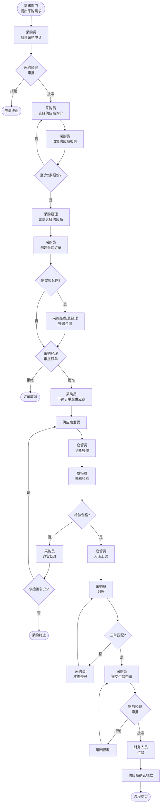

# BIZ-FLOW-P01: 采购订单到付款

**文档编号**：BIZ-FLOW-P01  
**版本**：v1.0  
**创建日期**：2026年1月5日  
**更新日期**：2026年1月5日  
**文档状态**：已发布  
**业务域**：采购域  
**优先级**：🔴 P0（极高）

---

## 一、流程概述

### 1.1 基本信息

- **流程名称**：采购订单到付款（Procure to Pay - P2P）
- **流程编号**：BIZ-FLOW-P01
- **起点**：采购需求产生
- **终点**：付款完成，供应商确认收款
- **业务目标**：
  - 及时采购所需物资，避免生产停工
  - 控制采购成本，获得最优性价比
  - 确保采购质量，保障生产和销售需求
  - 合规管理供应商，建立良好合作关系

### 1.2 适用范围

- **适用公司**：集团所有公司（A公司、B公司）
- **适用部门**：采购部、生产部、仓储部、质检部、财务部
- **适用场景**：
  - 原材料采购（生产用）
  - 辅料采购（包材、试剂等）
  - 设备采购
  - 办公用品采购
  - 服务采购（外包加工、运输等）

### 1.3 流程类型

- **流程性质**：端到端核心业务流程
- **流程频率**：高频（每日多次）
- **流程复杂度**：中高（涉及5个部门协同，需要严格审批控制）

---

## 二、角色与职责（RACI矩阵）

| 流程阶段 | 需求部门 | 采购员 | 采购经理 | 仓管员 | 质检员 | 财务人员 | 财务经理 | 质量经理 | 总经理 |
|---------|---------|--------|---------|--------|--------|---------|---------|---------|--------|
| 需求提出 | R, A | I | I | - | - | - | - | - | - |
| 采购申请 | R | R | A | - | - | - | - | C* | A* |
| 询价比价 | C | R | A | - | - | - | - | - | - |
| 供应商选择 | C | R | A | - | C | - | - | - | - |
| 采购下单 | I | R | A | - | - | - | - | - | A* |
| 合同签署 | C | R | A | - | - | - | - | - | A* |
| 到货通知 | I | R | I | R | I | - | - | - | - |
| 来料检验 | I | I | - | I | R, A | - | - | I | - |
| 入库上架 | I | I | - | R, A | - | - | - | - | - |
| 对账核对 | - | R | I | - | - | R | I | - | - |
| 付款申请 | - | R | I | - | - | I | A | - | A* |
| 财务付款 | - | I | - | - | - | R, A | I | - | - |

**注释**：

- R (Responsible)：负责执行
- A (Accountable)：最终批准
- C (Consulted)：需要咨询
- I (Informed)：需要知会
- C*：新供应商需质量经理会签
- A*：特定条件下批准（如超限额、新供应商、大额采购）

---

## 三、流程阶段设计

### 阶段1：采购需求管理

#### 步骤1.1 需求触发

**触发方式**：

**方式A：库存自动触发**

- **条件**：库存管理人员发现库存量低于安全库存
- **动作**：提出补货需求

**方式B：生产计划触发**

- **条件**：生产部门下达生产工单，计算物料需求
- **动作**：检查库存，缺料部分提出采购需求

**方式C：设备/项目需求**

- **条件**：设备维修、技术改造、新项目启动
- **动作**：相关部门提出专项采购需求

**方式D：日常办公需求**

- **条件**：办公用品、劳保用品等日常消耗
- **动作**：行政部门提出采购申请

**执行角色**：需求部门（生产部、研发部、行政部等）

**输出**：

- 采购需求清单（物料名称、规格、数量、需求日期、用途）

---

#### 步骤1.2 采购申请

**触发条件**：

- 需求部门确认采购需求

**执行角色**：采购员

**输入**：

- 采购需求清单
- 物料主数据（如已有）
- 预算信息

**执行步骤**：

1. 采购员接收需求，创建【采购申请】
2. 分配唯一编号（PR-YYYYMMDD-XXX）
3. 填写采购申请信息：
   - 物料名称、规格型号、技术参数
   - 申请数量
   - 需求日期（到货日期要求）
   - 用途说明
   - 预估单价和总金额
   - 建议供应商（如有）
4. 检查是否为新物料：
   - 如是新物料，需附技术规格书
   - 如涉及质量要求，需质量部门会签
5. 提交审批

**审批规则**：

| 采购金额 | 物料类型 | 审批人 |
|---------|---------|--------|
| < 5万 | 常规物料 | 采购经理 |
| < 5万 | 新物料/新供应商 | 采购经理 + 质量经理 |
| ≥ 5万且< 20万 | 任何物料 | 采购经理 + 总经理 |
| ≥ 20万 | 任何物料 | 采购经理 + 总经理（需预算审查） |

**输出**：

- 审批通过的采购申请

**决策点**：

- 采购申请是否被批准？
  - 批准 → 进入询价流程
  - 拒绝 → 退回需求部门，说明原因（预算不足、需求不合理等）

---

### 阶段2：询价与供应商选择

#### 步骤2.1 供应商寻源

**触发条件**：

- 采购申请审批通过

**执行角色**：采购员

**输入**：

- 采购申请
- 供应商数据库（现有合作供应商）
- 市场信息

**执行步骤**：

1. 查询供应商数据库，筛选潜在供应商：
   - 供应该类物料的供应商
   - 历史合作记录、评分
   - 地理位置、交货能力
2. 选择询价对象：
   - **常规采购**：至少选择3家供应商
   - **紧急采购**：至少2家
   - **特殊物料**（独家供应）：1家，但需说明理由
3. 如现有供应商不足，进行市场寻源：
   - 网络搜索、展会、行业推荐
   - 记录潜在新供应商信息

**输出**：

- 询价供应商清单（3家以上）

**决策点**：

- 是否需要开发新供应商？
  - 否 → 直接询价
  - 是 → 先进行供应商资质评估（参见BIZ-FLOW-P02）

---

#### 步骤2.2 发送询价

**触发条件**：

- 询价供应商清单确定

**执行角色**：采购员

**输入**：

- 采购申请（含技术规格）
- 供应商联系方式

**执行步骤**：

1. **确定询价方式**：
   - **方式A：标准询价（RFQ）**：适用于大宗、定制、非标物料。通过邮件/系统发送正式询价单。
   - **方式B：电商直询**：适用于标准品、MRO、低值易耗品。直接在电商平台（京东、淘宝、1688、震坤行等）查询或咨询客服。

2. **执行询价**：
   - **对于方式A**：
     1. 编制【询价单】，分配编号（RFQ-YYYYMMDD-XXX）。
     2. 明确物料名称、规格、数量、交期、付款条件、报价有效期。
     3. 发送给各供应商并跟进。
   - **对于方式B**：
     1. 在电商平台搜索对应物料。
     2. 咨询在线客服确认库存、交期、开票事宜。
     3. 截取商品详情页、价格、运费等信息作为报价依据。
     4. 记录商品链接（URL）。

**输出**：

- 发送的询价单记录（方式A）
- 电商询价记录/截图（方式B）

---

#### 步骤2.3 供应商报价

**触发条件**：

- 供应商收到询价单 或 电商咨询完成

**执行角色**：供应商（外部角色） / 采购员（电商场景）

**执行动作**：

**场景A：标准供应商报价**

1. 供应商评估需求，计算成本与利润。
2. 回复正式报价单（含单价、总价、交期、付款条件等）。
3. 通过邮件或传真发送给采购员。

**场景B：电商平台报价**

1. 采购员直接获取平台公开价格或客服报价。
2. **注意**：需确认价格是否含税（专票/普票）及运费。
3. 将电商页面截图或购物车清单作为“报价单”保存。

**采购员整理**：

1. 接收/收集各方报价。
2. 录入报价信息到【询价对比表】。
3. 初步筛选不合格报价。

**输出**：

- 各供应商报价记录
- 询价对比表

---

#### 步骤2.4 比价与供应商选择

**触发条件**：

- 收到至少2家供应商报价

**执行角色**：采购员（分析），采购经理（决策）

**输入**：

- 询价对比表
- 供应商历史表现数据（准时交货率、质量合格率、响应速度）

**执行步骤**：

1. **价格对比**：
   - 计算各供应商报价差异
   - 识别明显偏离市场价的报价（过高或过低）
2. **综合评分**（多维度评估）：

| 评估维度 | 权重 | 评分标准 |
|---------|------|---------|
| 价格 | 40% | 最低价得满分，其他按比例扣分 |
| 质量 | 30% | 历史合格率、质保承诺 |
| 交货期 | 20% | 能否满足需求日期、历史准时率 |
| 服务 | 10% | 售后服务、响应速度、技术支持 |

3. **综合排名**：计算总分，排序
4. **决策**：
   - 原则上选择总分最高的供应商
   - 特殊情况（如品牌指定、技术独家）需说明理由
5. 采购经理审批选择结果

**输出**：

- 供应商选择决策记录
- 中标供应商通知

**决策点**：

- 是否有合格的供应商？
  - 是 → 进入下单流程
  - 否 → 重新询价或开发新供应商

---

### 阶段3：采购订单与合同

#### 步骤3.1 采购订单创建

**触发条件**：

- 供应商选择确定

**执行角色**：采购员

**输入**：

- 采购申请
- 中标供应商报价
- 供应商基本信息

**执行步骤**：

1. 创建【采购订单】（Purchase Order - PO）
2. 分配唯一编号（PO-YYYYMMDD-XXX）
3. 填写采购订单详细信息：

   **基本信息**：
   - 供应商名称、联系人、电话、地址
   - 采购日期、要求交货日期

   **物料明细**：
   - 物料编码、名称、规格
   - 数量、单位
   - 单价、金额
   - 小计、税额、总计

   **交货条款**：
   - 交货地点（公司仓库地址）
   - 运输方式（供应商送货/物流/自提）
   - 包装要求

   **付款条款**：
   - 付款方式（货到付款、月结、预付等）
   - 付款比例和时间（如30%预付、70%货到后7天付）
   - 开票要求（增值税专用发票/普通发票）

   **质量条款**：
   - 质量标准
   - 检验方式
   - 不合格品处理

4. 提交审批

**审批规则**：

| 订单金额 | 供应商类型 | 审批人 |
|---------|-----------|--------|
| < 10万 | 合格供应商 | 采购经理 |
| < 10万 | 新供应商 | 采购经理 + 质量经理 |
| ≥ 10万且< 50万 | 任何供应商 | 采购经理 + 总经理 |
| ≥ 50万 | 任何供应商 | 采购经理 + 总经理（需财务审查） |

**输出**：

- 审批通过的采购订单

**决策点**：

- 采购订单是否审批通过？
  - 通过 → 发送给供应商
  - 拒绝 → 修改后重新提交或取消采购

---

#### 步骤3.2 合同签署（可选）

**触发条件**：

- 采购金额≥5万或涉及长期供货协议

**执行角色**：采购员（起草），采购经理/总经理（签署）

**输入**：

- 采购订单
- 标准采购合同模板
- 供应商营业执照、资质证明

**执行步骤**：

1. 基于采购订单内容，起草【采购合同】
2. 合同必备条款：
   - 合同双方信息
   - 货物清单（品名、规格、数量、单价、金额）
   - 交货条款（时间、地点、方式）
   - 验收标准
   - 付款条款
   - 质量保证与售后服务
   - 违约责任（延期交货罚款、质量问题赔偿）
   - 争议解决方式
3. 发送合同草稿给供应商审阅
4. 双方协商修改（如有）
5. 打印合同，双方盖章签署（一式两份）
6. 合同编号登记（CON-YYYYMMDD-XXX）
7. 采购订单关联合同编号

**输出**：

- 签署的采购合同（纸质+扫描件）
- 合同登记记录

**决策点**：

- 合同条款是否达成一致？
  - 是 → 签署合同
  - 否 → 继续协商或终止采购

---

#### 步骤3.3 订单下达

**触发条件**：

- 采购订单审批通过（或合同签署完成）

**执行角色**：采购员

**输入**：

- 采购订单

**执行步骤**：

1. 生成正式采购订单文档（PDF）
2. 通过邮件/传真发送给供应商
3. 电话确认供应商已收到并接受订单
4. 记录供应商确认信息：
   - 确认时间
   - 承诺交货日期
5. 更新采购订单状态为"已下达"
6. 设置跟进提醒（交货日期前3天）

**输出**：

- 发送的采购订单（记录）
- 供应商确认记录

**后续跟进**：

- 采购员定期（每周）电话/邮件催促供应商，确认进度
- 如供应商提出无法按期交货，协商解决方案（延期、部分交货、取消订单）

---

### 阶段4：到货与检验

#### 步骤4.1 发货通知

**触发条件**：

- 供应商发货

**执行角色**：供应商（通知），采购员（接收）

**供应商动作**：

1. 发货前通知采购员
2. 提供发货信息：
   - 发货日期
   - 运输方式（物流公司、车牌号）
   - 运单号（如通过物流）
   - 预计到达时间
3. 提供发货单据：
   - 装箱单（Packing List）
   - 送货单

**采购员动作**：

1. 接收发货通知
2. 更新采购订单状态为"已发货"
3. 通知仓管员和质检员准备收货
4. 跟踪物流状态（如有运单号）

**输出**：

- 发货通知记录
- 预计到货时间

---

#### 步骤4.2 到货签收

**触发条件**：

- 货物送达公司

**执行角色**：仓管员

**输入**：

- 采购订单（待到货清单）
- 供应商送货单

**执行步骤**：

1. 核对送货单与采购订单：
   - 供应商是否正确
   - 物料名称、规格是否匹配
   - 数量是否一致
2. 初步外观检查：
   - 包装是否完好（无破损、受潮）
   - 标识是否清晰（产品名称、规格、批次号、生产日期）
3. 点数核对：
   - 实际到货数量
   - 与送货单是否一致
4. 签收送货单（仓管员签字、盖收货章）
5. 创建【到货记录】
6. 通知质检员进行来料检验

**输出**：

- 到货记录（含实收数量）
- 待检验物料

**异常处理**：

| 异常情况 | 处理方式 |
|---------|---------|
| 数量短缺 | 在送货单注明短缺数量，拒收或部分签收 |
| 包装破损严重 | 拍照留证，拒收，通知采购员和供应商 |
| 货不对版 | 核对订单，如确实错误，拒收 |
| 无采购订单支持 | 拒收，联系采购员确认 |

---

#### 步骤4.3 来料检验

**触发条件**：

- 到货签收完成

**执行角色**：质检员

**输入**：

- 到货物料
- 采购订单（含质量标准）
- 物料检验标准（Incoming Quality Control - IQC标准）

**执行步骤**：

1. 创建【来料检验单】，分配编号（IQC-YYYYMMDD-XXX）
2. 关联采购订单和到货记录
3. 执行检验：

   **检验内容**：
   - **文件检查**：送货单、质检报告（如有）、产品标识
   - **外观检查**：颜色、光泽、有无杂质、破损
   - **规格检查**：尺寸、重量、包装规格
   - **性能测试**（根据物料类型）：
     - 化学品：纯度、成分分析
     - 机械件：尺寸精度、硬度
     - 电子元件：功能测试

   **抽样规则**（依据AQL标准或公司规定）：
   - 批量<50：全检
   - 批量50-500：抽检10%，至少5个
   - 批量>500：抽检5%，至少20个

4. 记录检验数据
5. 判定结果

**判定规则**：

| 检验结果 | 判定 | 后续动作 |
|---------|------|---------|
| 全部合格 | 合格 | 允许入库 |
| 轻微不合格（在可接受范围内） | 让步接收 | 需质量经理批准，折价或降级使用 |
| 严重不合格（超出标准） | 拒收 | 退货，通知采购员和供应商 |

6. 生成【来料检验报告】
7. 在物料上贴合格/不合格标签

**输出**：

- 来料检验报告
- 合格品（允许入库）
- 不合格品（待退货）

**决策点**：

- 检验是否合格？
  - 合格 → 允许入库
  - 不合格 → 拒收退货流程

---

#### 步骤4.4 不合格品处理

**触发条件**：

- 来料检验判定为不合格

**执行角色**：采购员（主责），质量经理（审批）

**输入**：

- 来料检验报告（不合格品）
- 采购订单

**处理方式**：

**方式A：退货**（最常见）

1. 采购员联系供应商说明不合格情况
2. 提供检验报告和照片证据
3. 要求供应商安排退货、换货
4. 仓管员将不合格品隔离存放（待退货区）
5. 供应商上门取回或公司发回
6. 更新采购订单状态为"部分到货"或"退货"

**方式B：返工**（供应商承诺整改）

1. 供应商提出返工方案
2. 质量经理评估可行性
3. 如同意，供应商派人到现场返工或取回返工
4. 返工后重新检验

**方式C：让步接收**（轻微不合格）

1. 质量部门评估风险（对生产/销售的影响）
2. 如风险可控，提出让步接收申请
3. 质量经理审批
4. 与供应商协商折价或补偿
5. 记录让步接收原因，后续改进

**输出**：

- 不合格品处理记录
- 退货单（如退货）
- 让步接收单（如让步）

**后续动作**：

- 采购员跟进供应商整改
- 下次到货重点关注该问题
- 如多次出现同样问题，考虑更换供应商

---

#### 步骤4.5 入库上架

**触发条件**：

- 来料检验合格

**执行角色**：仓管员

**输入**：

- 检验合格的物料
- 来料检验报告

**执行步骤**：

1. 创建【入库单】，分配编号（GRN-YYYYMMDD-XXX）
2. 关联采购订单
3. 记录入库信息：
   - 物料编码、名称、规格
   - 入库数量（以检验合格数量为准）
   - 批次号（供应商批次号）
   - 生产日期、有效期（如有）
   - 存放库位
4. 更新库存：
   - 增加库存可用量
   - 更新库存台账
5. 物料上架存放：
   - 按物料分类存放
   - 先进先出原则（FIFO）
   - 危险品特殊存放
6. 打印入库单，附在物料上

**输出**：

- 入库单（记录）
- 更新的库存台账

**决策点**：

- 采购订单是否全部到货？
  - 是 → 关闭采购订单
  - 否 → 订单状态更新为"部分到货"，等待后续到货

---

### 阶段5：对账与付款

#### 步骤5.1 对账准备

**触发条件**：

- 按付款条款约定的时间（如月底统一对账、或货到后7天）

**执行角色**：采购员

**输入**：

- 采购订单
- 入库单
- 供应商发票

**执行步骤**：

1. 整理本月/本期需付款的采购订单
2. 核对三方单据（三单匹配）：

   **采购订单**：应付金额  
   **入库单**：实际入库数量  
   **供应商发票**：开票金额

3. 核对项目：
   - 数量是否一致（订单数量 vs 入库数量）
   - 单价是否一致（订单单价 vs 发票单价）
   - 金额是否一致（入库数量 × 单价 = 发票金额）
   - 税额是否正确

4. 发现差异时的处理：
   - **数量差异**：查明原因（部分到货、退货、短缺），调整应付金额
   - **价格差异**：联系供应商确认（是否有价格调整、折扣）
   - **发票错误**：要求供应商重开或红冲

**输出**：

- 对账清单（待付款明细）

---

#### 步骤5.2 付款申请

**触发条件**：

- 对账完成，三单匹配无误

**执行角色**：采购员

**输入**：

- 对账清单
- 供应商开票信息
- 供应商发票（纸质或电子）
- 采购合同（如有）

**执行步骤**：

1. 创建【付款申请】，分配编号（PAY-YYYYMMDD-XXX）
2. 填写付款申请信息：
   - 关联采购订单号
   - 供应商名称、开户行、账号
   - 发票号码、发票金额
   - 付款金额（可能与发票金额不同，如有预付、扣款）
   - 付款方式（银行转账、承兑汇票、现金）
   - 付款理由（采购货款、设备款、服务费等）
3. 附件：
   - 采购订单（扫描件/打印件）
   - 入库单
   - 供应商发票
   - 采购合同（如有）
4. 提交审批

**审批规则**：

| 付款金额 | 审批流程 |
|---------|---------|
| < 10万 | 财务经理 |
| ≥ 10万且< 50万 | 财务经理 + 总经理 |
| ≥ 50万 | 财务经理 + 总经理（需资金计划审查） |

**输出**：

- 审批通过的付款申请

**决策点**：

- 付款申请是否审批通过？
  - 通过 → 进入付款流程
  - 拒绝 → 退回修改（如单据不全、金额有误）或暂缓付款（资金不足）

---

#### 步骤5.3 财务付款

**触发条件**：

- 付款申请审批通过

**执行角色**：财务人员

**输入**：

- 付款申请
- 供应商发票

**执行步骤**：

**（1）发票处理**

1. 检查发票真伪（税务局网站验证）
2. 检查发票信息完整性（抬头、税号、金额、品名）
3. 在财务系统中录入采购发票
4. 生成记账凭证：

   ```
   借：库存商品/原材料/固定资产   XXX元
       应交税费 - 应交增值税（进项税）  XXX元
       贷：应付账款 - XX供应商   XXX元
   ```

**（2）付款执行**

1. 登录网银（需双人复核：制单人+复核人）
2. 填写付款信息：
   - 收款方名称、账号、开户行
   - 付款金额
   - 用途（如"支付XX采购货款，发票号XXX"）
3. 提交审核
4. 审核通过后，银行转账
5. 保存银行回单（电子+打印）
6. 生成记账凭证：

   ```
   借：应付账款 - XX供应商   XXX元
       贷：银行存款   XXX元
   ```

**（3）反馈确认**

1. 更新付款申请状态为"已付款"
2. 记录付款日期、付款凭证号
3. 通知采购员付款已完成
4. 采购员通知供应商查收款项

**输出**：

- 付款凭证（银行回单）
- 记账凭证
- 更新的应付账款台账

**决策点**：

- 该供应商所有订单是否都已付款？
  - 是 → 本期对账结束
  - 否 → 继续处理其他付款申请

---

#### 步骤5.4 付款跟踪与对账

**触发条件**：

- 付款完成后

**执行角色**：采购员（跟进），财务人员（记录）

**后续动作**：

**（1）供应商确认收款**

- 采购员联系供应商，确认是否收到款项
- 如有延迟，协助查询（提供银行回单）

**（2）月度供应商对账**

- 每月月底，财务部门生成【供应商应付账款余额表】
- 与供应商核对余额：
  - 本月采购金额
  - 本月付款金额
  - 期末应付余额
- 双方签字确认

**（3）账龄管理**

- 财务部门监控应付账款账龄：
  - 未到期
  - 逾期1-7天
  - 逾期8-30天
  - 逾期>30天
- 逾期付款的风险：
  - 供应商催款、停止供货
  - 影响公司信用
  - 可能产生滞纳金

**输出**：

- 供应商对账单（双方签字）
- 应付账款账龄分析表

---

### 阶段6：特殊采购场景 (Special Procurement Scenarios)

#### 场景6.1 紧急采购 (Emergency Procurement)

**适用情形**：

- 生产线因缺料面临停产风险。
- 设备突发故障需紧急抢修。
- 安全隐患需立即消除。

**流程差异**：

1. **绿色通道**：允许“先执行，后补单”。
2. **口头批准**：采购经理/总经理口头或微信批准即刻执行。
3. **补办手续**：必须在紧急情况解除后24小时内补齐所有审批手续（PR/PO）。
4. **付款加速**：财务优先处理付款（如需现结）。

#### 场景6.2 贸易采购 (Trade Procurement)

**适用情形**：

- 公司作为中间商，采购商品直接销售给客户（背靠背交易）。

**流程差异**：

1. **订单关联**：采购订单必须关联销售订单（SO）。
2. **直发模式**：供应商直接发货给最终客户（Drop Shipping），不入公司实体库。
3. **虚拟入库**：系统进行“虚拟入库”和“虚拟出库”操作，以完成财务结算。
4. **单据流转**：重点核对供应商发货单与客户签收单。

#### 场景6.3 保密/特殊采购 (Confidential Procurement)

**适用情形**：

- 研发核心机密部件。
- 战略项目物资。
- 价格敏感的特殊渠道采购。

**流程差异**：

1. **信息脱敏**：系统中物料名称使用代号（如“项目X组件”），屏蔽真实规格。
2. **权限隔离**：仅指定采购员和审批人可见，普通人员无权查询。
3. **收货特殊**：到货后不经普通IQC，由研发/项目组专人验收。
4. **档案封存**：合同与价格信息单独归档，不公开。

---

## 四、流程图

### 4.1 主流程图（泳道图）



### 4.2 决策树（审批决策）

```
采购申请审批
├── 采购金额 < 5万
│   ├── 常规物料 → 采购经理
│   └── 新物料/新供应商 → 采购经理 + 质量经理
├── 采购金额 ≥ 5万且< 20万
│   └── 任何物料 → 采购经理 + 总经理
└── 采购金额 ≥ 20万
    └── 任何物料 → 采购经理 + 总经理（需预算审查）

付款申请审批
├── 付款金额 < 10万 → 财务经理
├── 付款金额 ≥ 10万且< 50万 → 财务经理 + 总经理
└── 付款金额 ≥ 50万 → 财务经理 + 总经理（需资金计划）
```

---

## 五、关键控制点

### 5.1 控制点清单

| 控制点 | 控制目标 | 控制措施 | 责任人 | 检查频率 |
|-------|---------|---------|--------|---------|
| **采购审批** | 控制采购成本 | 超限额采购需总经理审批 | 采购经理/总经理 | 每笔采购 |
| **比价机制** | 获得最优价格 | 5万以上必须3家比价 | 采购经理 | 每次询价 |
| **来料检验** | 确保采购质量 | 入库前必须质检合格 | 质检员 | 每批到货 |
| **三单匹配** | 防止舞弊 | 订单、入库单、发票必须一致 | 财务人员 | 每笔付款 |
| **付款审批** | 资金安全 | 大额付款需总经理审批 | 财务经理/总经理 | 每笔付款 |
| **供应商评估** | 供应商质量 | 新供应商需资质评估 | 质量经理 | 新增供应商 |
| **合同管理** | 法律风险 | 大额采购必须签合同 | 采购经理 | 金额≥5万 |

### 5.2 风险与应对

| 风险 | 影响 | 概率 | 应对措施 |
|-----|------|------|---------|
| 采购舞弊（回扣、虚开发票） | 成本增加、法律风险 | 中 | 比价机制、三单匹配、审计抽查 |
| 供应商质量不稳定 | 生产中断、产品质量 | 中 | 来料检验、供应商评估、多源供应 |
| 供应商延期交货 | 生产停工、客户投诉 | 高 | 提前下单、安全库存、备用供应商 |
| 价格波动 | 成本失控 | 中 | 签订长期协议、价格锁定、批量采购 |
| 假冒伪劣产品 | 质量事故 | 低 | 选择正规供应商、索要质检报告 |
| 付款纠纷 | 供货中断、法律诉讼 | 低 | 合同明确付款条款、及时付款 |

---

## 六、异常处理

### 6.1 常见异常场景

#### 场景1：紧急采购（需求部门突发需求）

**触发**：生产线急需物料，常规采购周期来不及

**处理流程**：

1. 需求部门说明紧急原因
2. 采购员优先处理，压缩流程：
   - 询价：选2家现有供应商（无需3家）
   - 审批：走绿色通道（当日完成）
3. 选择交货期最短的供应商
4. 如需加急费，经采购经理批准
5. 跟踪物流，确保按时到货

**风险提示**：

- 可能价格较高（加急费）
- 来不及充分比价
- 建议后续分析紧急采购原因，优化库存管理

---

#### 场景2：到货数量短缺

**触发**：实际到货数量少于采购订单数量

**处理流程**：

1. 仓管员在到货记录中注明短缺数量
2. 拍照留证（包装、送货单）
3. 采购员联系供应商查明原因：
   - **原因A**：供应商库存不足，部分发货
     - 协商补货时间
     - 决定是否接受部分到货或取消订单
   - **原因B**：物流丢失
     - 联系物流公司索赔
     - 要求供应商补发
   - **原因C**：供应商错发
     - 要求供应商核查发货记录
     - 补发短缺部分
4. 更新采购订单状态为"部分到货"
5. 等待补货完成后，再付款（或按实际到货数量付款）

---

#### 场景3：来料检验不合格

**触发**：质检员判定来料不合格

**处理流程**：

1. 质检员生成【不合格品报告】，注明不合格项
2. 采购员联系供应商：
   - 发送不合格品报告和照片证据
   - 说明不合格情况
3. 协商处理方式：
   - **退货**：供应商上门取回或公司发回（运费由责任方承担）
   - **换货**：供应商补发合格品
   - **返工**：供应商派人现场返工或取回返工
   - **折价**：轻微不合格，协商降价，公司让步接收
4. 不合格品隔离存放，做好标识
5. 记录不合格情况，纳入供应商评分
6. 如多次不合格，考虑更换供应商

**升级机制**：

- 如供应商拒不承认或拒绝处理 → 采购经理介入
- 如涉及金额较大或质量严重 → 总经理介入，考虑法律途径

---

#### 场景4：供应商要求预付款

**触发**：新供应商或大额订单，供应商要求预付部分货款

**评估标准**：

- 供应商资质是否可靠（营业执照、合作历史）
- 预付比例是否合理（通常不超过30%）
- 是否有担保措施（银行保函、质押）

**审批流程**：

1. 采购员评估预付款必要性和风险
2. 提交特殊审批：
   - 预付比例≤30%且供应商可靠 → 采购经理批准
   - 预付比例>30%或新供应商 → 总经理批准
3. 如批准，签订合同，明确：
   - 预付款金额和支付时间
   - 发货时间和数量
   - 违约责任（如不按时发货，退还预付款+赔偿）

**风险控制**：

- 尽量避免100%预付（风险极高）
- 首次合作尽量不预付或小额预付
- 保留采购合同和付款凭证，万一纠纷有据可查

---

### 6.2 异常升级机制

```
一级响应（采购员处理）
   ↓ 无法解决或涉及金额>5万
二级响应（采购经理介入）
   ↓ 无法解决或涉及金额>20万
三级响应（总经理介入）
   ↓ 重大质量事故或合同纠纷
四级响应（法律途径、成立专项小组）
```

---

## 七、绩效指标（KPI）

### 7.1 流程效率指标

| 指标名称 | 定义 | 计算公式 | 目标值 | 数据来源 |
|---------|------|---------|--------|---------|
| **采购准时率** | 按需求日期到货的采购订单比例 | 准时到货订单数 ÷ 总订单数 × 100% | ≥90% | 采购订单表 |
| **采购周期** | 从采购申请到入库的平均天数 | Σ(入库日期 - 申请日期) ÷ 订单数 | ≤15天 | 采购订单表 |
| **订单完成率** | 已完成订单占总订单的比例 | 完成订单数 ÷ 总订单数 × 100% | ≥98% | 采购订单表 |
| **付款及时率** | 按约定日期付款的比例 | 按时付款笔数 ÷ 总付款笔数 × 100% | ≥95% | 付款记录 |

### 7.2 质量成本指标

| 指标名称 | 定义 | 计算公式 | 目标值 | 数据来源 |
|---------|------|---------|--------|---------|
| **来料合格率** | 检验合格批次占总批次的比例 | 合格批次 ÷ 总检验批次 × 100% | ≥98% | 来料检验表 |
| **采购成本节约率** | 相比预算或上期的成本节约 | (预算-实际) ÷ 预算 × 100% | ≥5% | 采购订单+预算 |
| **供应商准时交货率** | 供应商按期交货的比例 | 准时交货次数 ÷ 总交货次数 × 100% | ≥85% | 采购订单表 |
| **退货率** | 因质量问题退货的比例 | 退货批次 ÷ 总到货批次 × 100% | ≤2% | 来料检验表 |

### 7.3 供应商管理指标

| 指标名称 | 定义 | 计算公式 | 目标值 | 数据来源 |
|---------|------|---------|--------|---------|
| **合格供应商数量** | 通过评估的供应商数量 | 评估合格供应商数 | - | 供应商档案 |
| **供应商集中度** | 前三大供应商采购额占比 | 前3名采购额 ÷ 总采购额 × 100% | <60% | 采购订单表 |
| **供应商响应速度** | 从询价到报价的平均时间 | Σ(报价日期 - 询价日期) ÷ 询价次数 | ≤3天 | 询价记录 |

---

## 八、与其他流程的接口

### 8.1 上游流程

| 上游流程 | 接口点 | 输入数据 |
|---------|--------|---------|
| **生产计划流程** (BIZ-FLOW-M01) | 生产工单触发物料需求 | 物料需求清单（BOM展开）、需求日期 |
| **库存管理流程** | 库存预警触发补货 | 库存余额、安全库存、补货点 |
| **研发立项流程** (BIZ-FLOW-R01) | 研发项目物料需求 | 试剂耗材需求、设备需求 |
| **供应商评估流程** (BIZ-FLOW-P02) | 合格供应商准入 | 合格供应商清单、供应商评分 |

### 8.2 下游流程

| 下游流程 | 接口点 | 输出数据 |
|---------|--------|---------|
| **质量检验流程** (BIZ-FLOW-M02) | 来料检验 | 采购订单、质量标准、检验结果 |
| **库存管理流程** | 物料入库 | 入库单、批次号、库存更新 |
| **月度财务关账流程** (BIZ-FLOW-F01) | 采购成本确认 | 采购发票、入库单、付款记录 |
| **生产执行流程** (BIZ-FLOW-M01) | 物料供应 | 可用库存、领料 |

### 8.3 并行流程

| 并行流程 | 协同点 | 数据交换 |
|---------|--------|---------|
| **合同管理流程** (BIZ-FLOW-C01) | 采购合同签署与履约 | 合同编号、合同条款、履约状态 |
| **供应商管理流程** (BIZ-FLOW-P02) | 供应商表现评估 | 准时率、质量合格率、服务评价 |
| **预算管理流程** | 采购预算控制 | 预算余额、实际支出 |

---

## 九、流程优化建议

### 9.1 短期优化（1-3个月）

1. **建立供应商分级制度**
   - 将供应商分为A/B/C三级（根据历史表现）
   - A级供应商：简化审批流程，优先合作
   - C级供应商：加强监控，逐步淘汰
   - 目标：提高采购效率，降低风险

2. **缩短询价周期**
   - 建立常用物料供应商快速联系通道（微信群、专线）
   - 对于紧急采购，允许电话询价（事后补书面确认）
   - 目标：询价周期从5天缩短到3天

3. **加强来料检验**
   - 对历史不合格率高的供应商，提高抽检比例
   - 建立快速检验通道（合格供应商免检或抽检）
   - 目标：提高检验效率，降低不合格品流入

### 9.2 中期优化（3-6个月）

1. **实施供应商协同**
   - 与核心供应商建立战略合作关系
   - 供应商可查看库存和采购计划，提前备货
   - 签订年度/季度框架协议，锁定价格和供货量

2. **优化付款流程**
   - 对信用良好的供应商，提供月结或账期延长
   - 对小额付款（如<1万），简化审批流程
   - 目标：提高供应商满意度，降低管理成本

3. **采购数据分析**
   - 每月分析采购数据：
     - 采购额TOP10物料
     - 采购额TOP10供应商
     - 价格波动趋势
   - 识别成本优化机会（批量采购、更换供应商）

### 9.3 长期优化（6-12个月）

1. **供应商门户系统**
   - 开发供应商自助平台
   - 供应商可在线接收询价、提交报价、确认订单、查看付款状态
   - 减少人工沟通成本，提高透明度

2. **智能采购决策**
   - 基于历史数据，建立采购预测模型
   - 自动识别最优供应商（综合评分最高）
   - 自动生成采购建议（采购时机、采购量）

3. **供应链金融**
   - 与银行合作，为优质供应商提供供应链金融服务（如应收账款保理）
   - 公司可延长账期，供应商提前获得资金
   - 实现双赢

---

## 十、附录

### 10.1 相关表单清单

| 表单名称 | 表单编号 | 使用场景 |
|---------|---------|---------|
| 采购申请单 | FRM-P01-001 | 提出采购需求 |
| 询价单 | FRM-P01-002 | 向供应商询价 |
| 询价对比表 | FRM-P01-003 | 比价分析 |
| 采购订单 | FRM-P01-004 | 正式下单 |
| 采购合同 | FRM-P01-005 | 大额采购签约 |
| 到货记录单 | FRM-P01-006 | 到货签收 |
| 来料检验单 | FRM-P01-007 | 来料检验 |
| 不合格品报告 | FRM-P01-008 | 不合格品处理 |
| 入库单 | FRM-P01-009 | 物料入库 |
| 对账单 | FRM-P01-010 | 与供应商对账 |
| 付款申请单 | FRM-P01-011 | 申请付款 |

### 10.2 术语表

| 术语 | 英文 | 定义 |
|-----|------|------|
| 采购订单 | Purchase Order (PO) | 向供应商正式下达的采购订单 |
| 应付账款 | Accounts Payable (AP) | 公司欠供应商的款项 |
| 来料检验 | Incoming Quality Control (IQC) | 采购物料到货后的质量检验 |
| 询价 | Request for Quotation (RFQ) | 向供应商询问价格 |
| 比价 | Price Comparison | 对比多家供应商报价 |
| 三单匹配 | Three-Way Match | 采购订单、入库单、发票三方核对 |
| 货到付款 | Cash on Delivery (COD) | 收到货物后立即付款 |
| 月结 | Monthly Settlement | 每月统一结算付款 |
| 预付款 | Advance Payment | 下单前预先支付的款项 |
| 让步接收 | Deviation Acceptance | 对轻微不合格品的接受 |
| 批次号 | Batch Number/Lot Number | 物料生产批次的唯一标识 |
| AQL | Acceptable Quality Level | 可接受质量水平（抽样标准） |

### 10.3 参考文档

- [业务架构分析](../业务架构分析.md)
- [分阶段选型策略-超精益方案](../../00_蓝图规划层/01_关键决策与选型/分阶段选型策略-超精益方案.md)
- BIZ-FLOW-M01: 生产计划到交付（下游流程）
- BIZ-FLOW-M02: 质量检验流程（关联流程）
- BIZ-FLOW-P02: 供应商评估流程（上游流程）
- BIZ-FLOW-F01: 月度财务关账流程（下游流程）

---

**文档版本历史**：

| 版本 | 日期 | 修改人 | 修改内容 |
|-----|------|--------|---------|
| v1.0 | 2026-01-05 | 系统 | 初始版本，定义完整的P2P流程 |

---

**审批记录**：

| 角色 | 姓名 | 审批意见 | 日期 |
|-----|------|---------|------|
| 流程Owner | 待定 | 待审批 | - |
| 质量经理 | 待定 | 待审批 | - |
| 采购经理 | 待定 | 待审批 | - |
| 总经理 | 待定 | 待审批 | - |

---

**最后更新**：2026年1月5日
