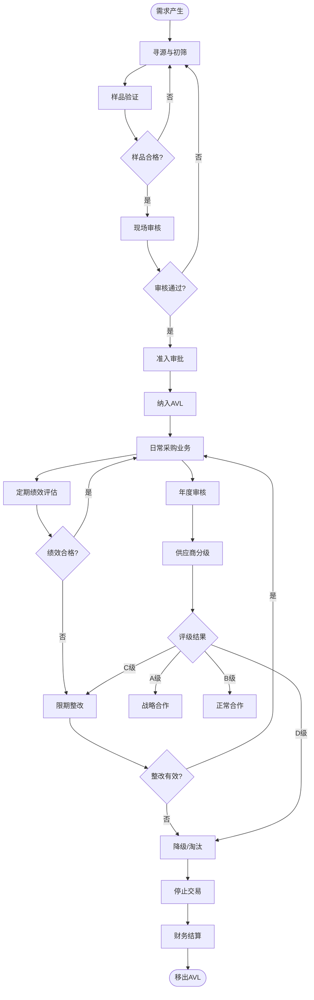

# BIZ-FLOW-P02: 供应商评估流程

**文档编号**：BIZ-FLOW-P02  
**版本**：v1.0  
**创建日期**：2026年1月5日  
**更新日期**：2026年1月5日  
**文档状态**：已发布  
**业务域**：采购域  
**优先级**：🟠 P1（高）

---

## 一、流程概述

### 1.1 基本信息

- **流程名称**：供应商评估流程（Supplier Evaluation & Management）
- **流程编号**：BIZ-FLOW-P02
- **起点**：新供应商引入申请 / 定期评估周期到达
- **终点**：供应商状态更新（合格/淘汰/升级）
- **业务目标**：
  - 建立科学的供应商准入机制，从源头控制风险
  - 通过定期绩效评估，推动供应商持续改进
  - 优化供应商结构，培育战略合作伙伴
  - 确保供应链的稳定性、合规性和竞争力

### 1.2 适用范围

- **适用公司**：全集团（A公司研发采购、B公司生产采购）
- **适用部门**：采购部、质量部、研发部、生产部、财务部
- **适用对象**：原材料供应商、外协加工商、关键设备供应商、服务提供商

### 1.3 流程类型

- **流程性质**：管理支持流程
- **流程频率**：
  - 准入：按需触发
  - 绩效评估：月度/季度
  - 年度审核：每年一次
- **流程复杂度**：中高（涉及多部门评价、现场审核）

---

## 二、角色与职责（RACI矩阵）

| 流程阶段 | 采购工程师 | 采购经理 | 质量工程师(SQE) | 研发工程师 | 财务人员 | 供应商 |
|---------|-----------|---------|----------------|-----------|---------|-------|
| 寻源与初筛 | R | I | - | C | - | I |
| 准入审核 | R | A | R | C | C | R |
| 样品验证 | I | - | R | R, A | - | R |
| 绩效评估 | R | A | C | C | C | I |
| 现场审核 | R | I | R, A | C | - | R |
| 评级与分类 | R | A | C | - | - | I |
| 退出/淘汰 | R | A | C | I | I | I |

**注释**：

- R (Responsible)：负责执行
- A (Accountable)：最终批准
- C (Consulted)：需要咨询
- I (Informed)：需要知会

---

## 三、流程阶段设计

### 阶段1：供应商准入 (Onboarding)

#### 步骤1.1 寻源与初筛

**触发条件**：

- 新项目研发需求
- 现有供应商产能不足/质量问题
- 降本需求

**执行角色**：采购工程师

**执行步骤**：

1. 市场调研：通过网络、展会、推荐等渠道寻找潜在供应商。
2. 发送【供应商调查表】（RFI）。
3. 初步筛选：
   - 资质审查（营业执照、生产许可证、ISO证书）。
   - 财务状况（注册资本、资信证明）。
   - 产能匹配度。
4. 筛选出3-5家候选供应商。

#### 步骤1.2 样品验证

**执行角色**：研发工程师、SQE

**执行步骤**：

1. 要求候选供应商提供样品。
2. **研发测试**：验证样品性能是否满足技术规格书。
3. **小批量试用**：在产线进行小批量试用（如适用）。
4. 出具【样品承认书】。
   - 合格：进入下一环节。
   - 不合格：反馈问题，要求改进或淘汰。

#### 步骤1.3 现场审核（必要时）

**执行角色**：采购、SQE、研发（组成审核小组）

**执行步骤**：

1. 对关键物料供应商进行现场审核。
2. 依据【供应商审核检查表】进行评分：
   - 质量管理体系（QMS）。
   - 生产现场管理（5S）。
   - 设备维护能力。
   - 研发与技术能力。
   - 社会责任（EHS）。
3. 发布审核报告。
   - 分数≥80：通过。
   - 60≤分数<80：有条件通过（需整改）。
   - 分数<60：不通过。

#### 步骤1.4 准入审批

**执行角色**：采购经理、财务部

**执行步骤**：

1. 收集所有准入资料（调查表、资质、样品报告、审核报告）。
2. 录入供应商主数据（名称、税号、银行账户、付款条款）。
3. 审批通过后，纳入【合格供应商名录】（AVL）。

---

### 阶段2：定期绩效评估 (Performance Evaluation)

#### 步骤2.1 数据收集

**触发条件**：每月/每季度初

**执行角色**：采购工程师

**执行步骤**：

1. 从各业务系统收集上个周期的绩效数据：
   - **质量 (Quality)**：来料合格率、客诉次数（来源：BIZ-FLOW-M02）。
   - **成本 (Cost)**：价格水平、降价幅度。
   - **交付 (Delivery)**：准时交货率、订单响应速度（来源：BIZ-FLOW-P01）。
   - **服务 (Service)**：配合度、售后服务、技术支持。

#### 步骤2.2 评分与排名

**执行角色**：采购工程师

**评分模型（示例）**：

- **质量 (40%)**：
  - 批次合格率 > 98% 得满分，每降1%扣5分。
  - 重大质量事故直接0分。
- **成本 (30%)**：
  - 价格低于市场平均价得满分。
  - 配合年度降本目标。
- **交付 (20%)**：
  - 准时交货率 100% 得满分。
- **服务 (10%)**：
  - 主观评价（采购、研发、质量部门打分）。

**执行步骤**：

1. 计算每家供应商的总分。
2. 按物料类别进行排名。
3. 生成【供应商绩效评估报告】。

#### 步骤2.3 结果反馈

**执行角色**：采购工程师

**执行步骤**：

1. 将评估结果发送给供应商。
2. 对于得分低（如<70分）的供应商，发出【整改通知书】。
3. 要求供应商提交改进计划。

---

### 阶段3：年度审核与分级 (Annual Audit & Classification)

#### 步骤3.1 年度现场审核

**触发条件**：每年一次

**执行角色**：审核小组

**执行步骤**：

1. 制定年度审核计划，覆盖主要供应商。
2. 实施现场审核（流程同1.3）。
3. 重点关注上年度问题的整改情况。

#### 步骤3.2 供应商分级

**执行角色**：采购经理

**执行步骤**：

1. 结合定期绩效和年度审核结果，对供应商进行分级：

| 级别 | 名称 | 定义 | 策略 |
|-----|------|------|------|
| **A级** | 战略供应商 | 绩效优秀，技术领先，合作紧密 | 优先分配份额，联合研发，高层互访 |
| **B级** | 合格供应商 | 绩效良好，无重大问题 | 维持现有份额，定期监控 |
| **C级** | 待改进供应商 | 绩效一般，偶有质量/交付问题 | 减少份额，限期整改，寻找备选 |
| **D级** | 淘汰供应商 | 绩效差，整改无效，或有重大违规 | 停止采购，启动退出流程 |

2. 更新系统中的供应商等级状态。

---

### 阶段4：供应商退出 (Exit)

#### 步骤4.1 退出触发

**触发条件**：

- 评级为D级。
- 发生重大质量/安全事故。
- 供应商破产或停止经营。
- 业务策略调整（不再需要该类物料）。

#### 步骤4.2 退出执行

**执行角色**：采购经理

**执行步骤**：

1. 冻结供应商账号（禁止下达新订单）。
2. 处理未结订单（取消或加速交付）。
3. 处理库存（退货或买断）。
4. 财务结算（结清应付款，扣除违约金）。
5. 移出合格供应商名录。

---

## 四、流程图

### 4.1 供应商全生命周期管理流程

---

## 五、关键控制点

### 5.1 控制点清单

| 控制点 | 风险描述 | 控制措施 | 责任人 |
|-------|---------|---------|--------|
| **资质审查** | 引入皮包公司或无资质企业 | 必须查验原件，通过第三方征信查询 | 采购工程师 |
| **样品验证** | 样品是"金样"，量产不行 | 必须进行小批量试产验证，封样管理 | 研发/SQE |
| **现场审核** | 审核走过场 | 使用标准检查表，审核员需有资质，保留证据 | SQE |
| **绩效评估** | 评分主观，不公正 | 尽量使用系统客观数据，多部门联合打分 | 采购经理 |
| **供应商主数据** | 银行账户错误导致资金损失 | 修改敏感信息需双人复核，财务独立验证 | 财务部 |

---

## 六、异常处理

### 6.1 常见异常场景

#### 场景1：独家供应商绩效差

**触发**：某关键物料只有一家供应商，但其质量/交付持续不达标。

**处理流程**：

1. **高层约谈**：采购总监/总经理约谈供应商高层，施加压力。
2. **驻厂帮扶**：派遣技术/质量人员驻厂，帮助其改进。
3. **开发备选**：研发部门立即启动替代物料/替代方案的验证（即使成本较高）。
4. **战略储备**：在替代方案未成熟前，增加安全库存，防止断供。

#### 场景2：供应商突然破产/断供

**触发**：突发事件导致供应商无法供货。

**处理流程**：

1. **启动应急预案**。
2. **抢货**：立即派人到供应商工厂/仓库抢运现有库存。
3. **寻找现货**：在市场上寻找贸易商现货。
4. **快速准入**：对新供应商启动"绿色通道"，简化准入流程（先供货后补手续）。

---

## 七、绩效指标（KPI）

| 指标名称 | 定义 | 计算公式 | 目标值 |
|---------|------|---------|--------|
| **合格供应商覆盖率** | 采购额在合格供应商中的占比 | 合格供应商采购额 / 总采购额 | 100% |
| **新供应商准入及时率** | 按计划时间完成准入 | 按时完成数 / 总准入数 | ≥95% |
| **供应商绩效考核覆盖率** | 参与考核的供应商比例 | 考核家数 / 活跃供应商总数 | 100% |
| **供应商质量合格率** | 供应商来料质量水平 | 见BIZ-FLOW-M02 | ≥98% |
| **供应商准时交货率** | 供应商交付能力 | 见BIZ-FLOW-P01 | ≥95% |

---

## 八、与其他流程的接口

### 8.1 上游流程

| 上游流程 | 接口点 | 输入数据 |
|---------|--------|---------|
| **研发立项到转移** (BIZ-FLOW-R01) | 新物料需求 | 技术规格书、图纸 |
| **生产计划到交付** (BIZ-FLOW-M01) | 产能需求 | 预测产量 |

### 8.2 下游流程

| 下游流程 | 接口点 | 输出数据 |
|---------|--------|---------|
| **采购订单到付款** (BIZ-FLOW-P01) | 采购执行 | 合格供应商名单、价格协议 |
| **质量检验流程** (BIZ-FLOW-M02) | 质量数据 | 来料检验报告、客诉记录 |

---

## 九、流程优化建议

### 9.1 短期优化

1. **电子化档案**：将所有供应商纸质档案扫描归档，建立电子档案库。
2. **定期复盘**：每季度召开供应商质量会议，通报问题，表彰优秀。

### 9.2 中期优化

1. **SRM系统**：实施供应商关系管理（SRM）系统，实现供应商门户，在线进行询报价、订单协同、绩效查询。
2. **风险雷达**：建立供应商风险监控机制，监控其法律诉讼、经营异常等外部风险信息。

### 9.3 长期优化

1. **供应链协同**：与核心供应商实现库存、计划数据的实时共享（VMI - 供应商管理库存）。
2. **联合创新**：邀请供应商参与早期研发（ESI），利用供应商的技术能力降低成本、缩短开发周期。

---

## 十、附录

### 10.1 相关表单

| 表单名称 | 编号 | 用途 |
|---------|------|------|
| 供应商调查表 | FRM-PUR-001 | 初步了解 |
| 供应商审核检查表 | FRM-PUR-002 | 现场审核评分 |
| 样品承认书 | FRM-PUR-003 | 样品确认 |
| 供应商准入申请单 | FRM-PUR-004 | 准入审批 |
| 供应商绩效评估表 | FRM-PUR-005 | 定期评分 |
| 供应商整改通知书 | FRM-PUR-006 | 要求改进 |

### 10.2 术语表

| 术语 | 全称 | 解释 |
|-----|------|------|
| AVL | Approved Vendor List | 合格供应商名录 |
| SQE | Supplier Quality Engineer | 供应商质量工程师 |
| QCDS | Quality, Cost, Delivery, Service | 质量、成本、交付、服务（评估维度） |
| RFI | Request for Information | 信息征询书 |
| ESI | Early Supplier Involvement | 供应商早期参与 |
| VMI | Vendor Managed Inventory | 供应商管理库存 |

### 10.3 参考文档

- ISO 9001 采购控制程序
- 供应商审核规范
- 廉洁采购协议

---

**文档版本历史**：

| 版本 | 日期 | 修改人 | 修改内容 |
|-----|------|--------|---------|
| v1.0 | 2026-01-05 | 系统 | 初始版本，定义供应商全生命周期管理 |

---

**审批记录**：

| 角色 | 姓名 | 审批意见 | 日期 |
|-----|------|---------|------|
| 流程Owner | 待定 | 待审批 | - |
| 采购经理 | 待定 | 待审批 | - |
| 质量经理 | 待定 | 待审批 | - |
| 财务总监 | 待定 | 待审批 | - |

---

**最后更新**：2026年1月5日
