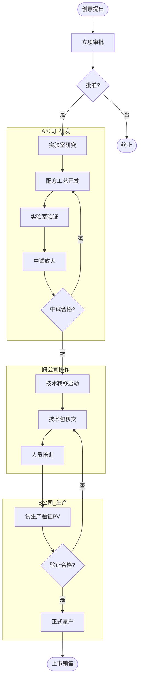

# BIZ-FLOW-R01: 研发立项到技术转移

**文档编号**：BIZ-FLOW-R01  
**版本**：v1.0  
**创建日期**：2026年1月5日  
**更新日期**：2026年1月5日  
**文档状态**：已发布  
**业务域**：研发域  
**优先级**：🟠 P1（高）

---

## 一、流程概述

### 1.1 基本信息

- **流程名称**：研发立项到技术转移（R&D Project to Tech Transfer）
- **流程编号**：BIZ-FLOW-R01
- **起点**：新产品/新技术创意提出
- **终点**：技术转移完成，正式量产
- **业务目标**：
  - 规范研发项目管理，确保研发方向符合公司战略
  - 提高研发成功率，缩短上市周期（TTM）
  - 确保技术转移的完整性和准确性，实现从实验室到工厂的平滑过渡
  - 保护核心知识产权（IP），实现A公司（研发）与B公司（生产）的数据隔离与受控交互

### 1.2 适用范围

- **适用公司**：A公司（研发主体）、B公司（生产主体）
- **适用部门**：研发部、市场部、生产技术部、质量部、注册部
- **适用场景**：
  - 新产品开发
  - 重大工艺改进
  - 原材料替代研究

### 1.3 流程类型

- **流程性质**：核心创新流程
- **流程频率**：中频（按项目周期）
- **流程复杂度**：极高（跨公司协作、长周期、高不确定性）

---

## 二、角色与职责（RACI矩阵）

| 流程阶段 | 项目经理(PM) | 研发工程师 | 市场经理 | 研发总监 | 生产技术经理(B公司) | 质量经理 | 总经理 |
|---------|-------------|-----------|---------|---------|-------------------|---------|-------|
| 创意与立项 | R | C | R | A | I | - | A |
| 实验室研究 | A | R | I | C | - | - | I |
| 小试/中试 | R | R | I | A | C | C | I |
| 技术转移 | R | R | - | A | R, A | C | I |
| 试生产验证 | C | C | - | I | R, A | R | - |
| 项目验收 | R | C | C | A | C | C | A |

**注释**：

- R (Responsible)：负责执行
- A (Accountable)：最终批准
- C (Consulted)：需要咨询
- I (Informed)：需要知会

---

## 三、流程阶段设计

### 阶段1：立项管理 (Project Initiation)

#### 步骤1.1 需求分析与创意筛选

**触发条件**：

- 市场需求调研
- 客户定制需求
- 技术发展趋势

**执行角色**：市场经理、研发总监

**执行步骤**：

1. 收集新产品创意。
2. 进行初步市场分析（市场规模、竞争对手、价格预期）。
3. 进行初步技术可行性评估。
4. 筛选出高价值创意，形成【项目建议书】。

#### 步骤1.2 可行性研究

**执行角色**：项目经理（预备）

**执行步骤**：

1. **技术可行性**：现有技术储备是否足够？是否需要外部合作？
2. **经济可行性**：预估研发投入、生产成本、投资回报率（ROI）。
3. **法规可行性**：是否符合环保、安全、行业法规要求。
4. **知识产权分析**：是否存在侵权风险（FTO分析）。

#### 步骤1.3 立项审批

**执行角色**：研发总监、总经理

**执行步骤**：

1. 召开立项评审会。
2. 评审项目建议书和可行性报告。
3. 批准立项，任命项目经理，分配预算和资源。
4. 签发【项目任务书】（Project Charter）。

**输出**：

- 项目任务书
- 预算计划
- 项目进度计划

---

### 阶段2：实验室研究 (Lab Research)

**适用范围**：A公司内部（严格保密）

#### 步骤2.1 配方与工艺开发

**执行角色**：研发工程师

**执行步骤**：

1. **文献调研**：查阅专利、文献。
2. **实验设计**（DoE）：设计实验方案。
3. **实验执行**：
   - 原材料筛选。
   - 配方调整。
   - 工艺参数摸索（温度、压力、时间）。
4. **数据记录**：
   - 在电子实验记录本（ELN）中实时记录实验数据。
   - **关键控制**：数据必须真实、完整、不可篡改。
5. **样品检测**：对实验室样品进行性能测试。

#### 步骤2.2 实验室验证

**执行角色**：研发工程师

**执行步骤**：

1. 重复实验，验证工艺的重现性。
2. 确定初步的【工艺规程】和【质量标准】。
3. 编制【实验室研究报告】。

**输出**：

- 实验记录（ELN归档）
- 实验室研究报告
- 初步BOM和工艺路线

---

### 阶段3：中试放大 (Pilot Scale-up)

**适用范围**：A公司中试车间 或 B公司中试车间（需授权）

#### 步骤3.1 中试准备

**执行角色**：项目经理

**执行步骤**：

1. 制定【中试方案】。
2. 准备中试设备（通常为生产设备的1/10或1/100）。
3. 采购中试物料。
4. 进行安全风险评估（HAZOP）。

#### 步骤3.2 中试执行

**执行角色**：研发工程师、工艺员

**执行步骤**：

1. 按中试方案进行投料生产。
2. 观察放大效应（如传热、传质差异）。
3. 调整工艺参数，适应设备特性。
4. 连续进行3批次以上中试，验证稳定性。

#### 步骤3.3 中试总结

**执行角色**：项目经理

**执行步骤**：

1. 检测中试产品质量。
2. 分析收率、能耗、成本。
3. 修正工艺规程和质量标准。
4. 编制【中试总结报告】。
5. 评审通过后，准备技术转移。

**输出**：

- 中试总结报告
- 修正后的工艺包

---

### 阶段4：技术转移 (Tech Transfer)

**适用范围**：从A公司转移至B公司

#### 步骤4.1 转移启动

**触发条件**：中试评审通过

**执行角色**：项目经理（A公司）、生产技术经理（B公司）

**执行步骤**：

1. 成立技术转移小组（双方人员组成）。
2. 签订【技术转移协议】（明确IP归属、保密义务、费用结算）。
3. 制定【技术转移计划】。

#### 步骤4.2 技术包移交

**执行角色**：研发工程师

**移交内容（技术包）**：

1. **产品类**：产品规格书、BOM、质量标准（成品/半成品/原料）。
2. **工艺类**：生产工艺规程（Master Formula）、批生产记录模板、工艺流程图（PFD/PID）。
3. **检验类**：检验方法验证报告、检验操作规程（SOP）。
4. **设备类**：设备选型要求、工装模具图纸。
5. **安全类**：MSDS、安全操作规程。

**关键控制**：

- 资料必须经过A公司内部审批。
- 移交过程需有签收记录。
- 确保B公司接收人员理解资料内容（进行培训）。

#### 步骤4.3 试生产验证 (PV)

**执行角色**：B公司生产部、A公司技术支持

**执行步骤**：

1. **设备调试**：B公司生产设备准备就绪。
2. **试生产**：在B公司正式生产线上进行试生产（通常3批）。
3. **现场指导**：A公司研发人员现场跟班，解决突发问题。
4. **过程确认**：确认B公司设备和人员能稳定重现A公司的工艺。
5. **产品验证**：对试生产产品进行全项检验，并进行稳定性考察。

**输出**：

- 技术转移报告
- 试生产验证报告
- 双方签字确认的正式生产文件

---

### 阶段5：项目验收与上市

#### 步骤5.1 项目验收

**执行角色**：研发总监、总经理

**执行步骤**：

1. 审查技术转移是否完成。
2. 审查产品质量是否达标。
3. 审查成本是否符合预算。
4. 批准项目结项。

#### 步骤5.2 正式量产

**执行角色**：B公司生产部

**执行步骤**：

1. 将试生产文件转化为正式受控文件。
2. 纳入B公司日常生产计划（进入BIZ-FLOW-M01流程）。
3. 持续进行工艺维护和改进。

---

## 四、流程图

### 4.1 研发到量产全流程图

---

## 五、关键控制点

### 5.1 控制点清单

| 控制点 | 风险描述 | 控制措施 | 责任人 |
|-------|---------|---------|--------|
| **立项评审** | 研发方向错误，浪费资源 | 严格的市场和技术可行性分析，高层决策 | 研发总监 |
| **实验记录** | 数据造假，无法追溯 | 使用ELN系统，开启审计追踪，禁止随意修改 | 研发工程师 |
| **中试放大** | 放大效应导致失败 | 循序渐进放大（1L→10L→100L），充分验证 | 项目经理 |
| **技术转移** | 信息传递失真 | 标准化的技术包，现场培训，双方签字确认 | 双方经理 |
| **知识产权** | 技术泄密 | 严格的权限控制，A/B公司物理和网络隔离 | IT/法务 |

---

## 六、异常处理

### 6.1 常见异常场景

#### 场景1：中试放大失败

**触发**：实验室做出的产品很好，中试设备上做不出来。

**处理流程**：

1. 暂停中试。
2. 成立攻关小组，对比实验室和中试的差异（设备结构、搅拌方式、传热效率）。
3. 回归实验室进行模拟实验。
4. 调整工艺参数或改进设备。
5. 重新进行中试。

#### 场景2：B公司试生产质量不稳定

**触发**：技术转移后，B公司生产的产品批次间差异大。

**处理流程**：

1. A公司技术人员驻厂调查。
2. 检查B公司是否严格执行SOP。
3. 检查原材料是否有变化（供应商差异）。
4. 检查设备状态。
5. 找到原因后，可能需要修订工艺范围（放宽或收窄），或对B公司人员进行再培训。

---

## 七、绩效指标（KPI）

| 指标名称 | 定义 | 计算公式 | 目标值 |
|---------|------|---------|--------|
| **研发周期** | 从立项到技术转移的时间 | 转移完成日 - 立项日 | 符合计划 |
| **技术转移成功率** | 一次性通过试生产验证的比例 | 通过项目数 / 总转移项目数 | ≥90% |
| **研发预算执行率** | 实际投入与预算的偏差 | |实际-预算| / 预算 | ≤10% |
| **新产品贡献率** | 新产品销售收入占比 | 新产品收入 / 总收入 | ≥30% |
| **专利申请数** | 知识产权产出 | 申请/授权专利数量 | 符合目标 |

---

## 八、与其他流程的接口

### 8.1 上游流程

| 上游流程 | 接口点 | 输入数据 |
|---------|--------|---------|
| **市场需求分析** | 立项 | 市场需求、竞品分析 |
| **供应商评估** (BIZ-FLOW-P02) | 原材料选型 | 合格供应商名单 |

### 8.2 下游流程

| 下游流程 | 接口点 | 输出数据 |
|---------|--------|---------|
| **生产计划到交付** (BIZ-FLOW-M01) | 正式量产 | BOM、工艺路线、SOP |
| **质量检验流程** (BIZ-FLOW-M02) | 质量控制 | 检验标准、检验方法 |
| **采购订单到付款** (BIZ-FLOW-P01) | 原材料采购 | 采购规格书 |

---

## 九、流程优化建议

### 9.1 短期优化

1. **模板标准化**：统一A公司和B公司的技术文件模板，减少转换工作量。
2. **视频SOP**：对于复杂操作，录制视频教程作为技术包的一部分，比文字更直观。

### 9.2 中期优化

1. **PLM系统**：引入产品生命周期管理（PLM）系统，管理从配方到BOM的变更，确保数据一致性。
2. **QbD（质量源于设计）**：在研发阶段引入QbD理念，确定关键工艺参数（CPP）和关键质量属性（CQA），提高工艺稳健性。

### 9.3 长期优化

1. **数字化孪生**：建立生产线的数字孪生模型，在虚拟环境中进行放大模拟，减少实物中试次数。
2. **知识库建设**：建立研发知识库，沉淀失败案例和成功经验，避免重复错误。

---

## 十、附录

### 10.1 相关表单

| 表单名称 | 编号 | 用途 |
|---------|------|------|
| 项目建议书 | FRM-RD-001 | 立项申请 |
| 项目任务书 | FRM-RD-002 | 立项授权 |
| 实验记录模板 | FRM-RD-003 | 实验记录 |
| 中试方案 | FRM-RD-004 | 中试计划 |
| 技术转移协议 | FRM-RD-005 | 跨公司转移 |
| 试生产验证报告 | FRM-RD-006 | 验证总结 |

### 10.2 术语表

| 术语 | 全称 | 解释 |
|-----|------|------|
| ELN | Electronic Lab Notebook | 电子实验记录本 |
| BOM | Bill of Materials | 物料清单 |
| SOP | Standard Operating Procedure | 标准操作规程 |
| PV | Process Validation | 工艺验证 |
| TTM | Time to Market | 上市时间 |
| FTO | Freedom to Operate | 自由实施（专利侵权分析） |
| QbD | Quality by Design | 质量源于设计 |

### 10.3 参考文档

- ICH Q8 药品研发
- ICH Q9 质量风险管理
- ICH Q10 药品质量体系

---

**文档版本历史**：

| 版本 | 日期 | 修改人 | 修改内容 |
|-----|------|--------|---------|
| v1.0 | 2026-01-05 | 系统 | 初始版本，定义研发到技术转移流程 |

---

**审批记录**：

| 角色 | 姓名 | 审批意见 | 日期 |
|-----|------|---------|------|
| 流程Owner | 待定 | 待审批 | - |
| 研发总监 | 待定 | 待审批 | - |
| 生产总监 | 待定 | 待审批 | - |
| 总经理 | 待定 | 待审批 | - |

---

**最后更新**：2026年1月5日
