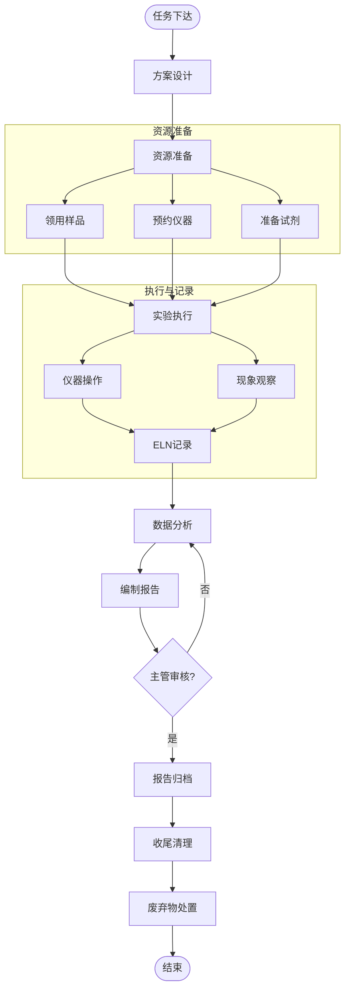

# BIZ-FLOW-R02: 实验管理流程

**文档编号**：BIZ-FLOW-R02  
**版本**：v1.0  
**创建日期**：2026年1月5日  
**更新日期**：2026年1月5日  
**文档状态**：已发布  
**业务域**：研发域  
**优先级**：🟠 P1（高）

---

## 一、流程概述

### 1.1 基本信息

- **流程名称**：实验管理流程（Laboratory Management Process）
- **流程编号**：BIZ-FLOW-R02
- **起点**：实验任务下达
- **终点**：实验报告归档
- **业务目标**：
  - 规范实验室日常操作，确保实验数据的真实性、完整性和可追溯性
  - 提高实验室资源（人员、设备、耗材）的利用效率
  - 确保实验室安全（EHS），合规处理危险废弃物
  - 支持研发项目（BIZ-FLOW-R01）的高效推进

### 1.2 适用范围

- **适用公司**：A公司（研发中心）
- **适用部门**：研发部、分析测试中心
- **涉及对象**：实验任务、样品、试剂耗材、仪器设备、实验数据

### 1.3 流程类型

- **流程性质**：日常运营流程
- **流程频率**：极高（每日多次）
- **流程复杂度**：中（操作细节多，合规要求高）

---

## 二、角色与职责（RACI矩阵）

| 流程阶段 | 研发工程师 | 实验员 | 实验室主管 | 设备管理员 | 样品管理员 | EHS专员 |
|---------|-----------|-------|-----------|-----------|-----------|--------|
| 任务分配 | R | I | A | - | - | - |
| 样品领用 | R | R | - | - | A | - |
| 实验执行 | R | R | C | I | - | C |
| 数据记录 | R | R | C | - | - | - |
| 报告编制 | R | C | A | - | - | - |
| 废弃物处理 | R | R | I | - | - | A |

**注释**：

- R (Responsible)：负责执行
- A (Accountable)：最终批准
- C (Consulted)：需要咨询
- I (Informed)：需要知会

---

## 三、流程阶段设计

### 阶段1：实验准备 (Preparation)

#### 步骤1.1 任务分配

**触发条件**：研发项目计划（BIZ-FLOW-R01）或临时测试需求

**执行角色**：实验室主管、研发工程师

**执行步骤**：

1. 主管根据项目进度，创建【实验任务单】。
2. 指定负责人（研发工程师）和执行人（实验员）。
3. 明确实验目的、截止时间、所需资源。

#### 步骤1.2 方案设计

**执行角色**：研发工程师

**执行步骤**：

1. 查阅文献和过往数据。
2. 设计实验方案（DoE）：
   - 变量设置（温度、配比等）。
   - 检测指标。
   - 预期结果。
3. 确认SOP（标准操作规程）是否适用，如无则起草临时方案。

#### 步骤1.3 资源准备与领用

**执行角色**：实验员、研发工程师

**资源分类与归属**：

- **研发电脑/工作站**：归属 **IT部** 管理。领用/归还走 BIZ-FLOW-I01 流程。
- **实验仪器/设备**（如色谱仪、测试台）：归属 **设备部/实验室** 统一管理。维护/校准走 BIZ-FLOW-M04 流程。
- **实验耗材**（试剂、元器件）：归属 **实验室** 管理。领用走本流程，采购走 BIZ-FLOW-P01 流程。

**执行步骤**：

1. **样品领用**：向样品管理员申请，填写《样品流转单》。
2. **仪器预约**：在实验室管理系统（LIMS）或台账上预约使用时间。
3. **耗材准备**：从危化品柜/材料柜领取所需试剂，记录领用台账。
4. **环境确认**：检查温湿度、通风橱等环境条件是否达标。

---

### 阶段2：实验执行 (Execution)

#### 步骤2.1 样品领用与预处理

**执行角色**：实验员、样品管理员

**执行步骤**：

1. 提交【样品领用单】。
2. 样品管理员核对样品名称、批号、有效期。
3. 称量/分装样品，记录领用量。
4. 对样品进行预处理（如研磨、溶解、干燥）。

#### 步骤2.2 仪器使用

**执行角色**：实验员

**执行步骤**：

1. **开机检查**：检查仪器状态，确认在校准有效期内。
2. **使用登记**：扫描仪器二维码或填写【仪器使用记录本】。
3. **运行实验**：按SOP操作仪器，设置参数。
4. **异常处理**：如遇报警，立即停机，通知设备管理员。

#### 步骤2.3 过程记录

**执行角色**：实验员

**执行步骤**：

1. 实时记录实验现象（颜色变化、沉淀、气泡等）。
2. 记录关键参数（实际温度、实际称样量）。
3. **工具**：使用电子实验记录本（ELN）或受控纸质记录本。
   - **原则**：ALCOA+原则（Attributable, Legible, Contemporaneous, Original, Accurate）。

---

### 阶段3：数据处理与报告 (Data & Report)

#### 步骤3.1 数据采集与分析

**执行角色**：研发工程师

**执行步骤**：

1. 导出仪器原始数据（谱图、数据表）。
2. 进行数据处理（积分、计算含量）。
3. 分析数据趋势，与预期结果对比。

#### 步骤3.2 报告编制

**执行角色**：研发工程师

**执行步骤**：

1. 撰写【实验报告】。
2. 内容包括：
   - 实验目的
   - 实验方法（引用SOP）
   - 实验结果（数据表、图表）
   - 结论与建议
3. 关联原始数据文件路径。

#### 步骤3.3 报告审核

**执行角色**：实验室主管

**执行步骤**：

1. 审核数据的逻辑性。
2. 审核结论是否合理。
3. 批准报告，归档至知识库。

---

### 阶段4：收尾与清理 (Cleanup)

#### 步骤4.1 样品处置

**执行角色**：实验员

**执行步骤**：

1. **余样退库**：未用完的贵重样品退回样品库。
2. **留样**：产出的中间体/成品按规定留样。
3. **报废**：无用样品按废弃物处理。

#### 步骤4.2 废弃物处理

**执行角色**：实验员、EHS专员

**执行步骤**：

1. **分类收集**：
   - 有机废液（卤代/非卤代）
   - 无机废液（酸/碱/重金属）
   - 固体废物（沾染毒物的耗材）
   - 锐器（针头、碎玻璃）
2. **贴标**：粘贴危险废物标签，注明成分和产生日期。
3. **移交**：定期移交至危废暂存间，由EHS专员联系有资质的第三方处理。

#### 步骤4.3 现场清理

**执行角色**：实验员

**执行步骤**：

1. 清洗玻璃器皿。
2. 清洁实验台面。
3. 归还公用工具。
4. 填写【实验室清洁记录】。

---

## 四、流程图

### 4.1 实验全流程图

---

## 五、关键控制点

### 5.1 控制点清单

| 控制点 | 风险描述 | 控制措施 | 责任人 |
|-------|---------|---------|--------|
| **试剂效期** | 使用过期试剂导致数据不准 | 领用前核对效期，定期清理过期试剂 | 实验员 |
| **仪器校准** | 仪器偏差导致结果错误 | 贴"校准合格"标签，超期禁用 | 设备管理员 |
| **数据真实性** | 编造或篡改数据 | ELN审计追踪，禁止删除原始数据 | 实验室主管 |
| **危废处理** | 乱倒废液污染环境 | 严格分类，视频监控，联单管理 | EHS专员 |
| **个人防护** | 实验事故导致人身伤害 | 强制佩戴PPE（眼镜、手套、实验服） | 实验室主管 |

---

## 六、异常处理

### 6.1 常见异常场景

#### 场景1：实验结果异常（OOS - Out of Specification）

**触发**：检测结果超出标准范围。

**处理流程**：

1. **保留现场**：不要倒掉样品和溶液。
2. **初步排查**：检查计算是否有误？仪器是否正常？操作是否失误？
3. **复测**：
   - 原样复测。
   - 重新取样复测。
4. **调查报告**：如确认为实验室偏差（Lab Error），纠正后重新实验；如确认为产品质量问题，报告项目经理。

#### 场景2：仪器突发故障

**触发**：实验中仪器报警或停机。

**处理流程**：

1. 记录故障现象和报错代码。
2. 挂"维修中"标识。
3. 联系厂家维修。
4. 评估对当前实验数据的影响（数据是否有效？）。

---

## 七、绩效指标（KPI）

| 指标名称 | 定义 | 计算公式 | 目标值 |
|---------|------|---------|--------|
| **实验及时完成率** | 按计划时间完成实验 | 按时完成数 / 总任务数 | ≥95% |
| **仪器利用率** | 贵重仪器使用频率 | 实际使用机时 / 可用机时 | ≥60% |
| **实验一次成功率** | 无需返工的实验比例 | 成功实验数 / 总实验数 | ≥90% |
| **安全事故数** | 发生的人身/环境事故 | 次数 | 0 |

---

## 八、与其他流程的接口

### 8.1 上游流程

| 上游流程 | 接口点 | 输入数据 |
|---------|--------|---------|
| **研发立项到转移** (BIZ-FLOW-R01) | 实验需求 | 实验方案、配方 |
| **采购订单到付款** (BIZ-FLOW-P01) | 试剂到货 | 试剂耗材 |

### 8.2 下游流程

| 下游流程 | 接口点 | 输出数据 |
|---------|--------|---------|
| **研发立项到转移** (BIZ-FLOW-R01) | 结果反馈 | 实验报告、工艺参数 |
| **知识管理** | 沉淀 | 实验数据、经验教训 |

---

## 九、流程优化建议

### 9.1 短期优化

1. **5S管理**：定置管理，所有物品有固定位置，减少寻找时间。
2. **看板管理**：使用白板或电子屏显示实验任务进度和仪器状态。

### 9.2 中期优化

1. **LIMS系统**：引入实验室信息管理系统（LIMS），实现样品条码化管理、仪器自动采集数据。
2. **试剂柜智能化**：使用智能试剂柜，刷卡领用，自动记录库存。

### 9.3 长期优化

1. **自动化实验室**：引入移液工作站、自动进样器，减少人工操作误差。
2. **AI辅助实验**：利用机器学习算法，根据历史数据推荐最优实验条件。

---

## 十、附录

### 10.1 相关表单

| 表单名称 | 编号 | 用途 |
|---------|------|------|
| 实验任务单 | FRM-LAB-001 | 任务分配 |
| 样品领用单 | FRM-LAB-002 | 样品管理 |
| 仪器使用记录 | FRM-LAB-003 | 仪器日志 |
| 实验报告模板 | FRM-LAB-004 | 结果汇总 |
| 废弃物移交单 | FRM-LAB-005 | 危废处理 |

### 10.2 术语表

| 术语 | 全称 | 解释 |
|-----|------|------|
| ELN | Electronic Lab Notebook | 电子实验记录本 |
| SOP | Standard Operating Procedure | 标准操作规程 |
| PPE | Personal Protective Equipment | 个人防护装备 |
| MSDS | Material Safety Data Sheet | 化学品安全技术说明书 |
| OOS | Out of Specification | 检验结果超标 |

### 10.3 参考文档

- CNAS-CL01 检测和校准实验室能力认可准则
- 实验室生物安全手册
- 危险化学品管理条例

---

**文档版本历史**：

| 版本 | 日期 | 修改人 | 修改内容 |
|-----|------|--------|---------|
| v1.0 | 2026-01-05 | 系统 | 初始版本，定义实验室日常管理流程 |

---

**审批记录**：

| 角色 | 姓名 | 审批意见 | 日期 |
|-----|------|---------|------|
| 流程Owner | 待定 | 待审批 | - |
| 实验室主管 | 待定 | 待审批 | - |
| 研发总监 | 待定 | 待审批 | - |

---

**最后更新**：2026年1月5日
