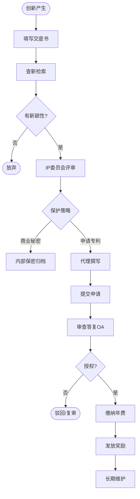

# BIZ-FLOW-R03: 知识产权管理流程

**文档编号**：BIZ-FLOW-R03  
**版本**：v1.0  
**创建日期**：2026年1月5日  
**更新日期**：2026年1月5日  
**文档状态**：已发布  
**业务域**：研发域  
**优先级**：🟡 P1（高）

---

## 一、流程概述

### 1.1 基本信息

- **流程名称**：知识产权管理流程（Intellectual Property Management Process）
- **流程编号**：BIZ-FLOW-R03
- **起点**：创新点挖掘 / 专利提案
- **终点**：专利授权与维护 / 商业秘密保护
- **业务目标**：
  - 保护公司核心技术，构建技术壁垒
  - 规避侵权风险（FTO），保障产品上市安全
  - 提升公司无形资产价值
  - 激励研发人员创新

### 1.2 适用范围

- **适用公司**：A公司（研发中心）、B公司（生产工艺改进）
- **管理对象**：
  - **专利**：发明、实用新型、外观设计。
  - **商标**：品牌Logo、产品名称。
  - **著作权**：软件代码、技术文档。
  - **商业秘密**：配方、工艺参数、客户名单。

### 1.3 流程类型

- **流程性质**：风险与资产管理流程
- **流程频率**：低频（按项目节点触发）
- **流程复杂度**：中高（涉及法律与技术交叉）

---

## 二、角色与职责（RACI矩阵）

| 流程阶段 | 发明人(研发) | IP专员 | 研发总监 | 外部代理所 | 知识产权委员会 |
|---------|-------------|-------|---------|-----------|---------------|
| 提案挖掘 | R | C | I | - | - |
| 查新检索 | I | R | - | C | - |
| 提案评审 | R (答辩) | R (组织) | A | - | A |
| 申请撰写 | C | I | - | R | - |
| 审查答复 | C | R | - | R | - |
| 授权维护 | - | R | - | C | I |
| 侵权预警 | I | R | A | C | I |

**注释**：

- R (Responsible)：负责执行
- A (Accountable)：最终批准
- C (Consulted)：需要咨询
- I (Informed)：需要知会
- **知识产权委员会**：负责IP战略决策和重大争议裁决。

---

## 三、流程阶段设计

### 阶段1：专利挖掘与布局 (Mining & Layout)

#### 步骤1.1 创新点挖掘

**触发条件**：

- 研发项目关键节点（如方案设计完成）。
- 解决了一个技术难题。

**执行角色**：发明人、IP专员

**执行步骤**：

1. IP专员定期参加研发项目会。
2. 引导研发人员识别创新点（如：新结构、新配方、新用途）。
3. 填写【专利提案书】（技术交底书）。

#### 步骤1.2 查新检索

**执行角色**：IP专员

**执行步骤**：

1. 在专利数据库中检索相关技术。
2. 分析现有技术（Prior Art）与本提案的区别。
3. 评估授权前景：
   - 新颖性（Novelty）：是否已被公开？
   - 创造性（Inventiveness）：是否有显著进步？

#### 步骤1.3 提案评审

**执行角色**：知识产权委员会

**执行步骤**：

1. 评审提案价值：
   - 市场价值：是否覆盖核心产品？
   - 法律价值：是否容易维权？
2. **决策**：
   - **申请专利**：进入下一阶段。
   - **作为商业秘密**：不公开，内部严密保护（如：难以反向工程的配方）。
   - **公开防卫**：发表论文，防止对手申请。
   - **放弃**：价值低。

---

### 阶段2：申请与审查 (Application & Prosecution)

#### 步骤2.1 撰写与提交

**执行角色**：外部代理所、IP专员

**执行步骤**：

1. IP专员委托签约代理所。
2. 代理律师撰写申请文件（权利要求书、说明书）。
3. 发明人审核技术准确性。
4. 向专利局（CNIPA/USPTO等）提交申请。

#### 步骤2.2 审查答复 (OA)

**执行角色**：外部代理所、IP专员、发明人

**执行步骤**：

1. 收到审查意见通知书（Office Action）。
2. 分析审查员的驳回理由。
3. 制定答复策略（修改权利要求或争辩）。
4. 提交答复意见。

#### 步骤2.3 授权与奖励

**执行角色**：IP专员、人事部

**执行步骤**：

1. 收到授权通知书，缴纳年费。
2. 获得专利证书。
3. 根据公司制度，向发明人发放【专利奖金】。

---

### 阶段3：风险管控 (Risk Management)

#### 步骤3.1 FTO分析 (Freedom to Operate)

**触发条件**：新产品立项、产品上市前。

**执行角色**：IP专员、外部律师

**执行步骤**：

1. 检索目标市场（如中国、美国）的有效专利。
2. 分析产品是否落入他人专利保护范围。
3. **风险应对**：
   - **无风险**：正常推进。
   - **有风险**：
     - 规避设计（改方案）。
     - 寻求许可/购买。
     - 提起专利无效宣告。

#### 步骤3.2 商业秘密保护

**执行角色**：全员

**执行步骤**：

1. **定密**：标识绝密/机密/秘密文件。
2. **物理隔离**：核心配方/代码仅在涉密区电脑操作，禁止联网/USB。
3. **人员管理**：签署保密协议（NDA），离职脱密。

---

## 四、流程图

### 4.1 专利申请全流程

---

## 五、关键控制点

### 5.1 控制点清单

| 控制点 | 风险描述 | 控制措施 | 责任人 |
|-------|---------|---------|--------|
| **提前公开** | 申请前发表论文或参展，丧失新颖性 | 严格执行“先申请，后公开”原则，参展前必须审核 | 研发总监 |
| **FTO漏检** | 产品上市后被诉侵权，面临巨额赔偿 | 关键节点强制进行FTO分析，由专业机构出具报告 | IP专员 |
| **权利要求过窄** | 专利容易被竞争对手绕开 | 撰写时进行上位概括，布局外围专利形成保护网 | IP专员 |
| **期限管理** | 错过答复或缴费期限导致专利失效 | 使用IP管理系统监控期限，设置多重提醒 | IP专员 |

---

## 六、异常处理

### 6.1 常见异常场景

#### 场景1：发现竞争对手侵权

**触发**：市场上出现仿冒产品。

**处理流程**：

1. 购买侵权产品，进行公证取证。
2. 技术比对，确认是否落入我方专利范围。
3. 发送律师函警告。
4. 提起诉讼或向行政部门投诉。

#### 场景2：核心人员离职

**触发**：掌握核心机密的研发人员辞职。

**处理流程**：

1. 立即冻结IT权限。
2. 进行离职面谈，重申保密义务和竞业限制。
3. 检查其电脑和文件交接情况。
4. 监控其去向，如有侵权嫌疑立即采取法律行动。

---

## 七、绩效指标（KPI）

| 指标名称 | 定义 | 计算公式 | 目标值 |
|---------|------|---------|--------|
| **专利申请量** | 创新活跃度 | 年度提交申请件数 | ≥ 目标值 |
| **专利授权率** | 申请质量 | 授权数 / 结案数 | ≥ 60% |
| **FTO覆盖率** | 风险控制 | 重点项目FTO分析完成率 | 100% |

---

## 八、与其他流程的接口

### 8.1 上游流程

| 上游流程 | 接口点 | 输入数据 |
|---------|--------|---------|
| **研发立项** (BIZ-FLOW-R01) | 查新/FTO | 技术方案 |
| **工艺改进** (BIZ-FLOW-M03) | 新工艺 | 改进点 |

### 8.2 下游流程

| 下游流程 | 接口点 | 输出数据 |
|---------|--------|---------|
| **销售订单到收款** (BIZ-FLOW-S01) | 品牌授权 | 商标使用权 |
| **人力资源** (BIZ-FLOW-H01) | 奖励 | 专利奖金清单 |

---

## 九、流程优化建议

### 9.1 短期优化

1. **专利数据库**：购买专业的专利检索数据库（如智慧芽、IncoPat），提高检索效率。
2. **培训**：定期对研发人员进行专利基础知识培训，教会他们如何写高质量的交底书。

### 9.2 中期优化

1. **专利地图**：绘制竞争对手的专利地图，分析其技术路线和空白点，指导研发方向。
2. **分级管理**：将专利分为核心、重要、一般三级，采取不同的维护策略（核心专利全球布局，一般专利适时放弃）。

### 9.3 长期优化

1. **IP运营**：将闲置专利进行许可或转让，实现知识产权的货币化变现。

---

## 十、附录

### 10.1 相关表单

| 表单名称 | 编号 | 用途 |
|---------|------|------|
| 技术交底书 | FRM-IP-001 | 提案 |
| 专利申请审批表 | FRM-IP-002 | 评审 |
| 专利奖励申请表 | FRM-IP-003 | 奖励 |

### 10.2 术语表

| 术语 | 全称 | 解释 |
|-----|------|------|
| FTO | Freedom to Operate | 自由实施（不侵权分析） |
| OA | Office Action | 审查意见通知书 |
| PCT | Patent Cooperation Treaty | 专利合作条约（国际申请） |

### 10.3 参考文档

- 专利法
- 企业知识产权管理规范 (GB/T 29490)
- 保密制度

---

**文档版本历史**：

| 版本 | 日期 | 修改人 | 修改内容 |
|-----|------|--------|---------|
| v1.0 | 2026-01-05 | 系统 | 初始版本，定义知识产权管理流程 |

---

**审批记录**：

| 角色 | 姓名 | 审批意见 | 日期 |
|-----|------|---------|------|
| 流程Owner | 待定 | 待审批 | - |
| 研发总监 | 待定 | 待审批 | - |
| 总经理 | 待定 | 待审批 | - |

---

**最后更新**：2026年1月5日
