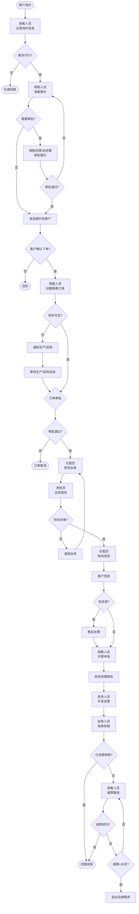

# BIZ-FLOW-S01: 销售订单到收款

**文档编号**：BIZ-FLOW-S01  
**版本**：v1.0  
**创建日期**：2026年1月5日  
**更新日期**：2026年1月5日  
**文档状态**：已发布  
**业务域**：销售域  
**优先级**：🔴 P0（极高）

---

## 一、流程概述

### 1.1 基本信息

- **流程名称**：销售订单到收款（Order to Cash - O2C）
- **流程编号**：BIZ-FLOW-S01
- **起点**：客户询价
- **终点**：收款到账，财务确认完成
- **业务目标**：
  - 快速响应客户需求
  - 确保按时交付产品
  - 及时回收货款，降低坏账风险

### 1.2 适用范围

- **适用公司**：集团所有公司（A公司、B公司）
- **适用部门**：销售部、仓储部、质检部、财务部
- **适用场景**：所有销售业务（标准产品销售、定制产品销售）

### 1.3 流程类型

- **流程性质**：端到端核心业务流程
- **流程频率**：高频（每日多次）
- **流程复杂度**：中等（涉及4个部门协同）

---

## 二、角色与职责（RACI矩阵）

| 流程阶段 | 销售人员 | 销售经理 | 仓管员 | 质检员 | 财务人员 | 财务经理 | 总经理 |
|---------|---------|---------|--------|--------|---------|---------|--------|
| 客户询价 | R | I | - | - | - | - | - |
| 报价审批 | R | A | - | - | C | - | A* |
| 销售订单审批 | R | A | - | - | C | A* | A* |
| 发货准备 | I | - | R | - | - | - | - |
| 质检放行 | I | - | I | R, A | - | - | - |
| 物流发运 | R | I | R | - | - | - | - |
| 客户签收 | R | I | - | - | - | - | - |
| 开票申请 | R | - | - | - | I | A | - |
| 财务开票 | I | - | - | - | R, A | I | - |
| 收款确认 | I | I | - | - | R, A | I | - |
| 催款跟进 | R | A | - | - | I | I | I* |

**注释**：

- R (Responsible)：负责执行
- A (Accountable)：最终批准
- C (Consulted)：需要咨询
- I (Informed)：需要知会
- A*：特定条件下批准（如超限额、超信用额度）
- I*：升级情况下知会

---

## 三、流程阶段设计

### 阶段1：商机管理与报价

#### 步骤1.1 客户询价

**触发条件**：

- 客户通过电话、邮件、微信、现场拜访等方式提出购买需求

**执行角色**：销售人员

**输入**：

- 客户基本信息（公司名称、联系人、联系方式）
- 产品需求（产品类型、规格要求、数量）
- 交货期要求
- 预算范围（可选）

**执行步骤**：

1. 记录客户询价信息到销售线索表
2. 分配唯一询价编号（INQ-YYYYMMDD-XXX）
3. 初步判断需求是否在公司产品范围内
4. 如属于新产品领域，咨询研发部或技术部

**输出**：

- 询价单（记录）
- 初步可行性评估

**决策点**：

- 是否在产品能力范围内？
  - 是 → 进入报价步骤
  - 否 → 礼貌回绝，或转给研发部评估

---

#### 步骤1.2 产品报价

**触发条件**：

- 询价需求确认可行

**执行角色**：销售人员（初步报价），销售经理（审批报价）

**输入**：

- 询价单信息
- 产品标准价格表
- 客户历史合作记录（客户等级、信用状况）
- 市场竞争情况

**执行步骤**：

1. 查询产品标准价格（根据规格、数量）
2. 计算折扣：
   - 根据客户等级（VIP客户、普通客户、新客户）
   - 根据采购数量（批量折扣）
   - 根据市场竞争情况（特殊折扣需审批）
3. 计算运费（根据目的地、重量）
4. 计算总金额：`总价 = (单价 × 数量 × 折扣率) + 运费`
5. 生成报价单文档
6. 提交审批（根据金额和折扣比例）

**审批规则**：

| 报价金额 | 折扣比例 | 审批人 |
|---------|---------|--------|
| < 10万 | 标准折扣 | 销售人员自行报价 |
| < 10万 | 非标准折扣 | 销售经理 |
| ≥ 10万 | 任何折扣 | 总经理 |

**输出**：

- 正式报价单（PDF文档）
- 报价有效期（通常7-15天）

**决策点**：

- 报价是否被审批通过？
  - 通过 → 发送给客户
  - 拒绝 → 调整报价重新提交

---

#### 步骤1.3 销售订单确认

**触发条件**：

- 客户确认接受报价，同意下单

**执行角色**：销售人员

**输入**：

- 客户确认的报价单
- 客户详细信息（收货地址、联系人、联系电话）
- 付款条件协商结果（预付、货到付款、月结等）

**执行步骤**：

1. 创建销售订单
2. 分配唯一订单编号（SO-YYYYMMDD-XXX）
3. 填写订单详细信息：
   - 客户信息
   - 产品明细（编码、名称、规格、数量、单价、金额）
     - *注：若销售类型为“原材料销售”，需确认该物料已在系统维护【销售视图】且赋予【销售价格】。*
   - 收货地址
   - 要求交货日期
   - 付款条件
4. 校验库存可用性：
   - 查询当前库存数量
   - 检查是否有其他订单占用
   - 如库存不足，标注【需生产】或【需采购】，通知生产/采购部门
5. 校验客户信用额度（对于月结客户）：
   - 当前应收账款余额 + 本单金额 ≤ 客户信用额度
   - 如超限，需财务经理审批
6. 提交订单审批

**审批规则**：

| 订单类型 | 审批人 |
|---------|--------|
| 常规订单（库存充足、信用额度内） | 销售经理 |
| 超信用额度订单 | 财务经理 + 销售经理 |
| 特殊折扣订单 | 总经理 |
| 需生产/采购订单 | 销售经理 + 生产/采购经理 |

**输出**：

- 审批通过的销售订单
- 自动触发生产计划（如需生产）
- 自动触发采购需求（如需采购）

**决策点**：

- 库存是否充足？
  - 是 → 进入发货流程
  - 否 → 等待生产/采购完成
- 信用额度是否超限？
  - 否 → 正常流程
  - 是 → 需财务经理审批

---

### 阶段2：发货出库

#### 步骤2.1 发货准备

**触发条件**：

- 销售订单审批通过
- 库存充足（或生产完成入库）
- 如需预付款，已收到预付款

**执行角色**：仓管员

**输入**：

- 审批通过的销售订单
- 库存信息（可用库存、库位）

**执行步骤**：

1. 接收系统发货通知（或查看待发货订单列表）
2. 核对订单信息：
   - 产品规格是否正确
   - 数量是否可满足
   - 客户地址是否完整
3. 前置检查：
   - 如为预付订单，确认已收款
   - 检查产品库存状态（是否在检验中、是否冻结）
4. 生成拣货任务

**输出**：

- 拣货任务单

**决策点**：

- 预付款是否到账（如需）？
  - 是 → 继续发货
  - 否 → 暂停，通知销售人员催款

---

#### 步骤2.2 拣货出库

**触发条件**：

- 拣货任务生成

**执行角色**：仓管员

**输入**：

- 拣货任务单
- 库位信息

**执行步骤**：

1. 根据拣货单到指定库位拣货
2. 核对产品信息（编码、规格、批次）
3. 记录实际拣货数量
4. 记录批次号（用于追溯）
5. 扣减库存：
   - 系统中库存可用量减少
   - 生成出库单编号（DN-YYYYMMDD-XXX）
6. 将产品移至发货区

**输出**：

- 出库单（记录）
- 待检验产品

**异常处理**：

- 如拣货时发现数量不足：通知生产/采购，协商交货期
- 如发现产品损坏：拒绝出库，通知质量部

---

#### 步骤2.3 出货质检

**触发条件**：

- 拣货完成，产品移至发货区

**执行角色**：质检员

**输入**：

- 待发货产品
- 产品质量标准
- 销售订单（客户要求）

**执行步骤**：

1. 执行出货检验（FQC - Final Quality Control）
2. 检验内容：
   - 产品规格是否与订单一致
   - 外观是否完好（无破损、污染、变色）
   - 包装是否符合标准（密封、标签、说明书）
   - 数量核对
3. 记录检验结果
4. 做出判定

**判定规则**：

| 检验结果 | 判定 | 后续动作 |
|---------|------|---------|
| 全部合格 | 放行 | 允许发货 |
| 部分不合格（轻微） | 让步放行（需批准） | 联系销售，征得客户同意 |
| 严重不合格 | 拒绝发货 | 退回仓库，通知生产部门 |

**输出**：

- 检验报告
- 放行标签（贴在产品上）

**决策点**：

- 检验是否合格？
  - 合格 → 允许发货
  - 不合格 → 退回仓库，重新备货

---

#### 步骤2.4 物流发运

**触发条件**：

- 质检放行

**执行角色**：仓管员、销售人员（协助）

**输入**：

- 检验合格的产品
- 客户收货地址信息
- 承运商清单（合作物流公司）

**执行步骤**：

1. 选择承运商（根据目的地、货物类型、成本）
2. 打包装箱：
   - 按照包装标准打包
   - 粘贴发货标签（客户名称、地址、联系人、电话）
   - 粘贴"小心轻放"、"防潮"等标识（如需）
3. 联系物流公司上门取货
4. 交接货物给物流公司
5. 获取运单号（跟踪号）
6. 记录发货信息：
   - 承运商名称
   - 运单号
   - 发货时间
   - 预计到达时间
7. 生成发货单（Delivery Note）
8. 通知客户发货：
   - 发送短信/邮件给客户
   - 提供运单号，方便查询物流状态
   - 附上发货单PDF

**输出**：

- 发货单（给客户、给财务各一份）
- 运单号（物流跟踪）

---

#### 步骤2.5 客户签收

**触发条件**：

- 物流送达客户处

**执行角色**：销售人员（跟进）

**输入**：

- 物流配送状态（通过物流公司网站查询）
- 客户反馈

**执行步骤**：

1. 跟踪物流状态（预计到达日主动联系客户）
2. 确认客户签收：
   - 签收人姓名
   - 签收时间
   - 签收数量
3. 询问客户是否有异常（破损、缺货、错货）
4. 更新销售订单状态为"已签收"

**输出**：

- 签收确认记录

**异常处理**：

| 异常情况 | 处理方式 |
|---------|---------|
| 破损 | 拍照留证，联系物流公司，必要时补发货 |
| 缺货 | 核查出库记录，如确实少发，立即补发 |
| 错货 | 安排退货，重新发正确产品 |
| 拒收 | 了解原因，协商解决或退货 |

**决策点**：

- 是否有异常？
  - 无 → 进入开票流程
  - 有 → 创建售后工单，处理完毕后再开票

---

### 阶段3：开票收款

#### 步骤3.1 开票申请

**触发条件**：

- 客户签收确认无误
- 客户要求开票（通常在签收后立即或月底统一）

**执行角色**：销售人员

**输入**：

- 销售订单
- 客户开票信息（税务登记证号、公司名称、地址、电话、开户行、账号）
- 发票类型（增值税专用发票/普通发票）

**执行步骤**：

1. 向客户索要开票信息（如首次合作）
2. 创建开票申请
3. 填写开票信息：
   - 关联销售订单号
   - 发票类型
   - 开票金额（通常与销售订单金额一致）
   - 开票项目（货物名称、规格、数量、单价、金额、税额）
   - 客户开票抬头信息
4. 提交财务部审批

**审批规则**：

- 财务经理审批（确保开票信息合规）

**输出**：

- 审批通过的开票申请

**决策点**：

- 开票信息是否完整准确？
  - 是 → 财务开票
  - 否 → 退回销售人员补充修改

---

#### 步骤3.2 财务开票

**触发条件**：

- 开票申请审批通过

**执行角色**：财务人员

**输入**：

- 审批通过的开票申请
- 税控系统（开票软件）

**执行步骤**：

1. 在税控系统中录入销售发票信息
2. 生成记账凭证：

   ```
   借：应收账款 - XX客户   XXX元
       贷：主营业务收入        XXX元
           应交税费 - 应交增值税（销项税）  XXX元
   ```

3. 打印发票（纸质）
4. 发票盖章（发票专用章）
5. 通过快递或客户自取方式寄送给客户
6. 在销售订单中更新发票号和开票日期

**输出**：

- 增值税发票（给客户）
- 记账凭证（财务存档）
- 发票存根（财务留存）

**合规要求**：

- 开票必须基于真实销售业务
- 发票内容必须与销售订单一致
- 发票税额计算准确
- 开票信息完整清晰

---

#### 步骤3.3 收款确认

**触发条件**：

- 客户付款（银行转账、承兑汇票等）

**执行角色**：财务人员

**输入**：

- 银行流水（网银查询）
- 收款通知（客户提供付款凭证）

**执行步骤**：

1. 每日登录网银查看收款情况
2. 识别收款来源（根据付款方名称、备注）
3. 匹配销售订单：
   - 根据客户名称
   - 根据金额
   - 根据备注（如客户提供订单号）
4. 核销应收账款：
   - 生成收款单
   - 关联销售订单和发票
   - 生成记账凭证：

     ```
     借：银行存款   XXX元
         贷：应收账款 - XX客户   XXX元
     ```

5. 更新销售订单状态为"已收款"
6. 通知销售人员款项已到账

**输出**：

- 收款单（记录）
- 记账凭证
- 更新的应收账款台账

**异常处理**：

| 异常情况 | 处理方式 |
|---------|---------|
| 款项金额不符 | 联系销售人员和客户确认，补齐差额或退回多余款项 |
| 无法匹配订单 | 联系客户确认是哪笔订单的款项 |
| 收到多付款 | 退回多余款项或客户要求抵扣下次货款 |

---

#### 步骤3.4 账龄管理与催款

**触发条件**：

- 对于月结客户、货到付款未付款客户，到期未收款

**执行角色**：销售人员（主责），财务人员（协助）

**输入**：

- 应收账款台账
- 客户信用政策
- 逾期天数

**执行步骤**：

**（1）定期查看应收账款**

- 财务人员每周生成【应收账款账龄分析表】
- 发送给销售经理和相关销售人员

**（2）预警机制**

| 逾期天数 | 预警级别 | 动作 |
|---------|---------|------|
| 未逾期 | 绿色 | 到期前3天提醒客户 |
| 逾期1-7天 | 黄色 | 销售人员电话催款 |
| 逾期8-15天 | 橙色 | 销售经理介入，发正式催款函 |
| 逾期16-30天 | 红色 | 总经理介入，考虑停止供货 |
| 逾期>30天 | 黑色 | 考虑法律途径，坏账准备 |

**（3）催款动作**

1. 第一次催款（逾期1-7天）：
   - 销售人员电话或微信提醒客户
   - 询问是否有付款困难
   - 确认付款时间
2. 第二次催款（逾期8-15天）：
   - 销售经理致电客户负责人
   - 发送正式催款邮件/函件
   - 必要时上门拜访
3. 第三次催款（逾期16-30天）：
   - 总经理介入，约谈客户高层
   - 停止继续供货（冻结新订单）
   - 提出分期付款方案
4. 法律途径（逾期>30天）：
   - 委托律师发律师函
   - 申请法院诉讼
   - 申请财产保全

**输出**：

- 催款记录（时间、方式、客户反馈）
- 逾期账款处理报告（月度）

---

### 阶段5：特殊销售场景 (Special Sales Scenarios)

#### 场景5.1 技术服务业务 (Technical Service Business)

**适用情形**：

- A公司对外提供检测、咨询、CRO/CDMO等技术服务。
- 交付物为报告、数据或技术方案，而非实物产品。

**流程差异**：

1. **立项评估**：报价前需由研发/技术部门进行可行性评估（工时、设备占用、技术难度）。
2. **合同类型**：签署《技术服务合同》，明确里程碑（Milestones）和交付标准。
3. **项目制交付**：
   - 不走仓储发货流程。
   - 建立项目（Project），按阶段执行（如：方案设计 -> 实验执行 -> 数据分析 -> 报告撰写）。
4. **验收方式**：客户对《技术服务报告》或《结题报告》进行签字验收。
5. **分期结算**：通常按“首款-进度款-尾款”模式结算，需财务根据项目进度确认收入（完工百分比法）。

#### 场景5.2 寄售业务 (Consignment Sales)

**适用情形**：

- 货物存放在客户仓库（VMI），客户领用后才结算。

**流程差异**：

1. **虚拟仓管理**：在系统中建立“客户寄售仓”。
2. **调拨出库**：发货时做“仓库调拨”（公司成品仓 -> 客户寄售仓），不产生应收账款。
3. **消耗结算**：根据客户提供的《领用清单》（Consumption Report），做“寄售结算出库”，此时才确认收入并生成发票。
4. **定期盘点**：需定期派人到客户现场盘点寄售仓库存。

---

## 四、流程图

### 4.1 主流程图（泳道图）



### 4.2 决策树（审批决策）

```
销售订单审批
├── 订单类型检查
│   ├── 库存充足？
│   │   ├── 是 → 检查信用额度
│   │   └── 否 → 需生产经理会签
│   ├── 信用额度内？
│   │   ├── 是 → 销售经理审批
│   │   └── 否 → 需财务经理会签
│   └── 特殊折扣？
│       ├── 是 → 需总经理审批
│       └── 否 → 正常审批流程
```

---

## 五、关键控制点

### 5.1 控制点清单

| 控制点 | 控制目标 | 控制措施 | 责任人 | 检查频率 |
|-------|---------|---------|--------|---------|
| **信用审批** | 防止坏账风险 | 超信用额度订单需财务经理审批 | 财务经理 | 每笔订单 |
| **库存校验** | 避免超卖 | 下单时检查库存可用性 | 销售人员/系统 | 每笔订单 |
| **出货质检** | 确保产品质量 | 出货前必须质检合格放行 | 质检员 | 每批出货 |
| **发票管理** | 税务合规 | 开票基于真实业务，信息完整 | 财务人员 | 每张发票 |
| **账龄监控** | 加速回款 | 定期生成账龄报告，逾期预警 | 财务经理 | 每周 |
| **批次追溯** | 质量可追溯 | 记录产品批次号 | 仓管员 | 每批出货 |

### 5.2 风险与应对

| 风险 | 影响 | 概率 | 应对措施 |
|-----|------|------|---------|
| 客户信用风险 | 坏账损失 | 中 | 信用评估、预付款、担保 |
| 产品质量问题 | 客诉、退货 | 中 | 严格质检、批次追溯 |
| 物流破损/丢失 | 客户投诉、赔偿 | 低 | 选择可靠物流、购买运输保险 |
| 超卖（库存不足） | 客户流失、信誉受损 | 低 | 库存实时校验、安全库存 |
| 开票错误 | 税务风险、客户投诉 | 低 | 开票前核对、财务审批 |

---

## 六、异常处理

### 6.1 常见异常场景

#### 场景1：客户要求特殊折扣

**触发**：客户谈判要求超出标准折扣范围

**处理流程**：

1. 销售人员评估折扣合理性（市场竞争、客户价值、订单规模）
2. 提交特殊折扣申请
3. 销售经理初审
4. 总经理审批
5. 如批准，备注特殊折扣原因

**升级规则**：折扣超过20%必须总经理审批

---

#### 场景2：库存不足，无法满足订单

**触发**：下单时发现库存不足

**处理流程**：

1. 销售人员与客户沟通：
   - 选项A：等待生产（告知预计交货期）
   - 选项B：部分发货（分批交付）
   - 选项C：取消订单
2. 如客户同意等待，通知生产部门安排生产
3. 生产完成后，恢复发货流程

---

#### 场景3：客户签收时发现破损

**触发**：客户反馈收到破损产品

**处理流程**：

1. 销售人员要求客户拍照留证
2. 创建售后工单，记录问题
3. 联系物流公司调查责任方
4. 根据破损程度决定：
   - 轻微破损：客户让步接收，给予部分折扣
   - 严重破损：补发新货
5. 向物流公司索赔（如责任在物流）
6. 关闭售后工单

---

#### 场景4：客户长期拖欠货款

**触发**：客户逾期超过30天仍未付款

**处理流程**：

1. 销售经理约谈客户高层，了解拖欠原因
2. 提出解决方案：
   - 分期付款
   - 提供担保
   - 以货抵债
3. 如客户拒绝合作，启动法律程序：
   - 委托律师发律师函
   - 向法院提起诉讼
   - 申请财产保全
4. 财务部计提坏账准备

---

### 6.2 异常升级机制

```
一级响应（销售人员处理）
   ↓ 无法解决或超时2小时
二级响应（销售经理介入）
   ↓ 无法解决或超时4小时
三级响应（总经理/管理层介入）
   ↓ 重大客诉或法律风险
四级响应（成立专项小组）
```

---

## 七、绩效指标（KPI）

### 7.1 流程效率指标

| 指标名称 | 定义 | 计算公式 | 目标值 | 数据来源 |
|---------|------|---------|--------|---------|
| **订单准时交付率** | 按承诺日期交付的订单比例 | 准时交付订单数 ÷ 总订单数 × 100% | ≥95% | 销售订单表 |
| **平均交付周期** | 从下单到发货的平均天数 | Σ(发货日期 - 下单日期) ÷ 订单数 | ≤5天 | 销售订单表 |
| **订单完整率** | 一次性满足客户需求的订单比例 | 无缺货/补发的订单数 ÷ 总订单数 × 100% | ≥98% | 销售订单表 |
| **开票及时率** | 签收后3天内开票的比例 | 及时开票数 ÷ 总开票数 × 100% | ≥90% | 财务开票表 |

### 7.2 财务质量指标

| 指标名称 | 定义 | 计算公式 | 目标值 | 数据来源 |
|---------|------|---------|--------|---------|
| **应收账款周转天数** | 平均回款周期 | 应收账款余额 ÷ (年销售额 ÷ 365) | ≤45天 | 财务报表 |
| **坏账率** | 无法收回的款项占比 | 坏账金额 ÷ 销售总额 × 100% | ≤1% | 财务报表 |
| **逾期账款占比** | 超过约定期限未收款的占比 | 逾期应收账款 ÷ 总应收账款 × 100% | ≤10% | 应收账款台账 |

### 7.3 客户满意度指标

| 指标名称 | 定义 | 计算公式 | 目标值 | 数据来源 |
|---------|------|---------|--------|---------|
| **客户满意度** | 客户对交付和服务的满意程度 | 满意客户数 ÷ 调查客户数 × 100% | ≥90% | 客户满意度调查 |
| **客诉率** | 客户投诉的订单比例 | 有投诉的订单数 ÷ 总订单数 × 100% | ≤2% | 客诉记录 |
| **重复购买率** | 再次下单的客户比例 | 重复购买客户数 ÷ 总客户数 × 100% | ≥60% | 客户订单记录 |

---

## 八、与其他流程的接口

### 8.1 上游流程

| 上游流程 | 接口点 | 输入数据 |
|---------|--------|---------|
| **市场营销流程** | 客户线索转化 | 潜在客户信息、市场活动记录 |
| **客户关系管理流程** | 客户信息维护 | 客户档案、信用等级、历史交易记录 |

### 8.2 下游流程

| 下游流程 | 接口点 | 输出数据 |
|---------|--------|---------|
| **生产计划流程** | 销售订单触发生产 | 产品需求、数量、交货期 |
| **采购流程** | 销售订单触发采购 | 物料需求、数量、交货期 |
| **月度财务关账流程** | 收入确认 | 销售发票、收款记录 |

### 8.3 并行流程

| 并行流程 | 协同点 | 数据交换 |
|---------|--------|---------|
| **库存管理流程** | 库存查询与扣减 | 实时库存数据、出库记录 |
| **物流管理流程** | 物流跟踪 | 运单号、配送状态 |
| **售后服务流程** | 质量问题处理 | 客诉单、退换货记录 |

---

## 九、流程优化建议

### 9.1 短期优化（1-3个月）

1. **建立客户信用评级体系**
   - 对所有客户进行信用评估打分
   - 根据信用等级设定不同的付款条件和信用额度
   - 降低坏账风险

2. **缩短报价响应时间**
   - 建立标准化产品价格表
   - 授权销售人员在一定范围内自主报价
   - 目标：询价后2小时内给出报价

3. **优化催款流程**
   - 设立自动预警机制（到期前3天提醒）
   - 每周发布应收账款TOP10清单给销售经理
   - 将回款率纳入销售人员绩效考核

### 9.2 中期优化（3-6个月）

1. **实现订单自动化审批**
   - 对于标准订单（库存充足、信用额度内、标准折扣），自动审批通过
   - 减少审批环节，提高效率

2. **电子签收与自动开票**
   - 推广电子签收（客户APP/小程序扫码确认）
   - 签收后自动触发开票流程
   - 缩短从签收到开票的时间

3. **建立客户画像**
   - 分析客户购买行为（频率、金额、偏好产品）
   - 主动推荐产品，提升复购率

### 9.3 长期优化（6-12个月）

1. **智能库存预测**
   - 基于历史销售数据，预测未来需求
   - 自动生成备货建议
   - 减少缺货和超卖情况

2. **客户自助下单平台**
   - 开发客户门户/小程序
   - 客户可自主查询产品、下单、跟踪物流、查看对账单
   - 减少销售人员重复性工作

3. **供应链金融**
   - 与银行合作，为信用良好的客户提供账期延长服务
   - 为公司提供应收账款保理服务，加速资金周转

---

## 十、附录

### 10.1 相关表单清单

| 表单名称 | 表单编号 | 使用场景 |
|---------|---------|---------|
| 询价单 | FRM-S01-001 | 客户询价时记录 |
| 报价单 | FRM-S01-002 | 向客户提供报价 |
| 销售订单 | FRM-S01-003 | 客户确认下单 |
| 拣货任务单 | FRM-S01-004 | 仓库拣货 |
| 出库单 | FRM-S01-005 | 出库记录 |
| 出货检验报告 | FRM-S01-006 | 质检放行 |
| 发货单 | FRM-S01-007 | 物流发运 |
| 开票申请单 | FRM-S01-008 | 申请开票 |
| 收款单 | FRM-S01-009 | 确认收款 |
| 催款记录表 | FRM-S01-010 | 逾期催款 |

### 10.2 术语表

| 术语 | 英文 | 定义 |
|-----|------|------|
| 销售订单 | Sales Order (SO) | 客户确认购买的正式订单 |
| 应收账款 | Accounts Receivable (AR) | 客户欠公司的款项 |
| 账龄 | Aging | 应收账款未收回的时间 |
| 信用额度 | Credit Limit | 允许客户赊账的最高金额 |
| 预付款 | Advance Payment | 客户下单时预先支付的款项 |
| 月结 | Monthly Settlement | 每月统一结算付款 |
| 货到付款 | Cash on Delivery (COD) | 收到货物后立即付款 |
| 批次号 | Batch Number | 产品生产批次的唯一标识 |
| 出货检验 | Final Quality Control (FQC) | 出货前的质量检验 |

### 10.3 参考文档

- [业务架构分析](../业务架构分析.md)
- [分阶段选型策略-超精益方案](../../00_蓝图规划层/01_关键决策与选型/分阶段选型策略-超精益方案.md)
- BIZ-FLOW-M01: 生产计划到交付（下游流程）
- BIZ-FLOW-P01: 采购订单到付款（下游流程）

---

**文档版本历史**：

| 版本 | 日期 | 修改人 | 修改内容 |
|-----|------|--------|---------|
| v1.0 | 2026-01-05 | 系统 | 初始版本，定义完整的O2C流程 |

---

**审批记录**：

| 角色 | 姓名 | 审批意见 | 日期 |
|-----|------|---------|------|
| 流程Owner | 待定 | 待审批 | - |
| 质量经理 | 待定 | 待审批 | - |
| 总经理 | 待定 | 待审批 | - |

---

**最后更新**：2026年1月5日
