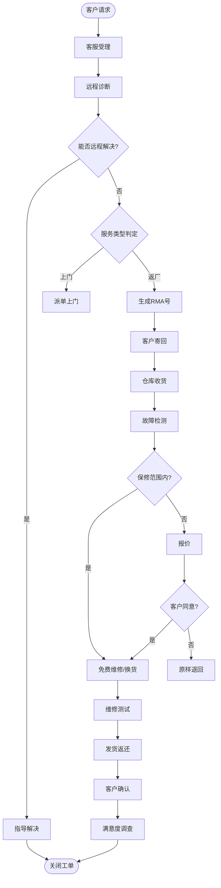

# BIZ-FLOW-S02: 售后服务流程

**文档编号**：BIZ-FLOW-S02  
**版本**：v1.0  
**创建日期**：2026年1月5日  
**更新日期**：2026年1月5日  
**文档状态**：已发布  
**业务域**：销售域  
**优先级**：🟡 P2（中）

---

## 一、流程概述

### 1.1 基本信息

- **流程名称**：售后服务流程（After-Sales Service Process）
- **流程编号**：BIZ-FLOW-S02
- **起点**：客户发起投诉或服务请求
- **终点**：问题解决，客户确认关闭
- **业务目标**：
  - 快速响应客户需求，提升客户满意度
  - 规范退换货与维修操作，控制售后成本
  - 收集产品质量反馈，推动产品改进
  - 维护品牌声誉

### 1.2 适用范围

- **适用公司**：全集团
- **适用产品**：所有已售出的产品
- **业务场景**：
  - 客户咨询与技术支持
  - 产品故障报修
  - 退货与换货（RMA）
  - 客户投诉处理

### 1.3 流程类型

- **流程性质**：核心业务流程
- **流程频率**：高
- **流程复杂度**：中（涉及跨部门协作与物流）

---

## 二、角色与职责（RACI矩阵）

| 流程阶段 | 客服专员 | 技术支持 | 质量工程师 | 销售经理 | 仓库管理员 | 维修工程师 |
|---------|---------|---------|-----------|---------|-----------|-----------|
| 受理登记 | R | - | - | I | - | - |
| 问题诊断 | C | R | C | - | - | - |
| 方案判定 | A | R | C | I | - | - |
| 退回接收 | - | - | I | - | R | - |
| 维修/检测 | - | - | A | - | - | R |
| 费用结算 | R | - | - | A | - | - |
| 客户回访 | R | - | - | I | - | - |

**注释**：

- R (Responsible)：负责执行
- A (Accountable)：最终批准
- C (Consulted)：需要咨询
- I (Informed)：需要知会

---

## 三、流程阶段设计

### 阶段1：受理与初诊 (Intake & Triage)

#### 步骤1.1 服务请求受理

**执行角色**：客服专员

**执行步骤**：

1. 接收渠道：400电话、邮件、官网、微信公众号。
2. 验证客户身份与产品保修状态（SN码查询）。
3. 记录问题描述，生成【服务工单】。

#### 步骤1.2 远程诊断

**执行角色**：技术支持工程师

**执行步骤**：

1. 联系客户，进行远程排查（电话/视频）。
2. **判断问题性质**：
   - **操作不当**：指导客户正确使用 -> 关闭工单。
   - **软件故障**：远程升级或重置 -> 关闭工单。
   - **硬件故障**：需返厂或现场维修 -> 进入下一阶段。

---

### 阶段2：解决方案判定 (Resolution Determination)

#### 步骤2.1 确定服务方案

**执行角色**：技术支持工程师 / 客服主管

**决策逻辑**：

- **退货**：符合退货政策（如7天无理由，或重大质量问题）。
- **换货**：DOA（到货即损）或保修期内无法维修。
- **返厂维修**：保修期内或保修期外付费维修。
- **上门维修**：大型设备或合同约定上门服务。

#### 步骤2.2 生成RMA单

**执行角色**：客服专员

**执行步骤**：

1. 系统生成 RMA (Return Merchandise Authorization) 号码。
2. 发送 RMA 单给客户，告知回寄地址和注意事项。

---

### 阶段3：退回与接收 (Return & Receipt)

#### 步骤3.1 实物接收

**执行角色**：仓库管理员

**执行步骤**：

1. 签收快递，核对 RMA 号码。
2. 检查外观完整性，拍照记录。
3. 系统录入【售后入库单】，状态为"待检"。

#### 步骤3.2 故障复核

**执行角色**：维修工程师 / 质量工程师

**执行步骤**：

1. 对退回产品进行检测，复现故障。
2. 确认故障原因：
   - **质量缺陷**：属于保修范围。
   - **人为损坏**：不属于保修范围，需报价维修。
   - **无故障 (NDF)**：测试正常，原样退回。

---

### 阶段4：维修与处理 (Repair & Disposition)

#### 步骤4.1 维修执行

**执行角色**：维修工程师

**执行步骤**：

1. 领用备件，进行更换或修复。
2. 维修后进行功能测试与老化测试。
3. 填写【维修报告】，记录更换件和工时。

#### 步骤4.2 费用确认（如需付费）

**执行角色**：客服专员

**执行步骤**：

1. 向客户发送【维修报价单】。
2. 客户确认付款后，通知维修部放行。
3. 若客户拒绝维修，安排退回坏件。

#### 步骤4.3 发货返还

**执行角色**：仓库管理员

**执行步骤**：

1. 包装修复后的产品（或新机）。
2. 附带维修报告。
3. 安排快递发货，录入物流单号。

---

### 阶段5：关闭与分析 (Closure & Analysis)

#### 步骤5.1 客户确认与回访

**执行角色**：客服专员

**执行步骤**：

1. 确认客户收到产品且问题解决。
2. 发送满意度调查问卷。
3. 关闭服务工单。

#### 步骤5.2 质量反馈

**执行角色**：质量工程师

**执行步骤**：

1. 定期分析售后数据（Top 10 故障模式）。
2. 触发 CAPA（纠正预防措施）流程（关联 BIZ-FLOW-M03）。
3. 推动研发或生产改进。

---

## 四、流程图

### 4.1 售后服务全流程

---

## 五、关键控制点

### 5.1 控制点清单

| 控制点 | 风险描述 | 控制措施 | 责任人 |
|-------|---------|---------|--------|
| **RMA授权** | 未经授权随意退货 | 必须凭RMA号收货，否则拒收 | 客服主管 |
| **保修判定** | 免费维修人为损坏产品 | 严格执行保修条款，保留检测证据（照片/日志） | 维修工程师 |
| **备件管理** | 维修备件流失 | 坏件必须退库（以旧换新），账实相符 | 仓库管理员 |
| **时效控制** | 维修周期过长 | 设定SLA（如48小时修完），超时预警 | 客服主管 |
| **数据真实性** | 隐瞒质量问题 | 售后系统与质量系统打通，数据不可篡改 | 质量总监 |

---

## 六、异常处理

### 6.1 常见异常场景

#### 场景1：客户拒付维修费

**触发**：保修期外，客户认为产品质量差，不愿付费。

**处理流程**：

1. 提供详细检测报告和故障照片。
2. 申请特殊折扣（需审批）。
3. 若仍拒绝，告知将退回坏件，并需客户承担运费。

#### 场景2：多次维修未果

**触发**：同一故障维修2次以上仍未解决。

**处理流程**：

1. 升级为"重点客诉"。
2. 申请整机更换（即使只修了部件）。
3. 资深工程师介入分析根本原因。

---

## 七、绩效指标（KPI）

| 指标名称 | 定义 | 计算公式 | 目标值 |
|---------|------|---------|--------|
| **客户满意度 (CSAT)** | 售后服务评分 | 问卷平均分 (1-5分) | ≥ 4.8分 |
| **平均维修周期 (TAT)** | 从收货到发货的时间 | 平均天数 | ≤ 3个工作日 |
| **一次修复率** | 维修后30天内无重复返修 | 1 - (返修数/维修总数) | ≥ 98% |
| **72小时结案率** | 3天内关闭工单的比例 | 72h关闭数 / 总工单数 | ≥ 90% |

---

## 八、与其他流程的接口

### 8.1 上游流程

| 上游流程 | 接口点 | 输入数据 |
|---------|--------|---------|
| **销售订单处理** (BIZ-FLOW-S01) | 发货信息 | 客户信息、产品SN、保修期 |
| **质量检验** (BIZ-FLOW-M02) | 出厂标准 | 检验标准、测试方法 |

### 8.2 下游流程

| 下游流程 | 接口点 | 输出数据 |
|---------|--------|---------|
| **工艺改进** (BIZ-FLOW-M03) | 质量反馈 | 故障分析报告、CAPA请求 |
| **费用报销** (BIZ-FLOW-F02) | 运费/差旅 | 售后产生的费用 |

---

## 九、流程优化建议

### 9.1 短期优化

1. **自助服务门户**：在官网提供SN查询保修、自助申请RMA、维修进度查询功能。
2. **常见故障库**：建立知识库（KB），赋能一线客服解决简单技术问题，减少二线压力。

### 9.2 中期优化

1. **备件前置仓**：在核心区域设立备件库，缩短物流时间。
2. **视频客服**：引入视频指导工具，提高远程解决率，减少返厂。

### 9.3 长期优化

1. **IoT预防性维护**：产品联网，自动上报故障代码，主动联系客户维修（变被动为主动）。

---

## 十、附录

### 10.1 相关表单

| 表单名称 | 编号 | 用途 |
|---------|------|------|
| 售后服务工单 | FRM-SVC-001 | 记录全过程 |
| RMA申请单 | FRM-SVC-002 | 退换货授权 |
| 维修报告单 | FRM-SVC-003 | 记录维修详情 |
| 客户满意度调查表 | FRM-SVC-004 | 收集反馈 |

### 10.2 术语表

| 术语 | 全称 | 解释 |
|-----|------|------|
| RMA | Return Merchandise Authorization | 退货授权 |
| DOA | Dead On Arrival | 到货即损（通常指开箱即坏） |
| TAT | Turn Around Time | 周转时间（维修周期） |
| NDF | No Defect Found | 未发现故障 |

### 10.3 参考文档

- 售后服务管理制度
- 产品保修政策
- 维修作业指导书

---

**文档版本历史**：

| 版本 | 日期 | 修改人 | 修改内容 |
|-----|------|--------|---------|
| v1.0 | 2026-01-05 | 系统 | 初始版本，定义售后服务流程 |

---

**审批记录**：

| 角色 | 姓名 | 审批意见 | 日期 |
|-----|------|---------|------|
| 流程Owner | 待定 | 待审批 | - |
| 销售总监 | 待定 | 待审批 | - |
| 质量总监 | 待定 | 待审批 | - |

---

**最后更新**：2026年1月5日
