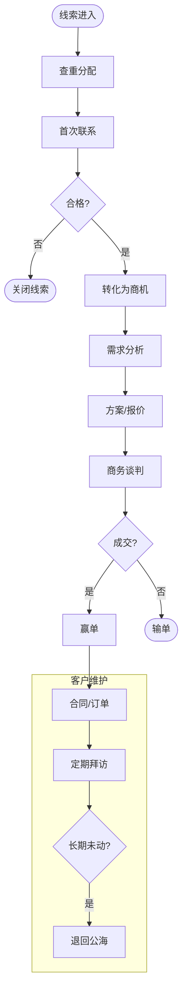

# BIZ-FLOW-S03: 客户关系管理流程

**文档编号**：BIZ-FLOW-S03  
**版本**：v1.0  
**创建日期**：2026年1月5日  
**更新日期**：2026年1月5日  
**文档状态**：已发布  
**业务域**：销售域  
**优先级**：🟢 P2（中）

---

## 一、流程概述

### 1.1 基本信息

- **流程名称**：客户关系管理流程（Customer Relationship Management Process）
- **流程编号**：BIZ-FLOW-S03
- **起点**：市场活动 / 线索获取
- **终点**：客户成交 / 客户流失
- **业务目标**：
  - 提高销售线索转化率（L2C）
  - 建立360度客户视图，深挖客户价值
  - 规范销售行为，防止客户资源随人员离职而流失
  - 提升客户满意度和忠诚度

### 1.2 适用范围

- **适用公司**：全集团
- **适用对象**：
  - **潜在客户 (Leads)**：有初步意向但未验证。
  - **商机 (Opportunities)**：有明确需求和预算。
  - **正式客户 (Accounts)**：已成交。

### 1.3 流程类型

- **流程性质**：业务增值流程
- **流程频率**：高频（每日）
- **流程复杂度**：中（依赖销售人员的主动性）

---

## 二、角色与职责（RACI矩阵）

| 流程阶段 | 销售代表 | 销售经理 | 市场部 | 客服部 | 财务部 |
|---------|---------|---------|-------|-------|-------|
| 线索获取 | R | I | R (活动) | I | - |
| 线索分配 | I | R | I | - | - |
| 客户跟进 | R | C (指导) | - | - | - |
| 商机管理 | R | A | - | - | - |
| 信用评估 | I | I | - | - | R |
| 客户分级 | R | A | - | - | - |

**注释**：

- R (Responsible)：负责执行
- A (Accountable)：最终批准
- C (Consulted)：需要咨询
- I (Informed)：需要知会

---

## 三、流程阶段设计

### 阶段1：线索管理 (Lead Management)

#### 步骤1.1 线索收集

**触发条件**：

- 参加展会、网络推广、电话咨询。

**执行角色**：市场部、销售代表

**执行步骤**：

1. 收集名片、表单。
2. 录入CRM系统“线索池”。
3. 记录来源（如：2026上海展会）。

#### 步骤1.2 清洗与分配

**执行角色**：销售经理 / 销售助理

**执行步骤**：

1. **查重**：检查是否已存在（防止撞单）。
2. **清洗**：剔除无效信息（如空号）。
3. **分配**：
   - 按区域分配（如：华东区）。
   - 按行业分配（如：医疗行业）。
   - 自动轮派（Round Robin）。

---

### 阶段2：商机跟进 (Opportunity Management)

#### 步骤2.1 首次联系与验证

**执行角色**：销售代表

**执行步骤**：

1. 电话/邮件联系客户。
2. 验证需求（BANT模型）：
   - **Budget**：有预算吗？
   - **Authority**：联系人有决策权吗？
   - **Need**：需求匹配吗？
   - **Time**：采购时间表？
3. **转化**：
   - 合格：将线索转化为“商机”和“客户”。
   - 不合格：标记为“关闭”，注明原因（如无预算）。

#### 步骤2.2 商机推进

**执行角色**：销售代表

**执行步骤**：

1. 制定跟进计划（拜访、演示、送样）。
2. 更新商机阶段（如：初步接洽 -> 方案验证 -> 商务谈判 -> 赢单）。
3. 填写【销售拜访记录】。

#### 步骤2.3 赢单/输单

**执行角色**：销售代表

**执行步骤**：

1. **赢单**：客户确认购买，转入合同流程（BIZ-FLOW-C01）。
2. **输单**：客户选择了竞对或取消项目。
   - 必须填写输单原因（价格高/功能缺/关系差）。
   - 输单商机退回公海池。

---

### 阶段3：客户全生命周期管理 (Account Lifecycle)

#### 步骤3.1 客户建档与分级

**执行角色**：销售代表、销售经理

**执行步骤**：

1. 完善客户信息（BIZ-FLOW-C03）。
2. **客户分级**：
   - **KA客户 (Key Account)**：战略价值大，由资深销售负责，高层定期拜访。
   - **B类客户**：潜力大，重点跟进。
   - **C类客户**：一般客户，标准服务。

#### 步骤3.2 信用管理

**执行角色**：财务部

**执行步骤**：

1. 评估客户信用状况（信保调查）。
2. 设定信用额度（Credit Limit）和账期（Payment Term）。
3. 定期复核（如每年一次）。

#### 步骤3.3 公海池机制

**执行角色**：系统自动

**规则**：

- **长期未跟进**：如30天无拜访记录，自动退回公海。
- **长期未成交**：如90天未签单，自动退回公海。
- **目的**：强制流动，防止销售“占坑不拉屎”。

---

## 四、流程图

### 4.1 销售漏斗流程

---

## 五、关键控制点

### 5.1 控制点清单

| 控制点 | 风险描述 | 控制措施 | 责任人 |
|-------|---------|---------|--------|
| **撞单冲突** | 两个销售跟进同一个客户，导致内耗 | 严格执行“报备制”和“保护期”，系统强制查重 | 销售总监 |
| **客户流失** | 销售离职带走客户资料 | 客户资料必须录入系统，严禁私自保存，离职交接 | 销售经理 |
| **商机虚报** | 夸大销售预测误导生产备货 | 销售经理定期复盘商机真实性，考核预测准确率 | 销售总监 |
| **信用风险** | 给高风险客户赊销 | 系统控制发货，超额度必须财务特批 | 财务经理 |

---

## 六、异常处理

### 6.1 常见异常场景

#### 场景1：撞单申诉

**触发**：销售A发现销售B也在跟进自己的客户。

**处理流程**：

1. 提交【撞单申诉】。
2. 销售总监判定：
   - 原则：谁先报备谁拥有。
   - 例外：客户明确要求更换销售。
3. 判定后，输方必须立即停止跟进。

#### 场景2：呆死客户激活

**触发**：公海池里的老客户突然有需求。

**处理流程**：

1. 销售C领取该客户。
2. 查看历史跟进记录（避免踩雷）。
3. 重新建立联系。

---

## 七、绩效指标（KPI）

| 指标名称 | 定义 | 计算公式 | 目标值 |
|---------|------|---------|--------|
| **线索转化率** | 市场活动效果 | 商机数 / 线索数 | ≥ 20% |
| **赢单率** | 销售能力 | 赢单数 / 结案商机数 | ≥ 30% |
| **销售预测准确率** | 计划能力 | 1 - |(实际-预测)/预测| | ≥ 80% |
| **客户拜访量** | 勤奋度 | 周拜访次数 | ≥ 10次 |

---

## 八、与其他流程的接口

### 8.1 上游流程

| 上游流程 | 接口点 | 输入数据 |
|---------|--------|---------|
| **市场活动** | 线索 | 名片、咨询单 |

### 8.2 下游流程

| 下游流程 | 接口点 | 输出数据 |
|---------|--------|---------|
| **销售订单到收款** (BIZ-FLOW-S01) | 报价/合同 | 客户信息、价格条款 |
| **主数据管理** (BIZ-FLOW-C03) | 建档 | 客户主数据 |

---

## 九、流程优化建议

### 9.1 短期优化

1. **移动CRM**：使用手机APP（如企业微信/钉钉），支持语音转文字记录拜访纪要，拍照上传名片。
2. **话术库**：整理优秀销售的沟通话术，供新人学习。

### 9.2 中期优化

1. **SCRM**：连接社交软件（微信），直接在微信中管理客户，记录聊天内容（需合规）。
2. **CPQ**：配置报价工具（Configure, Price, Quote），帮助销售快速生成复杂的报价单。

### 9.3 长期优化

1. **AI销售助手**：利用AI分析客户画像，推荐最佳联系时间、最佳话术和推荐产品。

---

## 十、附录

### 10.1 相关表单

| 表单名称 | 编号 | 用途 |
|---------|------|------|
| 销售线索单 | FRM-CRM-001 | 线索录入 |
| 客户拜访记录表 | FRM-CRM-002 | 过程管理 |
| 客户建档申请表 | FRM-CRM-003 | 主数据申请 |

### 10.2 术语表

| 术语 | 全称 | 解释 |
|-----|------|------|
| CRM | Customer Relationship Management | 客户关系管理 |
| Lead | - | 线索 |
| Opportunity | - | 商机 |
| BANT | Budget, Authority, Need, Time | 需求验证模型 |
| L2C | Leads to Cash | 线索到回款 |

### 10.3 参考文档

- 销售管理制度
- 客户信用管理办法

---

**文档版本历史**：

| 版本 | 日期 | 修改人 | 修改内容 |
|-----|------|--------|---------|
| v1.0 | 2026-01-05 | 系统 | 初始版本，定义CRM流程 |

---

**审批记录**：

| 角色 | 姓名 | 审批意见 | 日期 |
|-----|------|---------|------|
| 流程Owner | 待定 | 待审批 | - |
| 销售总监 | 待定 | 待审批 | - |
| 总经理 | 待定 | 待审批 | - |

---

**最后更新**：2026年1月5日
