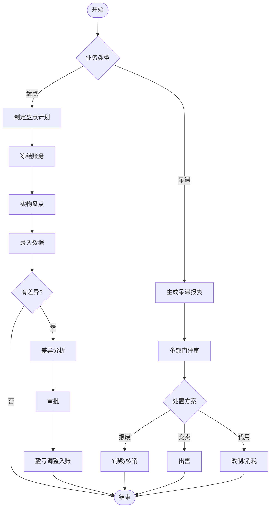

# BIZ-FLOW-W01: 库存管理流程

**文档编号**：BIZ-FLOW-W01  
**版本**：v1.0  
**创建日期**：2026年1月5日  
**更新日期**：2026年1月5日  
**文档状态**：已发布  
**业务域**：仓储域  
**优先级**：🔴 P0（极高）

---

## 一、流程概述

### 1.1 基本信息

- **流程名称**：库存管理流程（Inventory Management Process）
- **流程编号**：BIZ-FLOW-W01
- **起点**：库存异动 / 盘点计划
- **终点**：账实相符 / 呆滞料处置完成
- **业务目标**：
  - 确保库存数据的准确性（账实相符率 > 98%）
  - 优化库存结构，降低资金占用
  - 及时发现并处理呆滞、过期物料
  - 满足财务审计合规要求

### 1.2 适用范围

- **适用公司**：全集团
- **适用仓库**：原材料仓、半成品仓、成品仓、备件仓、废品仓
- **业务场景**：
  - 库存盘点（定期/循环）
  - 盈亏调整
  - 库内调拨（移库）
  - 呆滞料分析与处理

### 1.3 流程类型

- **流程性质**：核心控制流程
- **流程频率**：日常（调拨）、月度（盘点）
- **流程复杂度**：中（涉及财务监盘和审批）

### 1.4 仓库分类与管控架构 (Warehouse Classification & Governance)

为明确不同实物的管理责任，全集团采用分级分类的仓库架构：

#### 1. 核心物流仓 (Core Logistics Warehouses)

**管理主责**：仓储物流部
**管控模式**：严格的出入库单据管理，实物与账务实时同步。

- **1001 原材料仓**：存放生产用主要原料、包材。
- **1002 半成品仓(Semi)**：存放自制半成品。
- **1003 成品仓(FG)**：存放可销售产成品。

#### 2. 生产现场仓 (Shop Floor / WIP)

**管理主责**：生产部
**管控模式**：基于BOM倒冲扣料 (Backflush) 或 现场盘点消耗。

- **2001 线边仓**：存放已领用但未消耗的物料。

#### 3. 职能物资仓 (Functional Asset Warehouses)

**管理主责**：各归口职能部门（实物管理权下放）。
**管控模式**：领用即费用化（财务视角），但需台账管理（实物视角）。

- **3001 IT资产仓** (Owner: **IT部**)：电脑、外设、服务器配件 (ref: I01)。
- **3002 行政物资仓** (Owner: **行政部**)：办公用品、制服、备用家具 (ref: A02)。
- **3003 备品备件仓** (Owner: **设备部**)：维修工具、机器备件 (ref: M04)。
- **3004 实验室仓** (Owner: **研发部**)：试剂、耗材、样品 (ref: R02)。

#### 4. 逻辑/虚拟仓 (Logical Warehouses)

**管理主责**：财务部/供应链
**管控模式**：逻辑状态标识，不可随意动用。

- **8001 废品/待处置仓**：存放不合格品、呆滞料。
- **8002 供应商寄售仓 (VMI)**：实物在库，但权属属于供应商。
- **8003 在途仓**：物料已发出但尚未送达目的地。

---

## 二、角色与职责（RACI矩阵）

| 流程阶段 | 仓管员 | 仓库主管 | 财务会计 | 财务经理 | 生产/采购/销售 | 总经理 |
|---------|-------|---------|---------|---------|--------------|-------|
| 库内调拨 | R | A | - | - | - | - |
| 盘点计划 | C | R | A | I | I | - |
| 盘点执行 | R | A | C (监盘) | - | - | - |
| 差异分析 | R | R | R | A | C | - |
| 盈亏调整 | I | R | R | A | - | A (大额) |
| 呆滞处置 | I | R | C | C | R (消耗/变卖) | A |

**注释**：

- R (Responsible)：负责执行
- A (Accountable)：最终批准
- C (Consulted)：需要咨询
- I (Informed)：需要知会

---

## 三、流程阶段设计

### 阶段1：库内管理 (Internal Management)

#### 步骤1.1 库内调拨（移库）

**触发条件**：

- 仓库整理（如合并零头箱）。
- 物料状态变更（如待检 -> 合格）。
- 存储策略调整（如ABC分类调整）。

**执行角色**：仓管员

**执行步骤**：

1. 系统创建【移库单】。
2. 搬运实物：从源库位移至目标库位。
3. 系统确认：扫描源库位和目标库位条码。
4. **注意**：移库不改变总库存数量，只改变位置。

#### 步骤1.2 批次/效期管理

**执行角色**：仓管员

**执行步骤**：

1. **先进先出 (FIFO)**：发货时系统自动推荐最早批次。
2. **近效期预警**：系统每日扫描，对剩余效期<3个月的物料报警。
3. **过期锁定**：过期物料自动冻结，禁止出库，转入呆滞处理流程。

---

### 阶段4：特殊业务处理 (Special Inventory Scenarios)

#### 步骤4.1 仓库与物料性质映射

在实际业务中，不同仓库对物料的性质有明确区分，但也存在特殊转换场景：

- **原材料仓 (Raw Material Warehouse)**
  - **常规用途**：生产领料。
  - **特殊用途**：原材料外销（需走销售出库流程，而非领料流程）。
  - **管控重点**：批次管理、保质期。

- **成品仓 (Finished Goods Warehouse)**
  - **常规用途**：销售发货。
  - **特殊用途**：产成品返工（从成品仓领料 -> 车间 -> 入库）。

- **管控策略**：
  - 若**原材料**需要销售，在系统中直接创建销售订单进行出库（移动类型：销售出库），物理位置仍在原材料仓，无需先移库至成品仓。
  - 若**成品**需要倒用（如拆解为原料），需先执行【拆解单/BOM分解】流程，将成品库存扣减，转化并入库为原材料/半成品。

#### 步骤4.2 库内调拨与属性转换

当物料的**实物状态**或**库存属性**发生变化时，执行此步骤。

**场景示例**：

- **存货属性转换**：将“寄售库存”买断，转为“自有库存”。
- **质量状态转换**：将“待检”转为“合格”或“不合格”。

**执行步骤**：

1. 创建【物资属性变更单】或【库存状态转换单】。
2. 质量/财务审批（视变更类型而定）。
3. 系统过账，更新库存属性标签。

---

### 阶段5：库存盘点 (Stocktaking)

#### 步骤2.1 盘点计划

**执行角色**：仓库主管、财务会计

**执行步骤**：

1. **类型选择**：
   - **月度抽盘**：重点盘点A类物料（高价值/高流动）。
   - **季度/年度全盘**：所有物料，通常需停产停发。
   - **循环盘点**：每日盘点一小部分，一年内覆盖所有。
2. 发布【盘点通知】，明确盘点时间、范围、人员。
3. 冻结库存账务（停止出入库操作）。

#### 步骤2.2 盘点执行

**执行角色**：盘点小组（仓管员+财务监盘人）

**执行步骤**：

1. **初盘**：仓管员盲盘（不看账面数），点数并填写【盘点卡】。
2. **复盘**：财务人员抽查初盘结果（重点关注差异项）。
3. 录入盘点数据至系统。

#### 步骤2.3 差异分析

**执行角色**：仓库主管、财务会计

**执行步骤**：

1. 系统生成【盘点差异表】（账面 vs 实盘）。
2. 调查差异原因：
   - 单据漏录/错录？
   - 串货（A物料发成B物料）？
   - 盘点错误？
   - 盗窃或损耗？
3. 填写【差异分析报告】。

#### 步骤2.4 盈亏调整

**执行角色**：财务经理、总经理

**执行步骤**：

1. 根据审批权限进行审批。
2. 审批通过后，系统执行调整：
   - **盘盈**：增加库存，计入“待处理财产损溢”。
   - **盘亏**：减少库存，计入管理费用或向责任人追偿。

---

### 阶段3：呆滞料处理 (Dead Stock Management)

#### 步骤3.1 呆滞识别

**执行角色**：系统/仓库主管

**定义**：

- **无动态**：超过6个月无出入库记录。
- **低周转**：库存周转天数 > 365天。
- **过期**：超过保质期。

**执行步骤**：

1. 每月生成【呆滞物料分析表】。
2. 发送给PMC、采购、销售、研发部门。

#### 步骤3.2 处置方案制定

**执行角色**：多部门小组

**执行步骤**：

1. **研发/技术**：评估能否代用或改制？
2. **销售**：能否打折促销？
3. **采购**：能否退回供应商？
4. **财务**：计提跌价准备。

#### 步骤3.3 处置执行

**执行角色**：仓库主管

**执行步骤**：

1. **报废**：物理销毁（需拍照/视频），财务核销。
2. **变卖**：作为废品出售给回收商。
3. **改制**：转为其他物料。

---

## 四、流程图

### 4.1 库存盘点与呆滞处理

---

## 五、关键控制点

### 5.1 控制点清单

| 控制点 | 风险描述 | 控制措施 | 责任人 |
|-------|---------|---------|--------|
| **盘点监盘** | 仓管员自盗自盘，掩盖亏空 | 财务必须现场监盘，且盲盘（不提供账面数） | 财务经理 |
| **账务冻结** | 盘点期间出入库导致数据混乱 | 盘点期间严禁实物移动，或设立“盘点临时区” | 仓库主管 |
| **盈亏审批** | 随意调整库存掩盖管理漏洞 | 严格执行审批权限，大额亏损需总经理批准 | 财务总监 |
| **效期控制** | 发出过期产品 | 系统强制FIFO，发货时校验效期 | 质量QA |

---

## 六、异常处理

### 6.1 常见异常场景

#### 场景1：盘点差异巨大

**触发**：某物料盘亏金额超过1万元。

**处理流程**：

1. 立即封存现场。
2. 成立专项调查组（审计、安保介入）。
3. 倒查最近一年的所有出入库单据。
4. 查看监控录像。
5. 查明原因前，不予调整账务。

#### 场景2：紧急发货遇盘点

**触发**：全盘期间，客户急需发货。

**处理流程**：

1. 申请【盘点期间紧急发货】。
2. 财务监盘人员优先盘点该物料。
3. 确认无误后，手工记录出库，实物发出。
4. 系统解冻后，补录出库单。

---

## 七、绩效指标（KPI）

| 指标名称 | 定义 | 计算公式 | 目标值 |
|---------|------|---------|--------|
| **库存准确率** | 账实相符程度 | (盘点准确项数 / 总盘点项数) * 100% | ≥ 98% |
| **库存周转率** | 资金周转效率 | 销售成本 / 平均库存金额 | ≥ 6次/年 |
| **呆滞料占比** | 库存健康度 | 呆滞料金额 / 总库存金额 | ≤ 5% |
| **盘点损耗率** | 库内管理水平 | 盘亏金额 / 期末库存金额 | ≤ 0.1% |

---

## 八、与其他流程的接口

### 8.1 上游流程

| 上游流程 | 接口点 | 输入数据 |
|---------|--------|---------|
| **采购订单到付款** (BIZ-FLOW-P01) | 入库 | 采购入库单 |
| **生产计划到交付** (BIZ-FLOW-M01) | 完工入库 | 成品入库单 |
| **销售订单到收款** (BIZ-FLOW-S01) | 退货入库 | 销售退货单 |

### 8.2 下游流程

| 下游流程 | 接口点 | 输出数据 |
|---------|--------|---------|
| **生产计划到交付** (BIZ-FLOW-M01) | 领料出库 | 生产领料单 |
| **销售订单到收款** (BIZ-FLOW-S01) | 销售出库 | 销售出库单 |
| **月度财务关账** (BIZ-FLOW-F01) | 成本核算 | 盈亏调整单 |

---

## 九、流程优化建议

### 9.1 短期优化

1. **库位标识**：确保每个货架、库位都有唯一的条码标识，实现“定位管理”。
2. **可视化看板**：在仓库门口展示库存准确率、呆滞料趋势图，提高全员意识。

### 9.2 中期优化

1. **WMS系统**：引入专业的仓库管理系统(WMS)，实现PDA扫码作业，防错防呆。
2. **条码/RFID**：全面推行条码管理，取消手工账。

### 9.3 长期优化

1. **自动化立体库 (AS/RS)**：引入堆垛机、AGV小车，实现无人化仓储。

---

## 十、附录

### 10.1 相关表单

| 表单名称 | 编号 | 用途 |
|---------|------|------|
| 盘点计划表 | FRM-WH-001 | 计划 |
| 盘点卡/表 | FRM-WH-002 | 记录数据 |
| 盘点差异报告 | FRM-WH-003 | 分析差异 |
| 移库单 | FRM-WH-004 | 库内移动 |
| 呆滞料处置申请 | FRM-WH-005 | 呆滞处理 |

### 10.2 术语表

| 术语 | 全称 | 解释 |
|-----|------|------|
| FIFO | First In First Out | 先进先出 |
| Cycle Count | - | 循环盘点 |
| Dead Stock | - | 呆滞库存 |
| WMS | Warehouse Management System | 仓库管理系统 |

### 10.3 参考文档

- 仓库管理制度
- 存货盘点管理办法
- 财务会计准则

---

**文档版本历史**：

| 版本 | 日期 | 修改人 | 修改内容 |
|-----|------|--------|---------|
| v1.0 | 2026-01-05 | 系统 | 初始版本，定义库存管理流程 |

---

**审批记录**：

| 角色 | 姓名 | 审批意见 | 日期 |
|-----|------|---------|------|
| 流程Owner | 待定 | 待审批 | - |
| 财务总监 | 待定 | 待审批 | - |
| 总经理 | 待定 | 待审批 | - |

---

**最后更新**：2026年1月5日
