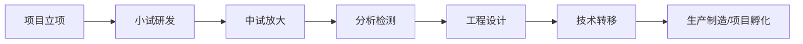
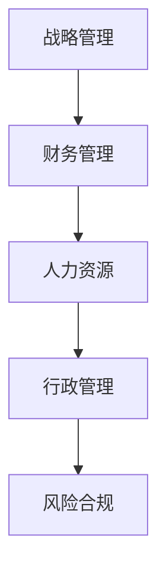

# 集团信息化建设 - 业务架构分析

**文档编号**：BIZ-ARCH-001  
**版本**：v1.0  
**创建日期**：2026年1月5日  
**更新日期**：2026年1月5日  
**文档状态**：已发布  
**项目目标**：快、全、好 - 流程闭环的信息化体系

---

## 一、组织架构与业务分析

### 1.1 集团组织结构

**组织架构（钉钉上下级关系）**：

```txt
集团总部（钉钉主组织）
├── A公司（研发型，钉钉子组织）
│   ├── 小试部门（孵化器）
│   ├── 中试部门
│   ├── 分析检测部门
│   ├── 工程设计部门
│   └── （规划）生产部门
├── B公司（生产型，钉钉子组织）
│   ├── 生产部
│   ├── 质量部
│   ├── 采购部
│   └── 仓储物流部
└── （未来）从A公司小试孵化的新子公司
```

**关键架构决策**：

- ✅ **统一门户**：钉钉作为集团统一协同平台
- ✅ **组织关联**：A/B公司通过钉钉上下级组织关系管理
- ✅ **统一认证**：基于钉钉实现单点登录(SSO)
- ✅ **相对独立**：A/B公司业务系统独立部署，通过接口集成

### 1.2 信息化架构定位

**核心原则：集团统筹 + 子公司独立**

```
┌─────────────────────────────────────────────────────────┐
│            集团统一平台层                                │
│  钉钉OA（组织/审批/沟通）                                │
│  集团财务（合并报表）                                    │
│  集团BI（经营分析）                                      │
└─────────────────────────────────────────────────────────┘
              ↓ 钉钉上下级关系
    ┌─────────┴─────────┐
    │                   │
┌───▼──────────────┐  ┌─▼────────────────┐
│ A公司独立系统    │  │ B公司独立系统    │
│ • ELN            │  │ • MES            │
│ • LIMS           │  │ • SCM            │
│ • 项目管理       │  │ • QMS            │
│ • 文档管理       │  │ • WMS            │
└──────────────────┘  └──────────────────┘
      ↓ 数据集成      ↓
    └─────────┬─────────┘
              ↓
      集团数据仓库/BI
```

**架构特点**：

1. **组织统一**：钉钉管理所有人员和组织关系
2. **系统独立**：A/B公司核心业务系统独立建设
3. **数据汇总**：通过集成平台汇总到集团BI
4. **灵活扩展**：新增子公司独立建设系统

### 1.3 核心业务流程识别

#### A公司（研发型）业务流程



**关键流程节点**：

1. **项目管理流程**：立项→评审→执行→验收→成果管理
2. **研发流程**：小试实验→数据记录→中试放大→工艺优化
3. **质量管理流程**：样品管理→分析检测→数据审核→报告生成
4. **工程设计流程**：需求确认→方案设计→图纸管理→变更控制
5. **知识产权流程**：技术成果→专利申请→知识库管理
6. **成果转化流程**：技术评估→转移方案→孵化决策

#### B公司（生产型）业务流程


**关键流程节点**：

1. **计划管理流程**：需求预测→生产计划→物料计划
2. **供应链流程**：供应商管理→采购申请→入库管理
3. **生产执行流程**：工单下达→现场执行→数据采集
4. **质量管理流程**：原料检验→过程检验→成品检验
5. **仓储物流流程**：库存管理→出入库→物流跟踪
6. **销售管理流程**：订单管理→发货→回款

#### 集团总部管理流程



**关键流程节点**：

1. **财务管理流程**：预算→核算→成本分析→资金管理
2. **人力资源流程**：招聘→培训→绩效→薪酬
3. **行政管理流程**：资产→合同→公文→档案
4. **战略管理流程**：战略规划→经营分析→决策支持

---

## 二、流程闭环关键点识别

### 2.1 跨公司流程闭环

| 闭环场景 | 起点 | 终点 | 关键数据流 |
|---------|------|------|-----------|
| **技术转移闭环** | A公司工程设计 | B公司生产执行 | 工艺包、配方、操作规程 |
| **质量追溯闭环** | B公司原料采购 | 客户交付 | 批次号、检验数据、质量证明 |
| **成果孵化闭环** | A公司小试 | 新子公司成立 | 技术评估、商业计划、资产划分 |
| **成本核算闭环** | 研发费用 | 产品成本 | 研发投入、生产成本、费用分摊 |
| **数据反馈闭环** | B公司生产数据 | A公司工艺优化 | 生产异常、质量问题、改进建议 |

### 2.2 单一公司内部闭环

**A公司研发闭环**：

- 项目立项 → 实验执行 → 数据分析 → 成果评审 → 知识沉淀 → 新项目输入

**B公司生产闭环**：

- 销售订单 → 生产计划 → 物料采购 → 生产执行 → 质量检验 → 交付回款 → 财务核算

**集团管理闭环**：

- 战略规划 → 年度预算 → 经营执行 → 绩效考核 → 分析改进 → 战略调整

### 2.3 数据流转闭环要求

```
┌─────────────────────────────────────────┐
│         统一的主数据管理平台              │
│  （人员、组织、物料、客户、供应商）       │
└─────────────────────────────────────────┘
              ↓          ↑
    ┌─────────┴──────────┴────────┐
    │                              │
┌───▼────┐  ┌──────┐  ┌──────┐  ┌─▼─────┐
│ A公司  │→ │ 集团 │← │ B公司 │← │ 外部  │
│ 业务系统│  │ 中台 │  │ 业务系统│  │ 系统  │
└────────┘  └──────┘  └──────┘  └───────┘
              ↓
    ┌─────────────────┐
    │  数据仓库/BI平台 │
    │  （统一报表分析）│
    └─────────────────┘
```

---

## 三、信息化需求清单

### 3.1 A公司系统需求（研发型）

| 系统类型 | 系统名称 | 核心功能 | 优先级 |
|---------|---------|---------|-------|
| **项目管理** | R&D项目管理系统 | 项目立项、进度跟踪、资源分配、成果管理 | ⭐⭐⭐ |
| **实验管理** | 电子实验记录本(ELN) | 实验记录、数据管理、流程审批 | ⭐⭐⭐ |
| **分析检测** | LIMS实验室信息管理 | 样品管理、检测流程、报告生成 | ⭐⭐⭐ |
| **文档管理** | 技术文档管理系统 | 工艺文档、图纸管理、版本控制 | ⭐⭐ |
| **知识管理** | 知识产权管理系统 | 专利管理、技术档案、知识库 | ⭐⭐ |

### 3.2 B公司系统需求（生产型）

| 系统类型 | 系统名称 | 核心功能 | 优先级 |
|---------|---------|---------|-------|
| **生产管理** | MES制造执行系统 | 生产计划、工单管理、现场采集 | ⭐⭐⭐ |
| **质量管理** | QMS质量管理系统 | 质检流程、不合格品、追溯 | ⭐⭐⭐ |
| **供应链** | SCM供应链系统 | 采购、库存、销售订单 | ⭐⭐⭐ |
| **仓储物流** | WMS仓库管理系统 | 出入库、库存、盘点 | ⭐⭐ |
| **设备管理** | 设备维护管理 | 设备台账、保养、维修 | ⭐ |

### 3.3 集团总部系统需求

| 系统类型 | 系统名称 | 核心功能 | 优先级 |
|---------|---------|---------|-------|
| **财务管理** | 财务核算系统 | 总账、应收应付、成本核算 | ⭐⭐⭐ |
| **人力资源** | HR人力资源系统 | 组织人事、薪酬、绩效 | ⭐⭐⭐ |
| **协同办公** | OA办公系统 | 公文流转、审批、通知 | ⭐⭐⭐ |
| **商业智能** | BI数据分析平台 | 报表、驾驶舱、经营分析 | ⭐⭐ |
| **资产管理** | 固定资产系统 | 资产台账、折旧、盘点 | ⭐ |

### 3.4 基础平台需求

| 平台类型 | 功能描述 | 优先级 |
|---------|---------|-------|
| **统一门户** | 单点登录、工作台、消息中心 | ⭐⭐⭐ |
| **主数据平台** | 组织、人员、物料、客户主数据管理 | ⭐⭐⭐ |
| **流程引擎** | 工作流、审批流、表单引擎 | ⭐⭐⭐ |
| **集成平台** | 系统对接、数据交换、API管理 | ⭐⭐ |
| **数据仓库** | 数据采集、清洗、建模 | ⭐⭐ |

---

## 四、流程闭环设计

### 4.1 技术转移闭环示例

```
┌──────────────┐
│ A公司：工程设计完成 │
│ 输出：工艺包      │
└───────┬──────────┘
        │
        ↓ (文档管理系统)
┌──────────────┐
│ 技术文档归档审批 │
└───────┬──────────┘
        │
        ↓ (流程引擎)
┌──────────────┐
│ B公司：技术接收  │
│ 导入：MES系统   │
└───────┬──────────┘
        │
        ↓ (MES系统)
┌──────────────┐
│ 生产工单执行    │
│ 数据采集       │
└───────┬──────────┘
        │
        ↓ (数据反馈)
┌──────────────┐
│ A公司：改进优化  │
│ 闭环完成       │
└──────────────┘
```

### 4.2 质量追溯闭环示例

```
原料到货 → 检验(LIMS) → 入库(WMS) → 生产领料(MES) 
  → 生产记录(MES) → 成品检验(LIMS) → 成品入库(WMS) 
  → 销售出库(SCM) → 质量追溯查询(BI)
```

**关键数据**：批次号贯穿全流程，每个环节记录关键信息

---

## 五、业务架构总结

### 5.1 架构分层

```
┌─────────────────────────────────────┐
│        决策层（战略与分析）          │
│      BI、数据仓库、管理驾驶舱        │
└─────────────────────────────────────┘
              ↑
┌─────────────────────────────────────┐
│        管理层（集团管控）            │
│   财务、HR、OA、合同、资产          │
└─────────────────────────────────────┘
              ↑
┌──────────────────┬──────────────────┐
│   A公司业务层    │   B公司业务层    │
│ 项目、实验、LIMS │ MES、SCM、QMS   │
└──────────────────┴──────────────────┘
              ↑
┌─────────────────────────────────────┐
│           基础平台层                 │
│ 门户、主数据、流程、集成、权限       │
└─────────────────────────────────────┘
```

### 5.2 关键成功因素

1. **统一数据标准**：建立集团级主数据标准（编码、分类、命名）
2. **流程标准化**：梳理并固化核心业务流程
3. **系统集成**：避免数据孤岛，实现自动化流转
4. **分步实施**：快速见效 + 持续迭代
5. **借助外力**：合理使用成熟产品和外部实施团队

### 5.3 业务优先级

**第一优先级（快速见效）**：

- OA协同办公（集团通用）
- 财务核算系统（集团必需）
- A公司：电子实验记录本ELN（核心业务）
- B公司：MES生产管理（核心业务）

**第二优先级（流程闭环）**：

- 主数据平台
- 集成平台
- LIMS、SCM、QMS

**第三优先级（分析决策）**：

- 数据仓库
- BI分析平台

---

## 六、下一步行动

1. ✅ 完成业务架构分析
2. ⏭️ 进入应用架构设计（系统选型）
3. ⏭️ 制定技术架构规划
4. ⏭️ 输出分阶段实施路线图
5. ⏭️ 制定项目交付计划

---

**文档维护**：本文档作为集团信息化建设的业务架构基线，后续根据实际情况持续更新。
