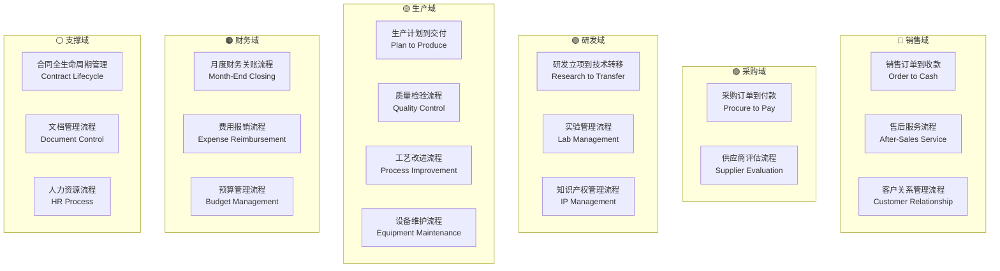

# 端到端业务流总览

**文档编号**：BIZ-FLOW-001  
**版本**：v1.0  
**创建日期**：2026年1月5日  
**更新日期**：2026年1月5日  
**文档状态**：已发布  
**核心原则**：流程闭环、角色清晰、数据一致

---

> 💡 **文档定位**  
> 本文档从**纯业务视角**梳理集团各核心业务流程，不涉及具体系统实施方案。  
> 每个端到端业务流独立成文档，详细描述业务逻辑、角色职责和关键控制点。

---

## 一、业务流全景图

### 1.1 业务域分类



### 1.2 业务流清单

| 编号 | 业务流名称 | 业务域 | 优先级 | 文档链接 |
|-----|----------|--------|--------|---------|
| BIZ-FLOW-S01 | 销售订单到收款 | 销售域 | 🔴 P0 | [查看详情](10.1_业务流详细设计/BIZ-FLOW-S01_销售订单到收款.md) |
| BIZ-FLOW-S02 | 售后服务流程 | 销售域 | 🟢 P2 | [查看详情](10.1_业务流详细设计/BIZ-FLOW-S02_售后服务流程.md) |
| BIZ-FLOW-S03 | 客户关系管理流程 | 销售域 | 🟡 P1 | [查看详情](10.1_业务流详细设计/BIZ-FLOW-S03_客户关系管理流程.md) |
| BIZ-FLOW-W01 | 库存管理流程 | 供应链域 | 🔴 P0 | [查看详情](10.1_业务流详细设计/BIZ-FLOW-W01_库存管理流程.md) |
| BIZ-FLOW-W02 | 进出口与关务管理流程 | 供应链域 | 🟢 P2 | [查看详情](10.1_业务流详细设计/BIZ-FLOW-W02_进出口与关务管理流程.md) |
| BIZ-FLOW-P01 | 采购订单到付款 | 采购域 | 🔴 P0 | [查看详情](10.1_业务流详细设计/BIZ-FLOW-P01_采购订单到付款.md) |
| BIZ-FLOW-P02 | 供应商评估流程 | 采购域 | 🟡 P1 | [查看详情](10.1_业务流详细设计/BIZ-FLOW-P02_供应商评估流程.md) |
| BIZ-FLOW-R01 | 研发立项到技术转移 | 研发域 | 🟡 P1 | [查看详情](10.1_业务流详细设计/BIZ-FLOW-R01_研发立项到技术转移.md) |
| BIZ-FLOW-R02 | 实验管理流程 | 研发域 | 🟡 P1 | [查看详情](10.1_业务流详细设计/BIZ-FLOW-R02_实验管理流程.md) |
| BIZ-FLOW-R03 | 知识产权管理流程 | 研发域 | 🟡 P1 | [查看详情](10.1_业务流详细设计/BIZ-FLOW-R03_知识产权管理流程.md) |
| BIZ-FLOW-M01 | 生产计划到交付 | 生产域 | 🔴 P0 | [查看详情](10.1_业务流详细设计/BIZ-FLOW-M01_生产计划到交付.md) |
| BIZ-FLOW-M02 | 质量检验流程 | 生产域 | 🔴 P0 | [查看详情](10.1_业务流详细设计/BIZ-FLOW-M02_质量检验流程.md) |
| BIZ-FLOW-M03 | 工艺改进流程 | 生产域 | 🟡 P1 | [查看详情](10.1_业务流详细设计/BIZ-FLOW-M03_工艺改进流程.md) |
| BIZ-FLOW-M04 | 设备全生命周期管理流程 | 生产域 | 🟡 P1 | [查看详情](10.1_业务流详细设计/BIZ-FLOW-M04_设备维护流程.md) |
| BIZ-FLOW-Q01 | 质量体系管理流程 | 质量域 | 🔴 P1 | [查看详情](10.1_业务流详细设计/BIZ-FLOW-Q01_质量体系管理流程.md) |
| BIZ-FLOW-F01 | 月度财务关账流程 | 财务域 | 🔴 P0 | [查看详情](10.1_业务流详细设计/BIZ-FLOW-F01_月度财务关账流程.md) |
| BIZ-FLOW-F02 | 费用报销流程 | 财务域 | 🟢 P2 | [查看详情](10.1_业务流详细设计/BIZ-FLOW-F02_费用报销流程.md) |
| BIZ-FLOW-F03 | 预算管理流程 | 财务域 | 🟡 P1 | [查看详情](10.1_业务流详细设计/BIZ-FLOW-F03_预算管理流程.md) |
| BIZ-FLOW-F04 | 固定资产管理流程 | 财务域 | 🟢 P2 | [查看详情](10.1_业务流详细设计/BIZ-FLOW-F04_固定资产管理流程.md) |
| BIZ-FLOW-F05 | 资金与税务管理流程 | 财务域 | 🔴 P1 | [查看详情](10.1_业务流详细设计/BIZ-FLOW-F05_资金与税务管理流程.md) |
| BIZ-FLOW-C01 | 合同全生命周期管理 | 支撑域 | 🟡 P1 | [查看详情](10.1_业务流详细设计/BIZ-FLOW-C01_合同全生命周期管理.md) |
| BIZ-FLOW-C02 | 文档管理流程 | 支撑域 | 🟢 P2 | [查看详情](10.1_业务流详细设计/BIZ-FLOW-C02_文档管理流程.md) |
| BIZ-FLOW-H01 | 人力资源流程 | 支撑域 | 🟡 P1 | [查看详情](10.1_业务流详细设计/BIZ-FLOW-H01_人力资源流程.md) |

### 1.3 优先级说明

- **🔴 P0（极高）**：涉及现金流、合规要求，必须首批梳理
- **🟡 P1（高）**：影响运营效率和产品质量，第二批梳理
- **🟢 P2（中）**：支撑性流程，可逐步完善

---

## 二、业务流设计原则

### 2.1 流程闭环原则

每个业务流必须：

- ✅ 有明确的**起点**和**终点**
- ✅ 所有分支路径都有**闭环处理**
- ✅ 异常情况有**明确的处理机制**
- ✅ 关键节点有**审批和控制**

### 2.2 角色职责清晰

每个流程步骤必须：

- ✅ 明确**执行角色**（谁来做）
- ✅ 明确**审批角色**（谁批准）
- ✅ 明确**监督角色**（谁检查）

### 2.3 数据一致性

跨流程数据传递必须：

- ✅ 定义**数据接口**和**传递时机**
- ✅ 确保**数据格式统一**
- ✅ 建立**数据校验机制**

### 2.4 可追溯性

所有业务活动必须：

- ✅ 有**唯一编号**（订单号、批次号等）
- ✅ 记录**关键时间节点**
- ✅ 保留**审批痕迹**

---

## 三、业务流文档结构规范

每个独立的业务流文档应包含以下章节：

### 3.1 标准章节

1. **流程概述**
   - 流程名称、编号
   - 起点和终点
   - 业务目标
   - 适用范围（哪些公司/部门）

2. **角色与职责**
   - RACI矩阵（负责、批准、咨询、知会）

3. **流程阶段设计**
   - 阶段1、阶段2...（每个阶段包含若干步骤）
   - 每个步骤：触发条件、执行人、输入、输出、决策点

4. **流程图**
   - 泳道图（Swimlane Diagram）
   - 决策树（Decision Tree）

5. **关键控制点**
   - 控制目标
   - 控制措施
   - 责任人

6. **异常处理**
   - 常见异常场景
   - 处理流程
   - 升级机制

7. **绩效指标（KPI）**
   - 关键指标定义
   - 目标值
   - 数据来源

8. **与其他流程的接口**
   - 上游流程
   - 下游流程
   - 数据交换

### 3.2 命名规范

- 文档命名：`BIZ-FLOW-[域代码][序号]_[流程名称].md`
  - 销售域：S（Sales）
  - 采购域：P（Procurement）
  - 研发域：R（R&D）
  - 生产域：M（Manufacturing）
  - 财务域：F（Finance）
  - 支撑域：C（Corporate）

---

## 四、业务流详细文档索引

### 4.1 销售域业务流

#### 🔴 [BIZ-FLOW-S01: 销售订单到收款](10.1_业务流详细设计/BIZ-FLOW-S01_销售订单到收款.md)

**流程概要**：

- **起点**：客户询价
- **终点**：收款到账，财务确认
- **核心阶段**：询价报价 → 订单确认 → 发货出库 → 开票收款
- **涉及角色**：销售人员、销售经理、仓管员、质检员、财务人员

---

### 4.2 采购域业务流

#### 🔴 [BIZ-FLOW-P01: 采购订单到付款](10.1_业务流详细设计/BIZ-FLOW-P01_采购订单到付款.md)

**流程概要**：

- **起点**：采购需求产生
- **终点**：付款完成，供应商确认
- **核心阶段**：需求申请 → 询价比价 → 采购下单 → 到货检验 → 对账付款
- **涉及角色**：需求部门、采购员、采购经理、仓管员、质检员、财务人员

---

### 4.3 研发域业务流

#### 🟡 [BIZ-FLOW-R01: 研发立项到技术转移](10.1_业务流详细设计/BIZ-FLOW-R01_研发立项到技术转移.md)

**流程概要**（适用于A公司）：

- **起点**：研发项目立项
- **终点**：技术转移至B公司，生产验证成功
- **核心阶段**：项目立项 → 实验研发 → 配方定版 → 技术转移 → 生产验证
- **涉及角色**：研发经理、研发工程师、质量工程师、生产工程师
- **保密要求**：高（涉及核心配方和工艺）

---

### 4.4 生产域业务流

#### 🔴 [BIZ-FLOW-M01: 生产计划到交付](10.1_业务流详细设计/BIZ-FLOW-M01_生产计划到交付.md)

**流程概要**（适用于B公司）：

- **起点**：生产需求确认
- **终点**：成品入库，可供销售
- **核心阶段**：生产计划 → 物料准备 → 生产执行 → 质量检验 → 成品入库
- **涉及角色**：生产计划员、车间主任、操作工、质检员、仓管员

#### 🔴 [BIZ-FLOW-M02: 质量检验流程](10.1_业务流详细设计/BIZ-FLOW-M02_质量检验流程.md)

**流程概要**：

- **适用场景**：来料检验、过程检验、成品检验、出货检验
- **核心阶段**：检验申请 → 抽样检测 → 结果判定 → 不合格品处理 → 检验归档
- **涉及角色**：质检员、质量工程师、质量经理

---

## 五、业务流实施指南

### 5.1 业务流梳理步骤

```
第1步：现状调研
├── 访谈各部门负责人
├── 收集现有流程文档
├── 观察实际业务操作
└── 识别痛点和瓶颈

第2步：流程设计
├── 定义流程边界（起点/终点）
├── 识别关键角色
├── 设计流程阶段和步骤
├── 绘制流程图
└── 定义控制点和KPI

第3步：评审优化
├── 部门负责人评审
├── 跨部门协同评审
├── 管理层评审
└── 修订完善

第4步：试运行
├── 选择试点部门
├── 培训相关人员
├── 监控运行情况
└── 收集改进建议

第5步：正式发布
├── 全员培训
├── 正式实施
├── 定期回顾优化
└── 版本迭代
```

### 5.2 业务流管理机制

#### 流程负责人制度

- 每个业务流指定**流程Owner**
- 负责流程的持续优化和监控
- 定期（季度）回顾流程有效性

#### 流程变更管理

- 流程变更需要正式申请和审批
- 重大变更需要管理层批准
- 变更后及时更新文档和培训

#### 流程绩效监控

- 每月统计流程KPI
- 识别流程瓶颈和异常
- 制定改进计划

---

## 六、附录

### 6.1 业务流编码规则

```
BIZ-FLOW-[域代码][序号]

域代码：
S - Sales（销售域）
P - Procurement（采购域）
R - R&D（研发域）
M - Manufacturing（生产域）
F - Finance（财务域）
C - Corporate（支撑域）

序号：01、02、03...

示例：
BIZ-FLOW-S01：销售订单到收款
BIZ-FLOW-P01：采购订单到付款
```

### 6.2 RACI矩阵说明

- **R (Responsible)**：负责执行
- **A (Accountable)**：最终批准
- **C (Consulted)**：需要咨询
- **I (Informed)**：需要知会

### 6.3 流程图图例

```
┌─────────┐
│  开始   │  ← 流程起点
└─────────┘

┌─────────┐
│  活动   │  ← 业务活动
└─────────┘

    ◇
   / \
  /   \  ← 决策点
 /     \
└───────┘

┌─────────┐
│  结束   │  ← 流程终点
└─────────┘

──────────→  ← 流程流向
```

---

**最后更新**：2026年1月5日  
**下一步**：逐个编写各业务流详细文档

## 七、已完成业务流详细文档

以下业务流已完成详细设计，可点击查看：

### ✅ 销售域

- [BIZ-FLOW-S01: 销售订单到收款](10.1_业务流详细设计/BIZ-FLOW-S01_销售订单到收款.md)
- [BIZ-FLOW-S02: 售后服务流程](10.1_业务流详细设计/BIZ-FLOW-S02_售后服务流程.md)
- [BIZ-FLOW-S03: 客户关系管理流程](10.1_业务流详细设计/BIZ-FLOW-S03_客户关系管理流程.md)

### ✅ 采购域

- [BIZ-FLOW-P01: 采购订单到付款](10.1_业务流详细设计/BIZ-FLOW-P01_采购订单到付款.md)
- [BIZ-FLOW-P02: 供应商评估流程](10.1_业务流详细设计/BIZ-FLOW-P02_供应商评估流程.md)

###  研发域

- [BIZ-FLOW-R01: 研发立项到技术转移](10.1_业务流详细设计/BIZ-FLOW-R01_研发立项到技术转移.md)
- [BIZ-FLOW-R02: 实验管理流程](10.1_业务流详细设计/BIZ-FLOW-R02_实验管理流程.md)
- [BIZ-FLOW-R03: 知识产权管理流程](10.1_业务流详细设计/BIZ-FLOW-R03_知识产权管理流程.md)

###  生产域

- [BIZ-FLOW-M01: 生产计划到交付](10.1_业务流详细设计/BIZ-FLOW-M01_生产计划到交付.md)
- [BIZ-FLOW-M02: 质量检验流程](10.1_业务流详细设计/BIZ-FLOW-M02_质量检验流程.md)
- [BIZ-FLOW-M03: 工艺改进流程](10.1_业务流详细设计/BIZ-FLOW-M03_工艺改进流程.md)
- [BIZ-FLOW-M04: 设备全生命周期管理流程](10.1_业务流详细设计/BIZ-FLOW-M04_设备维护流程.md)

###  质量域

- [BIZ-FLOW-Q01: 质量体系管理流程](10.1_业务流详细设计/BIZ-FLOW-Q01_质量体系管理流程.md)

###  供应链域

- [BIZ-FLOW-W01: 库存管理流程](10.1_业务流详细设计/BIZ-FLOW-W01_库存管理流程.md)
- [BIZ-FLOW-W02: 进出口与关务管理流程](10.1_业务流详细设计/BIZ-FLOW-W02_进出口与关务管理流程.md)

###  财务域

- [BIZ-FLOW-F01: 月度财务关账流程](10.1_业务流详细设计/BIZ-FLOW-F01_月度财务关账流程.md)
- [BIZ-FLOW-F02: 费用报销流程](10.1_业务流详细设计/BIZ-FLOW-F02_费用报销流程.md)
- [BIZ-FLOW-F03: 预算管理流程](10.1_业务流详细设计/BIZ-FLOW-F03_预算管理流程.md)
- [BIZ-FLOW-F04: 固定资产管理流程](10.1_业务流详细设计/BIZ-FLOW-F04_固定资产管理流程.md)
- [BIZ-FLOW-F05: 资金与税务管理流程](10.1_业务流详细设计/BIZ-FLOW-F05_资金与税务管理流程.md)

###  支撑域

- [BIZ-FLOW-C01: 合同全生命周期管理](10.1_业务流详细设计/BIZ-FLOW-C01_合同全生命周期管理.md)
- [BIZ-FLOW-C02: 文档管理流程](10.1_业务流详细设计/BIZ-FLOW-C02_文档管理流程.md)
- [BIZ-FLOW-H01: 人力资源流程](10.1_业务流详细设计/BIZ-FLOW-H01_人力资源流程.md)

---

**编写进度**：23/23（100%）
**最近更新**：2026年1月6日
