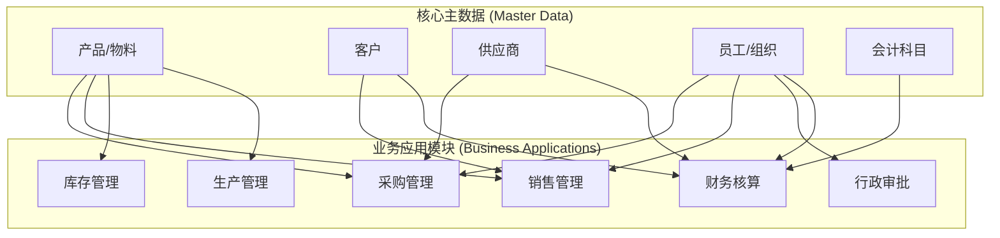
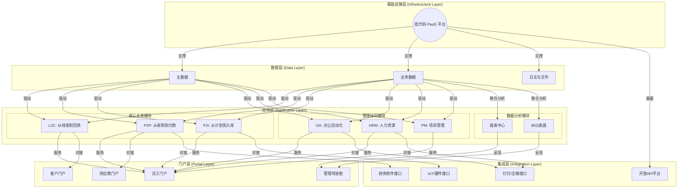

# 企业全链路信息化蓝图规划项目

**项目目标**: 为公司设计一套基于低代码平台的、覆盖全业务链路的企业信息化系统蓝图，并制定分步实施的行动路线图。

**技术平台**: 主流低代码开发平台 (如 氚云、明道云、钉钉宜搭、Power Platform 等)

---

## 第一步：定义核心主数据模块（构建数据基石）

在构建任何业务流程前，必须先定义好全公司统一的、权威的**主数据 (Master Data)**，以保证数据源的唯一性和准确性。

**核心主数据模块**:

1. **产品/物料主数据**: 物料编码、名称、规格、单位、类型等。
2. **客户主数据**: 客户编码、名称、类型、联系人、信用等级等。
3. **供应商主数据**: 供应商编码、名称、资质、主营产品、付款条件等。
4. **员工/组织架构主数据**: 员工工号、姓名、部门、岗位、上级等。
5. **会计科目与成本中心**: 财务核算的基础。

**核心地位示意图**:

---

## 第二步：搭建核心业务流程模块（打通价值链）

将公司的核心业务流程线上化、标准化、自动化，确保数据流的顺畅传递。

* **L2C (Lead to Cash) - 从线索到回款**: 管理整个销售流程，是企业“开源”的主线。
* **P2P (Procure to Pay) - 从采购到付款**: 管理整个采购流程，是企业“节流”的主线。
* **P2I (Plan to Inventory) - 从计划到入库**: (针对制造型企业) 管理整个生产流程。

---

## 第三步：构建管理与协同模块（提升组织效率）

解决业务流程之外的日常管理、行政事务和团队协作问题。

* **OA (Office Automation) - 办公自动化**: 审批流程中心、信息门户、知识库。
* **HRM (Human Resource Management) - 人力资源管理**: 组织人事、招聘、考勤薪酬、绩效。
* **PM (Project Management) - 项目管理**: 项目立项、任务分解、成本归集。
* **资产管理**: 固定资产台账与全生命周期管理。

---

## 第四步：设计数据分析与报表模块（实现数据洞察）

将沉淀的数据转化为有价值的洞察，为决策提供支持。

1. **业务执行层报表**: 面向一线员工的实时明细数据。
2. **管理控制层仪表盘**: 面向部门经理的绩效分析图表。
3. **战略决策层驾驶舱**: 面向高管的、聚焦公司整体健康状况的核心KPI。

---

## 第五步：规划系统集成与扩展（连接内外部）

打破平台与公司其他系统之间的壁垒，实现数据和流程的无缝流转。

* **内部集成**: 财务软件、企业微信/钉钉。
* **外部连接**: 供应商门户(SRM)、客户门户、电子签章/发票平台。
* **硬件集成**: IoT设备数据采集、智能仓储硬件。

---

## 第六步：最终系统架构与数据流总图

这是一张描绘企业信息化全景的宏伟蓝图，是指导一切建设工作的核心地图。

---

## 第七步：分步实施路线图 (Roadmap)

遵循“小步快跑、快速迭代”的敏捷原则，分阶段将蓝图变为现实。

* **阶段一：奠定基础，打通任督二脉 (预计3-6个月)**
  * **任务**: 启动主数据建设、上线OA核心审批、打通P2P或L2C之一。
  * **目标**: 解决核心痛点，快速见效。

* **阶段二：完善核心，扩展管理半径 (预计6-9个月)**
  * **任务**: 打通剩余核心业务线、上线HRM核心模块、启动数据分析、集成钉钉/企微。
  * **目标**: 完善业务闭环，扩展管理能力。

* **阶段三：深度融合，迈向智能运营 (预计9-18个月)**
  * **任务**: (制造型)启动P2I项目、上线项目管理、构建CEO驾驶舱、集成财务软件。
  * **目标**: 实现业财一体化和战略决策支持。

* **阶段四：生态连接，持续优化 (长期)**
  * **任务**: 建设供应商/客户门户、探索IoT集成、根据业务反馈持续迭代。
  * **目标**: 将信息化能力延伸至产业链。
