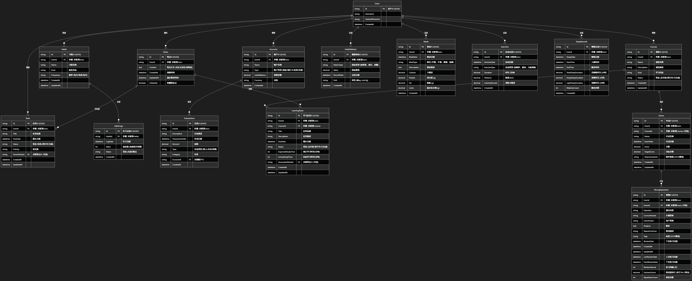

# 架构设计：以功能需求为核心

我们将采用 **路径B：API驱动的“混合”方案**，该方案能够有效支撑“方寸”项目的多样化功能需求和用户体验目标。

## 核心功能驱动的架构选择

### 1. 统一数据管理与复杂关联

**功能需求：** 闪念笔记、日程安排、习惯养成、复式记账、学习/考试管理和健康管理等核心功能涉及多种类型的数据（文本、日期、量化指标、财务记录、学习进度、考试信息、健康数据），且这些数据之间存在紧密的关联（如笔记转化为任务、习惯与日程联动、学习任务与日程联动、知识点与笔记关联、运动与习惯关联）。

**架构支撑：**

- **后端 (ASP.NET Core Web API):** 提供统一的API接口，负责处理所有客户端的数据请求，确保数据的一致性和完整性。通过ORM（如Entity Framework Core）与数据库交互，简化复杂数据模型的管理。
- **数据库 (PostgreSQL):** 选用功能强大的关系型数据库，能够有效存储和管理结构化数据，并通过外键和索引支持复杂的数据关联查询，确保数据的严谨性。

### 2. 跨平台一致性与高效同步

**功能需求：** 用户需要在移动端和桌面端无缝切换，数据实时同步，且能够快速响应操作。

**架构支撑：**

- **前端 (.NET MAUI):** 实现真正的跨平台原生应用体验，确保移动端和桌面端界面和交互的一致性。
- **核心同步逻辑:** 负责结构化数据 (数据库) 与前端展示/编辑内容之间的双向同步。通过Web API进行数据传输，并可结合SignalR等技术实现实时推送，确保数据在不同设备间的即时更新。

### 3. 桌面端智能编辑体验

**功能需求：** 桌面端需要提供高效、智能的编辑体验，支持自定义语法、数据提示、关键词提示，并能实时预览和转换为结构化数据。

**架构支撑：**

- **前端 (.NET MAUI 桌面应用):** 内置一个强大的富文本/代码编辑器组件（例如基于Avalonia UI或Blazor Hybrid的自定义编辑器）。
- **自定义语法解析器:** 在前端实现一个轻量级的解析器，能够识别用户定义的特定语法（例如用于创建任务、记录财务交易的简写），并进行实时解析。
- **智能提示模块:** 基于当前编辑内容和数据库中的已有数据，提供智能的数据提示和关键词自动补全功能。
- **结构化预览:** 编辑器能够实时将解析后的内容渲染为结构化的预览视图，让用户在提交前确认效果。
- **数据转换与上传:** 编辑器将解析后的结构化数据通过Web API提交至后端，由后端进行数据验证和持久化。

### 4. 数据分析与可视化

**功能需求：** 复式记账、习惯养成、日程安排、学习/考试管理、健康管理等功能需要提供丰富的可视化报表和分析工具，帮助用户掌握趋势和做出决策，例如学习进度、考试成绩分析、错题统计、健康指标趋势分析等。

**架构支撑：**

- **后端数据处理:** 后端API除了基本CRUD操作外，还需提供数据聚合、统计分析的接口。
- **前端可视化组件:** 利用.NET MAUI强大的UI能力，集成图表库（如Microcharts、OxyPlot）来渲染各种财务报表、习惯进度图表、日程概览、健康趋势图等。

## 架构图



```mermaid
graph TD
    subgraph "用户设备 (Clients)"
        C1[📱 移动应用 (.NET MAUI)]
        C2[💻 桌面应用 (.NET MAUI) <br> (内置自定义语法编辑器)]
    end

    subgraph "云端服务 (Backend)"
        API[🚀 ASP.NET Core Web API]
        DB[(🗄️ PostgreSQL 数据库)]
    end

    subgraph "核心数据流与智能处理"
        C1 -- "结构化数据 (JSON)" --> API
        C2 -- "自定义语法解析后<br>发送结构化数据 (JSON)" --> API
        API -- "读/写/分析" --> DB
        DB -- "推送数据变更" --> C1
        DB -- "推送数据变更" --> C2
        API -- "智能复习计划 (艾宾浩斯曲线)" --> DB
    end
    
    C2 -- "用户输入" --> CustomEditor[自定义语法编辑器]
    CustomEditor -- "数据/关键词提示" --> C2
    CustomEditor -- "结构化预览" --> PreviewView[预览视图]
    PreviewView -- "确认提交" --> C2

    style C1 fill:#D6EAF8,stroke:#3498DB
    style C2 fill:#D6EAF8,stroke:#3498DB
    style CustomEditor fill:#E8F8F5,stroke:#1ABC9C
    style PreviewView fill:#F8F9F9,stroke:#D6DBDF

    style API fill:#D5F5E3,stroke:#2ECC71
    style DB fill:#FDEDEC,stroke:#E74C3C
```

## 数据库设计 (MVP)

```mermaid
erDiagram
    Users {
        string Id PK "用户ID (GUID)"
        string Username
        string HashedPassword
        datetime CreatedAt
    }

    Notes {
        string Id PK "笔记ID (GUID)"
        string UserId FK "外键: 关联到Users"
        text Content "笔记正文 (自定义语法/结构化)"
        datetime CreatedAt "创建时间"
        datetime UpdatedAt "最后修改时间"
        boolean IsDeleted "软删除标记"
    }
    
    Tasks {
        string Id PK "任务ID (GUID)"
        string UserId FK "外键: 关联到Users"
        string Title "任务标题"
        datetime DueDate "截止日期"
        string Status "状态 (待办/进行中/完成)"
        string Priority "优先级"
        string ParentNoteId FK "关联笔记ID (可选)"
        datetime CreatedAt
        datetime UpdatedAt
    }

    Habits {
        string Id PK "习惯ID (GUID)"
        string UserId FK "外键: 关联到Users"
        string Name "习惯名称"
        string Goal "量化目标"
        string Frequency "频率 (每日/每周/每月)"
        datetime CreatedAt
        datetime UpdatedAt
    }
    
    HabitLogs {
        string Id PK "打卡记录ID (GUID)"
        string HabitId FK "外键: 关联到Habits"
        datetime LogDate "打卡日期"
        int Value "量化值 (如阅读分钟数)"
        string Status "状态 (完成/跳过)"
        datetime CreatedAt
    }

    Accounts {
        string Id PK "账户ID (GUID)"
        string UserId FK "外键: 关联到Users"
        string Name "账户名称"
        string Type "账户类型 (现金/银行卡/投资/负债)"
        decimal InitialBalance "初始余额"
        string Currency "币种"
        datetime CreatedAt
    }
    
    Transactions {
        string Id PK "交易ID (GUID)"
        string UserId FK "外键: 关联到Users"
        string Description "交易描述"
        datetime TransactionDate "交易日期"
        decimal Amount "金额"
        string Type "交易类型 (收入/支出/转账)"
        string Category "分类"
        string AccountId FK "关联账户ID"
        datetime CreatedAt
    }

    Courses {
        string Id PK "课程ID (GUID)"
        string UserId FK "外键: 关联到Users"
        string Name "课程名称"
        string Description "课程描述"
        string Goal "学习目标"
        string Status "状态 (未开始/进行中/已完成)"
        datetime CreatedAt
        datetime UpdatedAt
    }

    LearningTasks {
        string Id PK "学习任务ID (GUID)"
        string UserId FK "外键: 关联到Users"
        string CourseId FK "外键: 关联到Courses"
        string Title "任务标题"
        string Description "任务描述"
        datetime DueDate "截止日期"
        string Status "状态 (未开始/进行中/已完成)"
        int ExpectedStudyTime "预计学习时长(分钟)"
        int ActualStudyTime "实际学习时长(分钟)"
        string AssociatedNoteId FK "关联笔记ID (可选)"
        datetime CreatedAt
        datetime UpdatedAt
    }

    Exams {
        string Id PK "考试ID (GUID)"
        string UserId FK "外键: 关联到Users"
        string CourseId FK "外键: 关联到Courses (可选)"
        string Name "考试名称"
        datetime ExamDate "考试日期"
        decimal Score "分数"
        decimal TargetScore "目标分数"
        string AttachmentUrls "附件链接 (JSON数组)"
        datetime CreatedAt
        datetime UpdatedAt
    }

    WrongQuestions {
        string Id PK "错题ID (GUID)"
        string UserId FK "外键: 关联到Users"
        string ExamId FK "外键: 关联到Exams (可选)"
        string Question "题目内容"
        string CorrectAnswer "正确答案"
        string UserAnswer "用户答案"
        text Analysis "解析"
        string ReasonForError "错误原因"
        string Tags "标签 (JSON数组)"
        datetime ReviewDate "下次复习日期"
        datetime CreatedAt
        datetime UpdatedAt
        datetime LastReviewDate "上次复习日期"
        datetime NextReviewDate "下次复习日期"
        int ReviewInterval "复习间隔 (天)"
        decimal EasinessFactor "简易度因子 (用于SM-2算法)"
        int RepetitionCount "重复次数"
    }

    HealthMetrics {
        string Id PK "健康指标ID (GUID)"
        string UserId FK "外键: 关联到Users"
        string MetricType "指标类型 (如体重、血压、血糖)"
        decimal Value "指标数值"
        datetime RecordDate "记录日期"
        string Unit "单位 (如kg, mmHg)"
        datetime CreatedAt
    }

    Meals {
        string Id PK "餐食ID (GUID)"
        string UserId FK "外键: 关联到Users"
        datetime MealDate "餐食日期"
        string MealType "餐次 (早餐、午餐、晚餐、加餐)"
        text Description "餐食描述"
        decimal Calories "卡路里"
        decimal Protein "蛋白质 (g)"
        decimal Fat "脂肪 (g)"
        decimal Carbs "碳水化合物 (g)"
        datetime CreatedAt
    }

    Exercises {
        string Id PK "运动记录ID (GUID)"
        string UserId FK "外键: 关联到Users"
        datetime ExerciseDate "运动日期"
        string ExerciseType "运动类型 (如跑步、游泳、力量训练)"
        decimal Duration "时长 (分钟)"
        decimal Distance "距离 (km)"
        decimal CaloriesBurned "消耗卡路里"
        datetime CreatedAt
    }

    SleepRecords {
        string Id PK "睡眠记录ID (GUID)"
        string UserId FK "外键: 关联到Users"
        datetime SleepDate "睡眠日期"
        datetime StartTime "入睡时间"
        datetime EndTime "醒来时间"
        decimal TotalSleepDuration "总睡眠时长 (小时)"
        decimal DeepSleepDuration "深睡时长 (小时)"
        decimal LightSleepDuration "浅睡时长 (小时)"
        int WakeUpCount "醒来次数"
        datetime CreatedAt
    }

    Users ||--o{ Notes : "拥有"
    Users ||--o{ Tasks : "管理"
    Users ||--o{ Habits : "养成"
    Users ||--o{ Accounts : "管理"
    Users ||--o{ Courses : "管理"
    Users ||--o{ HealthMetrics : "记录"
    Users ||--o{ Meals : "记录"
    Users ||--o{ Exercises : "记录"
    Users ||--o{ SleepRecords : "记录"
    Habits ||--o{ HabitLogs : "记录"
    Accounts ||--o{ Transactions : "包含"
    Notes ||--o{ Tasks : "可生成"
    Courses ||--o{ LearningTasks : "包含"
    Courses ||--o{ Exams : "包含"
    Exams ||--o{ WrongQuestions : "产生"
    Notes ||--o{ LearningTasks : "关联"
```



## 架构可扩展性评估与渐进式演进建议

现有“API驱动的混合方案”为“方寸”提供了一个坚实的基础。为了支持用户所设想的宏大愿景和未来扩展，同时兼顾成本和部署复杂性，建议采取一种**渐进式演进策略**，从“模块化单体”开始，并为未来的“微服务”转型预留可能性。

### 1. **核心架构原则：模块化单体 (Modular Monolith)**

- **挑战：** 传统单体应用易于部署，但随着功能增多，代码耦合度高，难以维护和扩展。完整的微服务架构在初期会引入显著的成本和运维复杂性。
- **改进建议：** 在MVP阶段，采用**模块化单体**架构。
  - **优点：**
    - **低成本启动：** 仍然以一个部署单元为主，降低了初期开发、部署和运维的复杂性和成本。
    - **高内聚低耦合：** 通过清晰的领域驱动设计（DDD）划分业务模块，每个模块拥有独立的业务逻辑、数据模型和API接口（内部）。模块之间通过明确的接口进行通信，减少直接依赖。
    - **易于重构：** 模块化设计使得未来将单个模块拆分为独立微服务变得相对容易。
  - **实施策略：**
    - 后端（ASP.NET Core Web API）内部划分为多个逻辑模块（例如：Notes.API, Scheduler.API, HabitTracker.API, Accounting.API, Learning.API, Health.API），每个模块拥有独立的文件夹结构、领域模型和仓储层。
    - 模块之间通过内部接口或事件进行通信，避免直接调用其他模块的实现细节。
    - 前端 (.NET MAUI) 也采用类似的模块化和组件化设计，每个功能模块对应一个或多个UI组件。

### 2. **数据存储策略：以 PostgreSQL 为主，预留多模扩展**

- **挑战：** 随着数据类型多样化，单一关系型数据库可能在某些场景下表现不佳。
- **改进建议：** 初始阶段继续以 **PostgreSQL** 作为主要数据存储。
  - **优点：** PostgreSQL 功能强大，足以支撑MVP阶段的所有结构化数据和大部分非结构化数据（如通过 JSONB 字段存储）。
  - **实施策略：** 在数据模型设计时，对未来可能需要独立存储的数据类型（如知识图谱的图形数据、时序数据）进行识别和标记。在数据量和业务复杂度达到一定程度时，再考虑引入**多模数据库**，例如：
    - **知识图谱：** 考虑 Neo4j 等图数据库。
    - **非结构化文档：** 考虑 MongoDB 等文档数据库。
    - **时序数据：** 考虑 InfluxDB 等时序数据库。

### 3. **实时能力与事件驱动：渐进式引入消息队列**

- **挑战：** 随着实时协作、智能推荐、自动化等功能的增加，需要更强大的实时处理能力和异步通信机制。
- **改进建议：** 渐进式引入**消息队列（Message Queue）**。
  - **优点：** 在模块化单体内部，消息队列可以作为模块间异步通信的机制，减少直接依赖，提高系统响应速度。
  - **实施策略：** 初始阶段可以使用轻量级的内部消息总线或直接的事件发布/订阅模式。随着业务复杂性增加，再引入成熟的消息队列服务（如 RabbitMQ, Kafka），以支持更复杂的事件驱动架构和跨服务通信。

### 4. **AI/智能服务集成：独立部署，API调用**

- **挑战：** AI 辅助整理、智能调度、智能推荐、艾宾浩斯曲线计算等功能需要专门的 AI 模型和计算资源。
- **改进建议：** 将 AI/智能服务作为独立的**可部署服务**。
  - **优点：** AI 服务可以独立于核心业务逻辑进行开发、部署和迭代。可以根据需求选择不同的 AI 框架和模型。
  - **实施策略：** 可以将 AI 相关功能封装成独立的模块（可以是微服务，也可以是独立部署的函数服务），通过 API 提供给核心后端服务调用，例如 AI 摘要服务、智能推荐服务、遗忘曲线计算服务。

### 5. **前端架构：组件化与可配置**

- **挑战：** 随着功能模块的增多，.NET MAUI 应用可能会变得庞大，组件复用和管理变得复杂。
- **改进建议：** 强化**组件化和可配置**设计。
  - **优点：** 将前端界面拆分为独立的、可复用的组件。通过配置中心或特性开关，允许用户根据需求启用或禁用特定模块的UI，避免界面臃肿。
  - **实施策略：** 从一开始就遵循严格的组件化规范。可以考虑在前端引入插件化机制（例如通过动态加载DLL或WebAssembly模块），但这属于更高级的扩展，可在后期考虑。

### 6. **用户与权限管理：灵活的RBAC模型**

- **挑战：** 引入付费功能、未来的家庭协作等，需要更细粒度的用户和权限控制。
- **改进建议：** 采用 **RBAC (Role-Based Access Control)** 模型，并预留扩展到 ABAC (Attribute-Based Access Control) 的能力。
  - **优点：** 能够灵活配置不同用户角色（免费用户、高级用户、家庭成员、管理员）的访问权限，支持更复杂的业务场景。
  - **实施策略：** 在用户管理模块中设计完善的角色、权限、用户组管理功能。

**总结：**

现有架构为“方寸”的初期发展提供了良好的基础。为了实现“全能软件生态”的宏大愿景，并支持未来不断增长的功能需求，建议在现有基础上逐步采纳上述架构改进建议。这些改进应是迭代式的，根据产品发展阶段和实际需求进行优先级排序和实施。关键在于保持架构的开放性、灵活性和可扩展性，为“方寸”的长期发展奠定坚实基础。
