# 数据库模式 (ERD) - 元数据驱动模型 (修正版)

本文档定义了 "方寸" 项目的核心数据实体及其关系。我们采用**元数据驱动 (Metadata-Driven Design)** 的设计哲学来处理大部分业务对象，同时，对于核心且相对稳定的通用实体（如 `Accounts`），则保持其独立性，以平衡灵活性和实际开发效率。

## 1. 核心 ERD

```mermaid
erDiagram
    Users {
        string Id PK "用户ID (GUID)"
        string Username
        string HashedPassword
        datetime CreatedAt
    }

    Roles {
        string Id PK "角色ID"
        string Name "角色名称 (e.g., FreeUser, PremiumUser, Admin)"
        string Description "角色描述"
    }

    Permissions {
        string Id PK "权限ID"
        string Name "权限名称 (e.g., create_item, view_report, edit_family_member)"
        string Description "权限描述"
    }

    UserRoles {
        string UserId FK "用户ID"
        string RoleId FK "角色ID"
    }

    RolePermissions {
        string RoleId FK "角色ID"
        string PermissionId FK "权限ID"
    }

    Accounts {
        string Id PK "账户ID (GUID)"
        string UserId FK "外键: 关联到Users"
        string Name "账户名称 (e.g., Assets:Cash:Alipay)"
        string Type "账户类型 (资产/负债/收入/支出/权益)"
        string Currency "币种 (e.g., CNY)"
        boolean IsActive "是否激活"
        datetime CreatedAt
    }

    UserDevices {
        string Id PK "设备ID (GUID)"
        string UserId FK "外键: 关联到Users"
        string DeviceName "设备名称"
        string DeviceType "设备类型 (Mobile, Desktop)"
        string LastLoginIp "上次登录IP"
        datetime LastLoginAt "上次登录时间"
        boolean IsActive "是否活跃"
        datetime CreatedAt
    }

    Items {
        string Id PK "项目ID (万物皆项目)"
        string UserId FK "所属用户"
        string ItemTypeId FK "项目类型 (e.g., Task, Note, Transaction)"
        string Title "项目标题 (用于显示和搜索)"
        datetime CreatedAt
        datetime UpdatedAt
    }

    ItemTypes {
        string Id PK "类型ID (e.g., 'type_task', 'type_note')"
        string Name "类型名称 (Task, Note, Book, Transaction)"
        string Icon "图标"
        string Description "类型描述"
    }

    Properties {
        string Id PK "属性ID (e.g., 'prop_duedate', 'prop_status', 'prop_balance')"
        string Name "属性名称 (e.g., DueDate, Amount, Status, Balance, Currency)"
        string DataType "数据类型 (Text, Number, Date, Select, Relation, etc.)"
        jsonb Options "属性选项 (例如 Select 类型的可选值)"
    }

    TypeProperties {
        string ItemTypeId FK "关联到 ItemTypes"
        string PropertyId FK "关联到 Properties"
        boolean IsRequired "是否必填"
        string DefaultValue "默认值"
    }

    Values {
        string ItemId FK "关联到 Items"
        string PropertyId FK "关联到 Properties"
        string Value "具体的值 (统一存储为字符串，根据 Property.DataType 解析)"
    }

    Relations {
        string SourceItemId FK "源 Item ID"
        string PropertyId FK "通过哪个属性关联"
        string TargetItemId FK "目标 Item ID"
    }
    
    Transactions {
        string Id PK "交易ID (GUID)"
        string UserId FK "外键: 关联到Users"
        datetime Date "交易日期"
        string Payee "收款人/商户"
        string Narration "交易描述"
        datetime CreatedAt
    }

    Postings {
        string Id PK "分录ID (GUID)"
        string TransactionId FK "外键: 关联到Transactions"
        string AccountName "账户名称 (引用 Accounts.Name)"
        decimal Amount "金额"
        string Currency "货币"
        datetime CreatedAt
    }


    Users ||--o{ Items : "创建"
    Users ||--o{ UserRoles : "拥有"
    Users ||--o{ UserDevices : "登录"
    Roles ||--o{ UserRoles : "被赋予"
    Roles ||--o{ RolePermissions : "拥有"
    Permissions ||--o{ RolePermissions : "被赋予"
    Users ||--o{ Accounts : "管理"
    Users ||--o{ Transactions : "发起"

    ItemTypes ||--o{ Items : "归类于"
    Items ||--|{ Values : "拥有值"
    Properties ||--|{ Values : "定义了"
    ItemTypes }|--|{ TypeProperties : "定义了"
    Properties }|--|{ TypeProperties : "被定义于"
    Items }|--o{ Relations : "作为源"
    Items }o--|{ Relations : "作为目标"
    Properties ||--o{ Relations : "作为关系类型"
    Transactions ||--|{ Postings : "包含"

```

## 2. 核心实体解析

1. **`Users` (用户)**: 系统的基础，所有数据都归属于特定用户。
2. **`Roles` (角色)**: 定义用户在系统中的权限集合。
3. **`Permissions` (权限)**: 具体的系统操作或数据访问权限。
4. **`UserRoles` / `RolePermissions`**: 实现 RBAC 模型的关联表。
5. **`Accounts` (账户)**: **核心通用实体**。独立存在，用于管理用户的财务账户信息。
6. **`UserDevices` (用户设备)**: 记录用户登录过的设备信息，用于多端登录管理和安全控制。
7. **`Items` (项目)**: 系统的核心，代表“万物”。一个 `Item` 可以是任务、笔记、交易等。
8. **`ItemTypes` (类型)**: 定义了 `Item` 的类别，如“任务”、“笔记”、“交易”。
9. **`Properties` (属性)**: 定义了可以用来描述 `Item` 的“字段”，如“截止日期”、“状态”。
10. **`TypeProperties` (类型-属性关联)**: 定义了哪种 `ItemType` 可以拥有哪些 `Properties`。
11. **`Values` (值)**: 存储 `Item` 的基本属性值（文本、数字、日期等）。
12. **`Relations` (关系)**: 作为“关系登记处”，专门存储 `Item` 之间的链接，是实现知识图谱能力的基础。
13. **`Transactions` (交易)**: 独立存在，存储 Beancount 交易的元信息。
14. **`Postings` (分录)**: 独立存在，存储 Beancount 交易的具体账户变动。

## 3. 架构决策与挑战应对

### 3.1 Beancount 兼容性

* **方案**: 通过“数据映射”实现。Beancount 的“交易”直接映射到 `Transactions` 表，其“分录”映射到 `Postings` 表。Beancount 交易和分录中的元数据，则仍然可以映射到 `Items` 和 `Values` 表（通过为 `Transactions` 和 `Postings` 创建对应的 `Item`，并关联其元数据）。
* **结论**: **完全兼容**。MDD 模型和独立账户/交易表可以协同工作。

### 3.2 查询性能与数据量膨胀

* **挑战**: `Values` 和 `Relations` 表的行数会随用户使用而急剧增长，若不加优化，复杂的 `JOIN` 查询将导致性能瓶颈。
* **应对策略 (渐进式演进)**:
    1. **MVP 阶段 - 强力索引 (Aggressive Indexing)**: 在 `Values` 和 `Relations` 表的关键字段（如 `ItemId`, `PropertyId`, `SourceItemId`, `TargetItemId`）上建立复合索引，这是保证基础查询性能的第一道防线。
    2. **增长阶段 - 数据库分区 (Partitioning)**: 当单表数据量达到千万级以上时，启用 PostgreSQL 的表分区功能。可以按 `UserId` 或时间进行水平分区，将一张逻辑大表切分为物理小表，查询时引擎只需扫描相关分区，极大提升效率。
    3. **平台阶段 - 读写分离 (CQRS)**: 当系统需要承载大规模并发读取时，引入读写分离架构。写操作依然面向规范化的 MDD 模型；同时通过后台事件，将数据“预拼装”成优化的只读 JSON 文档，存入专门的读取库（如 Elasticsearch 或非规范化的表）。所有前端查询都访问这个只读库，以获得极致的查询性能。

**总结**: MDD 模型的性能和数据量挑战是真实存在的，但通过成熟的数据库技术和架构模式，这些挑战是**完全可以被工程化解决的**。我们的策略是从最简单的索引优化开始，为未来的分区和读写分离预留了清晰的演进路径。
