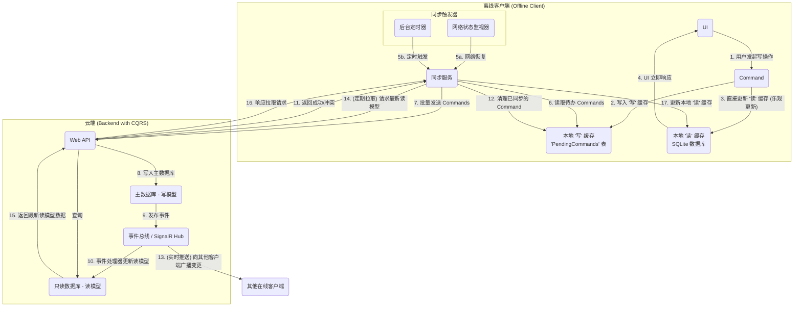

# 架构设计：离线同步与数据一致性方案

本文档详细阐述了 "方寸" 项目为实现跨平台、离线优先和数据实时同步所采用的核心架构方案。该方案旨在平衡用户体验的流畅性、数据模型的最终一致性以及系统架构的复杂性。

## 1. 核心挑战

现代多端应用必须解决的核心挑战是：如何在保证用户在离线状态下依然能流畅操作的同时，确保所有设备上的数据在网络恢复后能快速、准确地达成一致。

## 2. 核心原则

* **服务器是单一事实来源 (Single Source of Truth)**: 云端数据库是唯一权威的数据存储。
* **离线优先 (Offline-First)**: 客户端必须能够在没有网络连接的情况下独立运行。
* **乐观更新 (Optimistic UI)**: 本地操作应立即反馈在UI上，无需等待服务器确认。
* **最终一致性 (Eventual Consistency)**: 我们接受数据在不同设备间存在短暂的不一致，但保证通过同步机制，所有设备最终会达到与服务器完全一致的状态。

## 3. 架构方案：本地伪CQRS + 服务端完整CQRS

我们采用一种在客户端模拟CQRS思想，而在服务器端实现完整CQRS的混合方案，以应对离线场景。

### 3.1 架构图 (带工作流序号)



### 3.2 工作流详解

1. **用户操作**: 用户在UI上进行修改（增、删、改）。
2. **创建命令**: 应用将用户的意图封装成一个明确的 `Command` 对象（如 `CreateItemCommand`）。
3. **写入本地队列**: `Command` 被序列化后，持久化到本地的一个“待办发件箱”队列中（如 `PendingCommands` 表）。这确保了即使应用被关闭，用户的操作也不会丢失。
4. **乐观更新**: 应用**立即**根据这个 `Command` 的内容去修改本地的“读”缓存数据库（SQLite）。UI通过数据绑定机制，实时刷新，给用户操作立即生效的流畅体验。
5. **触发同步**:
    * (a) **网络状态触发**: 一个常驻的**网络监视器**检测到网络从离线恢复为在线状态。
    * (b) **定时触发**: 一个后台**计时器**（例如每分钟）定期触发。
    * 两者之一会“唤醒”沉睡的“同步服务”。
6. **读取队列**: “同步服务”检查“发件箱”中是否有待处理的 `Command`。
7. **上传命令**: 将队列中的 `Command` 按顺序批量发送到服务器的 Web API。
8. **执行写入 (服务端)**: 服务器 API 对 `Command` 进行业务逻辑校验，然后更新**主数据库（写模型）**。
9. **发布事件 (服务端)**: 写入成功后，在**事件总线**上发布一个领域事件（如 `ItemCreatedEvent`）。
10. **更新读模型 (服务端)**: 一个或多个后台的**事件处理器**监听到该事件，并负责更新**只读数据库（读模型）**。
11. **返回结果**: API 向客户端的“同步服务”返回每个 `Command` 的处理结果（成功、失败、或冲突）。
12. **清理队列**: “同步服务”根据成功返回的结果，从“发件箱”中安全地移除对应的 `Command`。
13. **实时推送**: 事件总线（通过 SignalR Hub）将数据变更的实时消息广播给**除源客户端之外**的所有其他在线客户端。
14. **定期拉取**: 除了实时推送，“同步服务”也会定期向服务器发起一个“拉取”请求，以获取最新的“读模型”数据，作为数据校准和补偿机制。
15. **查询读模型**: 服务器 API 从高性能的“只读数据库”中获取数据。
16. **响应拉取**: API 将最新的数据返回给客户端。
17. **同步本地缓存**: “同步服务”用从服务器拉取的权威数据来更新本地的“读”缓存数据库（SQLite），完成数据同步的最终闭环。在此阶段，需要实现**冲突解决 (Conflict Resolution)** 策略。

## 4. 客户端本地数据库设计

客户端的本地数据库 (SQLite) 旨在为快速读取、UI渲染和离线写操作提供支持。它本质上是服务端“读模型”的一个本地非规范化副本，并存储离线操作的命令。

### 4.1 核心表结构

1. **`LocalItems` 表 (本地项目 - 读缓存)**:
    * 存储服务端所有 `Item` 类型（包括任务、笔记、**账户**、**交易**等）的扁平化数据。
    * **结构**:

        ```mermaid
        erDiagram
            LocalItems {
                string Id PK "Item ID"
                string ItemTypeId "Item类型 (e.g., 'type_task', 'type_transaction', 'type_account')"
                string Title "项目标题 (或交易描述)"
                jsonb PropertiesJson "所有属性的扁平化 JSON"
                datetime LastSyncedAt "最后同步时间"
                string SyncStatus "同步状态 (Synced, Pending, Conflict)"
                datetime CreatedAt
                datetime UpdatedAt
            }
        ```

    * **`PropertiesJson`**: 这是关键字段。它存储了一个 `Item` 的所有属性（包括值和关系）预先组装成的 JSON 文档。客户端UI可以直接读取这个 JSON，而无需进行复杂的 `JOIN` 操作。对于记账相关的 `Transactions` 和 `Accounts`，它们在服务端虽然是独立表，但在同步到客户端时，也会被**扁平化为 JSON**，并作为 `ItemType` 为 "Transaction" 或 "Account" 的 `Item` 的 `PropertiesJson` 存储。

2. **`PendingCommands` 表 (待处理命令 - 写缓存)**:
    * 存储离线时用户操作生成的 `Command` 队列，等待网络恢复后上传到服务器。
    * **结构**:

        ```mermaid
        erDiagram
            PendingCommands {
                string Id PK "Command ID"
                string CommandType "命令类型 (e.g., CreateItem, UpdateItem, DeleteItem)"
                jsonb CommandPayload "Command 的具体内容 (JSON)"
                datetime CreatedAt
                int RetryCount "重试次数"
                string Status "状态 (Pending, Failed)"
            }
        ```

    * **`CommandPayload`**: 存储原始的 `Command` 对象，等待上传。

## 5. 关键技术点

* **客户端**: 需要一个轻量级的本地数据库（如 SQLite），一个管理 `PendingCommands` 的队列，以及一个负责网络监听和后台任务的同步服务。
* **服务端**: 需要实现 CQRS 模式，引入事件总线（如 MediatR 或更重的 RabbitMQ/Kafka），以及一个实时消息推送方案（如 SignalR）。
* **冲突解决**: 必须设计一套明确的冲突解决策略，例如“最后写入者获胜 (Last Write Wins)”或更复杂的“操作转换 (Operational Transformation, OT)”。对于 MVP 阶段，LWW 通常是最简单有效的选择。
