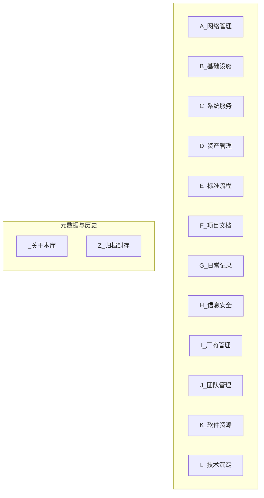

# 知识库导览 (V2.0)

## 1. 欢迎来到IT部知识库

本知识库是IT部官方的、唯一的、权威的知识管理中心。它采用“**矩阵式管理模型**”，旨在沉淀团队核心知识资产，提升协作效率，并为所有IT工作提供“单一事实来源”。

---

## 2. 核心架构：矩阵式管理模型

本知识库的顶层由以下**14个核心管理维度**构成，每个维度都是一篇独立的“索引页”或“驾驶舱”。

---

## 3. 一级分类速查

| 编号 | 名称 | 核心职责 |
| :--- | :--- | :--- |
| **_** | `_关于本库` | 知识库自身的“宪法”与“说明书”。 |
| **A** | `A_网络管理` | **逻辑层**：管理IP、路由、VLAN和访问策略。 |
| **B** | `B_基础设施` | **物理层**：管理机房、服务器、存储、布线等实体。 |
| **C** | `C_系统服务` | **服务层**：负责服务的部署、配置和日常运维。 |
| **D** | `D_资产管理` | **资产层**：以“物”为核心，跟踪资产的生命周期。 |
| **E** | `E_标准流程` | **流程层**：定义“如何规范地做”的SOP。 |
| **F** | `F_项目文档` | **项目层**：管理有时限、有目标的IT项目。 |
| **G** | `G_日常记录` | **执行层**：记录“已经做了什么”的动态日志。 |
| **H** | `H_信息安全` | **安全层**：定义“如何才能安全地做”的策略与审计。 |
| **I** | `I_厂商管理` | **商务层**：管理供应商、合同与维保。 |
| **J** | `J_团队管理` | **组织层**：管理团队成员、职责与目标。 |
| **K** | `K_软件资源` | **资源层**：存放软件、许可与驱动。 |
| **L** | `L_技术沉淀` | **知识层**：内化个人经验与外部知识。 |
| **Z** | `Z_归档封存` | **历史层**：存放已结束、已过时的所有内容。 |

---

## 4. 如何开始？

**新成员第一站：** 请从 `_关于本库` 开始，阅读以下核心规范：

* `_02_分类与目录规范`
* `_03_文件命名规范`
* `_04_治理与维护策略`

**核心使用原则：**

1. **归类先问维**：创建文档时，先思考它属于哪个管理维度。
2. **资产必有页**：在 `D_资产管理` 中为每个核心IT资产创建“资产主页”。
3. **万物皆链接**：通过 `[[双向链接]]` 将所有相关信息串联起来。
