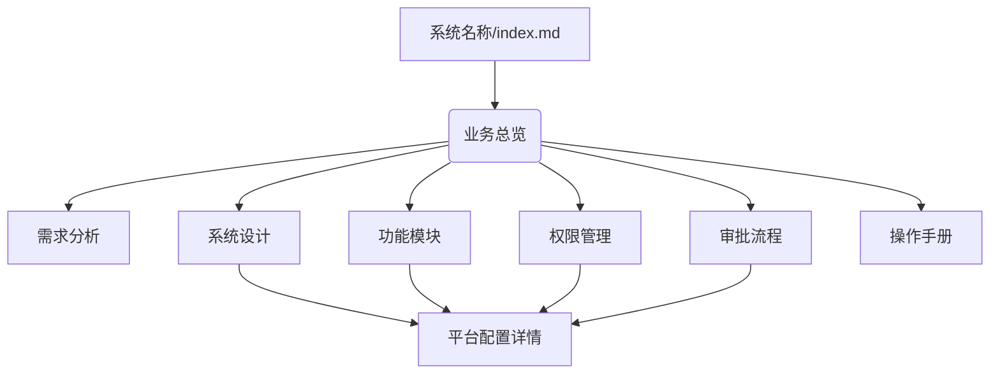
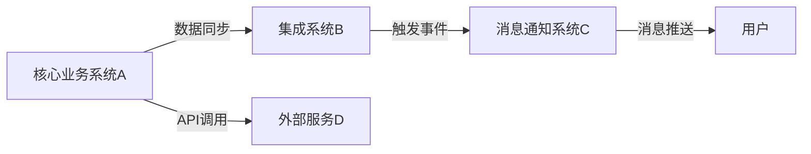

# TECH-文档体系指南

## 1. 引言

本文档旨在为企业数智化知识库中信息化系统相关文档的编写、组织和维护提供统一的指导原则和最佳实践。通过明确文档的类型、作用、相互关系以及与其他系统的联动描述方式，确保文档的清晰性、完整性、可追溯性和可维护性，从而更好地支持系统的生命周期管理。

## 2. 文档类型与作用

本知识库中的系统文档主要分为以下几类，它们共同构成了一个系统的全面视图：

### 2.1. 业务总览 (TECH-系统名称-业务总览.md)

* **作用**：作为系统业务层面的高层入口和导航中心，提供系统目标、背景、核心需求、功能模块概览、主要业务流程概览、角色与权限概览以及与其他系统的联动概述。它既提供概览，也通过内部链接跳转到详细文档。
* **适用读者**：所有相关人员（管理层、产品经理、业务人员、技术人员）。

### 2.2. 需求分析 (SRS-系统名称.md 或 TECH-系统名称-需求分析(SRS).md)

* **作用**：详细阐述系统的功能性需求和非功能性需求，作为系统设计、开发、测试和验收的依据。明确系统“应该做什么”。
* **适用读者**：产品经理、业务分析师、系统设计师、开发人员、测试人员。

### 2.3. 系统设计 (TECH-系统名称-系统设计.md)

* **作用**：描述系统“如何实现”的抽象蓝图，包括系统架构、模块划分、数据模型、核心业务流程逻辑、抽象的权限设计等，不涉及具体平台实现细节。
* **适用读者**：系统设计师、开发人员、架构师。

### 2.4. 功能模块 (TECH-系统名称-功能模块.md)

* **作用**：对系统中的每个主要功能模块进行深入描述，包括业务规则、界面描述、业务逻辑流程图、数据模型关联等。侧重于平台无关的业务实现。
* **适用读者**：产品经理、业务分析师、开发人员、测试人员。

### 2.5. 权限管理 (TECH-系统名称-权限管理.md)

* **作用**：明确系统中不同用户角色的业务层面的操作权限和数据访问范围，确保系统安全、合规。侧重于权限的业务定义，不涉及平台配置细节。
* **适用读者**：系统管理员、安全管理员、开发人员、测试人员。

### 2.6. 审批流程 (TECH-系统名称-审批流程.md)

* **作用**：描述业务流程的流转和控制，确保业务操作的规范性。侧重于业务层面的审批节点、审批人、审批条件和流转规则，不涉及平台配置细节。
* **适用读者**：业务人员、流程管理员、系统管理员、开发人员。

### 2.7. 平台配置详情 (TECH-系统名称-平台配置详情.md)

* **作用**：记录系统在特定技术平台（例如氚云、Salesforce、自研框架等）上的具体实现细节和配置信息。
* **特点**：
  * **平台相关性强**：内容与具体平台紧密绑定。
  * **易变性**：当底层平台更换时，这部分内容将需要完全更新或替换。
  * **与核心文档解耦**：与业务逻辑和系统设计分离，避免因平台变更而大规模修改核心文档。
* **适用读者**：平台管理员、开发人员、运维人员。

### 2.8. 操作手册 (TECH-系统名称-操作手册.md)

* **作用**：为最终用户和系统管理员提供详细的操作指南，帮助用户快速熟悉系统各项功能的使用方法。
* **适用读者**：最终用户、系统管理员。

## 3. 文档之间的关系

以下Mermaid图展示了各文档类型之间的主要关系：

* **业务总览**：作为系统的业务高层入口和导航中心。
* **需求分析**：是系统设计和功能模块的基础，定义了系统“做什么”。
* **系统设计**：将需求转化为抽象技术蓝图，指导功能模块的实现。
* **功能模块**：详细描述了系统各个具体功能的平台无关业务实现。
* **权限管理 & 审批流程**：是贯穿于需求、设计和功能模块中的重要业务规定。
* **平台配置详情**：是系统设计、功能、权限、审批在具体平台上的实现细节，与核心业务和设计文档解耦。
* **操作手册**：是面向最终用户的指南，基于所有功能实现。

## 4. 系统联动与数据流动描述

在系统文档中清晰地描述与其他系统的联动和数据流动至关重要，尤其是在微服务架构或多系统集成的企业环境中。

### 4.1. 描述位置与方式

* **业务总览**：高层提及系统与其他关键系统的关系和数据流动概述。
* **系统设计**：
  * **系统架构图**：明确标识与外部系统的接口和集成点（例如：ERP、财务系统、消息通知平台等）。
  * **数据模型设计**：说明外部系统数据同步的字段来源或去向。
  * **流程设计**：增加外部系统参与的抽象业务流程节点。
* **功能模块**：在具体功能点描述中，说明与外部系统的数据交互的业务逻辑。
* **平台配置详情**：详细描述特定平台（如氚云）如何通过API、Webhook、数据集成等方式与外部系统连接，包括配置细节、数据映射规则。
* **专门的“系统集成文档” (可选)**：当集成复杂时，可创建独立文档 `TECH-系统名称-系统集成.md`。

### 4.2. 数据流动描述要点

在描述数据流动时，应包含以下信息：

* **数据源与目标**：数据从哪个系统流向哪个系统。
* **触发机制**：什么事件触发了数据流动（例如：采购申请批准、领用超额）。
* **数据内容**：流动的数据具体包含哪些字段。
* **传输方式**：API调用、文件传输（FTP/SFTP）、消息队列、数据库同步等。
* **数据格式**：JSON、XML、CSV等。
* **频率**：实时、定时、批量。
* **错误处理机制**：数据传输失败如何处理、重试机制。
  * **安全性**：数据传输的加密、认证授权等。

### 4.3. 数据流动示例图

## 5. 文档编写原则

* **以读者为中心**：根据目标读者调整详略。
* **结构清晰，易于导航**：使用清晰的标题、子标题、列表、图表和内部链接。
* **图文并茂**：利用流程图、ER图、界面原型等可视化元素。
* **保持一致性**：遵循统一的术语、格式和模板。
* **可追溯性**：文档内容应能追溯到原始需求，便于变更管理。
* **持续更新**：随系统演进而及时更新。

## 6. 文档模板使用指南

为了方便新系统文档的创建，我们提供了标准化的文档模板。这些模板位于 `_templates/system_documentation/` 目录下，包含各类型文档的结构和占位符。

### 6.1. 模板列表

* [`_templates/system_documentation/TECH-系统名称-业务总览_TEMPLATE.md`](_templates/system_documentation/TECH-系统名称-业务总览_TEMPLATE.md)
* [`_templates/system_documentation/TECH-系统名称-需求分析(SRS)_TEMPLATE.md`](_templates/system_documentation/TECH-系统名称-需求分析(SRS)_TEMPLATE.md)
* [`_templates/system_documentation/TECH-系统名称-系统设计_TEMPLATE.md`](_templates/system_documentation/TECH-系统名称-系统设计_TEMPLATE.md)
* [`_templates/system_documentation/TECH-系统名称-功能模块_TEMPLATE.md`](_templates/system_documentation/TECH-系统名称-功能模块_TEMPLATE.md)
* [`_templates/system_documentation/TECH-系统名称-权限管理_TEMPLATE.md`](_templates/system_documentation/TECH-系统名称-权限管理_TEMPLATE.md)
* [`_templates/system_documentation/TECH-系统名称-审批流程_TEMPLATE.md`](_templates/system_documentation/TECH-系统名称-审批流程_TEMPLATE.md)
* [`_templates/system_documentation/TECH-系统名称-平台配置详情_TEMPLATE.md`](_templates/system_documentation/TECH-系统名称-平台配置详情_TEMPLATE.md)
* [`_templates/system_documentation/TECH-系统名称-操作手册_TEMPLATE.md`](_templates/system_documentation/TECH-系统名称-操作手册_TEMPLATE.md)

### 6.2. 使用步骤

1. **选择模板**：根据您要编写的文档类型，从上述列表中选择对应的模板文件。
2. **复制模板**：将选定的模板文件复制到目标系统的文档目录下（例如：`20_系统与应用/你的新系统/`）。
3. **重命名文件**：按照命名规范（`TECH-系统名称-具体主题.md`），将复制的模板文件重命名。例如，将 `TECH-系统名称-业务总览_TEMPLATE.md` 重命名为 `TECH-你的新系统名称-业务总览.md`。
4. **填充内容**：打开重命名后的文件，根据文件中的提示和占位符，逐步填充具体内容。请删除模板中的 `[请在此处...]` 等提示信息。
5. **图表绘制**：对于流程图、ER图等，请使用Mermaid语法直接在Markdown文件中绘制，确保图文并茂。
6. **内部链接**：在文档内容中，请使用相对路径创建内部链接，连接到同一系统下的其他相关文档。
7. **持续更新**：随着系统的迭代和演进，请务必及时更新相关文档，保持文档与系统实际情况的一致性。
