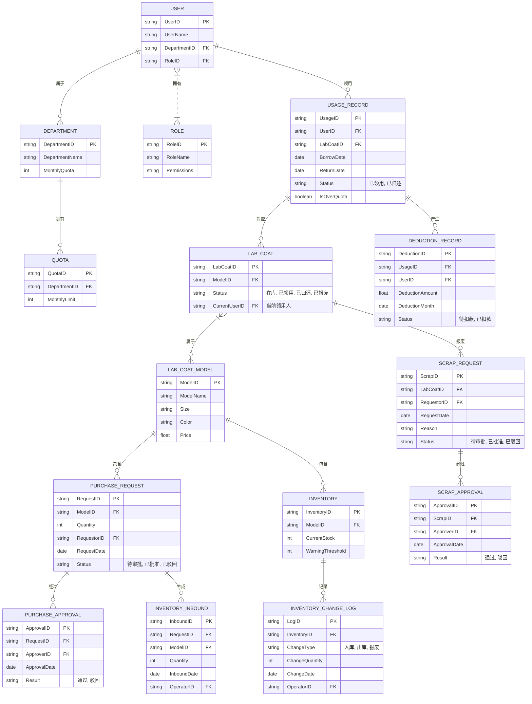
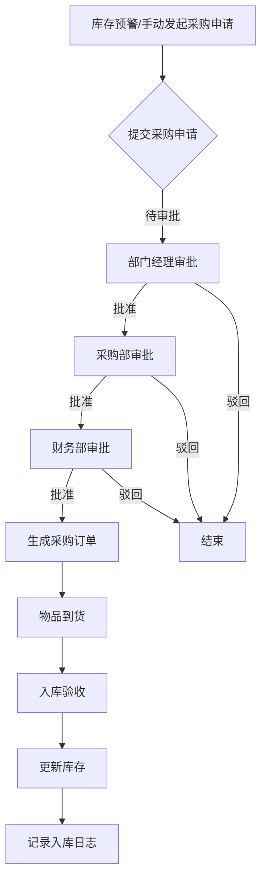
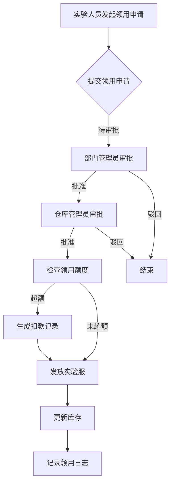
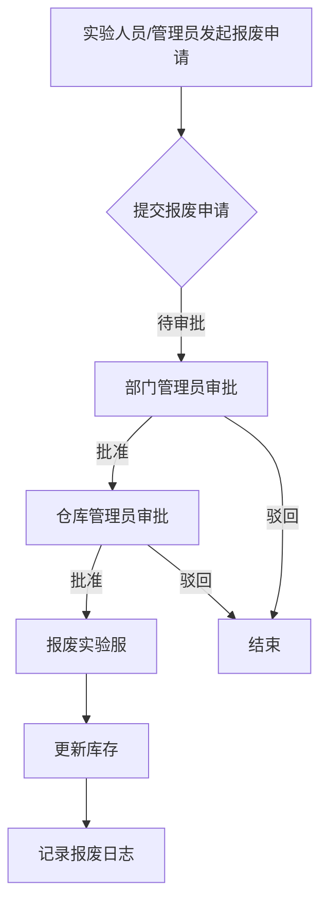

# TECH-实验服管理系统-系统设计

## 1. 总体架构设计

### 1.1. 系统架构图

```mermaid
graph TD
    A[实验人员] --> B(氚云移动端/PC端)
    B --> C[氚云平台]
    C --> D[氚云表单]
    C --> E[氚云流程引擎]
    C --> F[氚云报表/仪表盘]
    C --> G[氚云集成(可选)]
    G --> H[企业微信/钉钉]
    G --> I[财务系统(扣款)]
    G --> J[ERP系统(采购)]
    K[仓库管理员] --> B
    L[部门管理员] --> B
    M[系统管理员] --> B
```

### 1.2. 架构说明

* **用户层**：实验人员、仓库管理员、部门管理员、系统管理员通过氚云移动端或PC端访问系统。
* **应用层**：基于氚云平台构建，核心包括：
  * **氚云表单**：用于实现各类数据录入和展示，如实验服信息、采购申请、领用申请、入库验收、归还登记、报废申请等。
  * **氚云流程引擎**：驱动采购审批、领用审批、报废审批等业务流程。
  * **氚云报表/仪表盘**：提供各类数据统计、分析和可视化展示，支持管理层决策。
  * **氚云集成（可选）**：通过氚云的集成能力，可与企业微信/钉钉进行消息通知集成，或与现有财务系统、ERP系统进行数据对接，实现自动扣款和采购订单同步。

## 2. 数据模型设计

### 2.1. 实体关系图 (ERD) 概览



### 2.2. 数据模型说明

* **USER（用户）**：记录实验人员、管理员等系统用户基本信息。
* **DEPARTMENT（部门）**：记录部门信息及月度领用额度。
* **ROLE（角色）**：定义不同角色的权限。
* **QUOTA（额度）**：记录部门的月度领用额度。
* **LAB_COAT_MODEL（实验服型号）**：记录实验服的型号、价格等静态属性。
* **LAB_COAT（实验服个体）**：记录每件实验服的唯一标识、当前状态和领用人。
* **PURCHASE_REQUEST（采购申请）**：记录采购申请的详情。
* **PURCHASE_APPROVAL（采购审批）**：记录采购申请的审批结果。
* **INVENTORY_INBOUND（入库记录）**：记录实验服的入库操作。
* **INVENTORY（库存）**：记录各型号实验服的实时库存和预警阈值。
* **USAGE_RECORD（领用记录）**：记录实验服的领用和归还情况，包括是否超额。
* **DEDUCTION_RECORD（扣款记录）**：记录超额领用产生的扣款信息。
* **SCRAP_REQUEST（报废申请）**：记录实验服报废申请。
* **SCRAP_APPROVAL（报废审批）**：记录报废申请的审批结果。
* **INVENTORY_CHANGE_LOG（库存变动日志）**：记录所有库存变动操作，便于追溯。

## 3. 流程设计

### 3.1. 采购流程



### 3.2. 领用流程



### 3.3. 报废流程



## 4. 界面原型设计 (示例)

本章节将提供主要系统界面的草图或示意图，例如：

* 实验服信息管理界面
* 采购申请表单
* 领用申请表单
* 库存查询界面
* 数据统计仪表盘
(具体内容将在后续设计中补充)

## 5. 权限设计

### 5.1. 角色与权限矩阵

| 角色       | 实验服信息管理 | 采购管理 | 库存管理 | 领用管理 | 归还管理 | 报废管理 | 数据报表 |
| :--------- | :------------- | :------- | :------- | :------- | :------- | :------- | :------- |
| 实验人员   | 查看           | -        | 查看     | 申请     | 归还     | 申请     | 查看     |
| 部门管理员 | 查看           | 审批     | 查看     | 审批     | 查看     | 审批     | 查看     |
| 仓库管理员 | 管理           | 验收入库 | 管理     | 发放     | 归还     | 报废     | 查看     |
| 系统管理员 | 管理           | 管理     | 管理     | 管理     | 管理     | 管理     | 管理     |

### 5.2. 权限说明

* **管理**：具备增、删、改、查所有权限。
* **申请**：仅能发起对应流程。
* **审批**：仅能审批对应流程。
* **发放/验收入库/归还/报废**：执行对应操作并更新系统状态。
* **查看**：仅能查看相关信息。
