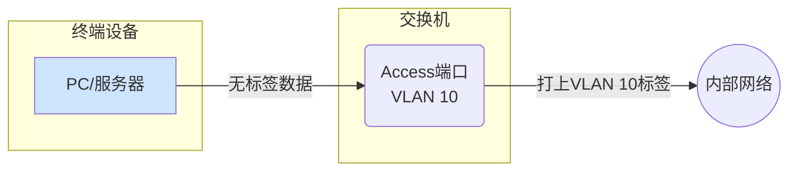
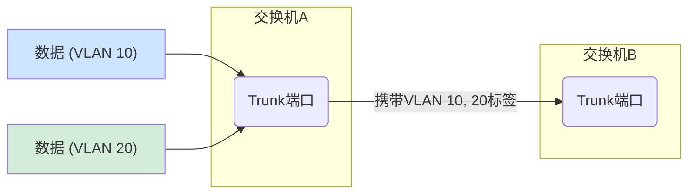

# A.03-VLAN端口模式详解(Access vs. Trunk)

> **标签**: `#VLAN` `#交换机` `#网络基础` `#Access` `#Trunk`
> **版本**: 1.0
> **状态**: 已发布

---

## 1. 核心问题

在配置交换机端口时，最基础也是最重要的一个决策就是：这个端口应该工作在 **Access** 模式还是 **Trunk** 模式？理解二者的区别是正确划分VLAN、实现网络隔离的基础。

---

## 2. 机场行李标签类比

想象一下，一个大型机场（代表一台**核心交换机**）连接着多个目的地城市（代表不同的**VLAN**，如VLAN10-市场部, VLAN20-研发部）。

### 2.1. Access 模式：【乘客办票柜台】

- **作用**: 用于连接最终的“乘客”（例如您的**电脑、打印机、服务器**等终端设备）。
- **工作方式**:
    1. 当一位乘客（代表一个**不带标签的数据包**）来到“市场部专用”办票柜台（一个配置为 `switchport access vlan 10` 的端口）时，柜台服务人员（交换机）明确知道这位乘客的目的地是“市场部城市”（VLAN 10）。
    2. 服务人员会给乘客的行李（数据包）贴上一个**内部的、目的地为VLAN 10的标签**。
    3. 随后，这个带了标签的行李被送上传送带。
- **关键特征**:
  - **单一VLAN**: 一个Access端口 **只属于一个** VLAN。
  - **处理无标签数据**: 它的核心职责是接收来自终端设备的、不带VLAN标签的数据，并为其“打上”自己所属VLAN的标签。

### 2.2. Trunk 模式：【行李主传送带/分拣系统】

- **作用**: 用于连接机场内部的各个关键枢纽（例如**交换机之间**、**交换机到路由器**、**交换机到AP**）。
- **工作方式**:
    1. 这条主传送带（Trunk链路）上，同时运输着来自市场部（VLAN 10）、研发部（VLAN 20）、财务部（VLAN 30）等所有部门的行李。
    2. 为了不出错，传送带上的**每一个行李都必须已经贴好了清晰的标签**（VLAN Tag），以便传送带末端的分拣系统（对端交换机）知道该把它送到哪个城市的登机口。
    3. 如果传送带上出现了一个没有标签的行李（Native VLAN，后述），分拣系统会默认认为它属于一个特定的“失物招领处”。
- **关键特征**:
  - **多个VLAN**: 一个Trunk端口可以同时承载**多个**VLAN的流量。
  - **处理带标签数据**: 它的核心职责是识别并透传已经带有VLAN标签的数据。它假设流经它的数据都是“已经分好类的”。

---

## 3. 总结与应用场景

| 特性 | Access 模式 | Trunk 模式 |
| :--- | :--- | :--- |
| **连接对象** | **终端设备** (PC, 打印机, 服务器) | **网络设备** (交换机, 路由器, AP) |
| **处理VLAN** | **仅一个** | **多个** |
| **数据标签** | 接收无标签数据，发送时**打上**标签 | 接收和发送的都是**带标签**数据 |
| **配置命令** | `switchport mode access`   `switchport access vlan [ID]` | `switchport mode trunk`   `switchport trunk allowed vlan [List]` |

### Native VLAN (本征VLAN)

- **仅存在于Trunk模式**: 这是一个特殊的设置，用于处理在Trunk链路上遇到的、**不带任何VLAN标签**的数据包。
- **工作原理**: 交换机会将这些无标签的数据包划归到`Native VLAN`所指定的VLAN中。
- **安全实践**: 为避免VLAN跳跃等攻击，最佳实践是：
    1. 将Native VLAN设置为一个**专用的、未使用的VLAN ID**（如999）。
    2. 确保Trunk链路两端的交换机上的Native VLAN设置**完全一致**。
    3. 不允许任何用户设备加入Native VLAN。
