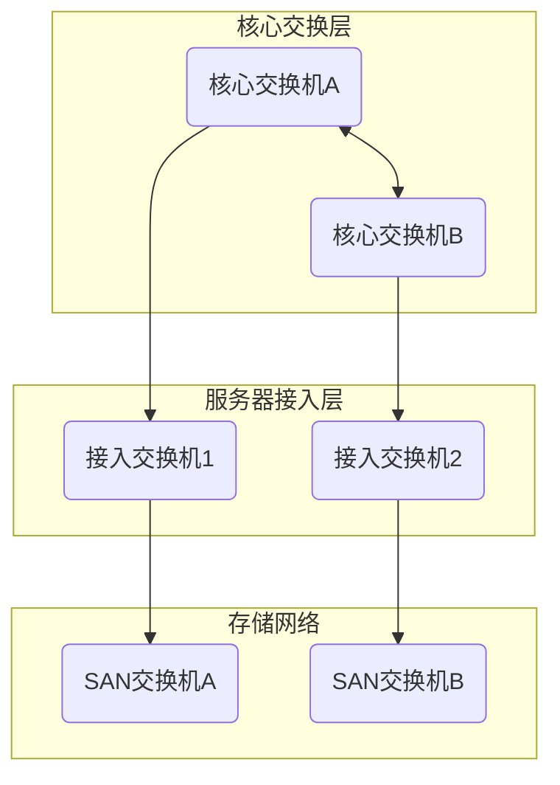

# 领域主页：B_基础设施

> **标签**: `#基础设施` `#物理层`
> **负责人**: [[J.01-张三-成员档案]]

---

## 1. 领域概述

本领域负责管理公司内所有数据中心、服务器、存储、网络布线、机房环境等物理实体资源。

* **相关SOP**: [[E.01-新服务器上架标准流程-SOP]]
* **相关安全策略**: [[H.01-数据中心物理安全管理规范]]

---

## 2. 子领域导航

本页聚合了基础设施领域下所有的子领域。

* [[B.01_机房管理]]
* [[B.02_服务器与存储]]
* [[B.03_综合布线]]
* [[B.04_监控安防]]
* [[B.05_UPS与供电]]

---

## 3. 核心资产与拓扑 (速查)

> 此处仅展示最重要的核心拓扑与资产，完整清单请查阅 `D_资产管理`。

### 3.1. 数据中心网络拓扑

### 3.2. 核心服务器列表

* **核心ERP应用服务器**: [[D.01-IT-SRV-001-资产主页]]
* **核心数据库服务器**: [[D.01-IT-SRV-002-资产主页]]
* **vCenter服务器**: [[D.01-IT-SRV-003-资产主页]]
