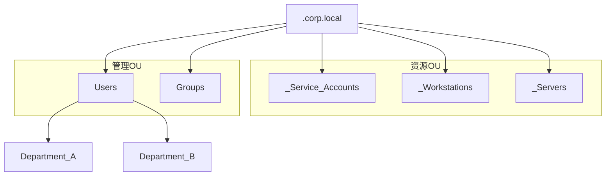

# C.01-Active Directory-设计标准 (v2.0)

> **标签**: `#AD` `#设计标准` `#多域森林`
> **版本**: 2.0
> **状态**: 已发布

---

## 1. 概述与架构决策

本文档定义了集团**多域AD森林**的通用设计原则和标准规范。为确保各业务实体（公司）管理的独立性与安全边界，同时兼顾协作需求，我们采用**“独立域，林信任”**的统一架构。

- **架构**: 创建一个空的林根域 (`corp.local`)，然后在林中为每家公司创建一个独立的子域。
- **信任关系**: 林中所有域之间默认为双向、可传递的信任关系，允许跨域的资源授权访问。
- **数据复制**:
  - **域内**: 每个域（如 `company_a.corp.local`）内部的所有数据（用户、密码、组策略）只会在该域自己的域控制器之间进行多主复制。
  - **域间**: 不同域之间**不会**复制用户、密码等敏感数据。仅共享“全局编录”（GC），以实现跨域的身份识别和资源查找。

---

## 2. 域和林设计标准

- **林根域名**: `corp.local` (这是一个不承载用户和计算机的、专用的“管理域”)
- **子域名模板**: `<company_code>.corp.local` (e.g., `hzgc.corp.local`)
- **NetBIOS域名模板**: `<COMPANY_NAME_UPPERCASE>` (e.g., `HUAZHI`)
- **林/域功能级别**: `Windows Server 2016` 或更高。
- **域控制器 (DC)**:
  - 每个站点、每个域都应至少部署一台DC，以实现冗余。
  - 林根域的第一台DC (`ROOT-DC01`) 必须部署。
  - 所有DC都应配置为**全局编录 (GC)** 服务器。
- **FSMO角色**:
  - **林级别角色** (架构主控, 域命名主控): 统一放置在 `ROOT-DC01` 上。
  - **域级别角色** (PDC, RID, 基础结构): 放置在各自域的主DC上 (e.g., `CA-DC01`)。

---

## 3. OU (组织单位) 结构标准

每个域内都应采用统一的、独立的OU结构模板。

**标准模板: `<company_name>.corp.local` 域内**

```
<company_name>.corp.local
|
|-- _Service_Accounts  (服务账户)
|-- _Workstations      (工作站)
|-- _Servers           (服务器)
|
|-- Users              (用户)
|   |-- Department_A   (部门A)
|   |-- Department_B   (部门B)
|-- Groups             (组)
```

**图形化结构:**



---

## 4. 组 (Group) 设计标准

- **原则**: 严格遵循**AGDLP** (Account -> Global -> Domain Local -> Permission) 原则进行权限分配。
- **跨域访问场景模板**:
  - **场景**: A公司的`用户X`需要访问B公司的`资源Y`。
  - **步骤**:
        1. 在`A公司域`中，将`用户X`的账户加入一个**全局组** (e.g., `GG_Access_ResourceY`)。
        2. 在`B公司域`中，创建一个**域本地组** (e.g., `DL_ResourceY_Read`)，并赋予该组对`资源Y`的访问权限。
        3. 将`A公司域`的全局组 (`GG_Access_ResourceY`) 添加为`B公司域`的域本地组 (`DL_ResourceY_Read`) 的**成员**。

---

## 5. 组策略 (GPO) 设计标准

- 每个域都可以独立设计和链接自己的GPO，互不干扰。
- **命名约定**: `[域缩写]_[类别]_[设置描述]`
  - **示例**: `HZ_SEC_Password_Policy`, `CM_DEF_Desktop_Wallpaper`

---

## 6. 设计实例

本标准在不同公司的具体落地实践，请参考以下设计实例文件：

- [[C.01.1-ActiveDirectory-HZGC设计实例]]
- [[C.01.2-ActiveDirectory-CMXC设计实例]]

---

## 7. 用户身份与命名标准

### 7.1. UPN (用户主体名称) 设计标准

- **原则**: 为实现本地AD与云服务的无缝身份集成（SSO），所有用户的UPN应与其主电子邮件地址保持一致。
- **实施**:
    1. 将公司的公共域名 (e.g., `aaaa.com.cn`, `bbbb.com`) 在AD林中注册为备用UPN后缀。
    2. 用户账户的UPN应设置为其公共邮件地址，而非默认的内部 `.local` 域名。
  - **示例**: 桦智公司用户 `zhangsan` 的UPN应为 `zhangsan@aaaa.com.cn`，而不是 `zhangsan@hzgc.corp.local`。

### 7.2. 用户账户命名规范 (sAMAccountName)

- **用途**: 用于兼容旧版Windows系统的登录名 (域\用户名)。
- **原则**: 采用“姓全拼+名缩写”或工号，确保域内唯一。
- **示例**: `zhangsan` / `liyd` / `T10086`

### 7.3. 计算机账户命名规范

- **原则**: `[站点代码]-[用途代码]-[资产编号]`
- **站点代码**: HZ (桦智), CM (纯铭)
- **用途代码**:
  - `WS`: Workstation (台式机)
  - `LT`: Laptop (笔记本)
  - `SRV`: Server (服务器)
- **示例**: `HZ-LT-0123`, `CM-SRV-0045`

### 7.4. 组 (Group) 命名约定

- **原则**: `[类型]_[范围]_[用途描述]`
- **类型**:
  - `SEC`: 安全组 (Security Group)
  - `DIST`: 通讯组 (Distribution Group)
- **范围**:
  - `G`: 全局组 (Global)
  - `DL`: 域本地组 (Domain Local)
  - `U`: 通用组 (Universal)
- **示例**:
  - `SEC_G_Finance_Users` (全局安全组-财务用户)
  - `SEC_DL_FileServer01_Share_Read` (域本地安全组-文件服务器01共享-读取权限)
  - `DIST_U_All_Staff` (通用通讯组-全体员工)
