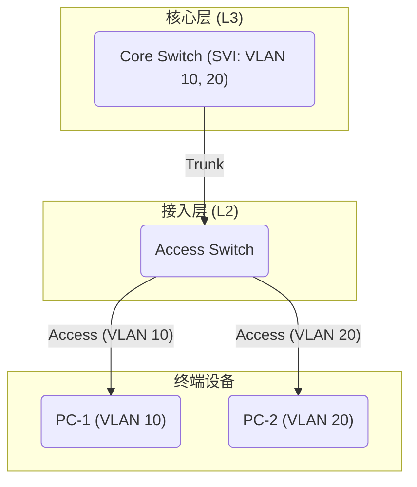

# E.04-VLAN与端口配置-SOP

> **标签**: `#SOP` `#VLAN` `#交换机` `#网络配置` `#安全`
> **版本**: 2.0
> **状态**: 最终版
> **关联设计**: [[A.01-IP与VLAN设计-标准]], [[A.01-IP与VLAN分配-总表]]

---

## 1. 概述

本SOP (Standard Operating Procedure) 定义了在公司网络交换机上创建VLAN、配置三层接口及分配端口的标准化流程。

### 1.1. 核心原则

- **VLAN需全程存在**: 一个VLAN必须在它所要经过的**所有**交换机上都被创建。
- **网关集中创建**: VLAN的三层网关接口（SVI）**只在**核心交换机上创建一次。接入层交换机只负责二层转发。



### 1.2. 前置依赖

- 操作前，必须查阅 [[A.01-IP与VLAN设计-标准.md]] 理解VLAN ID和IP地址的规划原则。
- 操作前，必须查阅 [[A.01-IP与VLAN分配-总表]] 确认VLAN ID和IP网段。

---

## 2. VLAN 创建与三层接口配置 (核心交换机)

此操作在**核心交换机**上执行。

> **注意**: 当前公司网络设备主要为 **TP-Link** 品牌。

### 2.1. 标准流程

1. **进入全局配置模式**:

    ```shell
    enable
    configure
    ```

2. **创建VLAN**:

    ```shell
    vlan [VLAN_ID]
    name [VLAN_Name]
    exit
    ```

3. **创建VLAN三层接口 (SVI)**:

    ```shell
    interface vlan [VLAN_ID]
    ip address [Gateway_IP] [Subnet_Mask]
    exit
    ```

4. **保存配置**:

    ```shell
    write
    ```

### 2.2. 配置示例

**场景**: 创建一个新的“办公-市场部”VLAN `30`，网段为`192.168.30.0/24`。

```shell
enable
configure

vlan 30
 name Office-Marketing
 exit

interface vlan 30
 ip address 192.168.30.254 255.255.255.0
 exit

write
```

---

## 3. 交换机端口配置 (接入层交换机)

### 3.1. Access (接入) 端口配置

Access端口用于连接单个终端设备。

1. **进入接口配置模式**:

    ```shell
    configure
    interface [Interface_Name]
    ```

2. **配置端口**:

    ```shell
    description [Description_of_Connected_Device]
    switchport mode access
    switchport access vlan [VLAN_ID]
    ```

3. **(安全增强) 配置端口安全**:

    ```shell
    switchport port-security enable
    switchport port-security mac-address sticky  ! 自动学习第一个接入的MAC地址
    switchport port-security maximum 1           ! 只允许1个MAC地址
    switchport port-security violation restrict  ! 违规时丢弃数据包并告警
    ```

4. **保存配置**:

    ```shell
    exit
    write
    ```

**示例**: 将`gigabitEthernet 1/0/1`端口分配给VLAN `30`，并启用端口安全。

```shell
configure
interface gigabitEthernet 1/0/1
 description MKT-PC-ZhangSan
 switchport mode access
 switchport access vlan 30
 switchport port-security enable
 switchport port-security mac-address sticky
 switchport port-security maximum 1
 switchport port-security violation restrict
 exit
write
```

### 3.2. Trunk (中继) 端口配置

Trunk端口用于交换机之间或连接AP/服务器。

1. **进入接口配置模式**:

    ```shell
    configure
    interface [Interface_Name]
    ```

2. **配置端口**:

    ```shell
    description [Description_of_Uplink_or_Connection]
    switchport mode trunk
    switchport trunk native vlan 999                 ! 配置一个未使用的VLAN作为Native VLAN
    switchport trunk allowed vlan [Allowed_VLAN_List]  ! 首次配置
    ! 或
    switchport trunk allowed vlan add [VLAN_ID]      ! 增量添加VLAN
    ```

3. **保存配置**:

    ```shell
    exit
    write
    ```

**示例**: 配置`gigabitEthernet 1/0/48`为上联Trunk口，并增量添加VLAN `30`。

```shell
configure
interface gigabitEthernet 1/0/48
 description Uplink-to-Core-Switch-01
 switchport mode trunk
 switchport trunk native vlan 999
 switchport trunk allowed vlan add 30
 exit
write
```

---

## 4. 验证命令 (TP-Link CLI)

- `show vlan`: 查看已创建的VLAN。
- `show interface vlan`: 查看三层接口的状态和IP地址。
- `show running-config interface [Interface_Name]`: 查看特定端口的详细配置。
- `show port-security interface [Interface_Name]`: 查看端口安全的状态和学习到的MAC地址。
- `show mac-address-table`: 查看MAC地址表。
