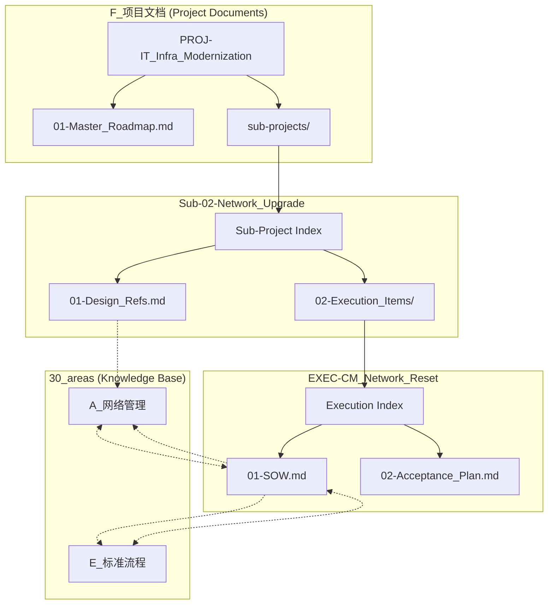

# 项目群：IT基础架构现代化

> **标签**: `#项目群` `#IT架构` `#数字化转型`
> **负责人**: [[张三]]
> **状态**: 总体规划中

---

## 1. 项目群概述

本项目群旨在通过对网络、身份认证、终端安全和桌面交付模式进行系统性升级，构建一套现代化、高安全、易于管理的IT基础架构，以支撑公司未来的业务发展。

---

## 2. 顶层架构图

---

## 3. 核心目标

- **统一身份管理**: 建立以Active Directory为核心的单一身份源 (SSoT)。
- **强化终端安全**: 通过IP-Guard实现对数据泄露的全面防护。
- **提升桌面灵活性**: 通过云桌面实现安全、高效、灵活的桌面交付。
- **打通多地协同**: 建立稳定、安全的跨站点网络。

---

## 4. 子项目导航

本项目群由以下四个核心子项目构成，它们在逻辑上紧密关联，实施上可分步进行。

| 编号 | 子项目 | 核心目标 | 状态 | 依赖关系 |
|:---|:---|:---|:---|:---|
| **Sub-01** | [[./sub-projects/Sub-02-Network_Upgrade/index.md]] | 网络改造 (DMZ/VPN) | 方案设计完成 | **无 (基石)** |
| **Sub-02** | [[./sub-projects/Sub-01-Unified_Identity/index.md]] | 统一身份认证 (AD) | 方案设计完成 | **Sub-01** |
| **Sub-03** | [[./sub-projects/Sub-04-Cloud_Desktop/index.md]] | 云桌面部署与迁移 | 待规划 | **Sub-02** |
| **Sub-04** | [[./sub-projects/Sub-03-IPGuard_Deployment/index.md]] | IP-Guard部署 | 待规划 | **Sub-02**, **Sub-03** |

---

## 4. 知识库归档策略

| 产出物类别 | 核心内容 | 知识库归属 |
|:---|:---|:---|
| **项目管理** | 本项目群所有文档 | `F_项目文档` |
| **网络设计** | DMZ, VLAN, IP规划, VPN参数 | `A_网络管理` |
| **核心服务** | AD域, ADFS, DNS服务 | `C_系统服务` |
| **安全策略** | 防火墙ACL, GPO, IP-Guard策略 | `H_信息安全` |
| **实施流程** | 所有SOP文档 | `E_标准流程` |
| **物理/虚拟资产**| 服务器VM, ESXi主机 | `B_基础设施`, `D_资产管理`|
