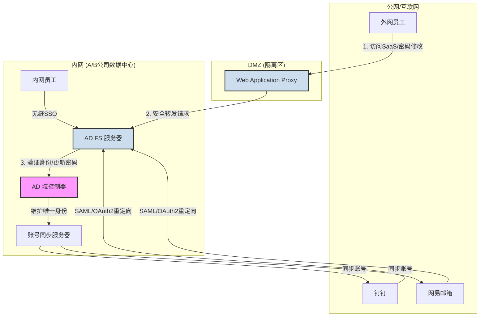

# 子项目：Sub-01-统一身份认证集成方案 (AD)

> **标签**: `#子项目` `#IT架构` `#ActiveDirectory` `#身份认证`
> **关联主项目**: [[../../index.md]]
> **状态**: 方案设计完成

---

## 1. 项目背景与目标

### 1.1. 背景与痛点

随着A、B两家公司的业务发展与协同办公需求日益增长，现有的IT环境面临以下挑战：

- **身份管理分散**：员工在钉钉、网易邮箱、未来规划的云桌面等多个系统中拥有独立的账号，入职、离职、调岗时需要人工在多处操作，效率低下且容易遗漏，带来安全隐患。
- **权限控制不精细**：无法基于员工的真实业务角色进行跨系统的、统一的权限分配与回收。
- **安全策略难以落地**：缺乏统一的平台来强制推行密码策略、桌面安全标准等，安全基线不一致。
- **用户体验不佳**：员工需要记忆多套密码，在不同系统间切换繁琐。

### 1.2. 项目目标

本项目旨在通过部署本地Active Directory (AD)并集成现有及未来的IT系统，构建一套集中、统一、安全的身份认证与管理体系。核心目标如下：

- **建立单一身份源 (SSoT)**：以AD作为所有员工身份的唯一权威来源。
- **实现统一认证与单点登录 (SSO)**：员工使用一套AD凭据登录所有授权的系统。
- **达成集中权限管理**：在AD中对用户和组进行统一的权限分配与管理。
- **强化安全基线**：通过组策略(GPO)强制推行统一的安全标准。

---

## 2. 项目实施前提条件

本项目成功实施依赖于以下网络和环境基础。在项目一期启动前，必须确保这些条件已满足。

### 2.1. 网络基础设施

- **VLAN与IP网段规划**: 必须完成服务器、办公、DMZ等区域的VLAN和IP网段划分。建议规划如下：
  - **服务器VLAN**: `192.168.10.0/24` (示例)
  - **办公VLAN**: `192.168.20.0/24` (示例)
  - **DMZ VLAN**: `172.16.99.0/24` (示例)

- **DMZ区域构建**: 必须在核心防火墙上完成DMZ区域的创建和配置。

- **防火墙访问控制策略 (ACL)**: 必须配置以下核心网络访问策略：
  - **允许** `公网` -> `DMZ (WAP)` 的 `TCP/443` 端口。
  - **允许** `DMZ (WAP)` -> `内网 (ADFS)` 的 `TCP/443` 端口。
  - **拒绝** `DMZ` -> `内网` 的所有其他流量。
  - **允许** `办公VLAN` -> `服务器VLAN` 的AD认证所需端口 (Kerberos, LDAP, DNS等)。

- **公网IP与域名**:
  - 必须准备至少一个公网IP地址，用于映射WAP服务器。
  - 必须申请并配置公网域名。**说明**: 可利用现有主域名 `CompanyA.com` 创建新的子域名记录。例如，在DNS服务商处为 `CompanyA.com` 新增一条 `A` 记录，将 `password.CompanyA.com` 指向WAP服务器的公网IP。这与主域名的MX记录或其他解析完全独立，互不冲突。

### 2.2. 虚拟化与服务器资源

- 必须准备好满足项目一期硬件要求的虚拟化资源（vSphere/Hyper-V），用于创建DC、ADFS、WAP等服务器。

---

## 3. 总体架构设计



---

## 3. 核心组件部署方案

### 3.1. Active Directory 部署方案

- **域命名**:
  - **建议域名**: `corp.internal`
  - **NetBIOS域名**: `CORP`
  - *说明*: `.internal` 后缀是业界推荐的内部域后缀，可避免与公网域名冲突。

- **组织单位 (OU) 结构**:
  - 设计一个清晰、可扩展的OU结构，便于委派管理和应用组策略。

  ```
  corp.internal
  ├─ OU=CompanyA
  │  ├─ OU=Users
  │  │  ├─ OU=Admin
  │  │  └─ OU=Standard
  │  ├─ OU=Groups
  │  ├─ OU=Computers
  │  └─ OU=Servers
  ├─ OU=CompanyB
  │  ├─ OU=Users
  │  ├─ OU=Groups
  │  ├─ OU=Computers
  │  └─ OU=Servers
  └─ OU=_ServiceAccounts
  ```

- **域控制器 (DC) 部署**:
  - **拓扑**: 在A公司和B公司的数据中心各部署至少一台物理或虚拟域控制器。
  - **角色**: 两台DC均作为全局编录(GC)和DNS服务器。
  - **复制**: 通过IPsec VPN在站点间进行AD数据复制，确保数据一致性和冗余。

- **组策略 (GPO) 规划 (初步)**:
  - **Default Domain Policy**: 设置全域生效的密码策略（长度、复杂度、有效期）、账户锁定策略。
  - **Desktop Security Policy**: 链接到 `Computers` OU，用于配置桌面安全设置，如禁用USB存储、统一屏保等。
  - **Server Security Policy**: 链接到 `Servers` OU，用于应用服务器基线安全设置。

### 3.2. 网络部署方案

- **IPsec VPN**:
  - **要求**: 确保A、B公司数据中心之间的IPsec VPN隧道稳定、可靠，延迟建议在50ms以内，带宽不低于100Mbps，以保证AD复制和跨站点资源访问的性能。
  - **路由**: 确保两端网络的IP地址段可以相互路由，特别是DC所在服务器网段。

- **DNS 解析**:
  - **配置**: 所有加入域的客户端（包括云桌面）和服务器，首选DNS服务器必须指向其所在站点的AD域控制器IP地址。
  - **转发**: AD的DNS服务应配置转发器，将无法解析的外部域名请求转发至公共DNS（如 `223.5.5.5` 或 `114.114.114.114`）。
  
  ### 3.3. 公网服务与单点登录 (SSO) 方案
  
  为解决外网员工密码过期和SaaS应用单点登录的问题，需引入AD FS和WAP组件。
  
  - **组件**:
    - **AD FS (Active Directory Federation Services)**: 作为身份提供商(IdP)，部署在内网，与AD集成。
    - **WAP (Web Application Proxy)**: 作为AD FS的公网反向代理，部署在DMZ区，不加入域。
  
  - **解决场景一：外网密码修改**
    - AD FS提供基于Web的密码修改和重置门户。
    - WAP将此门户安全地发布到公网（例如 `password.yourcompany.com`）。
    - 在外网的员工可通过访问此门户，安全地更改其已过期或遗忘的AD密码。
  
  - **解决场景二：SaaS应用单点登录 (SSO)**
    - **原理**: 基于SAML 2.0等标准联合身份验证协议。
    - **流程**:
      1. 在AD FS与钉钉、网易邮箱等SaaS应用之间建立**信任关系 (Federation Trust)**。
      2. 用户访问SaaS应用，被重定向到公司的AD FS登录页面。
      3. AD FS验证用户身份（内网用户无感，外网用户需输入AD密码）。
      4. AD FS向SaaS应用颁发一个安全的身份“令牌”(Token)。
      5. SaaS应用验证令牌，并允许用户登录。
    - **效果**: 用户只需维护一套AD凭据，即可在授权后访问所有集成的应用，无需二次登录。
  
  ## 4. 身份同步与集成方案

### 4.1. AD 与钉钉集成方案 (范围调整)

- **范围说明**: 根据项目一期“时间紧、任务重”的原则，**暂时移除** AD到钉钉的组织架构与账号同步功能。钉钉的用户管理将**继续手动维护**。
- **保留功能**: 保留将“AD密码修改门户”包装成钉钉应用的功能，以提升用户体验。

### 4.2. 用户体验优化：集成密码修改入口至钉钉工作台

- **目标**: 避免员工记忆密码修改网址，提供统一、便捷的入口。
- **方案**: 将WAP发布的密码修改门户包装成一个钉钉H5微应用。
- **实施步骤**:
  1. 在钉钉开放平台后台，创建一个企业内部H5微应用。
  2. 将应用首页地址配置为密码修改门户的公网URL (例如 `https://password.CompanyA.com`)。
  3. 设置应用名称为“修改密码”，并配置一个清晰的图标。
  4. 将该应用发布到钉钉工作台，并设置为全员可见。
- **效果**: 员工可在钉钉工作台直接点击图标，拉起页面修改密码。

### 4.2. AD 与网易企业邮箱集成方案

- **技术选型**:
  - **建议方案**: 使用网易企业邮箱官方提供的 **“帐号同步组件”**。
  - **备选方案**: 基于网易企业邮箱的API开发自定义同步脚本。

- **部署方案**:
  - “帐号同步组件”可与“钉钉连接器”部署在同一台“同步服务器”上。

- **同步逻辑**:
  - **同步范围**: 配置同步组件，使其仅同步特定AD安全组（如 `Email_Allowed_Users`）的成员。
  - **账号生命周期管理**:
    - **创建**: 当授权用户在AD中创建时，自动在网易邮箱中创建同名邮箱账号。
    - **禁用**: 当AD用户被禁用或从授权组中移除时，自动禁用或删除其邮箱账号（策略可配置）。
  - **密码同步**: 组件通常支持密码同步或密码“截获”功能，当用户在AD中修改密码时，新密码可以同步到网易邮箱，实现密码统一。

## 5. 差异化授权实现方案

本方案旨在通过AD灵活的组和属性，满足复杂的业务授权需求。

### 5.1. 场景一：部分员工无邮箱的实现方案

- **目标**: 控制邮箱发放范围，节约许可成本。
- **实现步骤**:
  1. **创建授权组**: 在AD的 `Groups` OU下，创建一个名为 `Grp_Email_Allowed` 的全局安全组。
  2. **修改同步规则**:
     - 配置“网易邮箱帐号同步组件”，使其同步源仅选择 `Grp_Email_Allowed` 这个安全组。
     - 即：只有该组的成员才会被同步到网易邮箱并创建邮箱账号。
  3. **制定管理流程**:
     - **申请**: 需要邮箱的员工通过IT服务流程提交申请。
     - **审批**: 员工的直属上级或部门负责人审批。
     - **执行**: IT管理员在收到批准的工单后，将该员工的AD账号手动添加至 `Grp_Email_Allowed` 组中。同步组件将在下一个同步周期自动为其创建邮箱。
     - **回收**: 员工离职或不再需要邮箱时，IT管理员将其从该组中移除，同步组件将自动禁用或删除其邮箱。

### 5.2. 场景二：跨公司员工权限的实现方案

- **目标**: 允许单一员工账号无缝访问A、B两家公司的授权资源。
- **实现原则**: **基于资源的访问控制 (RBAC)**。用户的身份是统一的，权限是其所担任的多个角色的集合。
- **实现步骤**:
  1. **统一身份**: 员工无论服务于哪个公司，在AD中都只拥有一个唯一的账号。
  2. **按资源创建访问组**:
     - 为各个关键资源（如文件共享、应用系统等）创建对应的访问控制组。命名规范建议为 `Grp_[公司]_[资源]_[权限]`。
     - *示例*:
       - `Grp_A_FinanceShare_Read` (A公司财务共享文件夹的只读权限)
       - `Grp_B_ProjectX_Edit` (B公司X项目文件夹的编辑权限)
       - `Grp_B_ERP_User` (B公司ERP系统普通用户权限)
  3. **按角色授权**:
     - **单一公司员工**: 将其AD账号加入其所属公司的相应资源组。
     - **跨公司员工**: 将其**同一个AD账号**，同时加入A公司和B公司的多个所需资源组。
  4. **权限审计**:
     - 通过定期审查各资源组的成员，可以清晰地了解谁对哪个资源拥有何种权限，便于安全审计。

## 6. 实施路线图 (Roadmap)

本项目建议分阶段进行，以平滑过渡，降低风险，并尽早实现核心价值。

### **准备阶段: 网络改造 (关键前置子项目)**

**此阶段属于网络基础设施改造，是整个项目启动的技术前提。必须在项目一期开始前完成。**

- **目标**: 构建支持本项目所需的网络安全架构，特别是创建DMZ区。
- **详细方案**: [[./sub-projects/Net-01-网络改造子项目/index.md]]

### 6.1. 一期：奠定基石 (预计4周)

- **目标**: 搭建AD基础架构，实现PC统一纳管。
- **关键任务**:
  1. **硬件/虚拟资源准备**: 准备用于部署域控制器和同步服务器的资源。
  2. **网络联调**: 确保A、B公司间的IPsec VPN稳定，并完成路由和DNS规划。
  3. **AD部署**: 在A、B公司各部署一台DC，完成AD林和域的初始化配置 (`corp.internal`)。 (详见: [[./SOPs/SOP-01-AD域控制器安装与配置指南.md]])
  4. **OU结构创建**: 根据方案创建OU和核心管理组。
  5. **GPO初步配置**: 配置默认的密码策略和账户锁定策略。
  6. **PC入域试点**: 选择IT部门或试点部门的电脑，将其加入AD域进行测试。
  7. **制定PC入域标准流程**: 撰写新购电脑和存量电脑加入域的标准操作程序 (SOP)。

### 6.2. 二期：集成核心应用 (预计3周)

- **目标**: 将钉钉和网易邮箱接入统一身份管理体系。
- **关键任务**:
  1. **同步服务器部署**: 配置同步专用服务器。
  2. **AD账号信息完善**: 导入或补充现有员工的AD账号信息（手机、邮箱等），为同步做准备。
  3. **钉钉集成**:
     - 安装和配置钉钉连接器(AD Sync)。
     - 进行小范围OU同步测试，验证组织架构和用户同步的准确性。
     - 全量同步。
  4. **网易邮箱集成**:
     - 创建 `Grp_Email_Allowed` 组，并添加首批授权用户。
     - 安装和配置网易帐号同步组件。
     - 测试邮箱账号的自动创建、禁用和密码同步。
  5. **流程文档更新**: 更新《员工IT流程》，体现新的账号开通和管理模式。

### 6.3. 三期：扩展至云桌面及更多应用 (预计5周)

- **目标**: 将云桌面环境纳入AD管理，并探索与其他应用集成。
- **关键任务**:
  1. **云桌面环境部署**: 部署VDI基础架构。
  2. **云桌面模板制作**: 创建加入AD域的标准化云桌面模板。
  3. **桌面池与用户分配**: 基于AD用户/组创建桌面池，并分配给用户。
  4. **IP-Guard策略集成**: 研究并测试通过GPO下发IP-Guard客户端策略。
  5. **SSO探索**: 调研并试点将其他支持SAML/OAuth2协议的应用与AD集成，实现单点登录。

## 7. 风险与应对

| 风险类别 | 风险描述 | 可能性 | 影响程度 | 应对措施 |
| :--- | :--- | :--- | :--- | :--- |
| **技术风险** | VPN网络不稳定，导致AD复制延迟过高或中断。 | 中 | 高 | 1. 与网络供应商签订SLA，确保线路质量。 2. 部署网络监控，对VPN的延迟和丢包率进行实时告警。 3. 确保各站点的DC能独立承担认证工作。 |
| **技术风险** | 钉钉或网易邮箱的同步工具出现Bug或兼容性问题。 | 中 | 中 | 1. 在正式实施前，搭建测试环境进行充分验证。 2. 优先选择官方认证的同步工具。 3. 准备好备选的API脚本开发方案。 |
| **管理风险** | 员工抵触新流程，不习惯在AD中管理账号和密码。 | 高 | 中 | 1. 项目实施前进行充分的宣贯和培训。 2. 制作清晰易懂的《员工IT流程》指南。 3. 设立IT服务热线，及时解答员工疑问。 |
| **管理风险** | 项目实施周期超出预期，影响业务正常运行。 | 中 | 高 | 1. 严格按照三期路线图分步实施，控制每期的范围。 2. 在每个关键变更前（如PC入域、全量同步），都进行小范围试点。 3. 安排在业务低峰期（如周末或夜间）进行核心变更操作。 |
| **安全风险** | AD域控服务器被攻击，导致整个认证体系瘫痪。 | 低 | 极高 | 1. 严格控制DC的物理和网络访问权限。 2. 遵循最小权限原则，仅为域管理员分配必要权限。 3. 定期对AD进行安全审计和备份。 4. 部署针对性的服务器安全防护软件。 |
