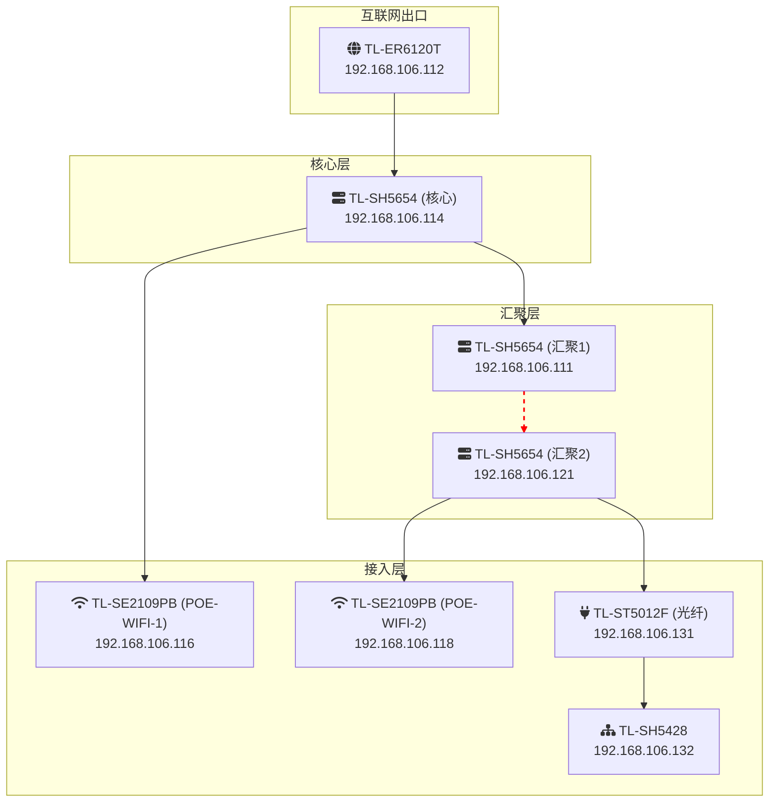

# A.05-HZ网络拓扑图-AS_IS (现状)

> **标签**: `#网络拓扑` `#HZ站点` `#现状分析`
> **版本**: 1.0

---

## 1. HZ站点当前网络物理拓扑图

本图根据现有设备连接情况绘制，反映了HZ站点的物理网络结构。

---

## 2. 现状分析与优化建议

### 2.1. 存在问题

1. **单点故障**: 路由器和核心交换机均为单台设备，存在单点故障风险。
2. **汇聚层级联**: `汇聚交换机2` 串联在 `汇聚交换机1` 之下，形成了“菊花链”式的级联。这种结构不仅增加了网络延迟，更严重的是，一旦`汇聚交换机1`或其上联链路故障，其下的所有设备（包括汇聚2、光纤交换机、POE交换机2等）将全部离线。
3. **IP地址不规范**: 所有网络设备的管理IP都位于同一个`192.168.106.x`网段，没有按照功能和安全级别进行隔离。

### 2.2. TO-BE (目标) 架构建议

- **核心层**: 采用两台核心交换机做**堆叠或虚拟化 (如VSS/IRF)**，实现冗余和高可用。
- **汇聚层**: 所有的汇聚交换机都应该**直接连接**到核心交换机堆叠组上，形成一个标准的“星型”拓扑，消除级联风险。
- **IP地址规划**: 严格按照我们最终确定的 `[[A.01-IP与VLAN分配-总表]]`，将所有网络设备的管理IP地址，统一迁移到 **`VLAN 1003 (网络设备管理)`** 中。
