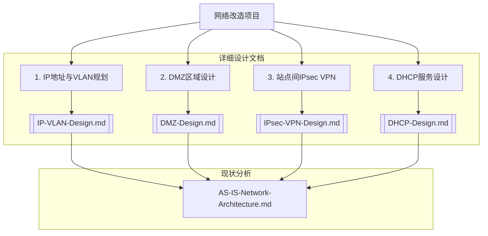

# 子项目：Sub-02-网络改造

> **关联主项目**: [[../../index.md]]
> **状态**: 规划完成

---

## 1. 项目概述

本项目旨在通过现代化的网络架构，为公司的IT基础设施提供一个安全、可靠、可扩展的基础。根据项目规划，整个网络改造工程被分解为以下几个核心的、可独立实施的子任务。

---

## 2. 项目分解结构 (WBS)

| 子任务 | 核心目标 | 产出物 | 状态 |
|:---|:---|:---|:---|
| **IP地址与VLAN规划** | 建立VLAN ID全局统一、IP地址按站点区分的终极体系。 | [[IP-VLAN-Design.md]] | `已完成` |
| **DMZ区域设计与隔离** | 为新网络设计DMZ，安全发布公网服务。 | [[DMZ-Design.md]] | `已完成` |
| **站点间IPsec VPN设计**| 统一A、B两地防火墙间的IPsec VPN参数。 | [[IPsec-VPN-Design.md]] | `已完成` |
| **DHCP服务高可用设计**| 为新网络设计高可用的DHCP服务。 | [[DHCP-Design.md]] | `已完成` |

---

## 3. 现状分析

> [!NOTE] 详细信息
> 当前网络的详细拓扑、VLAN/IP列表及问题分析，请参见独立的现状分析文档：[[AS-IS-Network-Architecture.md]]

---

## 4. 实施路线图 (基于“蓝绿部署”模型)

为实现最低风险的平滑迁移，我们采用“**并行构建，一键切换**”的蓝绿部署模式。

### Phase 1: “绿区”并行建设 (零风险)

**目标**: 在不影响当前“蓝区”（旧网络）的前提下，完整地构建出全新的“绿区”（新网络）。

1. **创建新VLAN**: 在核心/汇聚交换机上，创建`IP-VLAN-Design.md`中规划的**所有新VLAN**（如10, 16, 20, 40, 61, 80, 99等）。
2. **部署新DHCP服务**: 部署两台Windows Server虚拟机，并根据`DHCP-Design.md`，为所有**新VLAN**创建作用域和故障转移。
3. **配置新防火墙**: 在新防火墙上，为所有**新VLAN**配置三层网关、ACL策略、DMZ区域，并建立A-B站间的IPsec VPN。
4. **配置DHCP中继**: 在新防火墙的**新VLAN**网关接口上，配置`ip helper-address`指向新的DHCP服务器。

> **此阶段核心原则**: 所有操作都在一个全新的、与旧网络隔离的逻辑空间（“绿区”）内进行。旧网络（“蓝区”）的VLAN、IP、路由、DHCP服务完全不受影响，业务100%正常运行。

### Phase 2: “绿区”验证 (低风险)

**目标**: 在不影响主业务的前提下，验证“绿区”网络功能是否完全正常。

1. **选择测试端口**: 找几个空闲的、或连接非关键PC的交换机端口。
2. **端口切换**: 将这些测试端口的所属VLAN，从旧的VLAN**修改为**对应的新VLAN（例如，从旧的办公VLAN改为VLAN 20-新办公-研发）。
3. **功能验证**: 测试PC是否能从新DHCP服务器获取到正确的IP地址，能否访问互联网，以及是否受到ACL策略的正确管控。

### Phase 3: 业务割接 (高风险 - 需在停机窗口操作)

**目标**: 将所有用户和设备从“蓝区”平滑迁移至“绿区”。

1. **通知与准备**: 提前通知所有用户，确定一个业务影响最小的停机窗口（如周末凌晨）。
2. **割接操作**:
    * **动态设备 (PCs, WIFI用户等)**: 网络工程师批量修改交换机所有用户端口的所属VLAN。用户设备将在下次接入或续租时自动切换到新网络。
    * **静态设备 (服务器, 打印机等)**: 系统/网络工程师协作，先修改设备自身的IP地址为新规划的静态IP，然后修改其连接的交换机端口所属VLAN。
3. **停用旧服务**: 在确认大部分业务已迁移至“绿区”并运行正常后，可以安全地停用旧路由器的DHCP服务，并逐步清理旧的VLAN配置。

### 4.4. 风险管理

| 风险点 | 风险等级 | 应对与回滚预案 |
|:---|:---:|:---|
| “绿区”网络在割接后发现未知问题 | **高** | **一键回滚**: 只需将交换机端口的VLAN配置改回旧的VLAN ID，即可立即回退到“蓝区”网络，业务秒级恢复。这是蓝绿部署的最大优势。 |
| 静态设备IP修改错误 | **中** | 准备详细的IP地址新旧对照表，逐一核对。如果出错，可根据此表快速改回旧IP，并将端口VLAN切回“蓝区”。 |
