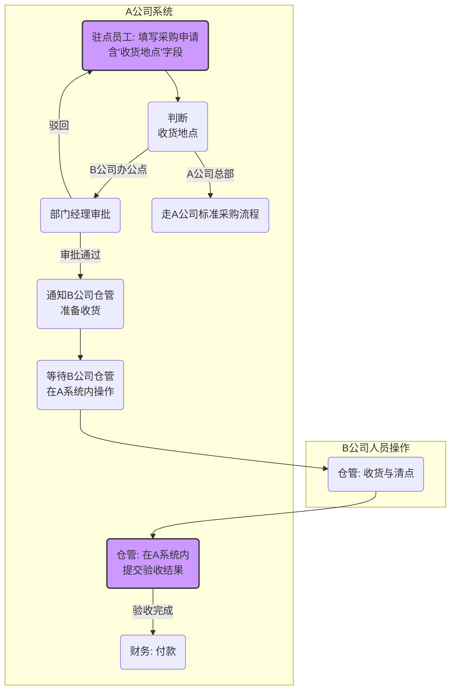

# 业务流程图：跨公司驻点采购流程 (To-Be)

> **关联项目**: [[PROJ-20251205-AB_Purchase]]
> **版本**: V1.0
> **状态**: `草稿`

---

## 1. 流程图 (To-Be V2.0)

---

## 2. 角色说明

* **驻点员工 (A公司)**: 采购需求的申请人。
* **部门经理 (A公司)**: 负责审批本部门员工的采购申请。
* **仓库人员 (B公司)**: 负责接收货物，并核对采购订单进行验收。
* **财务 (A公司)**: 负责根据已验收的采购订单完成付款。

---

## 3. 关键业务规则

* **审批规则**: 采购金额低于5000元，由部门经理一级审批；高于5000元，需增加总监二级审批。
* **验收规则**: 仓库人员必须上传到货物料的实物照片作为验收凭证。
* **数据同步**: 验收结果（数量、状态）必须实时同步回传至A公司的采购系统中。
