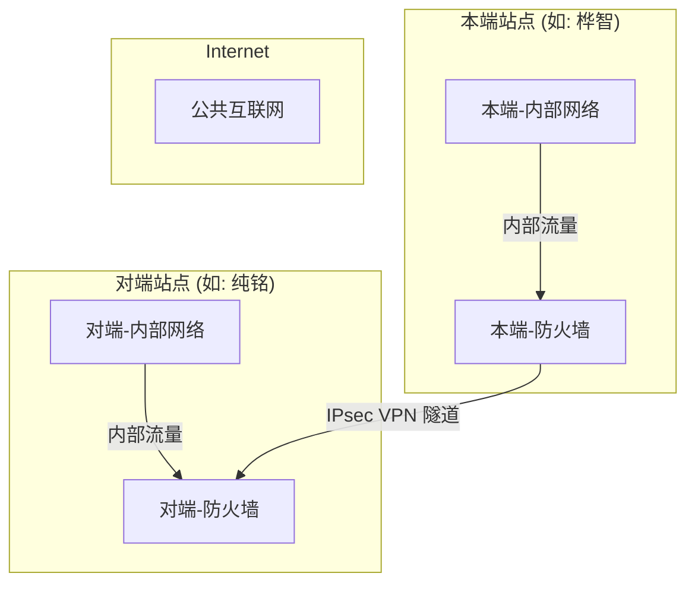

# H.02-网络安全域-站点间IPsec-VPN标准

> **标签**: `#安全标准` `#IPsec` `#VPN` `#网络互联`
> **版本**: 1.0
> **状态**: 草稿
> **关联标准**: [[A.01-IP与VLAN设计-实例.md]]

## 1. 目的与适用范围

### 1.1. 目的

为公司多个分支站点之间的网络互联，提供一套标准化、高安全性的IPsec VPN配置基线。本标准旨在确保所有站点间VPN隧道均采用一致的加密与认证参数，简化故障排查，并提高整体网络的安全性和稳定性。

### 1.2. 适用范围

本标准适用于所有需要通过公共互联网进行安全互联的公司站点（如：桦智、纯铭等）。

## 2. 技术选型与架构

### 2.1. 部署架构

各站点均使用边界防火墙作为IPsec VPN网关，通过互联网建立加密隧道。

### 2.2. 模式选型 (重要)

- **推荐模式**: **路由模式 (Route-based VPN)**
  - **原理**: 创建一个虚拟的隧道接口 (VTI - Virtual Tunnel Interface)，IPsec SA与该接口绑定。所有需要进入VPN的流量，通过配置静态或动态路由指向该隧道接口即可。
  - **优点**: 配置极其灵活。当需要新增互访网段时，只需修改路由表，无需重建VPN隧道和复杂的ACL策略，极大简化了运维。
- **兼容模式**: **策略模式 (Policy-based VPN)**
  - **原理**: 通过定义“感兴趣流”（通常是ACL）来触发IPsec协商。每一对需要互访的网段，都需要配置一条独立的策略。
  - **缺点**: 缺乏灵活性。每当新增一对互访网段，就需要修改VPN策略，可能导致隧道中断和重新协商，管理复杂。仅在设备不支持路由模式时作为备选。

**本标准强制要求，所有新建立的VPN必须优先采用路由模式。**

## 3. 标准化配置参数

所有站点间的IPsec VPN必须严格遵循以下参数进行配置。

### 3.1. 阶段一 (IKE) 参数

| 参数 | 标准值 | 描述 |
|:---|:---|:---|
| **IKE版本** | IKEv2 | 相比IKEv1更高效、更安全，并内置支持NAT-T和DPD。 |
| **协商模式** | Main Mode (主模式) | IKEv1兼容设置，IKEv2无此概念。 |
| **认证方法** | Pre-shared Key | 简单高效，确保两端密钥一致且**长度不低于20位**，包含大小写字母、数字和特殊符号。 |
| **加密算法** | AES-256-GCM | **推荐**。GCM模式同时提供加密和认证，性能优于CBC+SHA组合。 |
| (备选)加密 | AES-256 | 当设备不支持GCM时使用。 |
| (备选)认证 | SHA-256 | 当使用非GCM加密算法时，必须配合此认证算法。 |
| **DH Group** | Group 14 (2048-bit) | 用于安全地生成会话密钥，提供足够的强度。 |
| **SA Lifetime**| 86400s (24小时) | IKE SA的生存周期，一天重新协商一次。 |
| **NAT穿透** | **Enable (启用)** | **必须启用**。自动检测两端是否存在NAT设备并封装UDP报文，解决潜在的连接问题。 |
| **DPD** | **Enable (启用)** | **必须启用**。定期探测对端存活性，及时发现并拆除失效隧道。 |

### 3.2. 阶段二 (IPsec) 参数

| 参数 | 标准值 | 描述 |
|:---|:---|:---|
| **封装协议** | ESP | 封装安全载荷。 |
| **加密算法** | AES-256-GCM | **推荐**。与阶段一保持一致。 |
| (备选)加密 | AES-256 | 当设备不支持GCM时使用。 |
| (备选)认证 | SHA-256 | 当使用非GCM加密算法时，必须配合此认证算法。 |
| **PFS** | **Enable (启用)** | **必须启用**。使用 **Group 14** 实现完美向前保密，确保即使主密钥泄露，历史会话数据也不会被解密。 |
| **SA Lifetime**| 3600s (1小时) | IPsec SA的生存周期，一小时重新协商一次，增加安全性。 |

## 4. 流量路由与安全策略

### 4.1. 感兴趣流 (路由模式)

在路由模式下，我们不直接定义“感兴趣流”，而是通过路由表和防火墙策略来控制。

1. **配置路由**:
    - 在**本端**防火墙上，添加指向**对端**内部所有规划网段的静态路由，下一跳指向**VPN隧道接口**。
    - **示例 (在桦智防火墙上)**:
        - `ip route 10.2.10.0 255.255.255.0 tunnel.1` (到纯铭服务器段)
        - `ip route 192.168.11.0 255.255.255.0 tunnel.1` (到纯铭研发办公)
        - `ip route 192.168.21.0 255.255.255.0 tunnel.1` (到纯铭行政办公)
        - ... 以此类推，覆盖所有已在 `实例表` 中规划的对端网段。

2. **配置防火墙策略**:
    - 创建一条从 `LAN` 区域到 `VPN` 区域的策略，允许本端需要访问对端的流量通过。
    - 创建一条从 `VPN` 区域到 `LAN` 区域的策略，允许对端需要访问本端的流量通过。
    - **最小权限原则**: 在这些策略中，应尽可能精确地定义源/目地址和服务端口，而不是使用`Any`。例如，仅允许服务器之间进行AD域同步所需的端口。

### 4.2. 实施步骤概要

1. **信息准备**: 确认两端防火墙的公网IP，并查阅[[A.01-IP与VLAN设计-实例.md]]获取两端所有内网网段。
2. **密钥生成**: 在密码管理器中生成一个符合强度要求的预共享密钥。
3. **防火墙配置 (双端)**:
    - 严格按照 **章节3** 的参数配置IKE和IPsec提议。
    - 建立VPN隧道，优先选择**路由模式**，并启用NAT-T与DPD。
    - 配置指向对端内网网段的路由，下一跳为VPN隧道接口。
    - 配置精细化的防火墙策略，放行隧道中的合法业务流量。
4. **测试与验证**:
    - 查看防火墙状态，确认VPN隧道及SA均已成功建立。
    - 从本端服务器 `ping` 对端服务器，应能ping通。
    - 测试核心业务（如文件共享、AD同步）是否正常。
