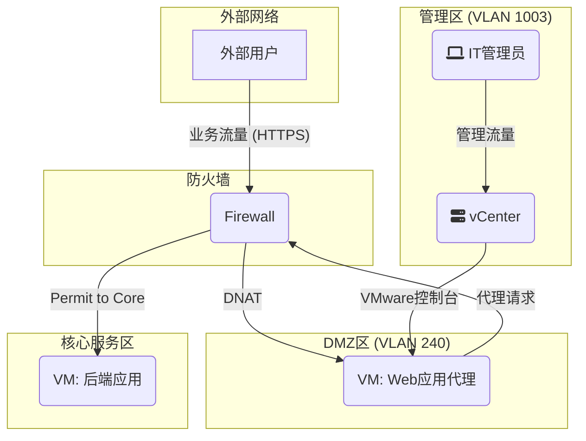

# H.02-网络安全域-DMZ设计规范

> **标签**: `#安全规范` `#DMZ` `#防火墙` `#网络设计`
> **版本**: 2.0 (最终版)
> **状态**: 已发布
> **关联标准**: [[A.01-IP与VLAN分配-总表]]

---

## 1. 设计目标

为需要对外发布的网络服务（如统一身份认证门户、Web服务器等）构建一个统一、安全、且与内部网络严格隔离的托管环境（DMZ, Demilitarized Zone）。本规范适用于公司所有站点的DMZ建设。

---

## 2. 标准化网络规划

为了实现统一管理和策略部署，所有站点的DMZ区域采用标准化的VLAN ID和IP地址段。

- **标准 VLAN ID**: `240`
- **IP网段分配原则**: `192.168.24x.0/24` (x根据站点偏移量决定)
- **网关**: `192.168.24x.254`
- **子网掩码**: `255.255.255.0`

> [!IMPORTANT]
> 每个站点（如：桦智、纯铭）必须分配一个**唯一**的 `192.168.24x.0/24` 网段。具体的IP分配请参考 [[A.01-IP与VLAN分配-总表]]。

---

## 3. 部署架构与流量模型

DMZ的核心是作为内外网络之间的“缓冲地带”。典型的流量路径如下所示：

**流量说明**:

1. 外部用户访问公网IP的`443`端口。
2. 边界防火墙通过**DNAT**将请求转发至DMZ内WAP服务器的私网IP (`192.168.24x.x`)。
3. WAP服务器作为反向代理，向内部应用服务器发起一个新的请求。
4. 防火墙**严格审查**并允许来自WAP服务器IP的特定请求访问核心服务区的特定服务器及端口。
5. 核心服务器响应请求。
6. 流量按原路返回。

---

## 4. 防火墙访问控制策略 (ACL)

以下是DMZ区域必须执行的最小化访问控制策略集合。

| 优先级 | 源区域 (Zone) | 目标区域 (Zone) | 服务/端口 (TCP/UDP) | 动作 | 描述与要求 |
|:---:|:---|:---|:---|:---:|:---|:---|
| 1 | **WAN** | **DMZ** | `TCP/443`, `TCP/80` | **Permit** | **[核心入口策略]** 通过DNAT将公网IP端口映射到DMZ服务器。系统将自动创建此策略。 |
| 2 | **DMZ** | **Core Zone** | `TCP/443`, `TCP/1433` 等 | **Permit** | **[核心代理策略]** 仅允许从DMZ中**特定的代理服务器IP**访问核心区**特定的后端服务器IP和端口**。 |
| 3 | **DMZ** | **WAN** | `TCP/53`, `UDP/53` | **Permit** | (可选) 允许DMZ服务器向公网DNS(如`223.5.5.5`)发起DNS查询。 |
| 4 | **DMZ** | **Any (Internal)** | `Any` | **Deny** | **[隔离基线 1]** 严禁DMZ主动访问任何其他内部区域 (如办公、Wi-Fi、管理等)。 |
| 5 | **Any (Internal)** | **DMZ** | `Any` | **Deny** | **[隔离基线 2]** 严禁任何内部区域主动访问DMZ，除运维管理需要外 (见策略6)。 |
| 6 | **IT_Admin_Zone** | **DMZ** | `TCP/3389`, `TCP/22` | **Permit** | **[管理策略]** 允许IT运维区通过RDP或SSH管理DMZ中的服务器 (当前通过vCenter控制台，此为未来堡垒机预留)。 |

---

## 5. 运维管理说明

为兼顾安全性与实施效率，DMZ的运维管理采用分阶段实施的策略。

**第一阶段（当前）：通过虚拟化平台管理**

- **核心方法**: 直接通过 **VMware vCenter / ESXi 的虚拟机控制台** 对DMZ中的虚拟机进行操作。
- **安全优势**:
  - **无需开放端口**: 此方式通过VMware的管理网络进行，**无需**在防火墙上为任何内部VLAN开放访问DMZ的端口（如RDP/SSH），极大收敛了攻击面。
  - **集中访问控制**: 运维权限被集中收敛到 **vCenter的访问控制**上。只要严格管理vCenter的用户和权限，即可确保DMZ的运维入口安全。

**第二阶段（未来演进）：部署堡垒机（Jump Server）**

- **推荐方案**: 部署专业的堡垒机系统，作为所有高安全等级区域（包括DMZ）的唯一运维入口。
- **核心优势**:
  - **操作审计与录像**: 所有通过堡垒机的会话均可被记录和回放。
  - **统一认证与授权**: 实现与AD等身份提供商的集成。
  - **协议代理**: 无需让运维人员直接接触服务器的真实IP和凭证。

---

## 6. 实施步骤概要

1. **VLAN创建**: 在所有站点的核心交换机上创建 `VLAN 240`，并配置Trunk。
2. **VMware配置**: 在vCenter中创建名为 `DMZ_PG` 的端口组，并标记VLAN ID为 `240`。
3. **防火墙配置**:
    - 创建DMZ安全区域 (Zone)，绑定 `VLAN 240` 的三层接口。
    - 为接口配置IP地址 `192.168.24x.254/24`。
    - 严格按照 **章节4** 的ACL列表配置安全策略。
    - 配置DNAT策略，将公网IP映射到DMZ服务器的私网IP。
4. **部署与测试**:
    - 在 `DMZ_PG` 端口组中部署虚拟机。
    - 从公网测试服务可访问性。
    - 从DMZ服务器测试对内网非授权目标的访问，应被**拒绝**。
