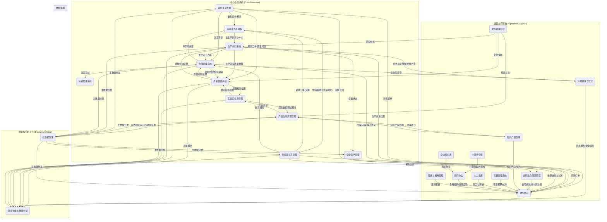

# 企业数字化蓝图 - 系统架构总览

## 1. 愿景与目标

本文档旨在从企业级的顶层视角，描绘公司核心业务信息系统的构成、它们之间的相互关系以及关键的数据流。其目标是打破系统孤岛，确保数据在不同业务域之间能够健康、有序地流转，为构建一个协同、高效、数据驱动的“企业数字孪生”提供架构指引。

## 2. 核心设计原则 (集团化管控)

基于集团目前“A、B两公司并行，目前共用，未来可能切割”的背景，所有系统设计必须遵循以下“松耦合联邦制”的核心原则，以确保架构的灵活性和前瞻性。

### 2.1. 统一主数据，预留扩展性

- **原则:** 核心主数据（物料、客户、供应商）在集团层面统一创建、统一编码，确保数据在集团内的唯一性和一致性。
- **设计要求:** 在所有核心主数据模型中，必须包含`所属公司`字段。当前该字段可默认为“集团”，但其存在为未来数据按法人主体切割预留了技术可行性，避免了后期数据结构的颠覆性改造。

### 2.2. 独立法人核算，支持内部交易

- **原则:** 财务核算严格遵循法人独立性。
- **设计要求:** ERP-FIN系统必须从始至终按多账套（A公司、B公司）进行搭建。所有涉及价值流的业务（采购、销售、库存转移），都必须能清晰地识别其法人主体，并生成正确的公司间交易凭证或法人内凭证。

### 2.3. 统一平台，分权运营

- **原则:** 在统一的技术平台和系统实例上，通过权限实现多公司的隔离运营。
- **设计要求:** 系统的权限模型必须支持“公司”这一维度。用户的权限不仅要控制到菜单和功能，更要控制到数据行级别。例如，A公司的销售员，无权查看B公司的客户和销售订单。

### 2.4. 流程模板化，支持差异配置

- **原则:** 核心业务流程（如采购、销售）采用“一个模板，多种配置”的模式。
- **设计要求:** 系统中的工作流引擎，应支持根据单据的`所属公司`字段，来调用不同的审批路径或执行不同的业务规则校验。例如，B公司的危化品采购，必须触发EHS部门的特殊审批节点。

---

## 3. 核心系统架构图

## 3. 核心系统职责定义

- **MDM (主数据管理):** **单一事实来源**。负责企业最核心、最需要共享的数据（如物料、客户、供应商、BOM、工艺路线、质量标准）的创建、清洗、分发和治理。
- **PLM (产品生命周期管理):** **工程与配方数据的源头**。负责从产品概念、研发、设计到工艺的整个过程管理。在化工行业，其核心是**配方管理**（处理百分比、浓度、活性成分等）和实验数据管理，是BOM和工艺路线的创建和变更的源头系统，并将最终版本发布至MDM。
- **LIMS (实验室信息管理系统):** **研发与质量的“执行层”**。负责管理研发实验（样品、试剂、设备）和质量检验（QC）的全过程。与分析仪器集成，自动采集检验数据，并生成检验报告(COA)。与PLM和QMS紧密集成。
- **APS (高级计划与排程):** **企业运营的“大脑”**。综合销售预测、客户订单、物料库存、供应交期、设备产能等多重约束，通过算法生成最优的主生产计划(MPS)和物料需求计划(MRP)。
- **CRM (客户关系管理):** 负责客户全生命周期管理。不仅包含从市场、线索到销售订单的**L2C (Lead to Cash)**前端流程，也应包含**售后服务管理**（客服工单的接收、分配、处理和关闭），是提升客户满意度和忠诚度的核心平台。
- **SRM (供应商关系管理):** 负责从供应商寻源、采购需求、采购订单到收货的**P2P (Procure to Pay)**全流程管理。
- **MES (生产执行系统):** **车间运作的“心脏”**。负责接收APS下达的生产计划，并调度车间人、机、料、法、环，执行从投料到完工入库的**P2I (Production to Inventory)**全流程。
- **WMS (仓储管理系统):** 负责所有物料的精细化**库内物流管理**，包括入库、出库、盘点、移位等，确保账实相符。
- **TMS (运输管理系统):** 负责管理产品**从仓库到客户端**的运输过程，包括路线规划、承运商管理、在途跟踪和运费结算。
- **QMS (质量管理系统):** **企业质量的“裁判所”**。集中管理质量标准、检验流程、审计和不合格品处理。它定义“应该怎么检”，而具体的检验任务执行和数据采集由LIMS完成。
- **EHS (环境、健康与安全):** **企业的“生命线”**。负责管理危险化学品(MSDS)、安全操作规程(SOP)、风险识别、事故上报、环保监测等所有EHS事务，确保企业合规、可持续运营。
- **EAM (设备资产管理):** 负责生产设备和关键资产的台账、预防性维护、维修和保养管理，保障生产的顺利进行。
- **DMS (文档管理系统):** **企业“法”的源头**。负责对所有受控文档（如SOP、技术图纸、质量标准、管理制度）进行严格的版本控制、权限管理、评审发布和分发，确保所有岗位使用的都是最新、最准确的有效版本。
- **CLM (合同生命周期管理):** 负责所有类型合同（销售、采购、技术等）的起草、评审、签署、归档、执行跟踪和到期提醒的全生命周期管理。
- **ITSM (IT服务管理):** 负责管理企业内部所有的IT服务请求、事件处理、问题管理、变更管理和IT资产配置管理。
- **IPM (知识产权管理):** 负责管理公司的专利、商标、著作权等无形资产的申请、维护、组合管理和价值评估。
- **FIN (财务核心系统):** 作为企业的**价值核心**。负责总账、应收、应付、成本、固定资产等所有价值流的核算与管理。是所有业务的最终价值沉淀池。
- **HR (人力资源系统):** 作为企业的**人才核心**。负责组织架构、员工主数据、薪酬福利、**绩效管理**和**培训管理**（员工技能矩阵、培训计划与记录、上岗资质认证）等人力资源核心流程。
- **OA (协同办公):** 负责企业内部的审批流、公文、通知以及非结构化的协同工作。同时，可作为**行政后勤管理**应用的承载平台（如图书借阅、车辆申请、工服管理等）。
- **WIKI (企业知识库):** 提供一个开放、便利的平台，用于企业内部非结构化知识、经验、FAQ的创建、分享和搜索，促进知识的沉淀与复用。
- **TNE (差旅与费用管理):** 负责从出差申请、行程预订到费用报销的**T2E (Travel to Expense)**全流程管理，确保差旅合规与高效报销。
- **BI (商业智能):** 从各大业务系统抽取数据，进行清洗、建模和分析，为管理决策提供数据洞察。

## 4. 下一步行动计划

1. **评审并确认**此顶层系统架构图。
2. 选择一个核心业务域（如我们已部分完成的P2P，或全新的L2C），**绘制详细的跨系统流程图和数据流图**。
3. **定义**每个核心业务域的关键数据对象和交互接口。
