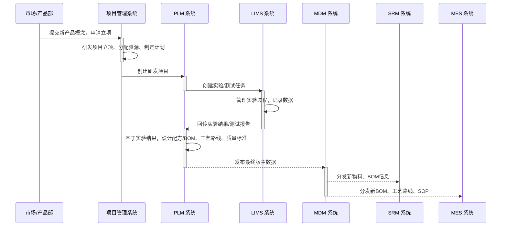

# 业务域详解：从概念到上市 (Idea to Market - I2M)

## 1. 业务域概述

“从概念到上市 (I2M)”是描述企业如何将一个新产品的创意，通过市场分析、立项、研发、设计、实验、打样等一系列活动，最终转化为一个可以被稳定生产、采购和销售的成熟产品的端到端流程。它是企业创新和保持核心竞争力的引擎。

本流程的核心目标是管理研发过程，沉淀技术知识，并确保研发成果（如图纸、配方、BOM、工艺）能够准确、规范地传递给下游的生产、采购和销售环节。

## 2. 核心流程与系统交互图

## 3. 流程阶段详解

### 阶段一: 概念与立项

- **核心活动:** 市场或产品部门基于市场分析，提出新产品概念，并在 [[../20_应用架构域/PMS_项目管理系统|PMS 系统]] 中提交项目立项申请。
- **系统支撑:** PMS负责管理研发项目的范围、进度、预算和资源。

### 阶段二: 设计与研发

- **核心活动:** 研发团队在 [[../20_应用架构域/PLM_产品生命周期管理|PLM 系统]] 中，将项目分解为具体的设计和研发任务。
- **系统支撑:**
  - PLM作为研发工作的核心平台，管理所有设计文档、图纸、模型等。
  - 对于需要进行化学实验或物理测试的环节，PLM向 [[../20_应用架构域/LIMS_实验室信息管理系统|LIMS 系统]] 下达实验任务。

### 阶段三: 实验与验证

- **核心活动:** 实验室的工程师或科学家，在LIMS中执行实验任务，记录过程数据，并分析结果。
- **系统支撑:** [[../20_应用架构域/LIMS_实验室信息管理系统|LIMS]] 管理样品、试剂、设备，并自动采集分析数据。实验完成后，将正式的测试报告回传给PLM，作为设计优化的依据。

### 阶段四: 数据固化与发布

- **核心活动:** 基于最终确认的研发成果，在PLM中固化形成标准的**配方/BOM、工艺路线、质量标准**等核心工程数据。
- **系统支撑:** [[../20_应用架构域/PLM_产品生命周期管理|PLM]]在完成内部的评审和签核后，将这些成熟的、可用于生产的主数据，正式**发布**到 [[../20_应用架构域/MDM_主数据管理|MDM 系统]]。

### 阶段五: 主数据分发

- **核心活动:** 主数据管理团队审核并批准从PLM接收到的新数据。
- **系统支撑:** [[../20_应用架构域/MDM_主数据管理|MDM]]作为企业唯一的主数据源，将这些新的物料、BOM、工艺等信息，分发给所有需要它的下游系统，如 [[../20_应用架构域/SRM_供应商关系管理|SRM]], [[../20_应用架构域/MES_制造执行系统|MES]], [[../20_应用架构域/ERP_企业资源计划|ERP-FIN]] 等，确保全公司使用的是同一套“标准语言”。

## 4. 涉及的核心系统职责

- **[[../20_应用架构域/PLM_产品生命周期管理|PLM]]:** 驱动整个I2M流程的核心，是所有工程数据和配方数据的创建、变更和版本控制中心。
- **[[../20_应用架构域/LIMS_实验室信息管理系统|LIMS]]:** 研发和质量检验的执行平台，为PLM提供可靠的实验和测试数据支撑。
- **[[../20_应用架构域/PMS_项目管理系统|PMS]]:** 从资源和进度的角度，对研发项目进行管理。
- **[[../20_应用架构域/MDM_主数据管理|MDM]]:** 作为企业主数据的“中央银行”，负责接收、审核并向全公司分发来自PLM的最终成果。
