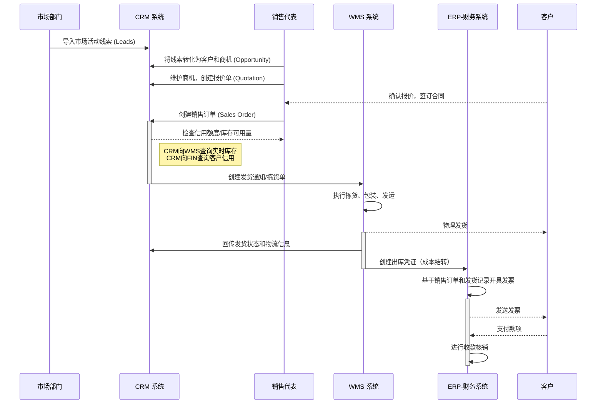

# 业务域详解：从线索到回款 (Lead to Cash - L2C)

## 1. 业务域概述

“从线索到回款 (L2C)”是描述公司如何发现潜在客户、培育商机、达成销售、交付产品/服务并最终收回款项的端到端核心业务流程。它是企业收入的源头，其流程的顺畅与否直接关系到市场响应速度、客户满意度和现金流健康。

本流程的核心目标是打通市场、销售、仓储、财务等部门的壁垒，实现客户信息、订单信息、库存信息和财务信息的无缝流转。

## 2. 核心流程与系统交互图

## 3. 流程阶段详解

### 阶段一: 市场与线索管理 (MQL)

- **核心活动:** 市场部门获取潜在线索，并在[[../20_应用架构域/CRM_客户关系管理|CRM 系统]]中进行培育和资格认证。
- **系统支撑:** CRM提供市场活动管理、线索录入、评分和分配功能。

### 阶段二: 销售与机会管理 (SQL)

- **核心活动:** 销售代表跟进合格线索，将其转化为客户和商机，并持续推进直至赢单。
- **系统支撑:** [[../20_应用架构域/CRM_客户关系管理|CRM 系统]]提供客户管理、联系人管理、商机管理和报价单管理功能。商机赢单后，在CRM中创建销售订单。

### 阶段三: 订单履行与交付

- **核心活动:** 接收并审核销售订单，安排仓库发货。
- **系统支撑:**
  - [[../20_应用架构域/CRM_客户关系管理|CRM]]在创建订单时，可向[[../20_应用架构域/WMS_仓库管理系统|WMS]]查询库存，向[[../20_应用架构域/ERP_企业资源计划|ERP-FIN]]查询信用。
  - 审核通过后，CRM向[[../20_应用架构域/WMS_仓库管理系统|WMS]]创建发货通知。
  - [[../20_应用架构域/WMS_仓库管理系统|WMS]]执行发货，并将状态回传给CRM。

### 阶段四: 开票与收款

- **核心活动:** 财务部门根据发货记录开具发票，并处理客户回款。
- **系统支撑:**
  - [[../20_应用架构域/WMS_仓库管理系统|WMS]]发货时，将成本信息传递给[[../20_应用架构域/ERP_企业资源计划|ERP-FIN]]。
  - [[../20_应用架构域/ERP_企业资源计划|ERP-FIN]]负责开票、收款和与应收账款的核销。

## 4. 涉及的核心系统职责

- **[[../20_应用架构域/CRM_客户关系管理|CRM]]:** 驱动整个L2C流程的前端引擎，负责从线索到订单的全过程管理，并包含售后服务。
- **[[../20_应用架构域/WMS_仓库管理系统|WMS]]:** 负责销售订单的实物拣选、包装和发货执行。
- **[[../20_应用架构域/ERP_企业资源计划|ERP-FIN]]:** 负责客户信用管理、应收账款、收款核销和销售成本的最终核算。
- **[[../20_应用架构域/MDM_主数据管理|MDM]]:** 为所有流程提供统一、准确的客户和产品（物料）主数据。
