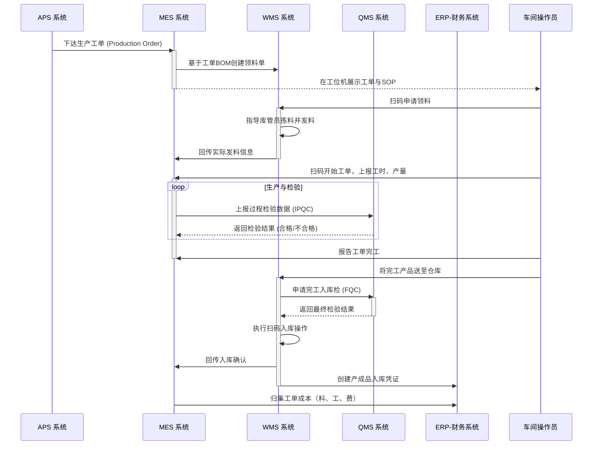

# 业务域详解：从计划到入库 (Plan to Inventory - P2I)

## 1. 业务域概述

“从计划到入库 (P2I)”是描述企业如何将生产计划转化为车间可执行的工单，组织人、机、料、法、环进行生产，并最终将合格的产成品或半成品送入仓库的端到端核心制造流程。它是连接“计划”与“库存”的桥梁，是企业实现精益制造、保证产品质量、控制生产成本的核心。

本流程的核心目标是打通计划、执行、仓储、质量、财务等环节，实现生产指令、物料消耗、完工状态、质量数据和成本信息的实时、准确传递。

## 2. 核心流程与系统交互图

## 3. 流程阶段详解

### 阶段一: 计划与工单下达

- **核心活动:** [[../20_应用架构域/APS_先进规划与排程系统|APS系统]]根据主生产计划(MPS)，生成详细的“生产工单”，并下达给[[../20_应用架构域/MES_制造执行系统|MES系统]]。
- **系统支撑:** 工单中包含了要生产什么、生产多少、使用哪个BOM版本、遵循哪条工艺路线等核心信息。

### 阶段二: 生产准备与领料

- **核心活动:** 车间根据工单进行生产准备，并从仓库领取所需原材料。
- **系统支撑:** [[../20_应用架构域/MES_制造执行系统|MES]]根据工单BOM，向[[../20_应用架构域/WMS_仓库管理系统|WMS]]创建领料单。WMS指导库管员拣选并记录发料，MES同步记录工单的物料消耗。

### 阶段三: 车间生产与过程控制

- **核心活动:** 操作员在车间执行生产任务，并进行过程质量检验。
- **系统支撑:** [[../20_应用架构域/MES_制造执行系统|MES]]通过工位机指导生产，并实时采集产量、工时、设备状态等数据。在关键工序，MES调用[[../20_应用架构域/QMS_质量管理系统|QMS]]进行过程检验(IPQC)。

### 阶段四: 完工入库与成本归集

- **核心活动:** 生产完工的产品送入仓库，并核算该工单的实际生产成本。
- **系统支撑:**
  - [[../20_应用架构域/WMS_仓库管理系统|WMS]]在接收成品时，可调用[[../20_应用架构域/QMS_质量管理系统|QMS]]进行入库检验(FQC)，合格后正式入库，并增加库存。
  - WMS将入库信息传给[[../20_应用架构域/ERP_企业资源计划|ERP-FIN]]，生成入库凭证。
  - [[../20_应用架构域/MES_制造执行系统|MES]]汇总工单消耗的所有料、工、费，将完整的工单成本传递给[[../20_应用架构域/ERP_企业资源计划|ERP-FIN]]进行核算。

## 4. 涉及的核心系统职责

- **[[../20_应用架构域/APS_先进规划与排程系统|APS]]:** 计划的源头，负责下达“生产什么、生产多少”的指令。
- **[[../20_应用架构域/MES_制造执行系统|MES]]:** 生产的执行引擎，负责“如何生产”的全过程调度与记录。
- **[[../20_应用架构域/WMS_仓库管理系统|WMS]]:** 生产物料流转的保障，负责原材料的发出和产成品的接收。
- **[[../20_应用架构域/QMS_质量管理系统|QMS]]:** 生产质量的裁判，负责在生产各环节提供检验标准和记录结果。
- **[[../20_应用架构域/ERP_企业资源计划|ERP-FIN]]:** 生产价值的核算中心，负责所有生产相关成本的归集与核算。
- **[[../20_应用架构域/MDM_主数据管理|MDM]]:** 为所有流程提供统一、准确的物料、BOM、工艺路线等主数据。
