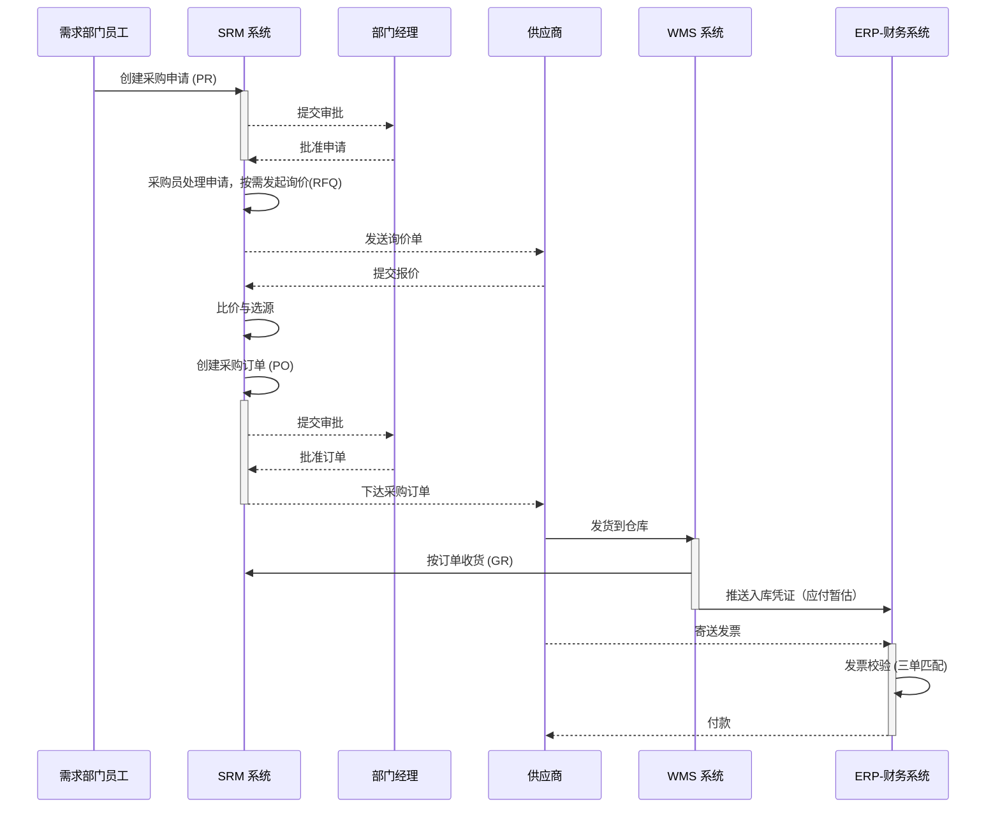

# 业务域详解：从寻源到付款 (Source to Pay - S2P)

## 1. 业务域概述

“从寻源到付款 (S2P 或 P2P)”是管理企业从发起采购需求、寻找和评估供应商、执行采购、接收货物到最终完成对供应商付款的全过程。它是企业保障供应、控制成本、管理供应商关系的核心业务价值链。

本流程的核心目标是打通需求、采购、仓储、财务等部门的壁垒，实现采购业务的全程数字化、透明化和合规化。

## 2. 核心流程与系统交互图

## 3. 流程阶段详解

### 阶段一: 需求管理

- **核心活动:** 业务部门员工根据生产计划或运营需要，在 [[../20_应用架构域/SRM_供应商关系管理|SRM 系统]] 中创建采购申请。
- **系统支撑:** SRM提供标准的采购申请表单，并通过工作流引擎进行内部审批。

### 阶段二: 寻源与供应商选择

- **核心活动:** 采购员分析采购需求，决定是使用已有供应商还是寻找新供应商。
- **系统支撑:**
  - **已有供应商:** SRM的采购信息记录提供历史价格和合作条款。
  - **寻找新供应商:** SRM支持创建并发送询价单(RFQ)给多个供应商，并提供比价功能。
  - **电商平台采购:** 对于零星采购，可选择“虚拟供应商”并手动录入价格。

### 阶段三: 订单执行与协同

- **核心活动:** 采购员基于寻源结果，在 [[../20_应用架构域/SRM_供应商关系管理|SRM 系统]] 中创建并下达正式的采购订单。
- **系统支撑:** SRM支持多种采购订单类型（标准、框架、寄售等），并通过审批流进行合规控制。订单通过邮件或供应商门户下达给供应商。

### 阶段四: 交付与收货

- **核心活动:** 供应商按订单送货，仓库管理员进行收货和入库。
- **系统支撑:** 仓管员在 [[../20_应用架构域/WMS_仓库管理系统|WMS 系统]] 中按单收货，系统实时增加库存。WMS将收货信息传递给SRM和 [[../20_应用架构域/ERP_企业资源计划|ERP-FIN]]。

### 阶段五: 发票与付款

- **核心活动:** 财务部门接收供应商发票，并与采购订单、收货单进行“三单匹配”校验，无误后安排付款。
- **系统支撑:** [[../20_应用架构域/ERP_企业资源计划|ERP-FIN 系统]] 负责发票校验和最终的付款执行。

## 4. 涉及的核心系统职责

- **[[../20_应用架构域/SRM_供应商关系管理|SRM]]:** 驱动整个P2P流程的核心引擎，负责从申请到订单的全过程管理。
- **[[../20_应用架构域/WMS_仓库管理系统|WMS]]:** 负责采购订单的实物收货与入库执行。
- **[[../20_应用架构域/ERP_企业资源计划|ERP-FIN]]:** 负责采购业务的最终价值核算，包括应付暂估、发票校验和付款。
- **[[../20_应用架构域/MDM_主数据管理|MDM]]:** 为所有流程提供统一、准确的物料和供应商主数据。
