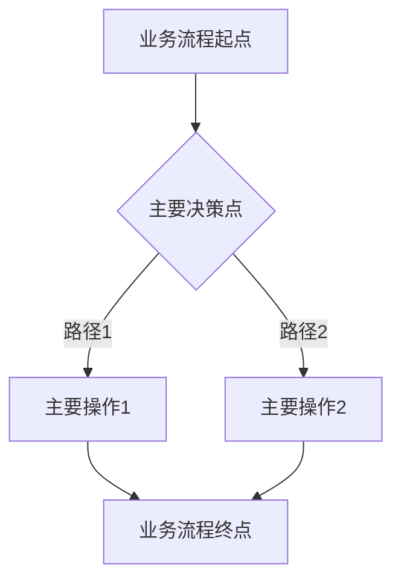

# TECH-系统名称-业务总览

## 1. 引言

### 1.1. 系统背景与目标

[请在此处简要描述系统的背景、建设目标以及解决了什么核心业务问题。]

### 1.2. 系统定位

[请在此处简要描述系统在整个企业IT架构中的定位，与其他系统（如果存在）的关系。]

## 2. 核心需求概览

[请在此处从《TECH-系统名称-需求分析(SRS).md》中提炼出系统的核心功能性需求和非功能性需求，进行概括性描述。]

* **功能需求**：
  * [核心功能点1]
  * [核心功能点2]
* **非功能需求**：
  * [核心性能要求]
  * [核心安全要求]

## 3. 主要功能模块概览

[请在此处从《TECH-系统名称-功能模块.md》中提炼出系统主要功能模块的概览，并简要描述每个模块的核心功能。可点击链接跳转至详细功能模块文档。]

* **[功能模块名称1]**：[简要功能描述] ([链接到TECH-系统名称-功能模块.md#功能模块名称1])
* **[功能模块名称2]**：[简要功能描述] ([链接到TECH-系统名称-功能模块.md#功能模块名称2])
* ...

## 4. 主要业务流程概览

[请在此处从《TECH-系统名称-审批流程.md》中提炼出系统中的主要业务流程，并简要描述流程的触发和主要步骤。可包含高层流程图，并可点击链接跳转至详细审批流程文档。]

* **[业务流程名称1]**：[简要流程描述] ([链接到TECH-系统名称-审批流程.md#业务流程名称1])
* **[业务流程名称2]**：[简要流程描述] ([链接到TECH-系统名称-审批流程.md#业务流程名称2])
* ...

## 5. 角色与权限概览

[请在此处从《TECH-系统名称-权限管理.md》中提炼出系统的主要用户角色及其核心操作权限。可点击链接跳转至详细权限管理文档。]

* **[角色名称1]**：[核心权限描述] ([链接到TECH-系统名称-权限管理.md#角色名称1])
* **[角色名称2]**：[核心权限描述] ([链接到TECH-系统名称-权限管理.md#角色名称2])
* ...

## 6. 系统联动与数据流动概述

[请在此处高层描述本系统与其他关键系统（如ERP、财务系统、消息通知平台等）之间的主要联动点和数据流动方向。可包含高层数据流动图，并可点击链接跳转至平台配置详情或系统集成文档。]

* **与[外部系统名称1]联动**：[简要描述联动目的和关键数据] ([链接到TECH-系统名称-平台配置详情.md#与外部系统名称1集成])
* **与[外部系统名称2]联动**：[简要描述联动目的和关键数据] ([链接到TECH-系统名称-平台配置详情.md#与外部系统名称2集成])
* ...

## 7. 详细文档链接

[请在此处提供所有详细文档的链接，方便读者快速跳转。]

* **需求分析**：[[TECH-系统名称-需求分析(SRS).md]]
* **系统设计**：[[TECH-系统名称-系统设计.md]]
* **功能模块**：[[TECH-系统名称-功能模块.md]]
* **权限管理**：[[TECH-系统名称-权限管理.md]]
* **审批流程**：[[TECH-系统名称-审批流程.md]]
* **平台配置详情**：[[TECH-系统名称-平台配置详情.md]]
* **操作手册**：[[TECH-系统名称-操作手册.md]]
